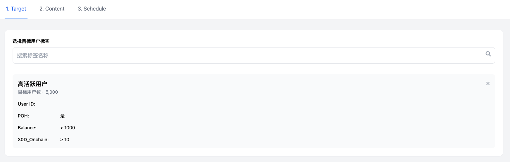

# 产品设计文档模板

## 一、产品概述

### 1. 产品背景

Onchain新板块和运营后台的开发主要针对以下需求：

- 增加更多的Onchain用户
- 让现有Onchain用户做更多Onchain Action并获得直接奖励
- 激励现有的Offchain用户学习和转向Onchain
- 通过运营体系和邀请裂变，增加Onchain用户
- 跑通B端的CPS投放Onchain Task模式，增加收入
- 为运营提供更精准和个性化的实现C端增长的工具

### 2. 产品愿景

基于统计数据显示，全量的Onchain用户（历史上所有做过Onchain Quest的用户）约有74万人，其中有10万人在4月份仍有行为记录，这是一个良好的基础。

我们的愿景是：

- 建立Onchain板块的小闭环
- 精准推荐让用户感知新板块并参与Onchain Action获得奖励
- 测试用户对不同奖励额度的接受度
- 通过前期尝鲜B端+自有任务，积累初始Onchain用户群体
- 通过数据分析了解对Onchain用户的驱动力
- 做大B端预算规模，建立在提供CPS保量+精准定价之上
- 撬动更大的B端预算后，反哺C端用户，建立C端的运营成长体系+裂变分佣体系

### 3. 用户故事

**B端用户：**

- 项目方希望通过Onchain任务吸引用户参与其生态
- 希望获得精准的目标用户群体
- 需要清晰了解投放效果和ROI

**C端用户：**

- 希望通过完成Onchain任务获得奖励
- 希望获得与自己相关的任务推荐
- 需要简单易用的操作流程

**运营人员：**

- 需要灵活的角色和权限系统
- 希望能精准定位用户群体
- 需要有效的审核和管理工具

## 二、业务流程

### 1. 全局业务流程图

#### Onchain Task推送工作流

1. 运营在后台创建task
2. 运营在后台设置推荐目标用户
3. C端目标用户会看到推荐弹窗
4. C端点击推荐弹窗，跳转到做task的页面
5. C端用户完成task，立刻获得奖励
6. 运营在后台能查看相关完成数据

#### B端投放task工作流

1. B端用户在B端页面看到两类菜单入口：
   - 第一个功能入口针对Community付费用户（Onchain Boost）
   - 第二个功能入口针对知名项目，使用白名单控制（Onchain CPS）
2. B端用户设置action、budget，并deposit
3. 运营在后台看到当前投放列表
4. 对于Community项目方，限制发布的action类型，发布后自动上架boost板块
5. 对于知名项目：
   - 若action涉及新合约，需要走合约审核流程
   - 若action不涉及新合约，运营可以直接为action创建task并设置奖励
   - 若运营判断该action不合理无法完成，可以直接拒绝，自动退款
6. 运营投放之后，能实时查看完成人数
7. B端也能实时查看完成人数
8. 如果到时间还完成不了，走部分退款流程

### 2. 关键子流程图

#### 标签系统工作流

1. 填写筛选条件
2. 筛选出用户列表和用户总人数
3. 如果满意，可以保存为标签

#### 精准投放工作流

1. 运营新建一个Delivery任务
2. 选择一个Label，自动刷新该Label的用户数量
3. 选择要推送的内容（Onchain Task和自定义内容）
4. 填写投放有效期
5. 创建成功后，进入Pending状态，进入待审核列表
6. 管理员审核通过，才会进入Upcoming或Ongoing状态
7. 审批拒绝，进入Unpass状态
8. C端用户只能看到状态为Ongoing的投放推送

## 三、功能设计

### 1. 功能地图

#### 2.0.0需求范围

| 模块          | 需求                                                       | 负责人 | 优先级 | 备注                 |
| ------------- | ---------------------------------------------------------- | ------ | ------ | -------------------- |
| 运营后台      | 运营后台框架/权限体系                                      | Sam    | P0     |                      |
|               | 自定义标签+推荐系统                                        | Sam    | P1     |                      |
|               | 运营配置Onchain新板块                                      | Ray    | P0     |                      |
| Onchain新板块 | Onchain新板块-C端列表页                                    | Billy  | P0     |                      |
|               | Onchain新板块-C端详情页（Swap/Hold/Bridge）                | Ray    | P0     |                      |
|               | Onchain新板块-B端投放后台                                  | Sam    | P0     |                      |
|               | Onchain新板块-教学/成就体系                                | Billy  | P1     |                      |
|               | 新增Onchain验证器（接入OO Swap/接入OO Bridge/批量接入Dex） | Ray    | P0     | 优先级取决于接入范围 |
| 其他          | 积分体系（先只做发放，积分/黄金积分）                      | Sam    | P1     |                      |
|               | C端精准推荐广告                                            | Billy  | P1     |                      |
|               | Lucky wheel，优化设置reward和发放reward                    | Billy  | P1     |                      |
|               | Community，增加KYC相关设置                                 | Ray    | P1     |                      |

#### 功能板块划分

- B端投放板块(Sam)
- 运营后台板块-task设置(Ray)
- 运营后台板块-精准推荐(Sam)
- C端精准推荐标签系统(Sam)
- C端推荐触点+推荐样式(Billy)
- C端Onchain新板块聚合页(Billy)
- C端Onchain新板块Detail页(Ray)

#### Onchain任务分类

- Hold Token（P0）
- Hold NFT（P1）
- Swap（P0）
- Bridge（P0）
- Mint NFT（P1）
- Stake（P1）
- Smart Contract（P1）
- Provide LP/Hold LP（P2）
- Borrow/Supply（P2）

### 2. 功能描述模板

#### 运营后台功能

1. **后台基础功能**

   - 用户管理（登陆、创建、密码、禁用、编辑）
   - 角色管理（创建、删除、编辑）
   - 操作日志
   - 审核功能

   
2. **自定义标签系统**

   - 用户特征值表
   - 自定义标签创建与管理
   - 用户列表查询与筛选

   
3. **精准投放系统**

   - 创建投放任务
   - 选择标签群体
   - 设置投放内容和时间
   - 状态管理（Draft、Pending、Unpass等）

   

#### B端功能

1. **Onchain Boost**

   - 创建Onchain Task
   - 设置预算和目标
   - 任务状态管理（Draft、Pending、Live等）
   - 数据分析

   
2. **Onchain CPS**（知名项目专用）

   - 白名单管理
   - 审核流程
   - 退款机制

   

#### C端功能

1. **Onchain新板块聚合页**

   - 任务列表展示
   - 分类筛选
   - 奖励展示

   
2. **Onchain新板块详情页**

   - 任务详情
   - 步骤指引
   - 完成状态跟踪

   
3. **推荐触点与样式**

   - 弹窗推荐
   - Banner推荐
   - 个性化推荐位

   

## 四、业务规则

### 1. 业务规则概述

#### 角色与权限规则

- 用户：每一个员工有一个账号，每个用户有用户名和密码
- 权限：每个权限与某一个功能对应
- 角色：管理员可以创建角色，每个角色有多个权限，每个用户可以赋予一个角色
- 管理员：管理员也是一个角色，管理员角色无法被删除

#### 标签系统规则

- 标签是基于用户特征宽表由运营添加个性化筛选条件
- 标签名称不能重复
- 筛选条件完全一致的标签不能重复创建

#### 投放系统规则

- C端用户只能看到状态为Ongoing的投放推送
- 审批通过后才能进入Upcoming或Ongoing状态
- Publish、Edit、Cancel三个操作都需要审批

#### Boost状态规则

- Draft：可以编辑、删除
- Pending：可以Cancel
- Canceled：引导用户查看退款
- Rejected：运营Reject并且审核通过的
- Live：运营Accept并起审核通过的
- Completed：达成项目方需要的target
- Expired：到了时间，但没达成项目方需要的target

### 2. 业务规则列表模板

#### 审批类别规则

- **Onchain boost request**：Accept、Reject、Edit、Refund
- **Onchain Task**：Publish、Edit、End
- **Delivery**：Publish、Edit、Cancel
- **Contract**：高信任（针对Onchain新板块，对安全性要求高）、低信任（针对GTC项目方自己配置的）、未审核

## 五、数据需求

### 数据流说明

#### 用户特征值表

技术需要按照C端标签系统的要求，定期跑数据，同步到用户特征宽表中，该宽表用于内部的数据分析和运营推荐体系。

主要数据指标包括：

1. **基本字段**

   - User ID
   - Last Active (用户最后活跃时间)
2. **POH信息**

   - POH (bool值)
   - ZKMe NFT
   - Binance BABT
3. **Onchain行为数据**

   - Onchain 任务完成数量
   - Onchain 任务完成类型
   - 链上交易频率
   - 钱包活跃度
   - Token持有情况
4. **用户参与度指标**

   - 完成任务数量
   - 奖励获取金额
   - 参与频率
   - 活跃天数

#### C端标签系统特征表

以下是C端标签系统使用的特征表示例：

| 特征ID | 特征名称        | 特征类型 | 特征说明          |
| ------ | --------------- | -------- | ----------------- |
| F001   | hold_eth        | 数值型   | 用户持有的ETH数量 |
| F002   | swap_times_30d  | 数值型   | 近30天内Swap次数  |
| F003   | has_poh         | 布尔型   | 是否完成POH认证   |
| F004   | active_chains   | 列表型   | 用户活跃的链      |
| F005   | nft_collections | 数值型   | 持有的NFT集合数量 |

完整的特征表请参考：[C端标签系统 - Onchain特征表.csv]

## 六、需求反馈意见

### 1. 完整性评估

| 评估项       | 状态          | 反馈意见                                                       |
| ------------ | ------------- | -------------------------------------------------------------- |
| 业务场景覆盖 | ⚠️ 部分完善 | 缺少部分边缘场景描述，如用户取消任务、任务失败等情况的处理流程 |
| 用户需求覆盖 | ✅ 较完善     | B端和C端用户需求描述较为全面，但可增加更多用户痛点分析         |
| 系统功能覆盖 | ⚠️ 部分完善 | 功能点列举较全面，但部分功能缺少详细的交互说明和验收标准       |

### 2. 明确性评估

| 评估项       | 状态          | 反馈意见                                                                           |
| ------------ | ------------- | ---------------------------------------------------------------------------------- |
| 功能需求描述 | ⚠️ 部分明确 | 部分功能描述过于概括，如"数据分析"、"审核流程"等需要更具体的说明                   |
| 业务规则描述 | ⚠️ 部分明确 | 业务规则缺少详细的约束条件和执行逻辑，如标签系统的筛选规则、投放系统的审批流程细节 |
| 数据需求描述 | ❌ 需改进     | 数据字段的定义不够详细，缺少数据类型、取值范围、校验规则等信息                     |

### 3. 一致性评估

| 评估项           | 状态          | 反馈意见                                                                     |
| ---------------- | ------------- | ---------------------------------------------------------------------------- |
| 内部逻辑一致性   | ✅ 较一致     | 文档内部逻辑框架清晰，各部分之间衔接自然                                     |
| 术语使用一致性   | ⚠️ 部分一致 | 部分术语使用不一致，如"Onchain任务"和"Onchain Task"、"标签"和"Label"交替使用 |
| 优先级标记一致性 | ✅ 一致       | 优先级标记(P0/P1/P2)使用一致，便于理解                                       |

### 4. 功能需求评估

| 评估项     | 状态          | 反馈意见                                                              |
| ---------- | ------------- | --------------------------------------------------------------------- |
| 核心功能   | ⚠️ 部分完善 | 核心功能描述需要更加详细，特别是Onchain任务的验证机制、奖励计算方式等 |
| 辅助功能   | ⚠️ 部分完善 | 缺少辅助功能的详细描述，如数据统计、报表导出等                        |
| 优先级划分 | ✅ 明确       | 功能优先级划分明确，有利于开发排期                                    |

### 5. 业务流程评估

| 评估项     | 状态    | 反馈意见                                                 |
| ---------- | ------- | -------------------------------------------------------- |
| 主流程描述 | ✅ 完善 | 主要业务流程描述清晰，配有流程图辅助理解                 |
| 异常流程   | ❌ 缺失 | 缺少异常流程的描述，如任务失败、审核拒绝后的处理流程     |
| 边界条件   | ❌ 缺失 | 缺少边界条件的说明，如极限用户数量、预算上限等情况的处理 |

### 6. 数据需求评估

| 评估项       | 状态          | 反馈意见                                                     |
| ------------ | ------------- | ------------------------------------------------------------ |
| 数据字段定义 | ⚠️ 部分完善 | 用户特征表字段列举较为全面，但缺少详细的字段属性说明         |
| 数据关系     | ❌ 缺失       | 缺少各数据实体之间的关系描述，如用户与标签、任务与投放的关系 |
| 数据校验规则 | ❌ 缺失       | 缺少数据输入和处理的校验规则说明                             |
| 数据流转     | ⚠️ 部分完善 | 数据流转过程描述不够详细，缺少数据处理各环节的明确说明       |

### 7. 交互设计评估

| 评估项   | 状态          | 反馈意见                                                 |
| -------- | ------------- | -------------------------------------------------------- |
| 页面流程 | ⚠️ 部分完善 | 主要页面流程有描述，但缺少详细的页面转换说明             |
| 操作逻辑 | ⚠️ 部分完善 | 部分操作逻辑描述不够详细，如用户筛选、任务设置等操作步骤 |
| 交互细节 | ❌ 缺失       | 缺少交互细节描述，如表单验证、操作反馈、状态提示等       |

### 8. 异常处理评估

| 评估项       | 状态          | 反馈意见                                             |
| ------------ | ------------- | ---------------------------------------------------- |
| 异常场景覆盖 | ❌ 缺失       | 缺少对异常场景的全面描述，如系统故障、数据异常等情况 |
| 错误提示     | ❌ 缺失       | 缺少对错误提示内容和形式的说明                       |
| 处理方案     | ⚠️ 部分完善 | 仅对部分异常情况(如退款)有处理方案，但不够全面       |

### 9. 总体建议

1. **完善异常流程**：补充各业务环节可能出现的异常情况及处理方案
2. **增加数据定义**：详细定义数据字段属性、关系和校验规则
3. **细化交互设计**：补充用户操作流程和交互细节描述
4. **统一术语使用**：保持文档中术语的一致性
5. **补充非功能需求**：增加性能、安全、兼容性等非功能性需求的描述
6. **明确验收标准**：为各功能点增加明确的验收标准和测试用例
7. **补充示例**：增加典型业务场景的示例，帮助理解需求
8. **完善边界条件**：明确系统各功能模块的边界条件和限制

## 七、需求完善详细说明

### 1. 严重级别 P0（高）- 核心问题

🔴 **异常流程缺失** - 直接影响用户体验

- 任务验证失败后的处理流程和用户引导
- 审核拒绝后的通知和重新提交流程

🔴 **核心功能验证机制不完善** - 直接影响业务核心流程

- 不同任务类型(Hold/Swap/Bridge)的具体验证逻辑
- 验证失败的重试机制
- 防作弊机制设计

🔴 **数据关系缺失** - 直接影响系统数据一致性

- 用户与标签的多对多关系定义
- 任务与投放的关联关系和约束条件
- B端用户与创建任务的关系和权限控制
- 各实体间的外键约束和级联操作规则

🔴 **业务规则不明确** - 直接影响功能实现正确性

- 标签系统筛选条件的组合规则和优先级
- 投放系统审批流程的处理人和权限
- 退款的计算公式和比例及触发条件
- 奖励分配规则和上限控制

### 2. 严重级别 P1（中）- 重要问题

🔶 **数据校验规则缺失** - 影响数据质量

- 用户输入数据的格式和范围验证
- 业务规则相关的数据一致性校验
- 数据导入和批量操作的验证规则
- 敏感操作的二次确认机制

🔶 **交互细节缺失** - 影响用户体验

- 表单验证的错误提示方式和位置
- 操作成功/失败的反馈机制和样式
- 长时间操作的进度展示方式
- 页面状态变化的视觉反馈

🔶 **错误提示缺失** - 影响问题解决效率

- 各类错误场景的提示文案规范
- 错误提示的分级（提醒、警告、错误）
- 错误提示的展示形式（弹窗、内嵌、通知）
- 错误提示的操作引导和解决建议

🔶 **奖励计算方式不明确** - 影响业务准确性

- 固定奖励和动态奖励的计算公式
- 不同任务类型的奖励差异
- 用户等级对奖励的影响因素
- 奖励发放的时间点和确认机制

🔶 **边缘场景处理不完善** - 影响用户体验完整性

- 用户中途取消任务的处理流程和状态变更
- 任务执行失败后的重试机制和失败原因收集
- 网络异常导致验证失败的处理方式
- B端项目方中途取消投放的用户补偿机制

🔶 **数据字段定义不完善** - 影响开发效率

- 字段的数据类型和长度限制
- 字段的取值范围和默认值
- 字段间的依赖关系和约束条件
- 必填/选填标识和验证规则

### 3. 严重级别 P2（低）- 次要问题

🔷 **辅助功能描述不详细** - 影响功能完整性

- 数据统计功能的关键指标定义
- 统计数据的展示维度和图表类型
- 报表导出功能的类型和使用场景
- 数据分析的周期和自动化程度

🔷 **页面流程说明不完善** - 影响开发理解

- 页面间跳转的具体触发条件
- 返回逻辑和历史记录保存机制
- 页面状态保持的场景和实现方式
- 页面权限控制和访问限制

🔷 **操作逻辑描述不足** - 影响实现细节

- 用户筛选操作的步骤和条件组合方式
- 任务设置过程的详细操作引导
- 审核流程的操作步骤和权限控制
- 批量操作的支持情况和限制

🔷 **数据流转说明不完整** - 影响数据处理流程

- 数据采集的频率和方式
- 数据处理和转换的规则
- 数据更新的触发条件和处理流程

## 八、改进建议与处理方案

### 1. P0级问题处理方案

#### 异常流程缺失处理方案
- **建议方案**: 补充专门的"异常流程设计"章节
- **处理步骤**:
  1. 为每类异常场景设计处理流程图
  2. 明确异常场景下的状态流转
  3. 定义异常处理的责任人和时效要求
  4. 设计用户友好的异常提示和解决指引
- **交付物**: 完整的异常流程文档，包含流程图和异常处理矩阵表

#### 核心功能验证机制完善方案
- **建议方案**: 补充详细的任务验证机制设计文档
- **处理步骤**:
  1. 梳理所有任务类型的验证逻辑
  2. 设计验证失败的重试机制
  3. 补充防作弊机制设计方案
  4. 制定验证数据的存储方案
- **交付物**: 验证机制详细设计文档，包含技术实现建议

#### 数据关系完善方案
- **建议方案**: 创建完整的数据模型关系图
- **处理步骤**:
  1. 梳理所有核心数据实体及其关系
  2. 定义外键约束和级联规则
  3. 设计数据一致性保障机制
  4. 补充数据关系说明文档
- **交付物**: ER图、数据关系说明文档和数据字典

#### 边界条件补充方案
- **建议方案**: 建立系统容量和边界条件规范
- **处理步骤**:
  1. 识别并列举所有边界条件场景
  2. 定义系统容量指标和限制
  3. 设计达到边界时的预警和降级机制
  4. 制定容量扩展策略
- **交付物**: 系统容量规划文档和边界条件处理手册

#### 业务规则明确化方案
- **建议方案**: 细化业务规则定义和执行逻辑
- **处理步骤**:
  1. 为每个业务规则创建详细说明
  2. 明确规则的优先级和执行条件
  3. 设计规则冲突时的处理策略
  4. 补充规则变更管理机制
- **交付物**: 业务规则手册和决策流程图

### 2. P1级问题处理方案

#### 数据校验规则补充方案
- **建议方案**: 制定完整的数据校验规范
- **处理步骤**:
  1. 识别所有需要校验的数据字段
  2. 定义各字段的校验规则和错误提示
  3. 设计跨字段的业务校验逻辑
  4. 补充数据异常的处理策略
- **交付物**: 数据校验规则文档和前端校验实现指南

#### 交互细节补充方案
- **建议方案**: 创建交互设计规范和原型
- **处理步骤**:
  1. 设计关键页面的交互流程
  2. 补充表单验证和反馈机制设计
  3. 明确各类操作的状态反馈
  4. 制作可交互原型展示交互细节
- **交付物**: 交互设计规范文档和可交互原型

#### 错误提示设计方案
- **建议方案**: 建立统一的错误提示系统
- **处理步骤**:
  1. 分类整理可能的错误场景
  2. 设计错误提示的样式和层级
  3. 编写用户友好的错误提示文案
  4. 为常见错误提供解决建议
- **交付物**: 错误提示设计规范和错误码手册

#### 奖励计算方式明确化方案
- **建议方案**: 制定详细的奖励计算规则文档
- **处理步骤**:
  1. 定义各类任务的奖励计算公式
  2. 明确奖励发放的触发条件和时机
  3. 设计奖励调整的机制和权限
  4. 补充奖励上限和风控规则
- **交付物**: 奖励计算规则文档和奖励发放流程图

#### 边缘场景处理方案
- **建议方案**: 补充边缘场景处理流程
- **处理步骤**:
  1. 梳理可能的边缘场景列表
  2. 为每个边缘场景设计处理流程
  3. 明确边缘场景的触发条件和责任人
  4. 设计边缘场景的监控机制
- **交付物**: 边缘场景处理手册和应急响应流程

### 3. P2级问题处理方案

#### 术语统一化方案
- **建议方案**: 创建项目术语表
- **处理步骤**:
  1. 梳理文档中出现的所有术语
  2. 为每个术语确定唯一的标准表达
  3. 对文档进行术语统一化修订
  4. 建立术语审核机制
- **交付物**: 项目术语表和文档修订版

#### 辅助功能完善方案
- **建议方案**: 补充辅助功能的详细设计
- **处理步骤**:
  1. 明确各辅助功能的用途和场景
  2. 补充数据统计和分析功能设计
  3. 设计报表导出功能和格式
  4. 明确辅助功能的权限控制
- **交付物**: 辅助功能设计文档和原型

#### 页面流程完善方案
- **建议方案**: 创建完整的页面导航地图
- **处理步骤**:
  1. 绘制页面流程和导航关系图
  2. 明确页面间跳转的触发条件
  3. 定义页面状态保持的规则
  4. 设计页面权限控制机制
- **交付物**: 页面导航地图和页面状态设计文档

#### 操作逻辑细化方案
- **建议方案**: 补充操作步骤的详细说明
- **处理步骤**:
  1. 为关键操作编写详细的步骤说明
  2. 明确每个操作的前置条件和后置影响
  3. 设计批量操作的处理逻辑
  4. 补充操作引导的设计
- **交付物**: 操作手册和步骤流程图

#### 数据流转完善方案
- **建议方案**: 建立完整的数据流转说明
- **处理步骤**:
  1. 梳理数据从采集到展示的完整流程
  2. 明确数据处理和转换的规则
  3. 设计数据更新的触发机制
  4. 补充数据流转的监控点
- **交付物**: 数据流转图和数据处理规则文档

#### 验收标准补充方案
- **建议方案**: 建立完整的验收标准体系
- **处理步骤**:
  1. 为每个功能点定义验收标准
  2. 设计功能测试用例
  3. 明确性能指标和要求
  4. 建立验收流程和责任分工
- **交付物**: 验收标准文档和测试用例库
