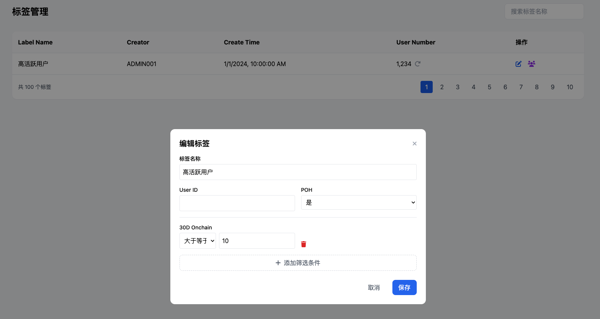

# 产品设计文档模板

## 一、产品概述

### 1. 产品背景

Onchain新板块和运营后台的开发主要针对以下需求：

- 增加更多的Onchain用户
- 让现有Onchain用户做更多Onchain Action并获得直接奖励
- 激励现有的Offchain用户学习和转向Onchain
- 通过运营体系和邀请裂变，增加Onchain用户
- 跑通B端的CPS投放Onchain Task模式，增加收入
- 为运营提供更精准和个性化的实现C端增长的工具

### 2. 产品愿景

基于统计数据显示，全量的Onchain用户（历史上所有做过Onchain Quest的用户）约有74万人，其中有10万人在4月份仍有行为记录，这是一个良好的基础。

我们的愿景是：

- 建立Onchain板块的小闭环
- 精准推荐让用户感知新板块并参与Onchain Action获得奖励
- 测试用户对不同奖励额度的接受度
- 通过前期尝鲜B端+自有任务，积累初始Onchain用户群体
- 通过数据分析了解对Onchain用户的驱动力
- 做大B端预算规模，建立在提供CPS保量+精准定价之上
- 撬动更大的B端预算后，反哺C端用户，建立C端的运营成长体系+裂变分佣体系

### 3. 用户故事

**B端用户：**

- 项目方希望通过Onchain任务吸引用户参与其生态
- 希望获得精准的目标用户群体
- 需要清晰了解投放效果和ROI

**C端用户：**

- 希望通过完成Onchain任务获得奖励
- 希望获得与自己相关的任务推荐
- 需要简单易用的操作流程

**运营人员：**

- 需要灵活的角色和权限系统
- 希望能精准定位用户群体
- 需要有效的审核和管理工具

## 二、业务流程

### 1. 全局业务流程图

#### Onchain Task推送工作流

1. 运营在后台创建task
2. 运营在后台设置推荐目标用户
3. C端目标用户会看到推荐弹窗
4. C端点击推荐弹窗，跳转到做task的页面
5. C端用户完成task，立刻获得奖励
6. 运营在后台能查看相关完成数据

#### B端投放task工作流

1. B端用户在B端页面看到两类菜单入口：
   - 第一个功能入口针对Community付费用户（Onchain Boost）
   - 第二个功能入口针对知名项目，使用白名单控制（Onchain CPS）
2. B端用户设置action、budget，并deposit
3. 运营在后台看到当前投放列表
4. 对于Community项目方，限制发布的action类型，发布后自动上架boost板块
5. 对于知名项目：
   - 若action涉及新合约，需要走合约审核流程
   - 若action不涉及新合约，运营可以直接为action创建task并设置奖励
   - 若运营判断该action不合理无法完成，可以直接拒绝，自动退款
6. 运营投放之后，能实时查看完成人数
7. B端也能实时查看完成人数
8. 如果到时间还完成不了，走部分退款流程

### 2. 关键子流程图

#### 标签系统工作流

1. 填写筛选条件
2. 筛选出用户列表和用户总人数
3. 如果满意，可以保存为标签

#### 精准投放工作流

1. 运营新建一个Delivery任务
2. 选择一个Label，自动刷新该Label的用户数量
3. 选择要推送的内容（Onchain Task和自定义内容）
4. 填写投放有效期
5. 创建成功后，进入Pending状态，进入待审核列表
6. 管理员审核通过，才会进入Upcoming或Ongoing状态
7. 审批拒绝，进入Unpass状态
8. C端用户只能看到状态为Ongoing的投放推送

## 三、功能设计

### 1. 功能地图

#### 2.0.0需求范围

| 模块 | 需求 | 负责人 | 优先级 | 备注 |
|------|------|--------|--------|------|
| 运营后台 | 运营后台框架/权限体系 | Sam | P0 | |
| | 自定义标签+推荐系统 | Sam | P1 | |
| | 运营配置Onchain新板块 | Ray | P0 | |
| Onchain新板块 | Onchain新板块-C端列表页 | Billy | P0 | |
| | Onchain新板块-C端详情页（Swap/Hold/Bridge） | Ray | P0 | |
| | Onchain新板块-B端投放后台 | Sam | P0 | |
| | Onchain新板块-教学/成就体系 | Billy | P1 | |
| | 新增Onchain验证器（接入OO Swap/接入OO Bridge/批量接入Dex） | Ray | P0 | 优先级取决于接入范围 |
| 其他 | 积分体系（先只做发放，积分/黄金积分） | Sam | P1 | |
| | C端精准推荐广告 | Billy | P1 | |
| | Lucky wheel，优化设置reward和发放reward | Billy | P1 | |
| | Community，增加KYC相关设置 | Ray | P1 | |

#### 功能板块划分

- B端投放板块(Sam)
- 运营后台板块-task设置(Ray)
- 运营后台板块-精准推荐(Sam)
- C端精准推荐标签系统(Sam)
- C端推荐触点+推荐样式(Billy)
- C端Onchain新板块聚合页(Billy)
- C端Onchain新板块Detail页(Ray)

#### Onchain任务分类

- Hold Token（P0）
- Hold NFT（P1）
- Swap（P0）
- Bridge（P0）
- Mint NFT（P1）
- Stake（P1）
- Smart Contract（P1）
- Provide LP/Hold LP（P2）
- Borrow/Supply（P2）

### 2. 功能描述模板

#### 运营后台功能

1. **后台基础功能**
   - 用户管理（登陆、创建、密码、禁用、编辑）
   - 角色管理（创建、删除、编辑）
   - 操作日志
   - 审核功能

   

2. **自定义标签系统**
   - 用户特征值表
   - 自定义标签创建与管理
   - 用户列表查询与筛选

   

3. **精准投放系统**
   - 创建投放任务
   - 选择标签群体
   - 设置投放内容和时间
   - 状态管理（Draft、Pending、Unpass等）

   

#### B端功能

1. **Onchain Boost**
   - 创建Onchain Task
   - 设置预算和目标
   - 任务状态管理（Draft、Pending、Live等）
   - 数据分析

   

2. **Onchain CPS**（知名项目专用）
   - 白名单管理
   - 审核流程
   - 退款机制

   

#### C端功能

1. **Onchain新板块聚合页**
   - 任务列表展示
   - 分类筛选
   - 奖励展示

   

2. **Onchain新板块详情页**
   - 任务详情
   - 步骤指引
   - 完成状态跟踪

   

3. **推荐触点与样式**
   - 弹窗推荐
   - Banner推荐
   - 个性化推荐位

   

## 四、业务规则

### 1. 业务规则概述

#### 角色与权限规则

- 用户：每一个员工有一个账号，每个用户有用户名和密码
- 权限：每个权限与某一个功能对应
- 角色：管理员可以创建角色，每个角色有多个权限，每个用户可以赋予一个角色
- 管理员：管理员也是一个角色，管理员角色无法被删除

#### 标签系统规则

- 标签是基于用户特征宽表由运营添加个性化筛选条件
- 标签名称不能重复
- 筛选条件完全一致的标签不能重复创建

#### 投放系统规则

- C端用户只能看到状态为Ongoing的投放推送
- 审批通过后才能进入Upcoming或Ongoing状态
- Publish、Edit、Cancel三个操作都需要审批

#### Boost状态规则

- Draft：可以编辑、删除
- Pending：可以Cancel
- Canceled：引导用户查看退款
- Rejected：运营Reject并且审核通过的
- Live：运营Accept并起审核通过的
- Completed：达成项目方需要的target
- Expired：到了时间，但没达成项目方需要的target

### 2. 业务规则列表模板

#### 审批类别规则

- **Onchain boost request**：Accept、Reject、Edit、Refund
- **Onchain Task**：Publish、Edit、End
- **Delivery**：Publish、Edit、Cancel
- **Contract**：高信任（针对Onchain新板块，对安全性要求高）、低信任（针对GTC项目方自己配置的）、未审核

## 五、数据需求

### 数据流说明

#### 用户特征值表

技术需要按照C端标签系统的要求，定期跑数据，同步到用户特征宽表中，该宽表用于内部的数据分析和运营推荐体系。

主要数据指标包括：

1. **基本字段**
   - User ID
   - Last Active (用户最后活跃时间)

2. **POH信息**
   - POH (bool值)
   - ZKMe NFT
   - Binance BABT

3. **Onchain行为数据**
   - Onchain 任务完成数量
   - Onchain 任务完成类型
   - 链上交易频率
   - 钱包活跃度
   - Token持有情况

4. **用户参与度指标**
   - 完成任务数量
   - 奖励获取金额
   - 参与频率
   - 活跃天数

#### C端标签系统特征表

以下是C端标签系统使用的特征表示例：

| 特征ID | 特征名称 | 特征类型 | 特征说明 |
|--------|---------|---------|---------|
| F001 | hold_eth | 数值型 | 用户持有的ETH数量 |
| F002 | swap_times_30d | 数值型 | 近30天内Swap次数 |
| F003 | has_poh | 布尔型 | 是否完成POH认证 |
| F004 | active_chains | 列表型 | 用户活跃的链 |
| F005 | nft_collections | 数值型 | 持有的NFT集合数量 |

完整的特征表请参考：[C端标签系统 - Onchain特征表.csv]
