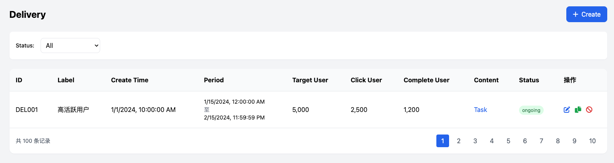

# 产品设计文档模板

## 一、产品概述

### 1. 产品背景

Onchain新板块和运营后台的开发主要针对以下需求：

- 增加更多的Onchain用户
- 让现有Onchain用户做更多Onchain Action并获得直接奖励
- 激励现有的Offchain用户学习和转向Onchain
- 通过运营体系和邀请裂变，增加Onchain用户
- 跑通B端的CPS投放Onchain Task模式，增加收入
- 为运营提供更精准和个性化的实现C端增长的工具

### 2. 产品愿景

基于统计数据显示，全量的Onchain用户（历史上所有做过Onchain Quest的用户）约有74万人，其中有10万人在4月份仍有行为记录，这是一个良好的基础。

我们的愿景是：

- 建立Onchain板块的小闭环
- 精准推荐让用户感知新板块并参与Onchain Action获得奖励
- 测试用户对不同奖励额度的接受度
- 通过前期尝鲜B端+自有任务，积累初始Onchain用户群体
- 通过数据分析了解对Onchain用户的驱动力
- 做大B端预算规模，建立在提供CPS保量+精准定价之上
- 撬动更大的B端预算后，反哺C端用户，建立C端的运营成长体系+裂变分佣体系

### 3. 用户故事

**B端用户：**

- 项目方希望通过Onchain任务吸引用户参与其生态
- 希望获得精准的目标用户群体
- 需要清晰了解投放效果和ROI

**C端用户：**

- 希望通过完成Onchain任务获得奖励
- 希望获得与自己相关的任务推荐
- 需要简单易用的操作流程

**运营人员：**

- 需要灵活的角色和权限系统
- 希望能精准定位用户群体
- 需要有效的审核和管理工具

## 二、业务流程

### 1. 全局业务流程图

#### Onchain Task推送工作流

1. 运营在后台创建task
2. 运营在后台设置推荐目标用户
3. C端目标用户会看到推荐弹窗
4. C端点击推荐弹窗，跳转到做task的页面
5. C端用户完成task，立刻获得奖励
6. 运营在后台能查看相关完成数据


#### B端投放task工作流

1. B端用户在B端页面看到两类菜单入口：
   - 第一个功能入口针对Community付费用户（Onchain Boost）
   - 第二个功能入口针对知名项目，使用白名单控制（Onchain CPS）
2. B端用户设置action、budget，并deposit
3. 运营在后台看到当前投放列表
4. 对于Community项目方，限制发布的action类型，发布后自动上架boost板块
5. 对于知名项目：
   - 若action涉及新合约，需要走合约审核流程
   - 若action不涉及新合约，运营可以直接为action创建task并设置奖励
   - 若运营判断该action不合理无法完成，可以直接拒绝，自动退款
6. 运营投放之后，能实时查看完成人数
7. B端也能实时查看完成人数
8. 如果到时间还完成不了，走部分退款流程


### 2. 关键子流程图

#### 标签系统工作流

1. 填写筛选条件
2. 筛选出用户列表和用户总人数
3. 如果满意，可以保存为标签


#### 精准投放工作流

1. 运营新建一个Delivery任务
2. 选择一个Label，自动刷新该Label的用户数量
3. 选择要推送的内容（Onchain Task和自定义内容）
4. 填写投放有效期
5. 创建成功后，进入Pending状态，进入待审核列表
6. 管理员审核通过，才会进入Upcoming或Ongoing状态
7. 审批拒绝，进入Unpass状态
8. C端用户只能看到状态为Ongoing的投放推送



## 三、功能设计

### 1. 功能地图

#### 2.0.0需求范围

| 模块          | 需求                                                       | 负责人 | 优先级 | 备注                 |
| ------------- | ---------------------------------------------------------- | ------ | ------ | -------------------- |
| 运营后台      | 运营后台框架/权限体系                                      | Sam    | P0     |                      |
|               | 自定义标签+推荐系统                                        | Sam    | P1     |                      |
|               | 运营配置Onchain新板块                                      | Ray    | P0     |                      |
| Onchain新板块 | Onchain新板块-C端列表页                                    | Billy  | P0     |                      |
|               | Onchain新板块-C端详情页（Swap/Hold/Bridge）                | Ray    | P0     |                      |
|               | Onchain新板块-B端投放后台                                  | Sam    | P0     |                      |
|               | Onchain新板块-教学/成就体系                                | Billy  | P1     |                      |
|               | 新增Onchain验证器（接入OO Swap/接入OO Bridge/批量接入Dex） | Ray    | P0     | 优先级取决于接入范围 |
| 其他          | 积分体系（先只做发放，积分/黄金积分）                      | Sam    | P1     |                      |
|               | C端精准推荐广告                                            | Billy  | P1     |                      |
|               | Lucky wheel，优化设置reward和发放reward                    | Billy  | P1     |                      |
|               | Community，增加KYC相关设置                                 | Ray    | P1     |                      |

#### 功能板块划分

- B端投放板块(Sam)
- 运营后台板块-task设置(Ray)
- 运营后台板块-精准推荐(Sam)
- C端精准推荐标签系统(Sam)
- C端推荐触点+推荐样式(Billy)
- C端Onchain新板块聚合页(Billy)
- C端Onchain新板块Detail页(Ray)

#### Onchain任务分类

- Hold Token（P0）
- Hold NFT（P1）
- Swap（P0）
- Bridge（P0）
- Mint NFT（P1）
- Stake（P1）
- Smart Contract（P1）
- Provide LP/Hold LP（P2）
- Borrow/Supply（P2）

### 2. 功能描述模板

#### 运营后台功能

1. **后台基础功能**

   - 用户管理（登陆、创建、密码、禁用、编辑）
   - 角色管理（创建、删除、编辑）
   - 操作日志
   - 审核功能

   
2. **自定义标签系统**

   - 用户特征值表
   - 自定义标签创建与管理
   - 用户列表查询与筛选

   
3. **精准投放系统**

   - 创建投放任务
   - 选择标签群体
   - 设置投放内容和时间
   - 状态管理（Draft、Pending、Unpass等）

   

#### B端功能

1. **Onchain Boost**

   - 创建Onchain Task
   - 设置预算和目标
   - 任务状态管理（Draft、Pending、Live等）
   - 数据分析

   
2. **Onchain CPS**（知名项目专用）

   - 白名单管理
   - 审核流程
   - 退款机制

   

#### C端功能

1. **Onchain新板块聚合页**

   - 任务列表展示
   - 分类筛选
   - 奖励展示

   
2. **Onchain新板块详情页**

   - 任务详情
   - 步骤指引
   - 完成状态跟踪

   
3. **推荐触点与样式**

   - 弹窗推荐
   - Banner推荐
   - 个性化推荐位

   

## 四、业务规则

### 1. 业务规则概述

#### 角色与权限规则

- 用户：每一个员工有一个账号，每个用户有用户名和密码
- 权限：每个权限与某一个功能对应
- 角色：管理员可以创建角色，每个角色有多个权限，每个用户可以赋予一个角色
- 管理员：管理员也是一个角色，管理员角色无法被删除

#### 标签系统规则

- 标签是基于用户特征宽表由运营添加个性化筛选条件
- 标签名称不能重复
- 筛选条件完全一致的标签不能重复创建

#### 投放系统规则

- C端用户只能看到状态为Ongoing的投放推送
- 审批通过后才能进入Upcoming或Ongoing状态
- Publish、Edit、Cancel三个操作都需要审批

#### Boost状态规则

- Draft：可以编辑、删除
- Pending：可以Cancel
- Canceled：引导用户查看退款
- Rejected：运营Reject并且审核通过的
- Live：运营Accept并起审核通过的
- Completed：达成项目方需要的target
- Expired：到了时间，但没达成项目方需要的target

### 2. 业务规则列表模板

#### 审批类别规则

- **Onchain boost request**：Accept、Reject、Edit、Refund
- **Onchain Task**：Publish、Edit、End
- **Delivery**：Publish、Edit、Cancel
- **Contract**：高信任（针对Onchain新板块，对安全性要求高）、低信任（针对GTC项目方自己配置的）、未审核

## 五、数据需求

### 数据流说明

#### 用户特征值表

技术需要按照C端标签系统的要求，定期跑数据，同步到用户特征宽表中，该宽表用于内部的数据分析和运营推荐体系。

主要数据指标包括：

1. **基本字段**

   - User ID
   - Last Active (用户最后活跃时间)
2. **POH信息**

   - POH (bool值)
   - ZKMe NFT
   - Binance BABT
3. **Onchain行为数据**

   - Onchain 任务完成数量
   - Onchain 任务完成类型
   - 链上交易频率
   - 钱包活跃度
   - Token持有情况
4. **用户参与度指标**

   - 完成任务数量
   - 奖励获取金额
   - 参与频率
   - 活跃天数

#### C端标签系统特征表

以下是C端标签系统使用的特征表示例：

| 特征ID | 特征名称        | 特征类型 | 特征说明          |
| ------ | --------------- | -------- | ----------------- |
| F001   | hold_eth        | 数值型   | 用户持有的ETH数量 |
| F002   | swap_times_30d  | 数值型   | 近30天内Swap次数  |
| F003   | has_poh         | 布尔型   | 是否完成POH认证   |
| F004   | active_chains   | 列表型   | 用户活跃的链      |
| F005   | nft_collections | 数值型   | 持有的NFT集合数量 |

完整的特征表请参考：[C端标签系统 - Onchain特征表.csv]

## 六、需求反馈意见

### 1. 完整性评估

| 评估项       | 状态          | 反馈意见                                                       |
| ------------ | ------------- | -------------------------------------------------------------- |
| 业务场景覆盖 | ⚠️ 部分完善 | 缺少部分边缘场景描述，如用户取消任务、任务失败等情况的处理流程 |
| 用户需求覆盖 | ✅ 较完善     | B端和C端用户需求描述较为全面，但可增加更多用户痛点分析         |
| 系统功能覆盖 | ⚠️ 部分完善 | 功能点列举较全面，但部分功能缺少详细的交互说明和验收标准       |

### 2. 明确性评估

| 评估项       | 状态          | 反馈意见                                                                           |
| ------------ | ------------- | ---------------------------------------------------------------------------------- |
| 功能需求描述 | ⚠️ 部分明确 | 部分功能描述过于概括，如"数据分析"、"审核流程"等需要更具体的说明                   |
| 业务规则描述 | ⚠️ 部分明确 | 业务规则缺少详细的约束条件和执行逻辑，如标签系统的筛选规则、投放系统的审批流程细节 |
| 数据需求描述 | ❌ 需改进     | 数据字段的定义不够详细，缺少数据类型、取值范围、校验规则等信息                     |

### 3. 一致性评估

| 评估项           | 状态          | 反馈意见                                                                     |
| ---------------- | ------------- | ---------------------------------------------------------------------------- |
| 内部逻辑一致性   | ✅ 较一致     | 文档内部逻辑框架清晰，各部分之间衔接自然                                     |
| 术语使用一致性   | ⚠️ 部分一致 | 部分术语使用不一致，如"Onchain任务"和"Onchain Task"、"标签"和"Label"交替使用 |
| 优先级标记一致性 | ✅ 一致       | 优先级标记(P0/P1/P2)使用一致，便于理解                                       |

### 4. 功能需求评估

| 评估项     | 状态          | 反馈意见                                                              |
| ---------- | ------------- | --------------------------------------------------------------------- |
| 核心功能   | ⚠️ 部分完善 | 核心功能描述需要更加详细，特别是Onchain任务的验证机制、奖励计算方式等 |
| 辅助功能   | ⚠️ 部分完善 | 缺少辅助功能的详细描述，如数据统计、报表导出等                        |
| 优先级划分 | ✅ 明确       | 功能优先级划分明确，有利于开发排期                                    |

### 5. 业务流程评估

| 评估项     | 状态    | 反馈意见                                                 |
| ---------- | ------- | -------------------------------------------------------- |
| 主流程描述 | ✅ 完善 | 主要业务流程描述清晰，配有流程图辅助理解                 |
| 异常流程   | ❌ 缺失 | 缺少异常流程的描述，如任务失败、审核拒绝后的处理流程     |
| 边界条件   | ❌ 缺失 | 缺少边界条件的说明，如极限用户数量、预算上限等情况的处理 |

### 6. 数据需求评估

| 评估项       | 状态          | 反馈意见                                                     |
| ------------ | ------------- | ------------------------------------------------------------ |
| 数据字段定义 | ⚠️ 部分完善 | 用户特征表字段列举较为全面，但缺少详细的字段属性说明         |
| 数据关系     | ❌ 缺失       | 缺少各数据实体之间的关系描述，如用户与标签、任务与投放的关系 |
| 数据校验规则 | ❌ 缺失       | 缺少数据输入和处理的校验规则说明                             |
| 数据流转     | ⚠️ 部分完善 | 数据流转过程描述不够详细，缺少数据处理各环节的明确说明       |

### 7. 交互设计评估

| 评估项   | 状态          | 反馈意见                                                 |
| -------- | ------------- | -------------------------------------------------------- |
| 页面流程 | ⚠️ 部分完善 | 主要页面流程有描述，但缺少详细的页面转换说明             |
| 操作逻辑 | ⚠️ 部分完善 | 部分操作逻辑描述不够详细，如用户筛选、任务设置等操作步骤 |
| 交互细节 | ❌ 缺失       | 缺少交互细节描述，如表单验证、操作反馈、状态提示等       |

### 8. 异常处理评估

| 评估项       | 状态          | 反馈意见                                             |
| ------------ | ------------- | ---------------------------------------------------- |
| 异常场景覆盖 | ❌ 缺失       | 缺少对异常场景的全面描述，如系统故障、数据异常等情况 |
| 错误提示     | ❌ 缺失       | 缺少对错误提示内容和形式的说明                       |
| 处理方案     | ⚠️ 部分完善 | 仅对部分异常情况(如退款)有处理方案，但不够全面       |

### 9. 总体建议

1. **完善异常流程**：补充各业务环节可能出现的异常情况及处理方案
2. **增加数据定义**：详细定义数据字段属性、关系和校验规则
3. **细化交互设计**：补充用户操作流程和交互细节描述
4. **统一术语使用**：保持文档中术语的一致性
5. **补充非功能需求**：增加性能、安全、兼容性等非功能性需求的描述
6. **明确验收标准**：为各功能点增加明确的验收标准和测试用例
7. **补充示例**：增加典型业务场景的示例，帮助理解需求
8. **完善边界条件**：明确系统各功能模块的边界条件和限制

## 七、需求完善详细说明

### 1. 严重级别 P0（高）- 核心问题

🔴 **异常流程缺失** - 直接影响用户体验

- 任务验证失败后的处理流程和用户引导
- 审核拒绝后的通知和重新提交流程

🔴 **核心功能验证机制不完善** - 直接影响业务核心流程

- 不同任务类型(Hold/Swap/Bridge)的具体验证逻辑
- 验证失败的重试机制
- 防作弊机制设计

🔴 **数据关系缺失** - 直接影响系统数据一致性

- 用户与标签的多对多关系定义
- 任务与投放的关联关系和约束条件
- B端用户与创建任务的关系和权限控制
- 各实体间的外键约束和级联操作规则

🔴 **业务规则不明确** - 直接影响功能实现正确性

- 标签系统筛选条件的组合规则和优先级
- 投放系统审批流程的处理人和权限
- 退款的计算公式和比例及触发条件
- 奖励分配规则和上限控制

### 2. 严重级别 P1（中）- 重要问题

🔶 **数据校验规则缺失** - 影响数据质量

- 用户输入数据的格式和范围验证
- 业务规则相关的数据一致性校验
- 数据导入和批量操作的验证规则
- 敏感操作的二次确认机制

🔶 **交互细节缺失** - 影响用户体验

- 表单验证的错误提示方式和位置
- 操作成功/失败的反馈机制和样式
- 长时间操作的进度展示方式
- 页面状态变化的视觉反馈

🔶 **错误提示缺失** - 影响问题解决效率

- 各类错误场景的提示文案规范
- 错误提示的分级（提醒、警告、错误）
- 错误提示的展示形式（弹窗、内嵌、通知）
- 错误提示的操作引导和解决建议

🔶 **奖励计算方式不明确** - 影响业务准确性

- 固定奖励和动态奖励的计算公式
- 不同任务类型的奖励差异
- 用户等级对奖励的影响因素
- 奖励发放的时间点和确认机制

🔶 **边缘场景处理不完善** - 影响用户体验完整性

- 用户中途取消任务的处理流程和状态变更
- 任务执行失败后的重试机制和失败原因收集
- 网络异常导致验证失败的处理方式
- B端项目方中途取消投放的用户补偿机制

🔶 **数据字段定义不完善** - 影响开发效率

- 字段的数据类型和长度限制
- 字段的取值范围和默认值
- 字段间的依赖关系和约束条件
- 必填/选填标识和验证规则

### 3. 严重级别 P2（低）- 次要问题

🔷 **辅助功能描述不详细** - 影响功能完整性

- 数据统计功能的关键指标定义
- 统计数据的展示维度和图表类型
- 报表导出功能的类型和使用场景
- 数据分析的周期和自动化程度

🔷 **页面流程说明不完善** - 影响开发理解

- 页面间跳转的具体触发条件
- 返回逻辑和历史记录保存机制
- 页面状态保持的场景和实现方式
- 页面权限控制和访问限制

🔷 **操作逻辑描述不足** - 影响实现细节

- 用户筛选操作的步骤和条件组合方式
- 任务设置过程的详细操作引导
- 审核流程的操作步骤和权限控制
- 批量操作的支持情况和限制

🔷 **数据流转说明不完整** - 影响数据处理流程

- 数据采集的频率和方式
- 数据处理和转换的规则
- 数据更新的触发条件和处理流程

## 八、改进建议与处理方案

### 1. P0级问题处理方案

#### 异常流程缺失处理方案

- **具体建议**: 创建"Onchain任务异常处理机制"文档
- **实施方案**:
  1. 针对现有Hold/Swap/Bridge三种任务类型，建立各自的异常流程图
  2. 针对B端投放task工作流中已提及的"部分退款流程"，详细设计退款规则：
     - 未达成目标时按照实际完成比例计算退款金额（例如完成50%目标退还40%资金）
     - 指定退款流程的审批节点和操作责任人
  3. 设计"任务验证失败"场景解决方案：
     - 对合约交互失败：提供常见Gas费用不足/滑点过大的解决指导
     - 对验证器失败：添加手动申诉和上传交易Hash的功能
  4. 为"运营判断action不合理无法完成直接拒绝"场景补充流程和表单设计
- **实施负责人**: Ray (任务详情页负责人)

#### 核心功能验证机制完善方案

- **具体建议**: 为各类Onchain任务制定验证规范与实现方案
- **实施方案**:
  1. Hold Token验证机制（P0优先级）:
     - 钱包地址验证：调用链上API确认用户钱包中Token余额
     - 持有时间验证：至少检查2个时间点的余额变化（任务开始和结束时间）
     - 防止借币验证：对闪电贷等行为进行识别的技术方案
  2. Swap验证机制（P0优先级）:
     - 定义支持的DEX清单和合约地址列表
     - 交易验证方法：通过区块扫描确认用户在指定DEX的交易记录
     - 最小交易额度设定：避免微小金额刷单行为
  3. Bridge验证机制（P0优先级）:
     - 支持的跨链桥清单和监控策略
     - 跨链交易的起止确认机制（源链和目标链都需验证）
- **实施负责人**: Ray (新增Onchain验证器负责人)

#### 数据关系完善方案

- **具体建议**: 制作系统数据关系图，明确各实体间关联
- **实施方案**:
  1. 建立核心数据实体关系模型：
     ```
     用户表(Users) ←→ 标签表(Labels)：多对多关系
     任务表(Tasks) ←→ 投放表(Deliveries)：一对多关系
     B端用户表(B_Users) ←→ 任务表(Tasks)：一对多关系
     用户表(Users) ←→ 任务完成记录表(Task_Completions)：多对多关系
     ```
  2. 补充数据操作触发的级联规则：
     - 当B端用户被禁用时，关联任务自动暂停
     - 当投放被取消时，未开始的任务自动取消，进行中的任务保留完成权利
     - 标签删除时的用户数据处理规则
  3. 定义外键约束和数据完整性规则
- **实施负责人**: Sam (负责标签系统和用户数据)

#### 边界条件补充方案

- **具体建议**: 定义系统容量和性能边界
- **实施方案**:
  1. 预算控制机制:

     - 单个Community项目方最大投放预算：5,000 USDT
     - 白名单项目方最大投放预算：50,000 USDT
     - 大额投放（>10,000 USDT）需要额外审批流程
- **实施负责人**: Sam (B端投放和投放系统)

#### 业务规则明确化方案

- **具体建议**: 补充现有规则执行细节
- **实施方案**:
  1. 完善标签系统筛选规则
     - 支持的筛选条件组合逻辑：AND/OR/NOT
     - 条件组优先级规则："(条件A AND 条件B) OR 条件C"格式支持
     - 筛选条件值域限制：数值型条件支持范围和精确值
  2. 投放系统审批流程细化
     - 增加审批角色定义：普通审批员/高级审批员/管理员
     - 审批权限矩阵：| 操作类型           | 普通审批员 | 高级审批员 | 管理员 |
       | ------------------ | ---------- | ---------- | ------ |
       | 内容审批           | ✓         | ✓         | ✓     |
       | 金额审批(≤1000U)  | ✓         | ✓         | ✓     |
       | 金额审批(≤10000U) | ✗         | ✓         | ✓     |
       | 金额审批(>10000U)  | ✗         | ✗         | ✓     |
     - 审批响应时限：普通投放24小时内，紧急投放4小时内
  3. 奖励分配规则细化
     - 定义任务类型基础奖励标准：| 任务类型   | 基础奖励范围 | 推荐值 |
       | ---------- | ------------ | ------ |
       | Hold Token | 0.5-5 USDT   | 2 USDT |
       | Swap       | 1-10 USDT    | 3 USDT |
       | Bridge     | 2-20 USDT    | 5 USDT |
     - 用户等级影响因子：VIP用户+10%奖励
     - 奖励上限控制：单用户每日最高获取奖励50 USDT
- **实施负责人**: Sam (标签系统和投放系统) 和 Ray (奖励计算机制)

### 2. P1级问题处理方案

#### 数据校验规则补充方案

- **具体建议**: 制定前后端统一的数据校验标准
- **实施方案**:
  1. 关键数据字段校验规则制定:
     ```
     wallet_address: 必须符合0x开头的42位16进制地址，需支持checksum验证
     budget: 数值型，精度2位小数，最小值10，最大值根据用户类型差异化配置
     start_time: 时间类型，不得早于当前时间
     end_time: 时间类型，不得早于start_time，二者时间差不少于3天不多于90天
     ```
  2. 复合业务校验逻辑:
     - Hold任务校验：持有Token数量与持有时长需同时满足条件
     - 投放时间重叠检测：同一目标用户群的投放时间不可超过50%重叠
     - 预算与目标完成率匹配：系统自动评估预算是否足够支持目标完成人数
  3. 敏感操作二次确认机制:
     - 批量操作时需二次确认
     - 预算修改超过20%需二次确认
     - 任务提前终止需二次确认
- **实施负责人**: Sam 和 Ray (各自负责的功能模块)

#### 交互细节补充方案

- **具体建议**: 完善核心功能页面的交互设计
- **实施方案**:
  1. B端投放页面交互设计:
     - 表单验证即时反馈：字段旁边即时显示错误提示
     - 预算设置辅助计算器：调整预算/人数自动计算单人奖励
     - 投放状态变更通知：状态变更时展示Toast通知并可跳转
  2. C端任务详情页交互流程:
     - 任务步骤进度指示器：清晰展示当前步骤/总步骤数
     - 任务验证中状态展示：提供动画效果和预估完成时间
     - 验证失败处理：提供可视化错误原因和建议解决方案
  3. 运营后台审批流程交互:
     - 审批队列排序与筛选功能
     - 批量审批功能（只适用于内容一致的多个申请）
     - 审批历史记录与回溯功能
- **实施负责人**: Billy (C端交互) 和 Sam (B端与运营后台)

#### 错误提示设计方案

- **具体建议**: 建立统一的错误码和提示系统
- **实施方案**:
  1. 错误码分类体系:
     - 用户输入错误：10000-19999
     - 业务规则冲突：20000-29999
     - 系统处理错误：30000-39999
     - 第三方服务错误：40000-49999
  2. 常见错误示例及文案:
     ```
     10001: "钱包地址格式不正确，请检查输入"
     20001: "任务开始时间不能早于当前时间"
     30001: "验证服务暂时不可用，请稍后重试"
     40001: "链上交易确认延迟，请耐心等待"
     ```
  3. 错误展示形式定义:
     - 阻断性错误：Modal弹窗展示
     - 警告性错误：表单内内联展示
     - 提示性错误：Toast通知展示
  4. 错误恢复建议生成机制:
     - 针对Gas不足提供增加Gas建议
     - 针对余额不足提供资金充值入口
     - 针对授权失败提供授权指南链接
- **实施负责人**: Billy (前端错误) 和 Ray (后端错误)

### 3. P2级问题处理方案

#### 术语统一化方案

- **具体建议**: 创建项目术语表并统一使用
- **实施方案**:
  1. 关键术语标准化:| 非标准用法                 | 标准用法       |
     | -------------------------- | -------------- |
     | Onchain任务/Onchain Task   | Onchain Task   |
     | 标签/Label                 | Label          |
     | 已取消/Canceled            | Canceled       |
     | Onchain Action/Onchain活动 | Onchain Action |
  2. 在文档开头增加术语表章节，列出所有术语的定义
  3. 全文替换统一术语用法，特别是UI展示和用户提示文案
- **实施负责人**: 文档撰写人员

#### 辅助功能完善方案

- **具体建议**: 丰富数据分析和统计功能设计
- **实施方案**:
  1. 数据统计面板设计:
     - 任务完成率统计：总览/按时间/按任务类型
     - 用户参与热力图：活跃时间分布/地域分布
     - ROI分析：投入产出比/用户获取成本分析
  2. 数据报表导出功能:
     - 支持格式：CSV/Excel/PDF
     - 报表类型：日报/周报/月报/自定义时间段
     - 内置报表模板：任务完成情况/用户参与情况/资金使用情况
  3. 定期数据分析周期设定:
     - 每日核心指标自动分析
     - 每周趋势报告自动生成
     - 每月综合分析报告
- **实施负责人**: Sam (数据分析功能)

#### 验收标准补充方案

- **具体建议**: 为各功能模块建立明确的验收标准
- **实施方案**:
  1. 功能验收标准模板:
     ```
     功能名称：[功能名称]
     功能描述：[简要描述]
     前置条件：[使用此功能的前提条件]
     验收标准：
     1. [具体验收点1]
     2. [具体验收点2]
     ...
     性能要求：[响应时间/并发数等指标]
     ```
  2. 核心功能验收标准示例(标签系统):
     ```
     功能名称：用户标签创建
     功能描述：运营人员通过条件组合创建用户标签
     前置条件：已登录并具有标签创建权限
     验收标准：
     1. 可通过多种条件组合(且/或/非)筛选用户
     2. 可实时预览匹配用户数量
     3. 标签名称不可重复
     4. 标签创建成功后可立即用于投放
     5. 支持编辑和删除操作
     性能要求：筛选结果预览响应时间<3秒(10万用户内)
     ```
  3. 为P0优先级功能制定完整验收标准清单，包括：
     - Hold Token任务验证功能
     - Swap任务验证功能
     - Bridge任务验证功能
     - B端投放审批流程
     - 用户标签系统
- **实施负责人**: 各功能模块负责人

## 九、C端标签系统数据定义与约束规范（建议部分）

### 1. 数据定义概述

C端标签系统是精准推荐和用户分群的基础设施，通过收集和分析用户的行为数据、链上数据和账户信息，为运营人员提供精准的用户筛选和标签功能。根据需求分析和现有数据表定义，主要包括以下数据分类：

#### 主要数据分类

1. **用户基本信息**：包括账户属性、社交媒体绑定、钱包绑定等基础信息
2. **POH信息**：包括各类身份验证和KYC认证信息
3. **链上数据**：包括钱包活动、持币情况、交易历史等链上行为数据
4. **平台交互数据**：包括Quest完成情况、Community参与度、Profile操作等平台行为数据
5. **用户偏好数据**：包括浏览偏好、任务类型偏好、奖励类型偏好等用户倾向数据
6. **Onchain行为数据**：专门记录用户的链上交互行为数据

### 2. 数据定义详细规范

#### 2.1 用户基本信息数据定义

| 数据字段名称     | 数据类型 | 更新频率 | 有效期 | 定义说明                             | 约束条件                   |
| ---------------- | -------- | -------- | ------ | ------------------------------------ | -------------------------- |
| 默认头像         | Boolean  | 实时     | 永久   | 是否使用默认头像                     | true/false                 |
| 默认名称         | Boolean  | 实时     | 永久   | 是否使用默认名称                     | true/false                 |
| 绑定twitter      | Boolean  | 实时     | 3个月  | 是否绑定了Twitter账号                | 需定期检查账号是否被封     |
| 绑定discord      | Boolean  | 实时     | 3个月  | 是否绑定了Discord账号                | 需定期检查账号是否被封     |
| 绑定telegram     | Boolean  | 实时     | 3个月  | 是否绑定了Telegram账号               | 需定期检查账号是否被封     |
| twitter age      | Integer  | 每日     | 动态   | Twitter账号创建月数，无账号为-1      | 绑定Twitter时更新，≥-1    |
| twitter follower | Integer  | 实时     | 动态   | Twitter粉丝数，无账号为-1            | 任务完成时自动更新，≥-1   |
| 绑定钱包类型     | Boolean  | 实时     | 永久   | 是否绑定各类钱包（EVM/BTC/Solana等） | 支持多种钱包类型并行绑定   |
| 地理位置         | String   | 实时     | 动态   | 通过IP判断的用户地理位置             | 国家/地区代码，可为空      |
| 偏好语言         | String   | 实时     | 动态   | 用户选择的界面语言                   | 符合ISO语言代码，默认en-US |

#### 2.2 POH信息数据定义

| 数据字段名称   | 数据类型 | 更新频率 | 有效期 | 定义说明               | 约束条件                    |
| -------------- | -------- | -------- | ------ | ---------------------- | --------------------------- |
| POH            | Boolean  | 实时     | 永久   | 是否完成POH认证        | 任一POH项完成即为true       |
| ZKMe NFT       | Boolean  | 实时     | 永久   | 是否持有ZKMe NFT       | 钱包绑定或POH页面刷新时更新 |
| Binance BABT   | Boolean  | 实时     | 永久   | 是否持有Binance BABT   | 钱包绑定或POH页面刷新时更新 |
| Galxe passport | Boolean  | 实时     | 永久   | 是否持有Galxe passport | 定期维护holders列表         |
| Binance KYC    | Boolean  | 实时     | 12个月 | 是否完成Binance KYC    | POH页面完成后更新           |
| OKX KYC        | Boolean  | 实时     | 12个月 | 是否完成OKX KYC        | POH页面完成后更新           |
| Coinbase KYC   | Boolean  | 实时     | 12个月 | 是否完成Coinbase KYC   | POH页面完成后更新           |
| Bybit KYC      | Boolean  | 实时     | 12个月 | 是否完成Bybit KYC      | POH页面完成后更新           |
| Gate KYC       | Boolean  | 实时     | 12个月 | 是否完成Gate KYC       | POH页面完成后更新           |
| Kucoin KYC     | Boolean  | 实时     | 12个月 | 是否完成Kucoin KYC     | POH页面完成后更新           |

#### 2.3 链上数据定义

| 数据字段名称          | 数据类型  | 更新频率 | 有效期 | 定义说明                             | 约束条件            |
| --------------------- | --------- | -------- | ------ | ------------------------------------ | ------------------- |
| 首次活动时间          | Timestamp | 每日     | 3个月  | 钱包首次活动时间                     | 无活动记录为空      |
| 总交易笔数            | Integer   | 每日     | 3个月  | 排除received交易的所有交易数         | ≥0                 |
| balance               | Float     | 每日     | 3个月  | 钱包余额（USD计价）                  | 保留2位小数，≥0    |
| ERC20 Token Holdings  | Array     | 每日     | 3个月  | ERC20代币列表及数量                  | JSON格式对象数组    |
| Native Token Holdings | Array     | 每日     | 3个月  | 原生代币列表及数量                   | JSON格式对象数组    |
| 总交易价值            | Float     | 每日     | 3个月  | 钱包所有交易总价值（USD）            | 保留2位小数，≥0    |
| 钱包评分              | Integer   | 每日     | 3个月  | 第三方评分，0-100                    | 整数，范围0-100     |
| NFTHolder评分         | Integer   | 每日     | 3个月  | NFT持有倾向性评分，0-100             | 整数，范围0-100     |
| 钱包链上参与度评分    | Integer   | 每日     | 3个月  | 链上活跃度评分，0-100                | 整数，范围0-100     |
| botWarning            | Boolean   | 每日     | 3个月  | 机器人预警标记                       | true/false          |
| 交易模式识别          | Boolean   | 每日     | 3个月  | 不同交易模式标记（高频/定时/连续等） | 多个并行Boolean字段 |
| associatedWallets     | Array     | 每日     | 3个月  | 关联钱包列表                         | JSON格式对象数组    |
| active_chains         | Object    | 每日     | 3个月  | 持有代币的网络列表                   | JSON对象            |

#### 2.4 平台交互数据定义

| 数据字段名称               | 数据类型 | 更新频率 | 有效期 | 定义说明                       | 约束条件                      |
| -------------------------- | -------- | -------- | ------ | ------------------------------ | ----------------------------- |
| quest完成数-Total          | Integer  | 每日     | 永久   | 总共完成的quest数量            | ≥0                           |
| quest参与数-Total          | Integer  | 每日     | 永久   | 总共参与的quest数量            | ≥0，≥quest完成数            |
| quest浏览数-Total          | Integer  | 每日     | 永久   | 总共浏览的quest数量            | ≥0，≥quest参与数            |
| quest完成率-Total          | Float    | 每日     | 永久   | 完成数/参与数                  | 0-100%                        |
| quest参与率-Total          | Float    | 每日     | 永久   | 参与数/浏览数                  | 0-100%                        |
| quest平均完成时间-Total    | Integer  | 每日     | 永久   | 从浏览到完成的平均时间（毫秒） | ≥0                           |
| 当前community数            | Integer  | 每日     | 永久   | 当前仍在的社区数               | ≥0                           |
| 加入community数-Total      | Integer  | 每日     | 永久   | 总共加入过的社区数             | ≥当前community数             |
| engagement community-Total | Integer  | 每日     | 永久   | 至少做了1个task的社区数        | ≥0，≤加入community数        |
| deeply engagement-Total    | Integer  | 每日     | 永久   | 至少做了10个task的社区数       | ≥0，≤engagement community数 |
| 完成task-total             | Integer  | 每日     | 永久   | 完成的task总数                 | ≥0                           |
| 绑定社媒次数               | Integer  | 每日     | 永久   | 累加值，解绑再次绑定算新增     | ≥0                           |
| 解绑社媒次数               | Integer  | 每日     | 永久   | 累加值                         | ≥0，≤绑定社媒次数           |
| 社媒解绑率                 | Float    | 每日     | 永久   | 解绑次数/绑定次数              | 0-100%                        |

#### 2.5 用户偏好数据定义

| 数据字段名称            | 数据类型 | 更新频率 | 有效期 | 定义说明                           | 约束条件 |
| ----------------------- | -------- | -------- | ------ | ---------------------------------- | -------- |
| 浏览页面次数-Total      | Integer  | 每日     | 永久   | 总浏览页面次数                     | ≥0      |
| 浏览总时长-Total        | Integer  | 每日     | 永久   | T总浏览时长（毫秒）                | ≥0      |
| 单页面平均时长-Total    | Integer  | 每日     | 永久   | 单页面平均停留时长                 | ≥0      |
| 浏览quest页面数-Total   | Integer  | 每日     | 永久   | quest页面浏览数                    | ≥0      |
| 浏览quest总时长-Total   | Integer  | 每日     | 永久   | quest页面浏览总时长                | ≥0      |
| quest偏好比例-Total     | Float    | 每日     | 永久   | quest时长/总浏览时长               | 0-100%   |
| community偏好比例-Total | Float    | 每日     | 永久   | community时长/总浏览时长           | 0-100%   |
| alpha偏好比例-Total     | Float    | 每日     | 永久   | alpha时长/总浏览时长               | 0-100%   |
| 稳定币-quest数          | Integer  | 每日     | 永久   | 奖励包括稳定币的quest数            | ≥0      |
| 其他有价格token-quest数 | Integer  | 每日     | 永久   | 能拿到价格的非稳定币token的quest数 | ≥0      |
| NFT-quest数             | Integer  | 每日     | 永久   | 奖励包括NFT的quest数               | ≥0      |
| twitter任务-完成数      | Integer  | 每日     | 永久   | 完成的twitter任务数量              | ≥0      |
| discord任务-完成数      | Integer  | 每日     | 永久   | 完成的discord任务数量              | ≥0      |
| onchain任务-完成数      | Integer  | 每日     | 永久   | 完成的onchain任务数量              | ≥0      |

#### 2.6 Onchain行为数据定义

| 数据字段名称               | 数据类型 | 更新频率 | 有效期 | 定义说明                       | 约束条件       |
| -------------------------- | -------- | -------- | ------ | ------------------------------ | -------------- |
| 完成过Onchain action-Total | Integer  | 每日     | 永久   | 完成过的Onchain action数量     | ≥0            |
| 完成过Onchain action-30D   | Integer  | 每日     | 永久   | 近30天完成的Onchain action数量 | ≥0，≤Total值 |
| 完成过Onchain action-7D    | Integer  | 每日     | 永久   | 近7天完成的Onchain action数量  | ≥0，≤30D值   |
| 完成过Onchain quest-Total  | Integer  | 每日     | 永久   | 完成的Onchain quest数量        | ≥0            |
| 完成过Onchain task-Total   | Integer  | 每日     | 永久   | 完成的Onchain task数量         | ≥0            |

### 3. 数据约束规则

#### 3.1 数据完整性约束

1. **必填字段约束**

   - User ID为主键，必须唯一且不为空
   - Last Active必须有默认值（注册时间）
   - 布尔型字段默认为false
2. **数据一致性约束**

   - 完成数不能大于参与数
   - 参与数不能大于浏览数
   - 完成率、参与率等百分比字段范围必须在0-100%之间
   - 时间段统计（如7D、30D）数值不能大于Total累计值
3. **关联完整性约束**

   - 钱包地址必须符合对应链的地址格式标准
   - 社交媒体账户必须经过验证才能计入统计
   - POH认证的有效期必须符合规定（KYC类12个月，其他永久）
4. **业务规则约束**

   - 社交媒体账号绑定状态每3个月需重新验证一次
   - 链上数据每日更新，优先更新当日活跃用户
   - 风险评估指标（如botWarning）需有明确的计算标准

#### 3.2 数据质量约束

1. **准确性约束**

   - 链上数据来源必须使用可靠的第三方API（如Thirdwave Labs）
   - 交易金额必须换算为USD并标准化存储
   - 数值型指标必须指定精度（如USD金额保留2位小数）
2. **时效性约束**

   - "实时"更新的字段必须在触发事件后5分钟内更新
   - "每日"更新的字段必须每24小时更新一次
   - 标记为"永久"有效期的数据必须永久保存
3. **完备性约束**

   - 用户行为数据必须覆盖全平台（Quest/Community/Alpha）
   - 链上行为必须覆盖所有支持的链（EVM/Solana/BTC等）
   - 奖励统计必须覆盖所有奖励类型（Token/NFT/Whitelist等）

### 4. C端标签系统数据设计

#### 4.1 数据层次结构

```
C端标签系统
├── 基础数据层
│   ├── 用户基本信息
│   ├── 账户绑定信息
│   └── POH认证信息
├── 行为数据层
│   ├── 平台交互数据
│   ├── 链上交易数据
│   └── 社交媒体互动数据
├── 派生数据层
│   ├── 用户偏好分析
│   ├── 活跃度指标
│   └── 参与度评分
└── 标签应用层
    ├── 预定义标签
    ├── 自定义标签
    └── 标签组合规则
```

#### 4.2 数据更新机制

1. **实时更新触发事件**

   - 用户账户信息变更（如绑定/解绑社交媒体、钱包）
   - 任务完成/参与状态变更
   - POH状态变更
2. **定期更新机制**

   - 链上数据：每日凌晨2:00更新前一天活跃用户的链上数据
   - 统计指标：每日凌晨3:00更新所有汇总指标和评分
   - 社交媒体状态：每月1日验证社交媒体账号状态
3. **增量更新策略**

   - 优先更新活跃用户数据，非活跃用户数据更新频率降低
   - 大规模数据更新采用分批处理避免系统负载过高
   - 关键指标采用缓存机制提高查询性能

#### 4.3 数据集成方案

1. **数据来源整合**

   - 平台内部数据：用户行为、任务完成、社区参与等数据
   - 链上数据API：接入Thirdwave Labs等第三方服务获取链上数据
   - 社交媒体API：通过Twitter、Discord等API获取账号信息
2. **数据处理流程**

   - 数据采集：从各源头获取原始数据
   - 数据清洗：去除异常值、格式标准化、缺失值处理
   - 特征提取：计算派生指标和用户特征
   - 数据入库：写入特征宽表供标签系统使用
3. **数据质量监控**

   - 建立数据完整性检查机制，监控关键指标异常
   - 定期对比不同来源数据，确保数据一致性
   - 建立数据质量评分体系，对低质量数据进行标记

### 5. 标签系统应用规范

#### 5.1 标签创建规则

1. **标签命名规范**

   - 格式：[数据类别]_[特征描述]_[条件值]
   - 示例：onchain_swap_7d_gt_3（7天内Swap次数大于3）
   - 自定义标签需包含创建人标识和版本号
2. **标签筛选条件规则**

   - 支持单一条件：字段、操作符、值（如age > 30）
   - 支持条件组合：AND/OR/NOT逻辑操作符
   - 支持条件嵌套：最多支持3层嵌套（如A AND (B OR C)）
   - 条件值支持：精确值、范围值、列表值、正则表达式
3. **标签更新机制**

   - 系统标签：随数据自动更新
   - 静态标签：创建时固定用户集合，不随数据变化
   - 动态标签：根据条件实时计算符合用户

#### 5.2 标签使用权限

1. **标签查看权限**

   - 所有运营人员可查看公共标签
   - 私有标签仅创建者和被授权人可见
   - 敏感标签需特殊权限审批
2. **标签编辑权限**

   - 系统标签：仅管理员可编辑
   - 公共标签：创建者和管理员可编辑
   - 私有标签：仅创建者可编辑
3. **标签应用权限**

   - 标签用于投放：需投放权限
   - 标签用于分析：需数据分析权限
   - 标签用于导出：需数据导出权限

#### 5.3 标签应用场景规范

1. **精准投放场景**

   - 单一标签用户群体大小限制：最小100人，最大500万人
   - 组合标签限制：最多组合5个标签
   - 排除标签限制：最多排除3个标签
   - 投放频率限制：同一用户群体7天内最多接收3次定向投放
2. **用户分析场景**

   - 分析报表必须包含样本大小和置信区间
   - 小样本分析（<1000人）需标注"样本量不足"警告
   - 交叉分析最多支持3个维度组合
3. **标签监控场景**

   - 标签用户数量变化超过30%需触发告警
   - 核心用户标签需设置最小覆盖率预警
   - 重要标签数据更新延迟超过24小时需告警

### 6. 性能与扩展性考虑

1. **数据量级预估**

   - 用户基础数据：预计100万用户，10-20个基础字段
   - 行为数据：预计每日新增1000万条行为记录
   - 链上数据：预计每日处理500万条链上交易记录
   - 标签数据：预计5000个预定义标签，10000个自定义标签
2. **查询性能要求**

   - 标签筛选响应时间：<3秒（百万级用户筛选）
   - 用户画像查询响应时间：<1秒
   - 数据更新延迟：实时更新<5分钟，定期更新<6小时
3. **扩展性设计**

   - 支持水平扩展的分布式存储架构
   - 采用流处理架构处理实时数据更新
   - 使用预计算和缓存机制优化查询性能
   - 设计模块化特征工程管道，便于添加新特征

### 7. C端标签系统实施建议

1. **优先级实施顺序**

   - 第一阶段：实现基础数据收集和存储架构
   - 第二阶段：实现核心特征计算和标签管理功能
   - 第三阶段：实现精准投放和分析应用功能
   - 第四阶段：优化性能和扩展高级特征
2. **数据验证与质量保障**

   - 建立数据采集的单元测试和集成测试
   - 实施数据质量监控面板，实时监测关键指标
   - 定期进行数据审计，验证特征计算准确性
   - 建立数据问题响应机制和修复流程
3. **标签效果评估机制**

   - 建立标签覆盖率和准确率评估体系
   - 实施A/B测试验证标签投放效果
   - 建立标签ROI分析框架，量化标签价值
   - 定期优化低效标签，淘汰无效标签

### 8. 数据埋点规范

#### 8.1 埋点基本原则

1. **埋点目标明确**

   - 每个埋点必须有明确的业务目标和数据用途
   - 埋点应覆盖用户全生命周期的关键行为
   - 埋点粒度应满足分析需求但不过度收集
2. **命名规范统一**

   - 埋点事件命名：[模块]_[行为]_[对象]，如 quest_view_detail
   - 属性命名：采用驼峰命名法，如 userType, questId
   - 公共属性与特有属性分离，避免冗余
3. **数据质量保障**

   - 埋点必须进行版本控制，记录变更历史
   - 新增埋点必须通过测试验证后方可上线
   - 关键埋点需配置监控告警机制

#### 8.2 埋点事件类型

1. **页面访问事件**

   - 事件名：page_view
   - 触发时机：用户访问页面时
   - 基本属性：
     - pageId: 页面唯一标识
     - pageName: 页面名称
     - pageUrl: 页面URL
     - referrer: 来源页面
     - viewDuration: 浏览时长(ms)
2. **用户行为事件**

   - 事件名：user_action
   - 触发时机：用户执行特定操作时
   - 基本属性：
     - actionType: 行为类型，如 click, submit, select
     - actionTarget: 行为目标，如 button, form, dropdown
     - actionPosition: 行为发生位置
     - actionResult: 行为结果，如 success, fail
3. **业务流程事件**

   - 事件名：business_process
   - 触发时机：业务流程关键节点
   - 基本属性：
     - processType: 流程类型，如 registration, quest_completion
     - processStep: 流程步骤
     - processStatus: 流程状态，如 start, processing, complete
     - processDuration: 流程耗时(ms)
4. **系统事件**

   - 事件名：system_event
   - 触发时机：系统状态变化或异常情况
   - 基本属性：
     - eventType: 事件类型，如 error, warning, notification
     - eventCode: 事件代码
     - eventMessage: 事件描述信息
     - eventSeverity: 严重程度，如 high, medium, low

#### 8.3 埋点属性字段规范

1. **公共属性**

   - userId: 用户唯一标识
   - sessionId: 会话标识
   - timestamp: 事件发生时间戳
   - platform: 平台，如 web, ios, android
   - version: 应用版本号
   - userAgent: 用户代理信息
   - deviceInfo: 设备信息
2. **Quest模块特有属性**

   - questId: Quest唯一标识
   - questType: Quest类型，如 twitter, discord, onchain
   - questCategory: Quest分类
   - questStatus: Quest状态，如 available, in_progress, completed
   - rewardType: 奖励类型，如 token, nft, whitelist
   - rewardAmount: 奖励数量
3. **社交绑定模块特有属性**

   - socialType: 社交平台类型，如 twitter, discord
   - bindStatus: 绑定状态，如 success, fail, pending
   - verificationMethod: 验证方法
   - accountInfo: 账号信息
4. **链上操作模块特有属性**

   - chainType: 链类型，如 ethereum, solana
   - walletAddress: 钱包地址
   - transactionType: 交易类型，如 swap, stake, mint
   - transactionStatus: 交易状态，如 pending, confirmed, failed
   - gasUsed: 使用的gas量
   - tokenAmount: 代币数量
   - usdValue: 美元价值

#### 8.4 埋点实施流程

1. **埋点设计与评审**

   - 产品与数据团队共同确定埋点需求
   - 填写埋点设计文档，明确事件定义和属性
   - 召开埋点评审会，确保埋点满足分析需求
2. **埋点开发与测试**

   - 开发团队根据埋点文档实现埋点代码
   - 在测试环境验证埋点数据准确性
   - 配置埋点监控仪表盘，验证数据完整性
3. **埋点上线与维护**

   - 埋点代码随功能发布上线
   - 定期检查埋点数据质量，确保持续可用
   - 建立埋点变更管理流程，记录埋点生命周期

#### 8.5 埋点数据处理流程

1. **数据采集层**

   - 客户端SDK负责采集原始埋点数据
   - 实施实时发送与批量发送两种模式
   - 确保网络异常情况下的数据持久化与重发
2. **数据清洗层**

   - 对原始埋点数据进行格式校验
   - 过滤无效或恶意数据
   - 数据标准化处理，确保格式统一
3. **数据存储层**

   - 实时数据流处理入库
   - 分层存储：原始数据、清洗数据、聚合数据
   - 实施数据生命周期管理策略
4. **数据应用层**

   - 构建实时数据大盘
   - 支持自定义数据分析查询
   - 为标签系统提供数据支持

#### 8.6 埋点数据与标签系统集成

1. **埋点数据特征提取**

   - 基于埋点数据计算用户行为特征
   - 特征包括：活跃度、参与度、偏好度等
   - 特征更新频率与数据实时性要求匹配
2. **标签规则映射**

   - 埋点特征与标签规则建立映射关系
   - 支持基于埋点数据的复合标签创建
   - 埋点变更时同步更新相关标签规则
3. **效果反馈闭环**

   - 监控标签人群对特定事件的触发率
   - 评估标签精准度与业务价值
   - 持续优化埋点设计与标签规则

#### 8.7 埋点监控与告警机制

1. **埋点健康监控**

   - 监控关键埋点的数据量变化趋势
   - 设置异常波动阈值，如±30%触发告警
   - 建立埋点数据延迟监控，确保实时性
2. **数据质量告警**

   - 监控数据完整性，如必填字段缺失率
   - 监控数据准确性，如格式错误、异常值
   - 配置数据一致性检查，如总和校验
3. **告警处理流程**

   - 建立告警分级响应机制
   - 配置告警通知渠道与责任人
   - 记录告警处理过程与解决方案

#### 8.8 埋点性能优化

1. **客户端性能考虑**

   - 埋点代码轻量化，避免影响页面加载速度
   - 采用批量发送机制减少网络请求次数
   - 非关键事件采用延迟发送或空闲时发送
2. **服务端性能考虑**

   - 采用分布式处理架构应对高并发
   - 实施数据分片策略提高查询效率
   - 配置数据预计算减少实时计算压力
3. **存储优化策略**

   - 实施数据压缩减少存储成本
   - 配置数据冷热分离策略
   - 建立数据归档与清理机制
