# TaskOn 2.0.0 Onchain和精准推进

## 一、产品概述

### 1. 产品背景

TaskOn 2.0.0 Onchain和精准推进项目是为了提升用户参与度和Onchain活跃度而开发的解决方案。当前用户在平台上的Onchain活动参与率有提升空间，通过精准推荐和专门的Onchain落地页，可以更好地引导用户参与各类链上活动。同时，为了提高运营效率和B端项目方的活动管理能力，需要开发完整的Action运营配置工具，支持活动从Request到Action的全流程管理。

### 2. 产品愿景

通过TaskOn 2.0.0 Onchain和精准推进项目，我们旨在：

- 为用户提供个性化的推荐内容
- 引导用户参与更多Onchain活动
- 提高平台用户的Onchain日活
- 建立可观用户基数满足B端CPS需求
- 增强用户体验和参与度
- 提供高效的运营工具，简化B端和运营人员的工作流程
- 实现从Request到Action的无缝管理，优化资源分配

### 3. 用户故事

- 作为一个普通用户，我希望看到符合我兴趣的链上活动推荐，这样我可以更容易地发现值得参与的任务。
- 作为一个活跃用户，我希望有一个专门的Onchain活动页面，方便我查看和参与各种链上任务。
- 作为一个新用户，我希望有清晰的教育内容，帮助我理解如何参与链上活动并获得奖励。
- 作为项目方，我希望能够通过精准推荐将我的任务推送给目标用户，提高参与度和转化率。
- 作为项目方，我希望能够在平台发起活动Request，并跟踪其执行进度和效果。
- 作为平台运营人员，我希望有高效的工具来管理项目方的Request和创建相应的Action，优化用户参与体验。

## 二、业务流程

### 1. 全局业务流程图

用户在TaskOn平台的Onchain活动参与流程如下：

1. 用户访问平台（Home、Quest列表页、Quest详情页、Asset页或Alpha页）
2. 系统判断用户是否符合广告推荐条件
3. 符合条件的用户看到个性化推荐内容
4. 用户点击感兴趣的任务查看详情
5. 用户参与任务（根据任务类型执行不同操作）
6. 用户完成任务要求后领取奖励

B端和运营团队的Action运营流程如下：

1. B端在Onchain Boost发起Request，设定活动目标、预算和希望执行的Action类型
2. 运营团队在管理后台查看和管理Request
3. 运营团队评估并审核Request状态（Pending → Live/Rejected）
4. 运营团队基于Live状态的Request创建相应的Action
5. 运营团队管理和监控Action的执行情况
6. C端用户看到并参与这些Action或Action Collection

### 2. 关键子流程图

#### C端精准推荐流程

1. 系统检查用户资格和广告状态
2. 显示符合条件的广告内容
3. 用户点击广告查看详情
4. 用户参与相应任务

#### 持有token任务流程

1. 用户查看任务要求
2. 系统检查用户持有token数量
3. 如满足要求，用户登记参与
4. 如不满足要求，引导用户通过Swap获取所需token
5. 用户持有规定时间后领取奖励

#### 教育板块任务流程

1. 用户查看可获取的徽章
2. 用户参与对应的教育任务
3. 用户完成任务步骤
4. 用户领取徽章奖励

#### Action运营配置流程

1. **Request管理流程**

   - B端提交Request
   - 运营团队审核Request
   - 运营团队修改Request状态（Pending → Live/Rejected）
   - 运营团队监控Live状态的Request进度
   - 运营团队管理Request超时和完成状态
2. **Action创建流程**

   - 运营团队基于Request创建Action
   - 设置Action基本信息（项目关联、logo、标题、时间等）
   - 配置Action步骤（文本/视频、Quiz、链上Action）
   - 设置奖励参数（预算分配、参与上限、单用户奖励）
   - 发布Action或保存为Draft状态
3. **Action Collection管理流程**

   - 运营团队创建Action Collection
   - 选择并组合相关Action
   - 设置Collection整体参数
   - 发布Collection供用户参与
4. **Action排序流程**

   - 运营团队调整Action显示顺序
   - 设置置顶Action
   - 保存排序结果影响C端展示

## 三、功能设计

### 1. 功能地图

TaskOn 2.0.0 Onchain和精准推进项目包含三个核心模块：

**C端精准推荐** (优先级: P1)

- 广告内容展示
- 交互样式控制
- 广告轮播管理
- 展开/收起控制

**C端On-chain落地页** (优先级: P0)

- 页面入口设计
- 头部板块展示
- 任务列表管理
- 任务卡片展示
- 教育板块内容 (优先级: P1)

**Onchain模块功能集合** (优先级: P0)

- Action详情页（Swap/Hold/Bridge）
- 运营配置工具
  - Request列表管理（筛选、搜索、查看详情）
  - Request详情页（状态管理、项目信息查看、预算监控）
  - Action列表管理（状态筛选、创建、查看）
  - Action创建页（基础信息设置、Step配置、奖励设置）
  - Action Collection管理（创建、编辑、发布）
  - Action排序（人工调整C端显示顺序）
- Bridge内嵌执行
- Hold任务Swap功能
- 登录优化
- 新增Onchain验证器（接入OO Swap/接入OO Bridge/批量接入Dex）

### 2. 功能描述模板

#### C端精准推荐 (优先级: P1)

**功能名称**：C端精准推荐
**功能描述**：根据用户特征和行为，在平台核心页面展示个性化的任务推荐。
**功能要点**：

- 根据广告配置和用户群体特征显示相关内容
- 支持展开和收起两种显示模式
- 支持任务/任务集合和图片两种广告样式
- 提供轮播功能和导航组件

**演示效果**：

**出现逻辑**：

当用户有符合命中广告的时候才展示该模块。

出现页面:

- Home (https://taskon.xyz/home)
- Quest 列表页
- Quest 详情页
- Asset 页(https://taskon.xyz/user/assets)
- Alpha (https://taskon.xyz/alpha/home)

**交互样式**：

1. **展开样式**

   **任务/任务集合样式**

   

   显示元素:

   - 任务/任务集合标题
   - 任务总共奖励 token 的等值美元价值
   - 有 token logo 用 token logo, 没有 token logo 用 project logo
   - 其他奖励的显示, 展示顺序 (badge > gold xp > xp)
   - Action button

   **图片样式**

   
2. **交互逻辑**

   - 针对图片样式的广告, 点击图片按钮, 打开新页面跳转
   - 针对任务样式的广告, 点击任务上的 action 按钮, 打开弹窗
   - 如果有多个广告的情况下, 每隔5秒轮播, 用户也可以通过底部的导航组件进行切换, 支持循环切换
   - 点击左侧的卡通人物后, 进入收起样式
3. **收起样式**

   

   当广告配置内容或命中的广告发生变更时且用户未阅读的情况下, 显示 NEW 提示。

   **注意**: 如果广告配置内容或发生的变更广告已经过期, 需要触发更新逻辑, 避免用户看到过期的广告

   **交互逻辑**:

   - 点击该玩偶, 使用抽屉的展开样式

**广告内容展示**：

展示的广告范围: 用户符合广告中配置的命中用户群且广告状态是 ongoing。有一个特殊情况, 如果广告是任务/任务合集类型的, 且用户已经领取完奖励了, 则该广告不在广告显示范围内。

**广告过期后, 需要触发更新逻辑, 避免用户看到过期的广告**

有多个广告的情况下, 广告 ongoing 生效时间靠后的顺序往前放, 也就是越晚推的顺序越靠前。

**展开/收起逻辑**：

当且仅当同时满足以下所有条件时，用户进入Home、Quest 列表页或 Asset 页会默认展开该模块：

- 用户命中 ongoing 状态广告的数量大于等于1
- 用户未在当前的广告内容下点击过"收起"按钮（当广告配置内容或命中的广告发生变更时，无论用户是否收起过该模块，都视为满足此条件）

特殊情形： 当存在 epic 时，用户访问 Home 和 Quest 列表页将始终不展开该模块（无论是否满足上述条件）

#### C端On-chain落地页 (优先级: P0)

**功能名称**：C端On-chain落地页
**功能描述**：专门展示和管理Onchain相关任务的页面。
**功能要点**：

- 通过导航栏和首页模块提供入口
- 头部展示功能介绍和奖励统计
- 提供任务列表和过滤功能
- 展示不同类型任务卡片和状态
- 提供教育板块帮助用户了解链上活动 (优先级: P1)

**演示效果**：

**页面入口**：

1. **导航栏增加入口**

   

   

   **交互逻辑**:

   - 在导航栏上 Hover ⚡️ Onchain 后显示下拉列表
   - 在导航栏上 点击 ⚡️ Onchain 后跳转至 onchain 页面
2. **首页增加模块**

   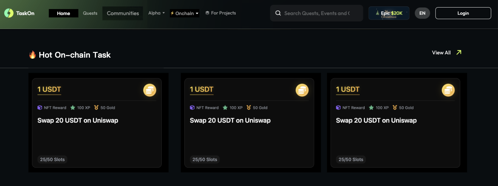

   从 onchain 任务列表中先过滤掉用户已领取奖励和已结束的任务后, 拉展示顺序 top 3 的任务卡片放在这里。如果任务卡片数量不足1个, 则不展示该模块。

   **交互逻辑**:

   - 点击 view all 后跳转到 onchain 页面
   - 点击任务卡片后, 打开任务弹窗 (用户未登录情况下, 先登录, 登录后再打开弹窗)

**头部板块**：

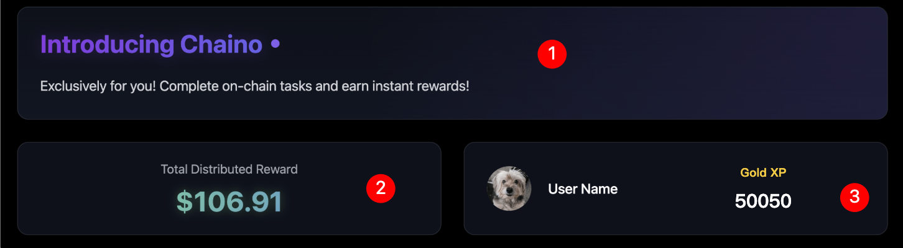

**板块1**: 用于介绍功能, 纯文本配置

**板块2**: 展示该功能下分发 Token 奖励的美元价值

- 5秒钟更新一次, 更新后数值有变化的情况下要有动效设计
- 注意: 非稳定币的 token 奖励需要转成美元价值
- 计算公式 = 初始值 + 该功能下分发 Token 奖励的美元价值 (初始值支持人工配置, 目的是为了功能上线初期数据太难看)

**板块3**: 展示用户获得的黄金积分的数量

- 当用户的积分有更新时, 该数值需要实时更新

**任务列表**：

1. **In progress 快速筛选**

   该模块下展示用户参与中的任务和任务合集:

   - 参与中的任务定义: 任务中有多个 step, 用户未完成所有 step
   - 参与中的任务合集定义: 任务合集中任意一个任务是参与中或已领奖状态, 且未领取所有任务奖励

   **交互逻辑**:

   - 按钮上显示项目数量
   - 点击后, 下方显示的任务卡片范围更新。再次点击后, 展示所有任务卡片
   - 用户没有参与中的任务和任务合集时, 不需要显示该按钮
2. **排序规则**

   a. **人工置顶优先**

   - 所有被人工置顶的任务或任务集合，统一排在列表最前面
   - 置顶项内部保持人工设置的顺序

   b. **状态优先级**

   - 优先显示优先级高的任务或任务集合
   - 优先级低的任务或任务集合排在后面

   状态和显示优先级映射关系：

   | 类型                       | 状态分类                | 排序优先级 |
   | -------------------------- | ----------------------- | ---------- |
   | 任务 (Task)                | 进行中 (Ongoing)        | 高         |
   |                            | 已结束 (名额满或时间到) | 低         |
   | 用户完成任务状态           | 未参与、参与中          | 高         |
   |                            | 已领奖                  | 低         |
   | 任务集合 (Task Collection) | 仍有进行中任务          | 高         |
   |                            | 所有任务均已结束        | 低         |
   | 用户在任务集合上的完成状态 | 未参与、参与中          | 高         |
   |                            | 已领取所有任务奖励      | 低         |

   c. **奖励价值排序**

   - 在状态相同的情况下，按奖励价值排序
   - 奖励 Token 总值（降序）- 数值越大越靠前
   - 若奖励 Token 为 0，则按黄金积分总值降序排序
   - 若奖励 黄金积分 为 0，则按积分总值降序排序

   d. **次级排序规则**

   - 如果以上条件都相同，则按创建时间降序排列（最新的排前），保证排序稳定

**任务卡片**：

1. **任务奖励**

   在任务卡片的头部显示奖励:

   

   **奖励显示规则**:

   - 多种类型奖励: 根据奖励类型的优先级选取一个主奖励展示

     - 奖励类型优先级: token 奖励 > badge > gold xp > xp
     - 副奖励显示规则:
       - badge: badge 名称 + badge 图片
       - Gold xp: gold xp 数量 + logo
       - xp: xp 数量 + logo
   - 一种类型奖励: 采用主奖励展示规则

   **不同类型主奖励的显示规则**:

   

   - Token: 显示总共 token 奖励等值美元价值, 右侧 logo 采用 token logo
   - badge: 显示 badge 名称, 右侧 logo 采用 badge 图片
   - Gold xp: 显示总共奖励的 gold xp 数量, 右侧 logo 采用 gold xp logo
   - xp: 显示总共奖励的 xp 数量, 右侧 logo 采用 xp logo

   **交互逻辑**:
   针对 token 类型奖励, hover 到数字($200区域)上时, 展示以下弹框:

   

   该弹框主要用于显示 token 奖励的数量, Token 名称, Token logo (有 token logo 用 token logo, 没有的话用 project logo)
2. **任务类型展示**

   根据不同的任务类型，展示不同的UI和交互逻辑：

   a. **Swap/Bridge 类型任务**

   <table border="1">
     <tr>
       <th>类型</th>
       <th>状态</th>
       <th>样式</th>
       <th>Hover 后样式</th>
     </tr>
     <tr>
       <td>swap/bridge</td>
       <td>未参与</td>
       <td>
         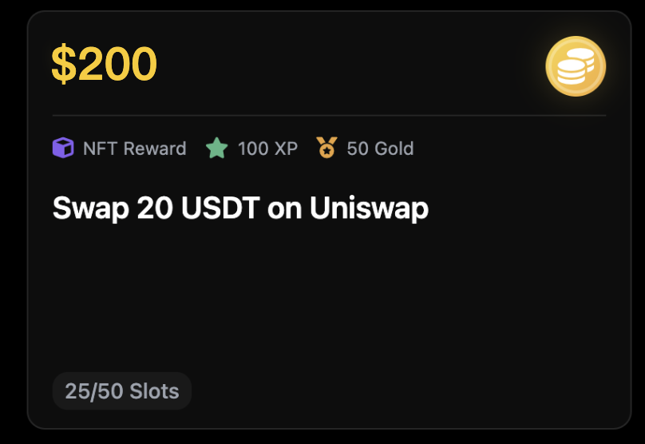
         
<b>显示要素:</b>

         
• 奖励

         
• 任务标题

         
• 剩余份数/总份数

       </td>
       <td>
         
         
<b>交互逻辑:</b>

         
点击 start 后, 打开任务页面

       </td>
     </tr>
     <tr>
       <td>swap/bridge</td>
       <td>已领取奖励</td>
       <td></td>
       <td>无变化, 同左边</td>
     </tr>
     <tr>
       <td>swap/bridge</td>
       <td>名额满/时间到期</td>
       <td></td>
       <td>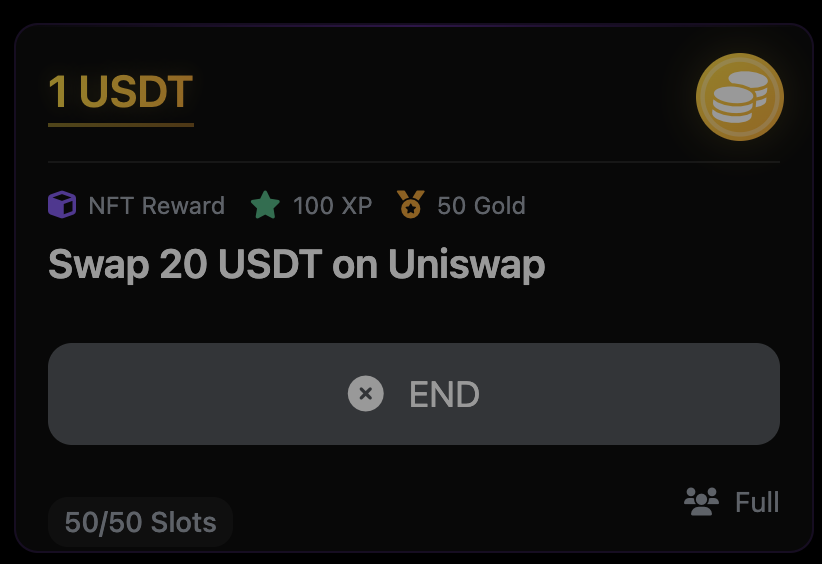</td>
     </tr>
   </table>

   b. **Hold Token 类型任务**

   <!-- 第一部分：Hold token + 天数 -->

   <table border="1">
     <tr>
       <th>类型</th>
       <th>状态</th>
       <th>样式</th>
       <th>Hover 后样式</th>
     </tr>
     <!-- 未登记状态 -->
     <tr>
       <td rowspan="8">Hold token + 天数</td>
       <td>未登记</td>
       <td>
         
         
<b>显示要素:</b>

         
• 奖励

         
• 任务标题

         
• 要求持有的token数量

         
• 要求持有的天数

       </td>
       <td>
         
         
<b>交互逻辑:</b>

         
点击 start 后, 需要判断用户持有的token数量是否满足要求:

          
         
<b>如果满足要求:</b>

         
• 展开参与成功提示弹窗

         
• 关闭弹窗后进入[已登记-进行中]状态

         
• 打卡天数+1

          
         
<b>如果不满足要求:</b>

         
• 展示 hold 弹窗

         
• 引导用户通过 swap 来获得要求 token 的数量

          
         
<b>参与成功提示弹窗:</b>

         
          
         
文案上的 10 days(5/24) 是动态显示的

          
         
<b>10 days</b> - 展示要求剩余持有token的天数

         
计算公式: 任务要求持有天数 - 用户已持有天数

          
         
<b>5/24</b> - 是满足持有天数的日期

         
计算公式: 当天日期+剩余天数

          
         
<b>Hold 弹窗:</b>

         
          
         
弹窗采用通用化组件(参考ray的需求), 图中标记的三个元素需要特殊设计:

          
         
<b>组件1:</b> 显示任务要求持有token数量的要求

          
         
<b>组件2:</b> 显示用户需要额外购买的token数量;

         
计算公式: 要求的token数量 - 用户的token余额

          
         
<b>组件3:</b> 自动填入用户需要额外购买的token数量

          
         
点击 verify 后, 校验用户的token余额是否满足条件:

         
如果满足条件, 则现有弹窗关闭, 展开参与成功提示弹窗,

         
任务卡片进入[已登记-进行中]状态, 打卡天数+1

       </td>
     </tr>
     <!-- 已登记-进行中 -->
     <tr>
       <td>已登记-进行中</td>
       <td>
         
       </td>
       <td>
         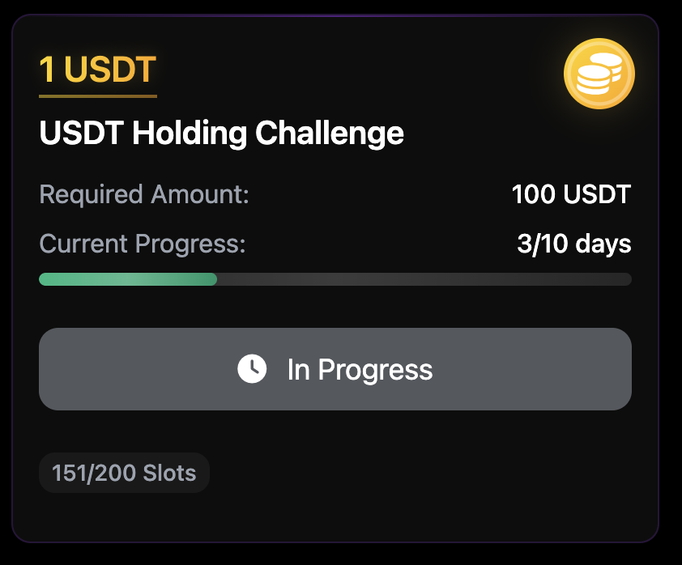
         
<b>注:</b> 按钮无法点击

       </td>
     </tr>
     <!-- 已登记-不满足hold token要求 -->
     <tr>
       <td>已登记-不满足 hold token 要求</td>
       <td>
         
       </td>
       <td>
         
         
<b>交互逻辑:</b>

         
点击 add balance 后, 展开 Hold 弹窗

       </td>
     </tr>
     <!-- 已登记-满足领取奖励条件但未领取 -->
     <tr>
       <td>已登记- 满足领取奖励 条件但未领取</td>
       <td>
         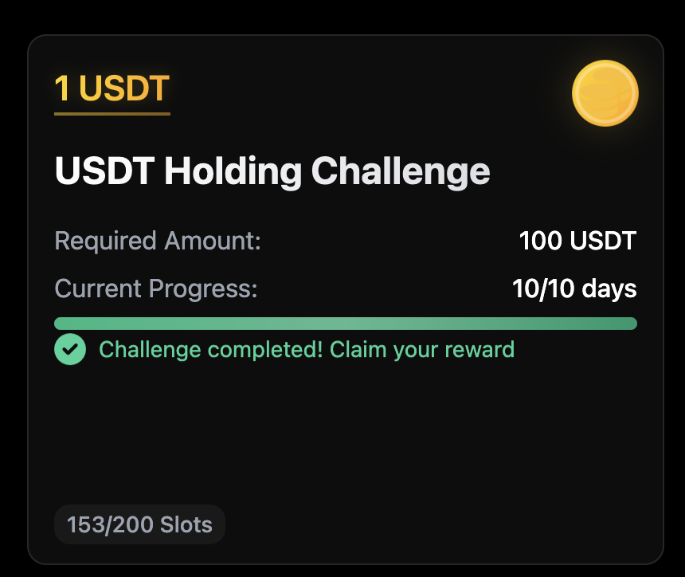
         
<b>*在设计样式上要强化需要用户手动领取奖励</b>

       </td>
       <td>
         
         
<b>交互逻辑:</b>

         
点击 claim reward 后, 进入通用领取奖励的页面

         
(ray 那边的设计)

       </td>
     </tr>
     <!-- 已登记-已领取 -->
     <tr>
       <td>已登记-已领取</td>
       <td>
         
       </td>
       <td>同左边, 没有变化</td>
     </tr>
     <!-- 已登记-名额满不能领取奖励/时间到期结束 -->
     <tr>
       <td>已登记-名额满 不能领取奖励 /时间到期结束</td>
       <td>
         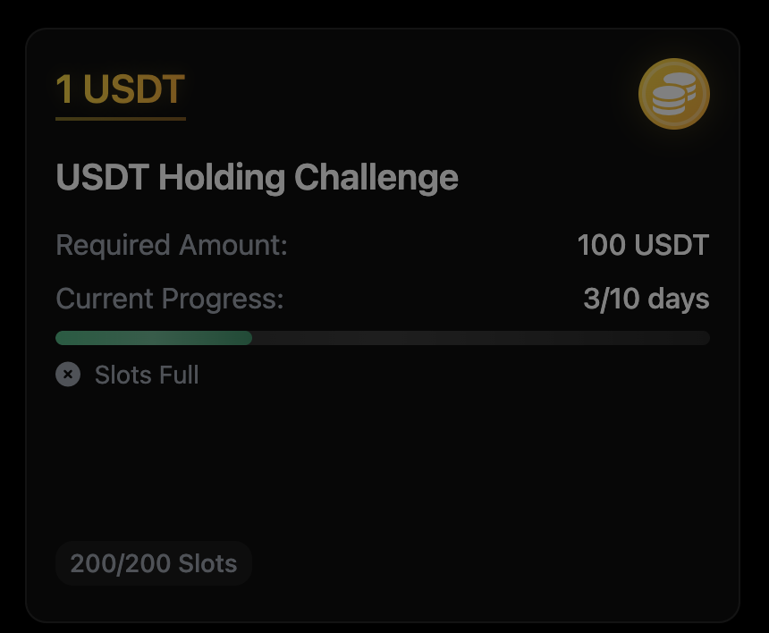
       </td>
       <td>
         
       </td>
     </tr>
     <!-- 未登记-时间即将到期 -->
     <tr>
       <td>未登记- 时间即将到期  当前时间 +任务要求持有 的天数大于任 务的结束时间, 这种情况下用 户即使参与了, 也100%拿不到奖励</td>
       <td>
         
       </td>
       <td>
         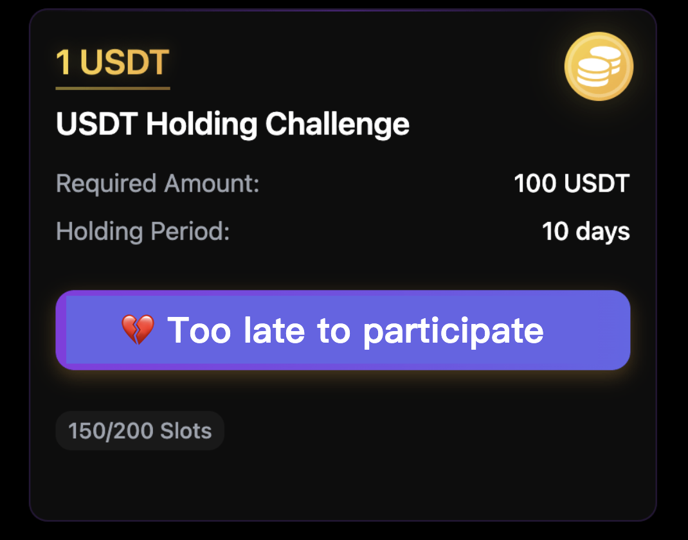
         
按钮不可点击

       </td>
     </tr>
     <!-- 未登记-时间到期 -->
     <tr>
       <td>未登记- 时间到期</td>
       <td>
         
       </td>
       <td>
         
       </td>
     </tr>
   </table>

   <!-- 第二部分：Hold token + 不加天数 -->

   <table border="1">
     <tr>
       <th>类型</th>
       <th>状态</th>
       <th>样式</th>
       <th>Hover 后样式</th>
     </tr>
     <!-- 未登记 -->
     <tr>
       <td rowspan="3">Hold token + 不加天数</td>
       <td>未登记</td>
       <td>
         
       </td>
       <td>
         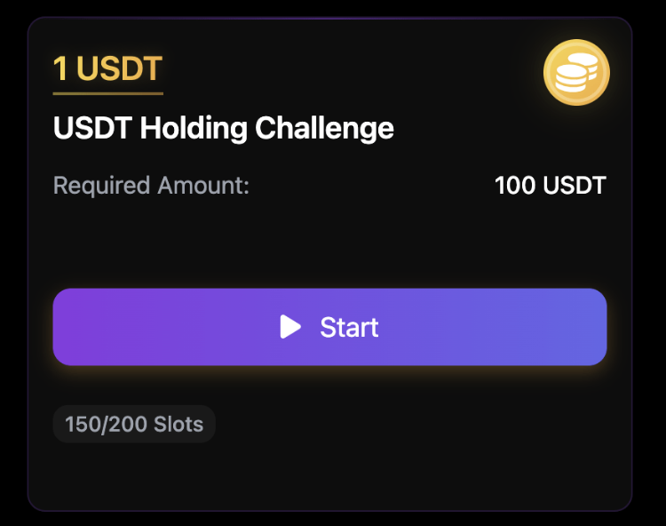
         
<b>交互逻辑:</b>

         
点击 start 后, 需要判断用户持有的token数量是否满足要求:

          
         
<b>如果满足要求:</b>

         
• 进入通用领取奖励的页面(ray 那边的设计)

          
         
<b>如果不满足要求:</b>

         
• 展示 hold 弹窗

         
• 引导用户通过 swap 来获得要求 token 的数量

          
         
<b>Hold 弹窗:</b>

         
          
         
点击 verify 后, 校验用户的token余额是否满足条件:

         
如果满足条件, 则进入通用的奖励领取页面

       </td>
     </tr>
     <!-- 已领取 -->
     <tr>
       <td>已领取</td>
       <td>
         
         
在任务标题下加个

         
Required Amount

       </td>
       <td>同左边</td>
     </tr>
     <!-- 名额满/时间到期 -->
     <tr>
       <td>名额满/时间到期</td>
       <td>
         
         
在任务标题下加个

         
Required Amount

       </td>
       <td>
         
       </td>
     </tr>
   </table>

   c. **Task Collection 类型**

   包含了多个任务的 task collection

   参考设计概念:

   

   <table>
     <tr>
       <th><b>状态</b></th>
       <th><b>样式</b></th>
       <th><b>Hover 后样式</b></th>
     </tr>
     <tr>
       <td>未登记</td>
       <td>
         

         
<b>显示要素:</b>

         
最多展示三个任务卡片,

         
卡片上只露出主奖励.

         
有超过3个任务卡片的情况下

         
将所有任务的奖励加起来后展示

         
任务集合名称

         
显示用户已领取奖励的任务及所有任务数

       </td>
       <td>
         
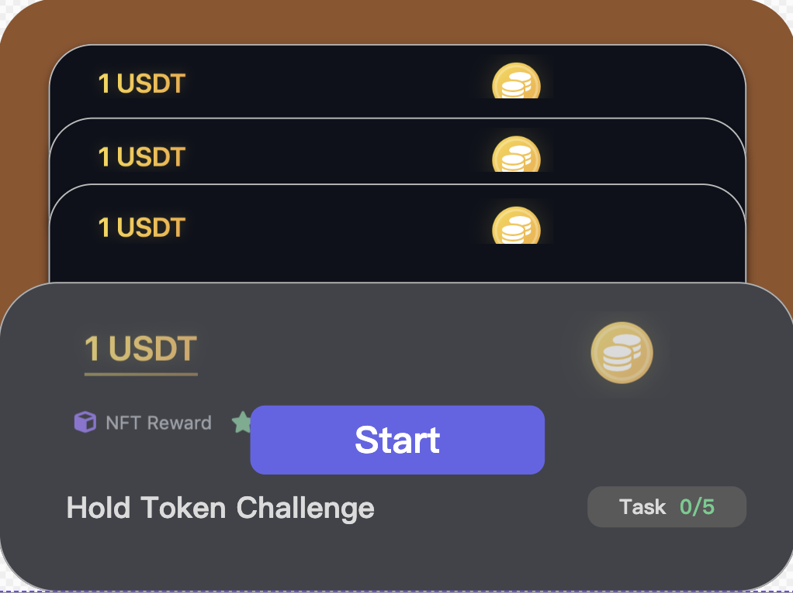

         
<b>交互逻辑:</b>

         
点击 Start 后, 进入 task

         
collection 页面

       </td>
     </tr>
     <tr>
       <td>部分任务完成奖励领取</td>
       <td>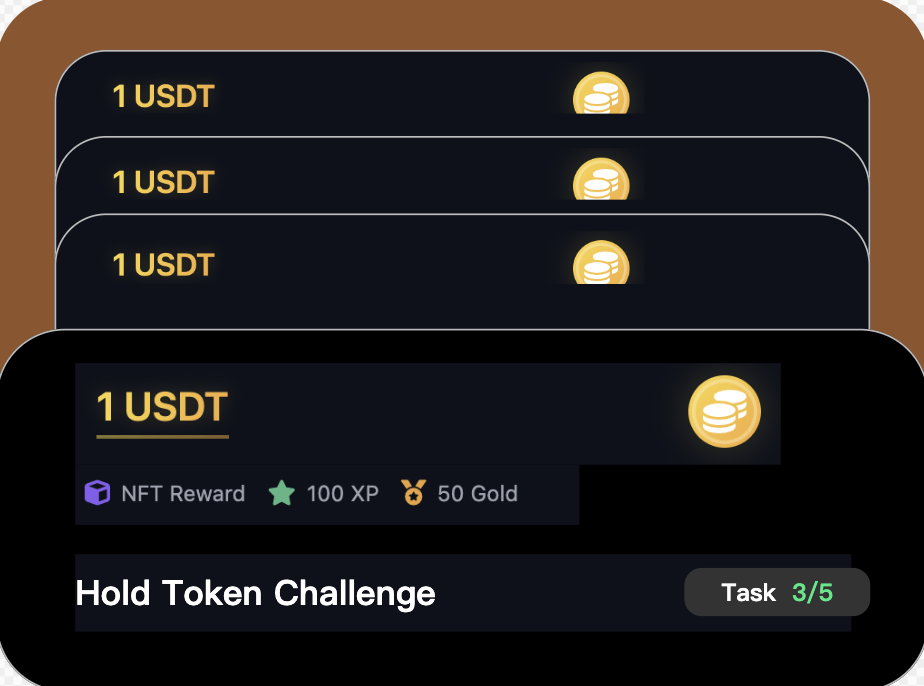</td>
       <td>同上</td>
     </tr>
     <tr>
       <td>全部任务完成奖励领取</td>
       <td></td>
       <td>同左</td>
     </tr>
     <tr>
       <td>部分任务名额满/时间到期</td>
       <td></td>
       <td>同左</td>
     </tr>
     <tr>
       <td>全部任务名额满/时间到期</td>
       <td></td>
       <td>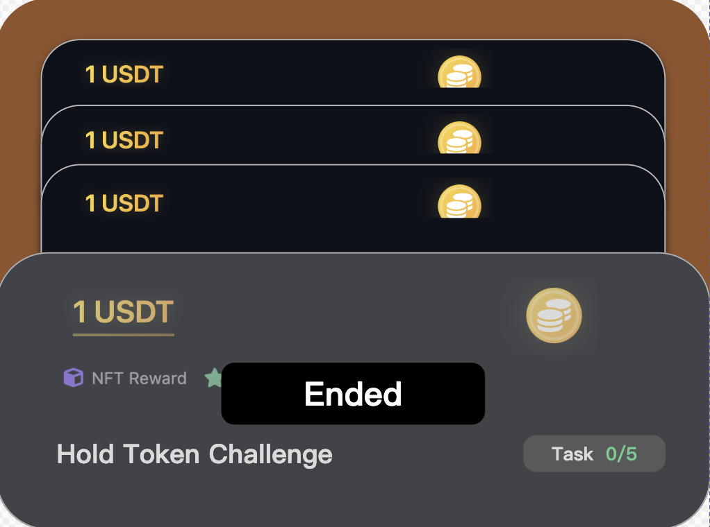</td>
     </tr>
   </table>

**教育板块**：

左侧的徽章墙上显示的徽章通过人工配置徽章 id 指定, 并且需要支持顺序配置(需要支持灵活配置, 变更不需要发版)。

右侧是对应获取徽章需要完成的任务(根据任务的奖励关联而来)。

**注**: 属于教育板块下的任务不需要出现在任务列表下, 也就是说, 任务列表下需要过滤出现教育板块下的任务, 避免重复出现。

**交互逻辑**:
点击左侧徽章, 右侧内容切换, 右侧内容显示要素(从上到下):

- 徽章标题
- 徽章描述
- 任务 Step 1标题
- 任务 Step 2标题
- ...

根据任务的不同完成状态, 有不同的显示样式和文案:

<table>
  <tr>
    <th><b>状态</b></th>
    <th><b>截图</b></th>
    <th><b>交互逻辑</b></th>
  </tr>
  <tr>
    <td>未参与</td>
    <td></td>
    <td>点击 start 按钮, 打开弹窗</td>
  </tr>
  <tr>
    <td>进行中</td>
    <td>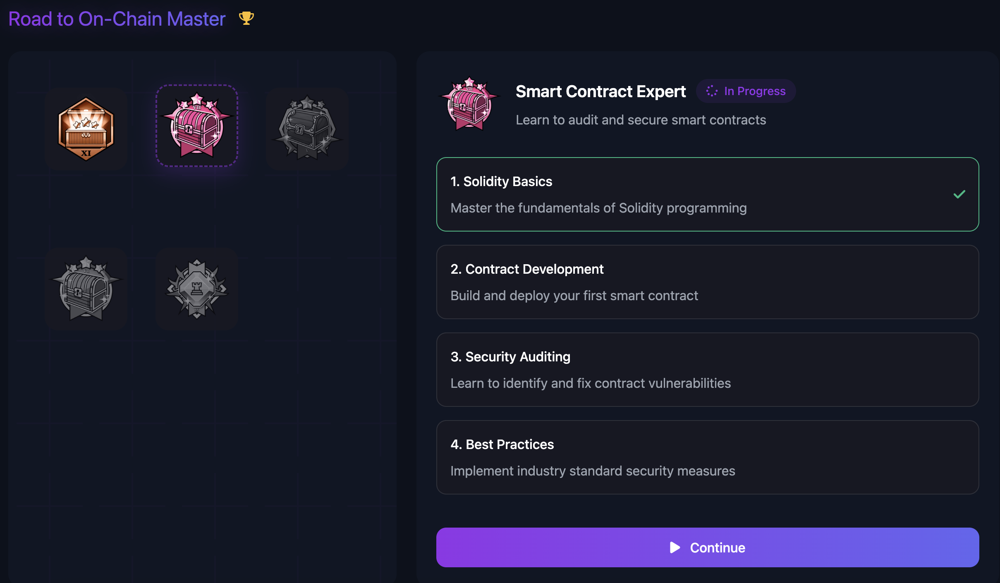</td>
    <td>
      
点击 continue 按钮,

      
打开弹窗,

      
展示最靠前未完成的 step

    </td>
  </tr>
  <tr>
    <td>已领取</td>
    <td></td>
    <td>按钮无法点击</td>
  </tr>
</table>

#### Action详情页 (优先级: P0)

**功能名称**：Action详情页**功能描述**：展示任务详情并引导用户完成任务步骤。**功能要点**：

- 显示任务标题、信息和奖励
- 支持教育、Quiz、内嵌执行等多种步骤类型
- 提供奖励展示和领取功能
- 支持Collection类型任务的展示

**功能点**:

- 详情页框架
- 教育 UI
- Quiz UI
- 内嵌执行 UI
- 奖励展示/领取
- Collection 展示

**用户主流程**:

1. 用户点击Action/Collection卡片
2. 页面出现Action详情弹窗
3. 用户查看详情弹窗
4. 用户依据分支执行Step
   - 教育类内容
   - Quiz
   - 内嵌执行
5. 全部执行完后用户进入奖励领取页
   - Token领取
   - NFT徽章领取
   - XP领取
   - Gold XP领取
6. 用户领取完成后看到对应的推荐信息

**交互逻辑**:

1. **详情页框架**

   - **页面入口**:
     - 直接通过链接访问
     - 用户通过C端落地页点击卡片进入
   - **整体页面布局**:
     - **Action标题区**:
       - 配置的Logo (默认为关联项目方的Logo，运营可以替换)
       - Action标题 (运营端配置内容，字体样式等不可修改)
     - **Action信息区**:
       - 时间组件 (展示开始和结束时间，结束时间强化展示)
       - 参与信息:

         - 参与用户头像 (展示1-3个)
         - 参与人数:

           - 如果奖励无限: 展示实际参与用户

           

           - 如果奖励有限: 展示已完成用户数/总参与上限

           
       - 用户进度区 (展示用户当前完成的进度，有分步骤的设计，提示当前步骤/总步骤数)
     - **奖励展示区**:
       - 单奖励显示 (Token/NFT Badges/XP/Golden XP)
       - 多奖励显示 (轮播切换，按优先级展示)
       - 人数限定 (剩余Spot数量及进度条，颜色随剩余比例变化)
     - **主页面**:
       - 展示各种Step的UI (教育类UI/Quiz UI/Hold/Swap/Bridge)
       - 领奖类UI
2. **未登录状态**:

   

   - 页面显示Login遮罩
   - 用户不能点击除了关闭、login以外的操作
3. **已登录状态**:

   - **被判定为机器人**:

     - 提示用户使用常见钱包操作或进行POH认证
   - **新用户**:

     

     - 页面提醒用户进行POH认证
     - 点击刷新按钮刷新状态
     - 点击Start进入POH验证页面
4. **教育UI**:

   

   - **页面元素**:
     - 标题 (运营端配置)
     - 主体 (运营端配置的富文本，支持图片和视频)
   - **交互**:
     - 用户查看图片文案
     - 用户查看视频 (可播放、暂停、全屏)
     - 通用交互 (返回上一步、进入下一步)
5. **Quiz UI**:

   

   - **页面元素**:
     - Quiz标题 (运营端配置)
     - Quiz选项 (可包含图片选项)
   - **交互**:
     - 选对 (动效提示正确，自动进入下一步)
     - 选错 (抖动特效，冷却时间3秒，选项位置随机排序)
6. **Swap UI**:

   

   - **页面元素**:
     - 内嵌展示组件
   - **交互**:
     - 用户进行Swap交易后点击Verify
7. **奖励展示/领取 UI**:

   - **Token领奖**:

     

     - 中奖固定文案
     - Token图片和数量
     - Token发放链信息
     - 奖励查看/领取提示
   - **NFT Badge领奖**
   - **Golden XP/XP**:

     - 与Token领奖流程类似
   - **多奖励**:

     

     

     

     - 按重要度排序展示 (Token > Badge > Golden XP > XP)
8. **Collection展示**:

   

   - 卡片样式和详情页展示

**其他功能模块**:

1. **Bridge内嵌执行** (优先级: P0)

   **功能点**:

   - 内嵌OO bridge
   - 非EVM钱包处理

   

   **交互逻辑**:

   - Bridge和Swap交互逻辑几乎一致
   - 非EVM钱包处理:
     - 用户需要连接两次钱包
     - 连接的钱包状态分开管理
     - 可能限制用户bridge的范围（仅支持当前能验证和用户能绑定钱包的链）
     - 新增下拉选项中出现用户当前所有EVM地址
     - 用户点击对应地址后，如果未连接会唤起钱包，如果已连接则出现单账号多地址切换提示弹窗
2. **Hold任务增加Swap功能** (优先级: P0)

   **交互逻辑**:

   - **Quest中**:
     - 在Verify左边增加一个常驻按钮Swap
     - 点击后打开swap浮窗
     - 用户点击Verify校验失败后提示用户可以用Swap（高亮swap按钮或显示指引）
   - **社区task中**:
     - 在Verify上方增加一个常驻按钮Swap
     - 点击后打开swap浮窗
     - 点击卡片详情（左边任务明细，右边swap组件）
     - 用户点击Verify校验失败后提示用户可以用Swap（高亮swap按钮或显示指引）
3. **登陆默认选项变为钱包** (优先级: P1)

   

   **交互逻辑**:

   - 调换位置，钱包的展开需要在钱包选项下面
   - 非钱包类展示可以适当弱化（仅考虑视觉）
4. **运营配置工具** (优先级: P0)

   **功能名称**：Action运营配置工具
   **功能描述**：为运营人员提供管理和配置Onchain Action的后台工具，实现Request和Action的全生命周期管理。
   **功能要点**：

   - 提供Request列表查看和管理
   - 支持Request详情查看和编辑
   - 提供Action列表管理和创建
   - 支持Action详细配置和状态管理
   - 实现Action集合(Collection)管理

   **用户主流程**：

   1. B端在Onchain Boost发起Request
   2. 运营在管理后台看到Request请求
   3. 运营管理Request
   4. 运营依据Request创建Action
   5. 运营管理Action
   6. C端看到最终Action或Action Collection

   **功能细节**：

   1. **Request列表**

      **UI展示**：

      

      - **Request状态**：

        - Pending
        - Canceled
        - Rejected
        - Live
        - Completed
        - Expired
      - **页面结构**：

        - 筛选功能：项目筛选、状态筛选、Action筛选
        - 搜索功能：基于项目的模糊搜索和Request编号搜索
        - 列表内容：序号、项目方、状态、预算、关联的Action数量
        - 标准分页：10条每页
      - **交互逻辑**：

        - 项目筛选：默认为"All Projects"，其他选项为至少有过request的项目方
        - Request状态筛选：支持多选（ALL、Pending、Canceled、Rejected、Live、Completed、Expired）
        - Action筛选：默认为"All"，本期支持Swap、Bridge、Hold三种链上行为
        - 点击列表项直接进入Request详情页
   2. **Request详情页**

      **通用页面结构UI**：

      

      **Pending状态UI**：

      

      **Canceled状态UI**：

      

      **Rejected状态UI**：

      

      **Live状态UI**：

      

      - **页面结构**：

        - 项目基本信息：Logo、项目名、项目方跳转链接
        - Request列表：筛选项显示不同状态Request
        - Request详情：状态、时间信息、预算信息
      - **Live状态下功能**：

        - Request Overview：显示时间信息、可用预算、B端目标值
        - 快捷Action创建按钮：自动带入项目信息到Action创建页
        - 编辑功能：修改结束时间、目标值、Action配置
      - **交互逻辑**：

        - 点击Edit：修改Request相关参数
        - 点击Confirm：使编辑的配置生效
        - 点击Reset：重置之前编辑的参数
        - 点击Create Action：创建新Action并自动填入相关参数
   3. **Action管理列表**

      **Action List UI**：

      

      **Collection List UI**：

      

      **Collection创建第一步**：

      

      **Collection创建第二步**：

      

      **Collection创建弹窗**：

      

      - **状态分类**：

        - Draft
        - Live
        - Expired
        - Hidden
      - **Action List标签**：

        - 筛选功能：项目筛选、状态筛选、Action筛选
        - 搜索功能：基于项目的模糊搜索
        - 列表内容：序号、Action名、项目方、状态、Action类型、参与人数和进度、Budget使用进度
        - Create Action按钮：创建新Action
      - **Collection List标签**：

        - 管理Action集合
        - 支持创建新的Collection
   4. **Action创建页**

      **创建页面UI**：

      

      **Step弹窗UI**：

      

      **Rewards Setup UI**：

      

      - **状态分类**：

        - Draft
        - Live
        - Ended
      - **创建步骤**：

        - **Basic Info**：

          - Action关联项目
          - Logo上传与重置
          - Title设置
          - 时间设置：开始时间、结束时间（支持Never Expire选项）
          - 目标受众：默认Everyone，支持白名单上传
          - Action Setup：支持纯文本/视频、Quiz、链上（Swap/Bridge/Hold）等多种类型
          - 支持Step拖拽排序和删除
        - **Rewards Setup**：

          - Action关联项目选择
          - Request关联选择：显示当前Live状态的Request
          - Request进程显示：时间信息、目标参数进度
          - 奖励设置：参与地址上限、单钱包奖励金额、预算进度
   5. **Action排序**

      **排序UI**：

      

      - 支持Action的人工排序
      - 影响C端用户看到的Action顺序

## 四、业务规则

### 1. 业务规则概述

TaskOn 2.0.0 Onchain和精准推进项目的业务规则主要涉及广告展示条件、任务排序逻辑、奖励显示规则、用户状态管理等方面。这些规则确保系统能够按照预期运行，并为用户提供一致的体验。

### 2. 业务规则列表模板

#### 广告展示规则

| 规则ID | 规则名称     | 规则描述                                                    | 适用范围    |
| ------ | ------------ | ----------------------------------------------------------- | ----------- |
| AD001  | 广告展示条件 | 当用户符合命中广告的条件且广告状态为ongoing时展示该广告     | C端精准推荐 |
| AD002  | 广告排序规则 | 多个广告时，按ongoing生效时间靠后的优先显示                 | C端精准推荐 |
| AD003  | 广告过滤规则 | 任务/任务合集类型广告，如用户已领取完奖励则不显示           | C端精准推荐 |
| AD004  | 展开条件     | 用户命中ongoing状态广告且未在当前广告内容下点击过"收起"按钮 | C端精准推荐 |
| AD005  | Epic特殊规则 | 存在Epic时，用户访问Home和Quest列表页将不展开该模块         | C端精准推荐 |

#### 任务排序规则

| 规则ID | 规则名称     | 规则描述                                          | 适用范围          |
| ------ | ------------ | ------------------------------------------------- | ----------------- |
| TS001  | 人工置顶优先 | 所有被人工置顶的任务或任务集合统一排在最前面      | C端On-chain落地页 |
| TS002  | 状态优先级   | 按进行中>已结束，未参与/参与中>已领奖的优先级排序 | C端On-chain落地页 |
| TS003  | 奖励价值排序 | 状态相同时，按奖励Token总值降序排序               | C端On-chain落地页 |
| TS004  | 次级排序规则 | 以上条件都相同时，按创建时间降序排列              | C端On-chain落地页 |

#### 奖励显示规则

| 规则ID | 规则名称       | 规则描述                                                   | 适用范围 |
| ------ | -------------- | ---------------------------------------------------------- | -------- |
| RW001  | 奖励类型优先级 | 多种奖励类型时，按token>badge>gold xp>xp的优先级选取主奖励 | 任务卡片 |
| RW002  | Token奖励显示  | 显示总共token奖励等值美元价值，右侧logo采用token logo      | 任务卡片 |
| RW003  | Badge奖励显示  | 显示badge名称，右侧logo采用badge图片                       | 任务卡片 |
| RW004  | XP奖励显示     | 显示总共奖励的xp数量，右侧logo采用xp logo                  | 任务卡片 |

#### Request管理规则

| 规则ID | 规则名称          | 规则描述                                                    | 适用范围     |
| ------ | ----------------- | ----------------------------------------------------------- | ------------ |
| RQ001  | Request状态流转   | Request状态从Pending开始，可流转至Live/Rejected/Canceled    | 运营配置工具 |
| RQ002  | Request时间控制   | Live状态的Request在结束时间后自动变为Completed或Expired状态 | 运营配置工具 |
| RQ003  | Request预算规则   | Live状态下可用预算始终更新为总预算减去已使用预算            | 运营配置工具 |
| RQ004  | Request展示优先级 | 默认按Request创建时间降序排列                               | 运营配置工具 |
| RQ005  | Request编辑权限   | 只有Live状态的Request可以被编辑                             | 运营配置工具 |

#### Action管理规则

| 规则ID | 规则名称         | 规则描述                                                         | 适用范围     |
| ------ | ---------------- | ---------------------------------------------------------------- | ------------ |
| AC001  | Action状态流转   | Action状态从Draft开始，可流转至Live，结束后变为Ended/Expired     | 运营配置工具 |
| AC002  | Action预算规则   | Action使用预算不能超过关联Request的可用预算                      | 运营配置工具 |
| AC003  | Action创建权限   | 只能基于Live状态的Request创建Action                              | 运营配置工具 |
| AC004  | Action时间控制   | Action开始时间必须大于等于当前时间，结束时间必须大于开始时间     | 运营配置工具 |
| AC005  | Never Expire规则 | 勾选Never Expire的Action没有结束时间，奖励全部发放完毕后自动结束 | 运营配置工具 |
| AC006  | Action发布校验   | 发布Action前需校验参数完整性和预算合规性                         | 运营配置工具 |

#### Collection管理规则

| 规则ID | 规则名称           | 规则描述                                                     | 适用范围     |
| ------ | ------------------ | ------------------------------------------------------------ | ------------ |
| CL001  | Collection组成规则 | Collection必须由至少1个Action组成                            | 运营配置工具 |
| CL002  | Collection展示规则 | Collection内Action按运营设定的顺序展示                       | 运营配置工具 |
| CL003  | Collection状态规则 | Collection状态取决于其包含的Action状态，全部结束才显示为结束 | 运营配置工具 |

## 五、数据需求

### 数据流说明

TaskOn 2.0.0 Onchain和精准推进项目需要收集以下数据：

#### 任务级数据统计

| 指标                 | 定义                                  | 备注                                   |
| -------------------- | ------------------------------------- | -------------------------------------- |
| 任务弹窗查看人数     | 任务弹窗查看用户数                    | 任务弹窗模块是ray那边需求上的          |
| 任务参与人数         | 完成任务中至少1个step的用户数         | 该指标只统计除holding task外的其他任务 |
| 任务完成人数         | 完成任务中所有step的用户数            | 该指标只统计除holding task外的其他任务 |
| Holding task参与人数 | Holding天数至少1天的用户数            |                                        |
| Holding task完成人数 | Holding天数完成要求的用户数           |                                        |
| Holding task领奖人数 | Holding天数完成要求且完成领奖的用户数 |                                        |

#### 任务集合级数据统计

| 指标                        | 定义                                     | 备注 |
| --------------------------- | ---------------------------------------- | ---- |
| Task_collection弹窗查看人数 | Task_collection弹窗查看用户数            |      |
| Task_collection参与人数     | 完成Task_collection中至少1个任务的用户数 |      |
| Task_collection完成人数     | 完成Task_collection中所有任务的用户数    |      |

#### Request级数据统计

| 指标                | 定义                                          | 备注                          |
| ------------------- | --------------------------------------------- | ----------------------------- |
| Request创建数       | B端创建的Request总数                          | 按时间段、项目方统计          |
| Request状态分布     | 各状态(Pending/Live/Completed等)的Request数量 | 用于监控Request流转效率       |
| Request执行率       | 转为Live状态的Request占总Request的比例        | 反映Request质量和运营审核情况 |
| Request目标达成率   | 达成目标(Wallet/Vol/Txns)的Request占比        | 按不同目标类型统计            |
| Request预算使用率   | 已使用预算/总预算                             | 用于评估预算利用效率          |
| Request平均处理时间 | Request从Pending到Live的平均时间              | 衡量运营效率                  |

#### Action级数据统计

| 指标                  | 定义                                   | 备注                       |
| --------------------- | -------------------------------------- | -------------------------- |
| Action创建数          | 运营创建的Action总数                   | 按时间段、项目方、类型统计 |
| Action状态分布        | 各状态(Draft/Live/Ended等)的Action数量 | 用于监控Action发布情况     |
| Action发布率          | 发布为Live的Action占创建总数的比例     | 反映Action质量             |
| Action参与率          | 有用户参与的Action占Live Action的比例  | 评估用户对Action的接受度   |
| Action完成率          | 用户完成率达到目标的Action占比         | 用于评估Action设计效果     |
| Action平均完成时间    | 用户从开始到完成Action的平均时间       | 用于评估Action复杂度       |
| Action奖励发放率      | 实际发放奖励/计划发放奖励              | 用于评估奖励设计合理性     |
| Request到Action转化率 | 每个Request平均产生的Action数量        | 衡量Request利用效率        |

此外，系统还需要记录导航栏按钮点击的PV和UV数据，以及头部板块中显示的Token奖励美元价值和用户获得的黄金积分数量。

### 数据实体关系

运营配置工具涉及的主要数据实体及其关系如下：

1. **Project实体**：代表B端项目方

   - 属性：项目ID、项目名称、Logo、创建时间等
   - 关系：一个Project可以有多个Request
2. **Request实体**：代表B端发起的活动请求

   - 属性：Request ID、状态、开始时间、结束时间、预算、目标值等
   - 关系：
     - 归属于一个Project
     - 可以关联多个Action
3. **Action实体**：代表运营配置的具体活动

   - 属性：Action ID、标题、Logo、状态、开始时间、结束时间、步骤配置等
   - 关系：
     - 可以关联一个Request（也可以无Request关联）
     - 可以属于多个Collection
4. **Collection实体**：代表Action的集合

   - 属性：Collection ID、名称、描述、状态等
   - 关系：包含多个Action
5. **Step实体**：代表Action中的单个步骤

   - 属性：Step ID、类型(文本/Quiz/链上)、内容配置等
   - 关系：归属于一个Action
6. **Reward实体**：代表Action的奖励配置

   - 属性：奖励类型、数量、预算限制、参与人数上限等
   - 关系：归属于一个Action

## 六、需求反馈意见

### 1. 完整性评估

#### 1.2 业务流程

- **优点**: 主要业务流程描述清晰，用户旅程和交互流程详细。
- **不足**:
  - 大部分异常流程未详细描述，例如网络异常、交易失败等场景的处理。
  - 缺少完整的状态转换图，特别是Hold Token任务的状态变化较复杂。
  - 未详细说明各业务操作的权限控制和安全措施。

#### 1.3 数据需求

- **优点**: 提供了基本的数据统计指标和定义。
- **不足**:
  - 数据模型和字段定义不完整，缺少数据结构、存储方式的详细说明。
  - 数据校验规则未明确定义，如任务参数、用户输入的验证规则。
  - 数据流转路径不完整，未清晰描述数据的生命周期和处理流程。

### 2. 明确性评估

#### 2.1 需求描述

- **优点**: 大部分功能的UI展示和交互流程描述清晰，配有截图说明。
- **不足**:
  - 部分术语定义不明确，如"命中广告"、"ongoing状态"等缺少明确定义。
  - 一些业务规则描述模糊，如"时间即将到期"的具体判断标准未明确。
  - 规格说明不完整，如UI尺寸、响应时间、动效细节等技术参数缺失。

#### 2.2 交互设计

- **优点**: 提供了详细的UI展示和交互流程，有丰富的截图支持。
- **不足**:
  - 部分交互细节缺失，如错误提示文案、加载状态展示等。

### 3. 一致性评估

#### 3.1 内部一致性

- **优点**: 整体结构逻辑清晰，模块之间划分合理。
- **不足**:
  - 部分术语使用不一致，如"任务"和"Action"混用，可能造成理解偏差。
  - 各模块的命名规则不统一，如"C端精准推荐"和"Onchain落地页"的命名逻辑不同。
  - 部分功能描述的详细程度不均衡，如Hold任务描述很详细，而其他类型任务描述较简略。

#### 3.2 外部一致性

- **优点**: 与现有产品风格基本一致，保持了用户体验的连贯性。
- **不足**:
  - 与第三方系统（如ray那边的需求）的接口和交互细节描述不足。
  - 未明确说明与现有系统的集成方式和兼容性考虑。

### 4. 建议事项

1. **异常处理完善**:

   - 补充各类异常场景的处理方案，如网络错误、数据验证失败、第三方服务异常等。
   - 为每种异常提供明确的用户提示和恢复措施。
2. **数据需求细化**:

   - 补充详细的数据模型设计，包括实体关系、字段定义、数据类型等。
   - 明确数据校验规则和数据安全措施。
3. **验收标准明确化**:

   - 为每个功能点定义明确的验收标准，包括功能、性能、体验等方面。
   - 设定关键业务指标目标值，如参与率、转化率等。
4. **非功能性需求补充**:

   - 添加性能需求、安全需求、可用性需求等非功能性需求的详细说明。
   - 明确兼容性要求，如支持的浏览器、设备类型等。
5. **统一术语和规范**:

   - 建立术语表，统一文档中使用的专业术语。
   - 统一各模块的命名规则和描述格式。

### 5. 按严重程度分类的具体反馈意见

#### 5.1 P0级问题（高优先级）

| 问题ID | 问题描述                                                         | 影响范围                                   | 建议解决方案                                                                                   |
| ------ | ---------------------------------------------------------------- | ------------------------------------------ | ---------------------------------------------------------------------------------------------- |
| P0-01  | 异常流程缺失：任务验证失败后没有清晰的用户引导机制               | Hold/Swap/Bridge三种任务类型的验证失败场景 | 设计验证失败的处理流程，包括失败原因提示、重试机制和用户指引（如Gas费不足/滑点过大的解决建议） |
| P0-02  | Hold Token任务状态管理不完整：缺少用户持有量低于要求时的恢复流程 | Hold Token任务全流程                       | 补充用户余额不足时的恢复流程，包括余额检查时机、通知方式和自动恢复机制                         |
| P0-03  | 核心验证机制不明确：未详细说明如何验证用户完成链上操作           | 所有Onchain任务类型                        | 为每种任务类型明确定义验证标准，如交易哈希验证方式、跨链验证方式、持有时间验证规则等           |
| P0-04  | 未定义任务完成率目标值：缺少业务成功的量化指标                   | 整体项目评估                               | 设定具体的任务完成率、参与转化率等KPI指标，如"Swap任务完成率>50%"、"推荐点击率>15%"            |
| P0-05  | 任务奖励发放机制不明确：未详细描述Token奖励的发放流程和时间点    | 奖励发放环节                               | 明确定义奖励发放的触发条件、确认机制、失败重试策略和用户通知方式                               |
| P0-06  | Request到Action转化流程不完整：缺少运营审核和创建的详细标准      | 运营配置工具                               | 制定明确的Request审核标准和Action创建指南，包括参数校验规则和质量标准                          |
| P0-07  | Action预算管理机制不明确：缺少预算分配与控制的详细规则           | 运营配置工具                               | 设计完整的预算分配、消耗和超限处理机制，确保资源合理利用                                       |

#### 5.2 P1级问题（中优先级）

| 问题ID | 问题描述                                                            | 影响范围     | 建议解决方案                                                           |
| ------ | ------------------------------------------------------------------- | ------------ | ---------------------------------------------------------------------- |
| P1-01  | 术语使用不一致："任务"和"Action"、"Onchain任务"和"Onchain Task"混用 | 整个文档     | 创建术语表，统一术语使用，明确定义每个术语的准确含义和使用场景         |
| P1-02  | 缺少性能指标定义：未明确系统响应时间、并发用户数等非功能需求        | 所有功能模块 | 定义关键性能指标，如"任务验证响应时间<3秒"、"系统支持10万用户同时在线" |
| P1-03  | 用户交互错误处理不完善：未说明各类操作失败的提示方式和格式          | 用户界面交互 | 设计统一的错误提示框架，包括错误码体系、用户友好的提示文案和恢复建议   |
| P1-04  | 数据模型定义不完整：未明确各实体间的关系和数据流转                  | 数据需求     | 补充完整的数据实体关系图，明确字段类型、约束条件和数据流转路径         |
| P1-05  | 缺少兼容性要求：未说明支持的设备类型、浏览器版本等                  | 前端实现     | 明确定义支持的操作系统、浏览器版本、移动设备类型及屏幕分辨率要求       |
| P1-06  | 教育板块内容管理机制不明确：未详细说明如何更新和维护教育内容        | 教育板块     | 设计内容管理流程，包括内容审核机制、更新周期和版本控制                 |
| P1-07  | Action Collection管理机制不完善：缺少Collection内Action关系管理规则 | 运营配置工具 | 制定Collection内Action关联规则，包括添加、移除和排序机制               |
| P1-08  | 运营角色权限不明确：未详细说明不同角色的操作权限和审批流程          | 运营配置工具 | 设计完整的RBAC权限模型，明确运营、审核和管理员角色的权限边界           |

#### 5.3 P2级问题（低优先级）

| 问题ID | 问题描述                                                       | 影响范围     | 建议解决方案                                                  |
| ------ | -------------------------------------------------------------- | ------------ | ------------------------------------------------------------- |
| P2-01  | 缺少自动化测试设计考虑：未提供便于自动化测试的设计元素         | 测试实施     | 在UI设计中添加稳定的测试钩子和ID，便于自动化测试脚本开发      |
| P2-02  | 广告轮播间隔固定为5秒：未考虑不同内容类型的最佳展示时间        | C端精准推荐  | 根据广告内容类型设计动态轮播时间，如图片型3-5秒，任务型5-8秒  |
| P2-03  | 功能描述详细程度不均衡：Hold任务描述过于详细而其他任务相对简略 | 文档平衡性   | 统一各功能模块的描述深度，确保关键信息覆盖完整且保持一致性    |
| P2-04  | 未考虑无障碍设计：缺少对色盲用户、屏幕阅读器等辅助功能的支持   | 用户体验     | 增加无障碍设计考虑，如支持高对比度模式、键盘导航和屏幕阅读器  |
| P2-05  | 缺少用户反馈收集机制：未说明如何收集和处理用户对新功能的反馈   | 产品迭代     | 设计用户反馈收集流程，包括问卷调查、使用数据分析和A/B测试机制 |
| P2-06  | Action排序UI交互细节不足：缺少拖拽排序的具体交互描述           | 运营配置工具 | 补充拖拽排序的交互细节，包括视觉反馈、保存机制和预览功能      |
| P2-07  | Request状态变更通知机制缺失：未说明如何通知B端状态变更情况     | 运营配置工具 | 设计状态变更通知机制，包括邮件、站内信和Dashboard实时更新     |

### 6. 功能验收标准建议

| 功能模块          | 验收指标                     | 目标值  | 测试方法                         |
| ----------------- | ---------------------------- | ------- | -------------------------------- |
| C端精准推荐       | 广告点击率                   | >15%    | 统计用户查看广告与点击的比率     |
|                   | 广告转化率（点击后完成任务） | >30%    | 统计点击广告后完成任务的用户比例 |
|                   | 广告加载时间                 | <1秒    | 性能测试工具测量                 |
| C端On-chain落地页 | 页面停留时间                 | >2分钟  | 用户行为数据分析                 |
|                   | 任务浏览到参与转化率         | >25%    | 统计浏览任务详情到参与任务的比率 |
|                   | 页面完全加载时间             | <3秒    | 性能测试工具测量                 |
| Hold Token任务    | 持有验证成功率               | >95%    | 验证过程错误率监控               |
|                   | 用户完成率（开始到领奖）     | >40%    | 任务漏斗分析                     |
|                   | 验证响应时间                 | <3秒    | 性能测试工具测量                 |
| Swap/Bridge任务   | 交易验证成功率               | >90%    | 验证过程错误率监控               |
|                   | 用户完成率                   | >60%    | 任务漏斗分析                     |
|                   | 平均完成时间                 | <5分钟  | 用户行为数据分析                 |
| 运营配置工具      | Request审核平均时间          | <24小时 | 运营效率监控                     |
|                   | Action创建平均时间           | <30分钟 | 运营效率监控                     |
|                   | 预算分配准确率               | >98%    | 预算使用偏差统计                 |
|                   | 系统响应时间                 | <2秒    | 性能测试工具测量                 |
|                   | Action发布成功率             | >95%    | 错误日志统计                     |

### 7. 优先实施建议

| 优先级 | 功能/改进点               | 预期收益                 | 技术复杂度 | 实施团队    |
| ------ | ------------------------- | ------------------------ | ---------- | ----------- |
| P0     | Hold Token验证机制完善    | 提高45%任务完成率        | 中         | 后端+前端   |
| P0     | C端On-chain落地页核心功能 | 增加30%Onchain用户活跃度 | 高         | 全栈团队    |
| P0     | Swap/Bridge内嵌执行       | 提高50%任务转化率        | 高         | 前端+区块链 |
| P0     | Request管理功能           | 提升65%运营效率          | 高         | 全栈团队    |
| P0     | Action创建核心功能        | 缩短70%活动发布周期      | 高         | 全栈团队    |
| P1     | 异常处理流程优化          | 降低40%用户流失率        | 中         | 前端+UX     |
| P1     | C端精准推荐功能           | 提高25%用户参与度        | 中         | 前端+数据   |
| P1     | 教育板块内容              | 新用户留存率提升20%      | 低         | 内容+前端   |
| P1     | Collection管理功能        | 提升30%运营内容组织效率  | 中         | 全栈团队    |
| P2     | 数据分析仪表盘            | 提升运营决策效率         | 低         | 数据+后端   |
| P2     | 移动端适配优化            | 改善15%移动用户体验      | 中         | 前端        |
| P2     | Action排序功能            | 提高25%用户点击率        | 低         | 前端+后端   |

### 8. Action运营配置需求专项评估

经过对Action运营配置工具需求的专项评估，发现以下几个关键方面需要进一步完善和明确：

#### 8.1 需求完整性评估

| 评估维度       | 现状描述                                                    | 问题分析                                             | 改进建议                                                       |
| -------------- | ----------------------------------------------------------- | ---------------------------------------------------- | -------------------------------------------------------------- |
| 状态流转机制   | 描述了Request和Action的基本状态，但缺少完整的状态转换图     | 状态间转换条件和触发机制不明确，可能导致开发理解偏差 | 补充完整的状态转换图，明确每个状态的进入/退出条件及触发方式    |
| 预算管理体系   | 提及了预算控制和分配，但缺少完整的预算管理流程              | 预算超限、调整和冻结等异常情况处理机制不清晰         | 设计完整的预算生命周期管理机制，包括分配、消耗、冻结和释放流程 |
| 审核与权限     | 简单提及了运营审核Request的功能，但缺少详细的审核标准和流程 | 审核标准不明确，可能导致审核不一致或延误             | 制定明确的审核标准文档，设计分级审核机制，明确各角色的权限范围 |
| 数据统计与监控 | 提及了基础数据统计，但缺少实时监控和预警机制                | 无法及时发现和处理异常情况，影响运营效率             | 增加实时监控面板设计，包含关键指标预警机制和异常处理流程       |
| 批量操作支持   | 未提及批量操作功能                                          | 单个操作效率低，不适合大规模活动管理                 | 增加批量创建、编辑和状态管理功能，提高运营效率                 |

#### 8.2 关键功能缺失分析

1. **Request审核工作流**

   - **现状**：仅描述了基本的审核操作，缺少完整工作流
   - **问题**：无法支持复杂审核场景，如多级审核、条件审核
   - **建议**：设计灵活的审核工作流配置功能，支持自定义审核路径和条件
2. **模板与复用机制**

   - **现状**：每次创建Action都需要从头配置
   - **问题**：重复工作多，效率低下
   - **建议**：增加Action模板功能，支持将成功的Action保存为模板并复用
3. **数据导入导出**

   - **现状**：未提及数据导入导出功能
   - **问题**：难以迁移数据或与外部系统集成
   - **建议**：增加标准格式的数据导入导出功能，支持Excel/CSV格式
4. **版本控制与回滚**

   - **现状**：未提及内容版本控制功能
   - **问题**：无法追踪变更历史或回滚错误修改
   - **建议**：为关键内容添加版本控制功能，支持历史版本查看和回滚
5. **A/B测试支持**

   - **现状**：未提及A/B测试功能
   - **问题**：无法科学验证不同活动设计的效果差异
   - **建议**：增加Action的A/B测试配置功能，支持效果对比分析

#### 8.3 交互设计评估

| 界面           | 优点                         | 存在问题                                     | 改进建议                                                 |
| -------------- | ---------------------------- | -------------------------------------------- | -------------------------------------------------------- |
| Request列表    | 布局清晰，筛选功能完善       | 缺少批量操作区域，状态展示不够直观           | 增加列表顶部批量操作栏，使用更明显的视觉元素区分不同状态 |
| Request详情页  | 信息分区合理，核心数据突出   | 编辑流程不够直观，缺少变更预览功能           | 优化编辑交互流程，增加变更预览功能和影响分析提示         |
| Action创建页   | 分步骤设计合理，降低认知负担 | 步骤间数据依赖关系不明确，表单验证规则不清晰 | 增加步骤间数据关联提示，完善即时表单验证和提示机制       |
| Action列表     | 支持多维度筛选               | 缺少快速操作功能，数据展示密度不够优化       | 增加行内快速操作按钮，优化列表数据展示密度和排序方式     |
| Collection管理 | 支持可视化组合               | UI交互细节描述不足，拖拽操作不够清晰         | 完善拖拽交互细节，增加预览功能和即时反馈机制             |

#### 8.4 性能与扩展性考量

1. **大规模数据处理能力**

   - 系统应设计成能处理大量Request和Action（万级）的场景
   - 建议增加分页、懒加载和数据分片加载机制
   - 考虑添加缓存策略，提高频繁访问数据的加载速度
2. **多项目并行管理**

   - 当运营同时管理多个项目的活动时，界面易用性可能下降
   - 建议增加项目分组和上下文切换机制，优化多项目管理体验
   - 增加项目级别的数据概览和比较功能
3. **系统可扩展性**

   - 当前设计未考虑未来可能增加的Action类型和验证机制
   - 建议设计可插拔的Action类型框架，支持后续扩展新类型
   - 考虑设计开放API，允许第三方系统集成

#### 8.5 建议实施路径

建议将Action运营配置工具按以下优先级分阶段实施：

**第一阶段（MVP）**：

- Request基础管理功能（创建、查看、状态更新）
- Action基础创建和管理功能（常用类型支持）
- 核心预算管理功能
- 基础数据统计

**第二阶段（增强功能）**：

- 完善的审核流程
- Collection管理功能
- Action排序功能
- 高级数据分析和报表

**第三阶段（优化与扩展）**：

- 模板和批量操作
- A/B测试支持
- 高级监控和预警
- 外部系统集成API

### 9. 主要风险与缓解措施

| 风险类型 | 风险描述                         | 影响程度 | 缓解措施                                                                          |
| -------- | -------------------------------- | -------- | --------------------------------------------------------------------------------- |
| 技术风险 | 区块链验证延迟导致用户体验差     | 高       | 1. 实现乐观更新UI ` `2. 设计轮询机制并优化频率 ` `3. 提供明确的进度反馈 |
| 用户风险 | 新用户对链上操作不熟悉，流失率高 | 高       | 1. 完善教育内容 ` `2. 添加引导式教程 ` `3. 设计友好的错误提示           |
| 业务风险 | 奖励吸引力不足，参与度低         | 中       | 1. 实施动态奖励机制 ` `2. A/B测试不同奖励额度 ` `3. 增加社交分享激励    |
| 运营风险 | 恶意用户利用系统漏洞刷取奖励     | 中       | 1. 完善风控规则 ` `2. 实施渐进式验证 ` `3. 设置合理的奖励上限           |
| 集成风险 | 第三方服务不稳定影响功能可用性   | 中       | 1. 增加服务降级策略 ` `2. 实现本地缓存 ` `3. 添加故障转移机制           |

## 七、技术开发任务拆解

根据需求优先级，将功能点拆解为可执行的技术开发任务，每个任务工作量不超过2天。

### P0优先级任务

#### C端On-chain落地页（核心功能）

##### 前端任务

1. **导航栏Onchain入口开发**

   - 开发导航栏Onchain按钮及下拉列表
   - 实现Hover和点击交互效果
   - 工作量：1天
2. **首页Onchain模块开发**

   - 开发Top 3任务卡片组件
   - 实现任务过滤逻辑（已领取奖励和已结束过滤）
   - 实现view all跳转和任务卡片点击交互
   - 工作量：1.5天
3. **头部板块开发**

   - 实现功能介绍文本区域
   - 开发Token奖励美元价值展示及动效
   - 开发用户黄金积分展示功能
   - 实现数值定时更新机制
   - 工作量：2天
4. **In Progress快速筛选功能**

   - 开发筛选按钮及数量展示
   - 实现参与中任务/任务合集过滤逻辑
   - 开发筛选状态切换功能
   - 工作量：1天
5. **任务列表排序实现**

   - 开发人工置顶优先排序逻辑
   - 实现状态优先级排序逻辑
   - 开发奖励价值排序和次级排序
   - 工作量：1.5天
6. **任务卡片基础组件和奖励展示开发**

   - 开发任务奖励展示组件
   - 实现多种类型奖励优先级逻辑
   - 开发Token类型奖励Hover弹窗
   - 工作量：2天
7. **Swap/Bridge类型任务卡片开发**

   - 开发未参与状态UI及交互
   - 实现已领取奖励状态UI
   - 开发名额满/时间到期状态UI及交互
   - 工作量：1.5天
8. **Hold Token任务卡片开发-第一部分**

   - 开发未登记状态UI及交互逻辑
   - 实现持有Token验证功能
   - 开发参与成功提示弹窗
   - 工作量：2天
9. **Hold Token任务卡片开发-第二部分**

   - 开发已登记进行中状态UI
   - 实现不满足hold token要求状态UI及交互
   - 开发满足领取条件但未领取状态UI
   - 工作量：2天
10. **Hold Token任务卡片开发-第三部分**

    - 开发已登记已领取状态UI
    - 实现名额满/时间到期状态UI
    - 开发时间即将到期状态逻辑及UI
    - 工作量：2天
11. **Task Collection类型卡片开发**

    - 开发集合卡片基础UI结构
    - 实现不同状态下的显示逻辑
    - 开发卡片交互功能
    - 工作量：2天

##### 后端任务

1. **任务列表API开发**

   - 开发任务数据查询接口
   - 实现过滤和排序逻辑
   - 开发任务状态管理API
   - 工作量：2天
2. **任务状态管理服务开发**

   - 开发任务参与状态判断逻辑
   - 实现任务完成状态判断逻辑
   - 开发奖励领取状态管理
   - 工作量：2天
3. **奖励计算服务开发**

   - 开发Token价格查询服务
   - 实现奖励美元价值计算
   - 开发奖励统计聚合接口
   - 工作量：2天

#### Action详情页（Swap/Hold/Bridge）

##### 前端任务

1. **详情页框架开发**

   - 开发页面整体布局结构
   - 实现Action标题区和信息区
   - 开发奖励展示区组件
   - 工作量：2天
2. **Action信息区开发**

   - 开发时间组件（开始和结束时间）
   - 实现参与用户头像和人数展示
   - 开发用户进度区组件
   - 工作量：1.5天
3. **用户状态处理开发**

   - 实现未登录状态遮罩
   - 开发机器人检测处理UI
   - 实现新用户POH认证提示
   - 工作量：1天
4. **教育UI组件开发**

   - 开发富文本内容展示组件
   - 实现图片和视频播放功能
   - 开发步骤导航和交互控件
   - 工作量：2天
5. **Quiz UI组件开发**

   - 开发Quiz题目和选项组件
   - 实现正确/错误反馈动效
   - 开发选项随机排序功能
   - 工作量：2天
6. **Swap/Bridge UI组件开发**

   - 开发内嵌交易组件结构
   - 实现交易验证按钮功能
   - 开发交易结果处理逻辑
   - 工作量：2天
7. **奖励展示/领取UI开发**

   - 开发Token奖励领取UI
   - 实现NFT Badge领奖UI
   - 开发XP/Gold XP奖励UI
   - 工作量：2天
8. **多奖励展示功能开发**

   - 实现多奖励轮播展示
   - 开发奖励优先级排序逻辑
   - 实现奖励领取状态管理
   - 工作量：1.5天
9. **Collection展示UI开发**

   - 开发Collection卡片样式
   - 实现Collection详情页展示
   - 开发集合内任务导航功能
   - 工作量：2天

##### 后端任务

1. **Action详情API开发**

   - 开发任务详情数据接口
   - 实现用户进度查询接口
   - 开发参与用户信息接口
   - 工作量：2天
2. **Step验证API开发**

   - 开发Quiz验证逻辑
   - 实现教育内容进度追踪
   - 开发Step完成状态管理
   - 工作量：2天
3. **奖励发放服务开发**

   - 开发Token奖励发放接口
   - 实现Badge奖励发放逻辑
   - 开发XP/Gold XP奖励发放
   - 工作量：2天

#### Bridge内嵌执行

##### 前端任务

1. **OO Bridge集成开发**

   - 开发Bridge组件UI
   - 实现Bridge功能集成
   - 开发交互流程和状态管理
   - 工作量：2天
2. **非EVM钱包处理开发**

   - 实现多钱包连接管理
   - 开发地址下拉选项功能
   - 实现账号切换提示弹窗
   - 工作量：2天

##### 后端任务

1. **Bridge验证服务开发**
   - 开发跨链交易验证逻辑
   - 实现验证结果处理接口
   - 开发异常处理机制
   - 工作量：2天

#### Hold任务Swap功能

##### 前端任务

1. **Quest中Swap功能开发**

   - 开发Swap按钮UI
   - 实现Swap浮窗组件
   - 开发校验失败提示引导
   - 工作量：2天
2. **社区Task中Swap功能开发**

   - 开发卡片详情页面
   - 实现Swap组件集成
   - 开发验证失败引导功能
   - 工作量：2天

#### 新增Onchain验证器

##### 后端任务

1. **OO Swap验证器开发**

   - 开发Swap交易验证逻辑
   - 实现验证结果处理接口
   - 开发异常处理机制
   - 工作量：2天
2. **OO Bridge验证器开发**

   - 开发跨链交易验证逻辑
   - 实现多链支持功能
   - 开发验证结果处理接口
   - 工作量：2天
3. **Dex批量接入开发-第一部分**

   - 设计验证器抽象层
   - 开发基础验证器接口
   - 实现配置管理服务
   - 工作量：2天
4. **Dex批量接入开发-第二部分**

   - 开发多Dex接口适配器
   - 实现Dex交易验证逻辑
   - 开发验证结果处理接口
   - 工作量：2天

#### 运营配置工具

##### 前端任务

1. **Request列表页开发**

   - 开发列表UI组件及分页功能
   - 实现筛选功能（项目筛选、状态筛选、Action筛选）
   - 开发搜索功能
   - 实现Request跳转逻辑
   - 工作量：2天
2. **Request详情页开发-基础结构**

   - 开发页面基础布局
   - 实现项目基本信息区域
   - 开发Request列表筛选组件
   - 实现Request详情基础信息展示
   - 工作量：2天
3. **Request详情页开发-Live状态功能**

   - 开发Request Overview组件
   - 实现时间和预算信息展示
   - 开发目标值展示组件
   - 实现快捷Action创建功能
   - 工作量：2天
4. **Request详情编辑功能**

   - 开发Edit模式UI组件
   - 实现参数编辑功能
   - 开发Confirm和Reset功能
   - 实现编辑结果实时反馈
   - 工作量：2天
5. **Action管理列表开发**

   - 开发Tab切换组件
   - 实现Action List筛选和搜索功能
   - 开发列表内容展示组件
   - 实现Create Action按钮功能
   - 工作量：2天
6. **Collection管理功能开发**

   - 开发Collection List组件
   - 实现Collection创建流程
   - 开发Collection管理功能
   - 工作量：2天
7. **Action创建页-Basic Info开发**

   - 开发项目关联和Logo设置功能
   - 实现时间设置组件
   - 开发目标受众配置功能
   - 实现Action Setup基础框架
   - 工作量：2天
8. **Action创建页-Step设置开发**

   - 开发Step类型选择组件
   - 实现文本/视频内容配置
   - 开发Quiz配置功能
   - 实现链上Action配置
   - 开发Step排序和删除功能
   - 工作量：2天
9. **Action创建页-Rewards Setup开发**

   - 开发Request关联组件
   - 实现Request进程展示
   - 开发奖励设置功能
   - 实现预算使用预览
   - 工作量：2天
10. **Action排序功能开发**

    - 开发拖拽排序UI
    - 实现排序保存功能
    - 开发排序预览效果
    - 工作量：1.5天

##### 后端任务

1. **Request管理API开发**

   - 开发Request列表查询接口
   - 实现筛选和排序功能
   - 开发搜索接口
   - 工作量：2天
2. **Request详情和编辑API**

   - 开发Request详情查询接口
   - 实现状态管理功能
   - 开发Request编辑接口
   - 实现编辑校验和权限控制
   - 工作量：2天
3. **Action管理API开发**

   - 开发Action列表查询接口
   - 实现状态管理功能
   - 开发Action基础操作接口
   - 工作量：2天
4. **Collection管理API开发**

   - 开发Collection列表查询接口
   - 实现Collection创建和编辑接口
   - 开发Collection与Action的关联管理
   - 工作量：2天
5. **Action创建与编辑API**

   - 开发Action创建接口
   - 实现Step配置保存功能
   - 开发奖励设置接口
   - 实现预算使用计算
   - 工作量：2天
6. **排序和预览API开发**

   - 开发排序配置保存接口
   - 实现排序规则应用功能
   - 开发C端排序效果查询接口
   - 工作量：1.5天

### P1优先级任务

#### C端精准推荐

##### 前端任务

1. **广告内容展示开发**

   - 开发广告容器组件
   - 实现命中逻辑和过滤功能
   - 开发过期广告更新机制
   - 工作量：2天
2. **展开样式开发-任务/任务集合样式**

   - 开发任务集合样式UI
   - 实现奖励显示逻辑
   - 开发Action按钮交互
   - 工作量：2天
3. **展开样式开发-图片样式**

   - 开发图片样式UI
   - 实现点击跳转功能
   - 开发交互逻辑
   - 工作量：1天
4. **广告轮播功能开发**

   - 开发轮播组件
   - 实现导航组件功能
   - 开发循环切换逻辑
   - 工作量：1.5天
5. **收起样式开发**

   - 开发收起样式UI
   - 实现NEW提示功能
   - 开发点击展开交互
   - 工作量：1天
6. **展开/收起逻辑开发**

   - 实现条件判断逻辑
   - 开发状态管理功能
   - 实现Epic特殊情形处理
   - 工作量：1天

##### 后端任务

1. **广告内容管理服务开发**

   - 设计广告数据模型
   - 开发内容管理接口
   - 实现状态控制功能
   - 工作量：2天
2. **用户群体匹配服务开发**

   - 开发用户特征分析逻辑
   - 实现广告匹配算法
   - 开发命中规则配置接口
   - 工作量：2天

#### 教育板块内容（C端On-chain落地页的一部分）

##### 前端任务

1. **徽章墙开发**

   - 开发徽章展示组件
   - 实现徽章配置加载功能
   - 开发排序和布局功能
   - 工作量：2天
2. **任务内容展示开发**

   - 开发徽章详情展示组件
   - 实现任务步骤组件
   - 开发状态差异化展示
   - 工作量：1.5天
3. **任务参与交互开发**

   - 开发任务状态控制逻辑
   - 实现按钮交互功能
   - 开发弹窗展示功能
   - 工作量：1天

##### 后端任务

1. **教育内容管理服务开发**
   - 开发徽章数据管理接口
   - 实现任务关联功能
   - 开发内容配置服务
   - 工作量：2天

#### 登录默认选项变为钱包

##### 前端任务

1. **登录UI优化开发**
   - 重排登录选项顺序
   - 优化钱包展开功能
   - 实现非钱包选项视觉弱化
   - 工作量：1天
