# TaskOn 2.0.0 Onchain和精准推进

## 目录
- [1. 项目概述](#1-项目概述)
- [2. C端精准推荐](#2-c端精准推荐)
  - [2.1 演示效果](#21-演示效果)
  - [2.2 出现逻辑](#22-出现逻辑)
  - [2.3 交互样式](#23-交互样式)
  - [2.4 广告内容展示](#24-广告内容展示)
  - [2.5 数据统计](#25-数据统计)
- [3. C端On-chain落地页](#3-c端on-chain落地页)
  - [3.1 演示效果](#31-演示效果)
  - [3.2 页面入口](#32-页面入口)
  - [3.3 头部板块](#33-头部板块)
  - [3.4 任务列表](#34-任务列表)
  - [3.5 任务卡片](#35-任务卡片)
  - [3.6 教育板块](#36-教育板块)
  - [3.7 数据统计](#37-数据统计)
- [4. Onchain模块功能清单](#4-onchain模块功能清单)
  - [4.1 功能目标](#41-功能目标)
  - [4.2 设计思路](#42-设计思路)
  - [4.3 核心页面](#43-核心页面)
  - [4.4 核心用户旅程](#44-核心用户旅程)
  - [4.5 详细功能模块](#45-详细功能模块)

## 1. 项目概述

TaskOn 2.0.0 Onchain和精准推进是一套为提升用户参与度和Onchain活跃度设计的完整解决方案。本项目包含三个核心模块：C端精准推荐、C端On-chain落地页和Onchain模块功能集合。

通过这些功能，我们旨在：
- 为用户提供个性化的推荐内容
- 引导用户参与更多Onchain活动
- 提高平台用户的Onchain日活
- 建立可观用户基数满足B端CPS需求
- 增强用户体验和参与度

## 2. C端精准推荐

### 2.1 演示效果

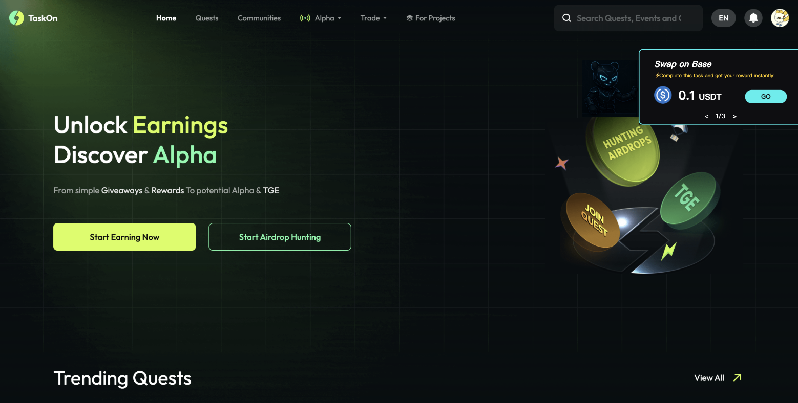

### 2.2 出现逻辑

当用户有符合命中广告的时候才展示该模块。

出现页面:
- Home (https://taskon.xyz/home)
- Quest 列表页
- Quest 详情页
- Asset 页(https://taskon.xyz/user/assets)
- Alpha (https://taskon.xyz/alpha/home)

### 2.3 交互样式

#### 2.3.1 展开样式

**任务/任务集合样式**

显示元素:
- 任务/任务集合标题
- 任务总共奖励 token 的等值美元价值
- 有 token logo 用 token logo, 没有 token logo 用 project logo
- 其他奖励的显示, 展示顺序 (badge > gold xp > xp)
- Action button

**图片样式**

#### 2.3.2 交互逻辑

- 针对图片样式的广告, 点击图片按钮, 打开新页面跳转
- 针对任务样式的广告, 点击任务上的 action 按钮, 打开弹窗
- 如果有多个广告的情况下, 每隔5秒轮播, 用户也可以通过底部的导航组件进行切换, 支持循环切换
- 点击左侧的卡通人物后, 进入收起样式

#### 2.3.3 收起样式

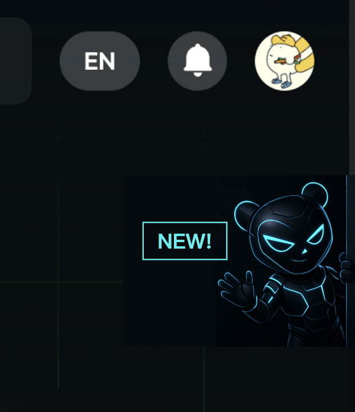

当广告配置内容或命中的广告发生变更时且用户未阅读的情况下, 显示 NEW 提示。

**注意**: 如果广告配置内容或发生的变更广告已经过期, 需要触发更新逻辑, 避免用户看到过期的广告

**交互逻辑**:
- 点击该玩偶, 使用抽屉的展开样式

### 2.4 广告内容展示

展示的广告范围: 用户符合广告中配置的命中用户群且广告状态是 ongoing。有一个特殊情况, 如果广告是任务/任务合集类型的, 且用户已经领取完奖励了, 则该广告不在广告显示范围内。

**广告过期后, 需要触发更新逻辑, 避免用户看到过期的广告**

有多个广告的情况下, 广告 ongoing 生效时间靠后的顺序往前放, 也就是越晚推的顺序越靠前。

### 2.5 展开/收起逻辑

当且仅当同时满足以下所有条件时，用户进入Home、Quest 列表页或 Asset 页会默认展开该模块：
- 用户命中 ongoing 状态广告的数量大于等于1
- 用户未在当前的广告内容下点击过"收起"按钮（当广告配置内容或命中的广告发生变更时，无论用户是否收起过该模块，都视为满足此条件）

特殊情形： 当存在 epic 时，用户访问 Home 和 Quest 列表页将始终不展开该模块（无论是否满足上述条件）

## 3. C端On-chain落地页

### 3.1 演示效果

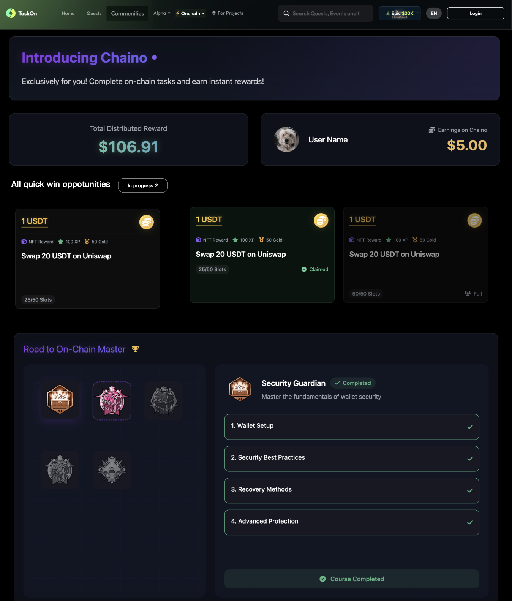

### 3.2 页面入口

#### 3.2.1 导航栏增加入口

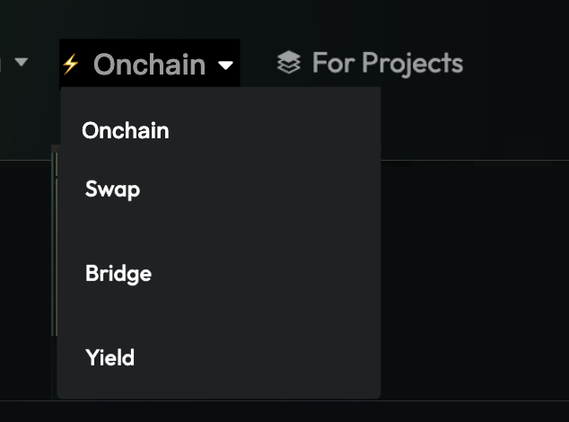

**交互逻辑**:
- 在导航栏上 Hover ⚡️ Onchain 后显示下拉列表
- 在导航栏上 点击 ⚡️ Onchain 后跳转至 onchain 页面

#### 3.2.2 首页增加模块

从 onchain 任务列表中先过滤掉用户已领取奖励和已结束的任务后, 拉展示顺序 top 3 的任务卡片放在这里。如果任务卡片数量不足1个, 则不展示该模块。

**交互逻辑**:
- 点击 view all 后跳转到 onchain 页面
- 点击任务卡片后, 打开任务弹窗 (用户未登录情况下, 先登录, 登录后再打开弹窗)

### 3.3 头部板块

**板块1**: 用于介绍功能, 纯文本配置

**板块2**: 展示该功能下分发 Token 奖励的美元价值
- 5秒钟更新一次, 更新后数值有变化的情况下要有动效设计
- 注意: 非稳定币的 token 奖励需要转成美元价值
- 计算公式 = 初始值 + 该功能下分发 Token 奖励的美元价值 (初始值支持人工配置, 目的是为了功能上线初期数据太难看)

**板块3**: 展示用户获得的黄金积分的数量
- 当用户的积分有更新时, 该数值需要实时更新

### 3.4 任务列表

#### 3.4.1 In progress 快速筛选

该模块下展示用户参与中的任务和任务合集:
- 参与中的任务定义: 任务中有多个 step, 用户未完成所有 step
- 参与中的任务合集定义: 任务合集中任意一个任务是参与中或已领奖状态, 且未领取所有任务奖励

**交互逻辑**:
- 按钮上显示项目数量
- 点击后, 下方显示的任务卡片范围更新。再次点击后, 展示所有任务卡片
- 用户没有参与中的任务和任务合集时, 不需要显示该按钮

#### 3.4.2 排序规则

1. **人工置顶优先**
   - 所有被人工置顶的任务或任务集合，统一排在列表最前面
   - 置顶项内部保持人工设置的顺序

2. **状态优先级**
   - 优先显示优先级高的任务或任务集合
   - 优先级低的任务或任务集合排在后面

   状态和显示优先级映射关系：

   | 类型 | 状态分类 | 排序优先级 |
   | ---- | -------- | ---------- |
   | 任务 (Task) | 进行中 (Ongoing) | 高 |
   | | 已结束 (名额满或时间到) | 低 |
   | 用户完成任务状态 | 未参与、参与中 | 高 |
   | | 已领奖 | 低 |
   | 任务集合 (Task Collection) | 仍有进行中任务 | 高 |
   | | 所有任务均已结束 | 低 |
   | 用户在任务集合上的完成状态 | 未参与、参与中 | 高 |
   | | 已领取所有任务奖励 | 低 |

3. **奖励价值排序**
   - 在状态相同的情况下，按奖励价值排序
   - 奖励 Token 总值（降序）- 数值越大越靠前
   - 若奖励 Token 为 0，则按黄金积分总值降序排序
   - 若奖励 黄金积分 为 0，则按积分总值降序排序

4. **次级排序规则**
   - 如果以上条件都相同，则按创建时间降序排列（最新的排前），保证排序稳定

### 3.5 任务卡片

#### 3.5.1 任务奖励

在任务卡片的头部显示奖励:

**奖励显示规则**:
- 多种类型奖励: 根据奖励类型的优先级选取一个主奖励展示
  - 奖励类型优先级: token 奖励 > badge > gold xp > xp
  - 副奖励显示规则:
    - badge: badge 名称 + badge 图片
    - Gold xp: gold xp 数量 + logo
    - xp: xp 数量 + logo

- 一种类型奖励: 采用主奖励展示规则

**不同类型主奖励的显示规则**:

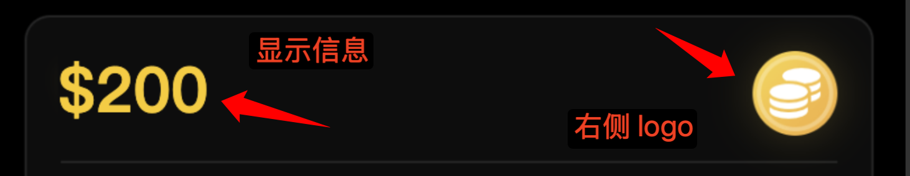

- Token: 显示总共 token 奖励等值美元价值, 右侧 logo 采用 token logo
- badge: 显示 badge 名称, 右侧 logo 采用 badge 图片
- Gold xp: 显示总共奖励的 gold xp 数量, 右侧 logo 采用 gold xp logo
- xp: 显示总共奖励的 xp 数量, 右侧 logo 采用 xp logo

**交互逻辑**:
针对 token 类型奖励, hover 到数字($200区域)上时, 展示以下弹框:

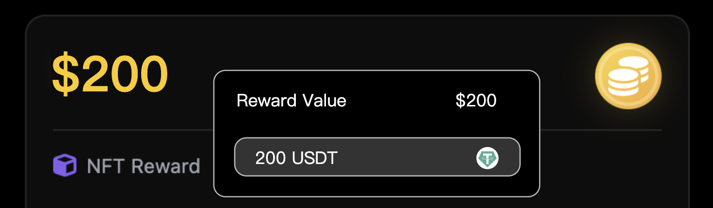

该弹框主要用于显示 token 奖励的数量, Token 名称, Token logo (有 token logo 用 token logo, 没有的话用 project logo)

#### 3.5.2 任务类型展示

根据不同的任务类型，展示不同的UI和交互逻辑：

1. **Swap/Bridge 类型任务**

<table border="1">
  <tr>
    <th>类型</th>
    <th>状态</th>
    <th>样式</th>
    <th>Hover 后样式</th>
  </tr>
  <tr>
    <td>swap/bridge</td>
    <td>未参与</td>
    <td>
      
      
<b>显示要素:</b>

      
• 奖励

      
• 任务标题

      
• 剩余份数/总份数

    </td>
    <td>
      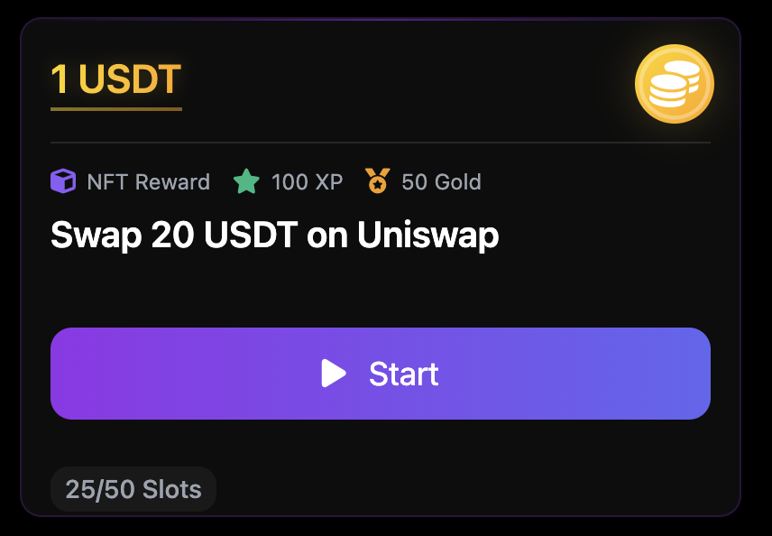
      
<b>交互逻辑:</b>

      
点击 start 后, 打开任务页面

    </td>
  </tr>
  <tr>
    <td>swap/bridge</td>
    <td>已领取奖励</td>
    <td>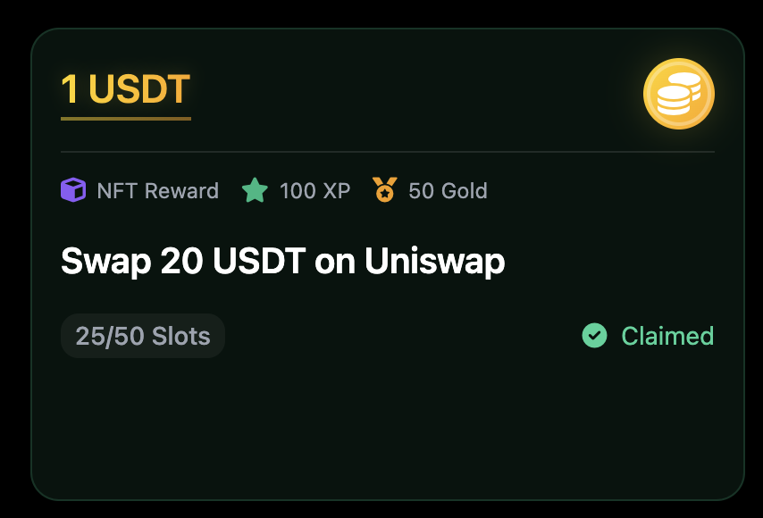</td>
    <td>无变化, 同左边</td>
  </tr>
  <tr>
    <td>swap/bridge</td>
    <td>名额满/时间到期</td>
    <td></td>
    <td></td>
  </tr>
</table>

2. **Hold Token 类型任务**

<!-- 第一部分：Hold token + 天数 -->
<table border="1">
  <tr>
    <th>类型</th>
    <th>状态</th>
    <th>样式</th>
    <th>Hover 后样式</th>
  </tr>
  <!-- 未登记状态 -->
  <tr>
    <td rowspan="8">Hold token + 天数</td>
    <td>未登记</td>
    <td>
      
      
<b>显示要素:</b>

      
• 奖励

      
• 任务标题

      
• 要求持有的token数量

      
• 要求持有的天数

    </td>
    <td>
      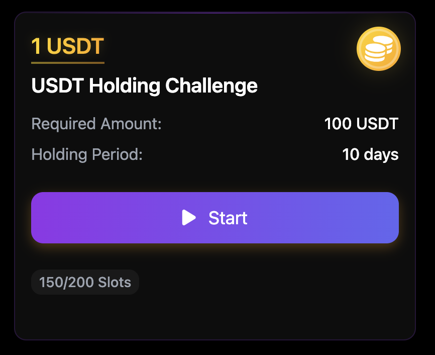
      
<b>交互逻辑:</b>

      
点击 start 后, 需要判断用户持有的token数量是否满足要求:

       
      
<b>如果满足要求:</b>

      
• 展开参与成功提示弹窗

      
• 关闭弹窗后进入[已登记-进行中]状态

      
• 打卡天数+1

       
      
<b>如果不满足要求:</b>

      
• 展示 hold 弹窗

      
• 引导用户通过 swap 来获得要求 token 的数量

       
      
<b>参与成功提示弹窗:</b>

      
       
      
文案上的 10 days(5/24) 是动态显示的

       
      
<b>10 days</b> - 展示要求剩余持有token的天数

      
计算公式: 任务要求持有天数 - 用户已持有天数

       
      
<b>5/24</b> - 是满足持有天数的日期

      
计算公式: 当天日期+剩余天数

       
      
<b>Hold 弹窗:</b>

      
       
      
弹窗采用通用化组件(参考ray的需求), 图中标记的三个元素需要特殊设计:

       
      
<b>组件1:</b> 显示任务要求持有token数量的要求

       
      
<b>组件2:</b> 显示用户需要额外购买的token数量;

      
计算公式: 要求的token数量 - 用户的token余额

       
      
<b>组件3:</b> 自动填入用户需要额外购买的token数量

       
      
点击 verify 后, 校验用户的token余额是否满足条件:

      
如果满足条件, 则现有弹窗关闭, 展开参与成功提示弹窗,

      
任务卡片进入[已登记-进行中]状态, 打卡天数+1

    </td>
  </tr>
  <!-- 已登记-进行中 -->
  <tr>
    <td>已登记-进行中</td>
    <td>
      
    </td>
    <td>
      
      
<b>注:</b> 按钮无法点击

    </td>
  </tr>
  <!-- 已登记-不满足hold token要求 -->
  <tr>
    <td>已登记-不满足 hold token 要求</td>
    <td>
      
    </td>
    <td>
      
      
<b>交互逻辑:</b>

      
点击 add balance 后, 展开 Hold 弹窗

    </td>
  </tr>
  <!-- 已登记-满足领取奖励条件但未领取 -->
  <tr>
    <td>已登记- 满足领取奖励 条件但未领取</td>
    <td>
      
      
<b>*在设计样式上要强化需要用户手动领取奖励</b>

    </td>
    <td>
      
      
<b>交互逻辑:</b>

      
点击 claim reward 后, 进入通用领取奖励的页面

      
(ray 那边的设计)

    </td>
  </tr>
  <!-- 已登记-已领取 -->
  <tr>
    <td>已登记-已领取</td>
    <td>
      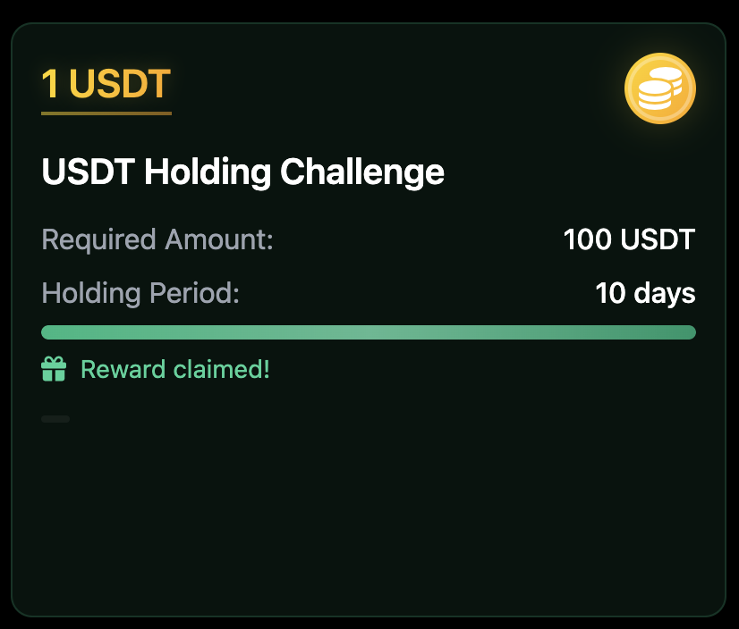
    </td>
    <td>同左边, 没有变化</td>
  </tr>
  <!-- 已登记-名额满不能领取奖励/时间到期结束 -->
  <tr>
    <td>已登记-名额满 不能领取奖励 /时间到期结束</td>
    <td>
      
    </td>
    <td>
      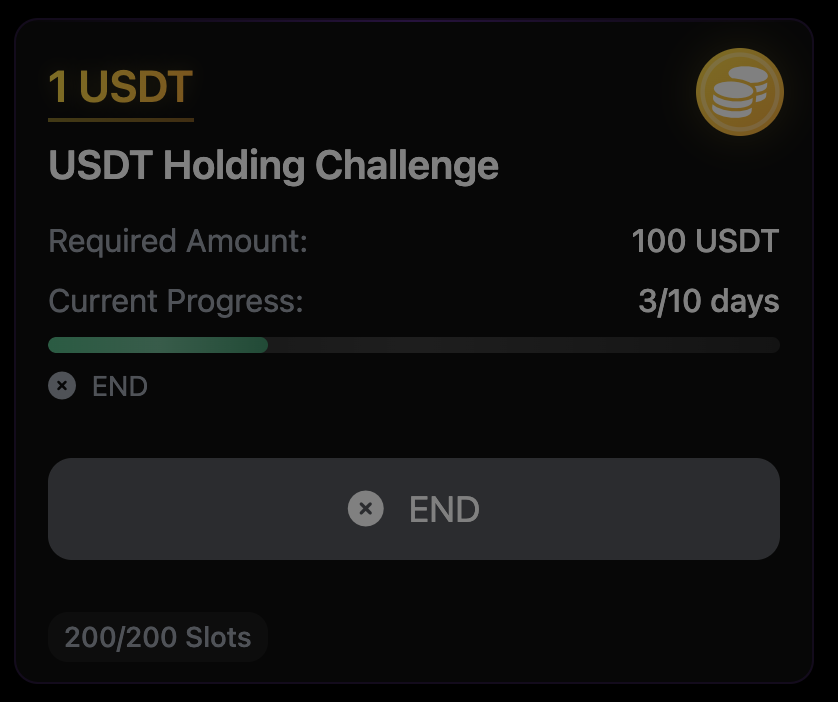
    </td>
  </tr>
  <!-- 未登记-时间即将到期 -->
  <tr>
    <td>未登记- 时间即将到期  当前时间 +任务要求持有 的天数大于任 务的结束时间, 这种情况下用 户即使参与了, 也100%拿不到奖励</td>
    <td>
      
    </td>
    <td>
      
      
按钮不可点击

    </td>
  </tr>
  <!-- 未登记-时间到期 -->
  <tr>
    <td>未登记- 时间到期</td>
    <td>
      
    </td>
    <td>
      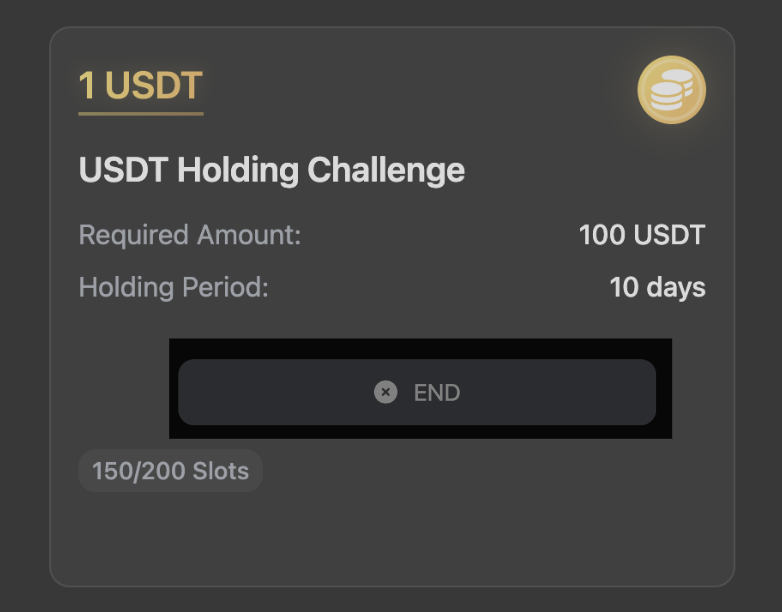
    </td>
  </tr>
</table>

<!-- 第二部分：Hold token + 不加天数 -->
<table border="1">
  <tr>
    <th>类型</th>
    <th>状态</th>
    <th>样式</th>
    <th>Hover 后样式</th>
  </tr>
  <!-- 未登记 -->
  <tr>
    <td rowspan="3">Hold token + 不加天数</td>
    <td>未登记</td>
    <td>
      
    </td>
    <td>
      
      
<b>交互逻辑:</b>

      
点击 start 后, 需要判断用户持有的token数量是否满足要求:

       
      
<b>如果满足要求:</b>

      
• 进入通用领取奖励的页面(ray 那边的设计)

       
      
<b>如果不满足要求:</b>

      
• 展示 hold 弹窗

      
• 引导用户通过 swap 来获得要求 token 的数量

       
      
<b>Hold 弹窗:</b>

      
       
      
点击 verify 后, 校验用户的token余额是否满足条件:

      
如果满足条件, 则进入通用的奖励领取页面

    </td>
  </tr>
  <!-- 已领取 -->
  <tr>
    <td>已领取</td>
    <td>
      
      
在任务标题下加个

      
Required Amount

    </td>
    <td>同左边</td>
  </tr>
  <!-- 名额满/时间到期 -->
  <tr>
    <td>名额满/时间到期</td>
    <td>
      
      
在任务标题下加个

      
Required Amount

    </td>
    <td>
      
    </td>
  </tr>
</table>

3. **Task Collection 类型**

包含了多个任务的 task collection

参考设计概念:

<table>
  <tr>
    <th><b>状态</b></th>
    <th><b>样式</b></th>
    <th><b>Hover 后样式</b></th>
  </tr>
  <tr>
    <td>未登记</td>
    <td>
      

      
<b>显示要素:</b>

      
最多展示三个任务卡片,

      
卡片上只露出主奖励.

      
有超过3个任务卡片的情况下

      
将所有任务的奖励加起来后展示

      
任务集合名称

      
显示用户已领取奖励的任务及所有任务数

    </td>
    <td>
      

      
<b>交互逻辑:</b>

      
点击 Start 后, 进入 task

      
collection 页面

    </td>
  </tr>
  <tr>
    <td>部分任务完成奖励领取</td>
    <td></td>
    <td>同上</td>
  </tr>
  <tr>
    <td>全部任务完成奖励领取</td>
    <td></td>
    <td>同左</td>
  </tr>
  <tr>
    <td>部分任务名额满/时间到期</td>
    <td></td>
    <td>同左</td>
  </tr>
  <tr>
    <td>全部任务名额满/时间到期</td>
    <td>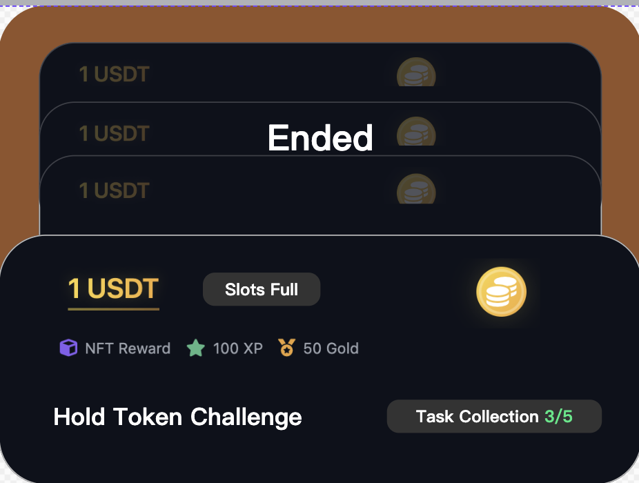</td>
    <td></td>
  </tr>
</table>

### 3.6 教育板块

左侧的徽章墙上显示的徽章通过人工配置徽章 id 指定, 并且需要支持顺序配置(需要支持灵活配置, 变更不需要发版)。

右侧是对应获取徽章需要完成的任务(根据任务的奖励关联而来)。

**注**: 属于教育板块下的任务不需要出现在任务列表下, 也就是说, 任务列表下需要过滤出现教育板块下的任务, 避免重复出现。

**交互逻辑**:
点击左侧徽章, 右侧内容切换, 右侧内容显示要素(从上到下):
- 徽章标题
- 徽章描述
- 任务 Step 1标题
- 任务 Step 2标题
- ...

根据任务的不同完成状态, 有不同的显示样式和文案:

<table>
  <tr>
    <th><b>状态</b></th>
    <th><b>截图</b></th>
    <th><b>交互逻辑</b></th>
  </tr>
  <tr>
    <td>未参与</td>
    <td></td>
    <td>点击 start 按钮, 打开弹窗</td>
  </tr>
  <tr>
    <td>进行中</td>
    <td></td>
    <td>
      
点击 continue 按钮,

      
打开弹窗,

      
展示最靠前未完成的 step

    </td>
  </tr>
  <tr>
    <td>已领取</td>
    <td></td>
    <td>按钮无法点击</td>
  </tr>
</table>

### 3.7 数据统计

需要按 Task_id 粒度统计以下数据:

| **指标**                   | **定义**                         | **备注**                                               |
| -------------------------------- | -------------------------------------- | ------------------------------------------------------------ |
| 任务弹窗查看人数                 | 任务弹窗查看用户数                     | 任务弹窗模块是 ray 那边需求上的                              |
| 任务参与人数                     | 完成任务中至少 1个 step 的用户数       | 该指标只统计除 holding task (包含 holding 天数) 外的其他任务 |
| 任务完成人数                     | 完成任务中所有 step 的用户数           | 该指标只统计除 holding task (包含 holding 天数) 外的其他任务 |
| Holding task (包含天数) 参与人数 | Holding 天数至少 1天的用户数           |                                                              |
| Holding task (包含天数) 完成人数 | Holding 天数完成要求的用户数           |                                                              |
| Holding task (包含天数) 领奖人数 | Holding 天数完成要求且完成领奖的用户数 |                                                              |

需要按 Task_collection_id 粒度统计以下数据:

| **指标**               | **定义**                             | **备注**                              |
| ---------------------------- | ------------------------------------------ | ------------------------------------------- |
| Task_collection 弹窗查看人数 | Task_collection 弹窗查看用户数             | Task_collection 弹窗模块是 ray 那边需求上的 |
| Task_collection 参与人数     | 完成 Task_collection 中至少1个任务的用户数 |                                             |
| Task_collection 完成人数     | 完成 Task_collection 中所有任务的用户数    |                                             |

除此之外, 需要记录导航栏按钮点击的 pv 和 uv。

## 4. Onchain模块功能清单

### 4.1 功能目标

- **运营后台**
  - 能够快速创建符合B端需求或是TaskOn自身运营体系所需要的Action
  - 能够管理Request进度
- **C端页面**
  - 用户能够尽可能多的参与Onchain各类行为
  - 提高平台用户的Onchain日活
  - 建立可观用户基数满足B端CPS需求

### 4.2 设计思路

1. 用户进入详情页后通过页面关键元素形成执行决策
2. 通过限制用户对区域可操作的范围引导用户执行下一步
3. 在用户执行完操作后能够给予奖励正反馈
4. 让用户形成一直操作一直执行的闭环

### 4.3 核心页面

| 优先级 | 页面 | 描述 |
| ------ | ---- | ---- |
|        | C端Onchain Action执行弹窗 |  |
|        | 运营端管理后台 |  |
|        | Action内嵌 |  |
|        | Hold任务增加Swap功能 |  |
|        | GTC社区支持POH |  |
|        | 系统改为用钱包作为默认登陆 |  |

### 4.4 核心用户旅程

- **页面进入来源**
  - 通过C端落地页直接访问
  - 通过推荐模块进入页面
  - 通过各种渠道的分享直接进入该页面
- **不同用户的细分角色**
  - 未登录状态
  - 已登录状态

### 4.5 详细功能模块

#### 4.5.1 C端Action详情页

**功能点**:
- 详情页框架
- 教育 UI
- Quiz UI
- 内嵌执行 UI
- 奖励展示/领取
- Collection 展示

**用户主流程**:
1. 用户点击Action/Collection卡片
2. 页面出现Action详情弹窗
3. 用户查看详情弹窗
4. 用户依据分支执行Step
   - 教育类内容
   - Quiz
   - 内嵌执行
5. 全部执行完后用户进入奖励领取页
   - Token领取
   - NFT徽章领取
   - XP领取
   - Gold XP领取
6. 用户领取完成后看到对应的推荐信息

**交互逻辑**:

1. **详情页框架**
   - **页面入口**:
     - 直接通过链接访问
     - 用户通过C端落地页点击卡片进入
   - **整体页面布局**:
     - **Action标题区**:
       - 配置的Logo (默认为关联项目方的Logo，运营可以替换)
       - Action标题 (运营端配置内容，字体样式等不可修改)
     - **Action信息区**:
       - 时间组件 (展示开始和结束时间，结束时间强化展示)
       - 参与信息:
         - 参与用户头像 (展示1-3个)
         - 参与人数:
           - 如果奖励无限: 展示实际参与用户
           
           
           
           - 如果奖励有限: 展示已完成用户数/总参与上限
           
           
           
       - 用户进度区 (展示用户当前完成的进度，有分步骤的设计，提示当前步骤/总步骤数)
     - **奖励展示区**:
       - 单奖励显示 (Token/NFT Badges/XP/Golden XP)
       - 多奖励显示 (轮播切换，按优先级展示)
       - 人数限定 (剩余Spot数量及进度条，颜色随剩余比例变化)
     - **主页面**:
       - 展示各种Step的UI (教育类UI/Quiz UI/Hold/Swap/Bridge)
       - 领奖类UI

2. **未登录状态**:
   
   
   
   - 页面显示Login遮罩
   - 用户不能点击除了关闭、login以外的操作

3. **已登录状态**:
   - **被判定为机器人**:
     - 提示用户使用常见钱包操作或进行POH认证
   - **新用户**:
   
     
     
     - 页面提醒用户进行POH认证
     - 点击刷新按钮刷新状态
     - 点击Start进入POH验证页面

4. **教育UI**:
   
   
   
   - **页面元素**:
     - 标题 (运营端配置)
     - 主体 (运营端配置的富文本，支持图片和视频)
   - **交互**:
     - 用户查看图片文案
     - 用户查看视频 (可播放、暂停、全屏)
     - 通用交互 (返回上一步、进入下一步)

5. **Quiz UI**:
   
   
   
   - **页面元素**:
     - Quiz标题 (运营端配置)
     - Quiz选项 (可包含图片选项)
   - **交互**:
     - 选对 (动效提示正确，自动进入下一步)
     - 选错 (抖动特效，冷却时间3秒，选项位置随机排序)

6. **Swap UI**:
   
   
   
   - **页面元素**:
     - 内嵌展示组件
   - **交互**:
     - 用户进行Swap交易后点击Verify

7. **奖励展示/领取 UI**:
   - **Token领奖**:
     
     
     
     - 中奖固定文案
     - Token图片和数量
     - Token发放链信息
     - 奖励查看/领取提示
   - **NFT Badge领奖**
   - **Golden XP/XP**:
     - 与Token领奖流程类似
   - **多奖励**:
     
     
     
     
     
     
     
     - 按重要度排序展示 (Token > Badge > Golden XP > XP)

8. **Collection展示**:
   
   
   
   - 卡片样式和详情页展示

#### 4.5.2 Action运营配置工具

运营端能够配置和管理各类Action及Collection。

#### 4.5.3 Bridge内嵌执行

**功能点**:
- 内嵌OO bridge
- 非EVM钱包处理

**交互逻辑**:
- Bridge和Swap交互逻辑几乎一致
- 非EVM钱包处理:
  - 用户需要连接两次钱包
  - 连接的钱包状态分开管理
  - 可能限制用户bridge的范围（仅支持当前能验证和用户能绑定钱包的链）
  - 新增下拉选项中出现用户当前所有EVM地址
  - 用户点击对应地址后，如果未连接会唤起钱包，如果已连接则出现单账号多地址切换提示弹窗

#### 4.5.4 Hold任务增加Swap功能

**交互逻辑**:
- **Quest中**:
  - 在Verify左边增加一个常驻按钮Swap
  - 点击后打开swap浮窗
  - 用户点击Verify校验失败后提示用户可以用Swap（高亮swap按钮或显示指引）
- **社区task中**:
  - 在Verify上方增加一个常驻按钮Swap
  - 点击后打开swap浮窗
  - 点击卡片详情（左边任务明细，右边swap组件）
  - 用户点击Verify校验失败后提示用户可以用Swap（高亮swap按钮或显示指引）

#### 4.5.5 登陆默认选项变为钱包

**交互逻辑**:
- 调换位置，钱包的展开需要在钱包选项下面
- 非钱包类展示可以适当弱化（仅考虑视觉）
