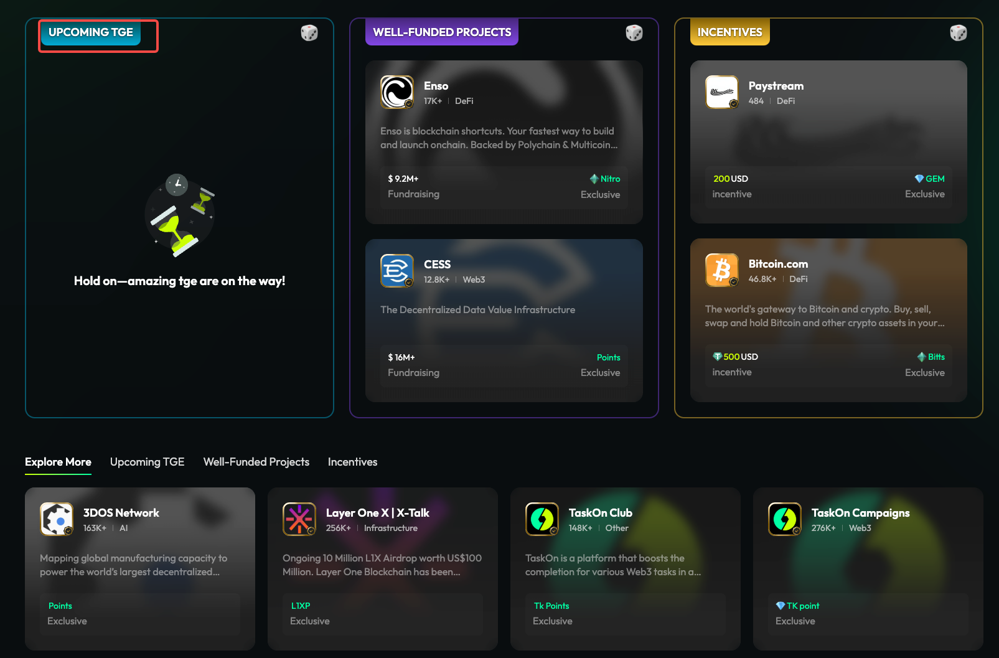

**Community页-针对TGE空窗的优化**

**需求背景**

community页，upcoming tge会为空，针对这个情况出了一个优化的方案。

{width="5.75in"
height="2.4791666666666665in"}

**功能描述**

1\. **增加Trending定义**

在图中红框处增加一个Trending的tab，点击tab，能看到当前所有7天内claim
task数量\>0的社区，根据community7天内的claim task数量进行排序。

{width="5.75in"
height="2.2916666666666665in"}

2\. **用Trending填补Upcoming TGE**

如果upcoming tge的数量为0，则该板块标题展示为Trending。

板块内部从Trending排名前10的community随机捞2个，展示出来，用户点击随机，就重新再捞2个。

{width="5.75in"
height="3.78125in"}
