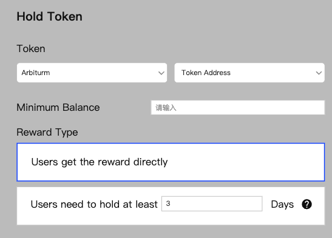

**Onchain板块 B端**

**需求背景**

新增加的Onchain板块，需要在B端可以创建onchain任务，同时我们内部需要有一个管理后台可以发布和管理这些onchain任务。

**工作流程**

B端用户在B端页面看到菜单入口，暂命名为Onchain Boost

Onchain Boost，B端创建一个Onchain Task，必须是Token奖励并Deposit

Onchain Task自动出现在Community和Onchain新板块

用户在Community中参与和在Onchain新板块参与Task，样式是否统一？

用户参与可以直接领token

B端可以手动End Task，剩余token会自动退回

对于知名项目方的Onchain CPS，B端用户设置action、budget，并deposit

运营在后台看到当前投放列表

分支一是action涉及新合约，需要走合约审核流程，由Donald审批

分支二是action不涉及新合约，运营可以直接为action创建task并设置奖励

分支三是运营判断该action不合理无法完成，可以直接拒绝，自动退款

运营投放之后，能实时查看完成人数

B端也能实时查看完成人数

如果到时间还完成不了，走手动退款流程

**Onchain任务分类**

Hold Token（P0）

Hold NFT（P1）

Swap（P0）

Bridge（P0）

Mint NFT（P1）

Stake（P1）

Smart Contract（P1）

Provide LP/Hold LP（P2）

Borrow/Supply（P2）

**功能清单**

Onchain Boost创建流程

Hold Token

Swap

Bridge

Swap集成

**功能详情**

1\. **Onchain Boost-入口和落地页**

1.1 **左侧栏**

在图中红色位置，增加新功能的tab，名字暂定：Onchain Boost

{width="2.59375in"
height="5.302083333333333in"}

1.2 **落地页**

**进入条件**

没有创建过boost

**页面布局**

{width="5.75in" height="4.125in"}

**交互逻辑**

点击3个action任意一个，直接带参数进入Create流程；

下面的action都不可点击，鼠标悬浮显示coming soon

1.3 **列表页**

**进入条件**

创建过Onchain Boost

**页面布局**

展示Boost列表页

{width="5.75in" height="8.364583333333334in"}

**Boost状态规则**

Draft：可以编辑、删除

Pending：可以Cancel

文案：The boost is under review. Please wait patiently for the staff to
contact you. If you want to contact us proactively, you can click the
small robot in the lower right corner to submit a ticket.

Canceled：引导用户查看退款、其他与draft相同

文案：The refund has been automatically made. Please check the balance
in Assets.

Rejected：运营Reject并且审核通过的，引导用户查看退款、联系我们、其他与draft相同

文案：Your Boost has been rejected by the reviewer because it does not
meet the platform boost specifications, and the budget has been returned
to your assets. If you want further information, please contact us

Live：运营Accept并起审核通过的，无法编辑、删除，能导出

Completed：达成项目方需要的target，能导出

Expired：到了时间，但没达成项目方需要的target，能导出、联系我们

文案：Your boost has expired. We are sorry that you have not reached
your target. Please contact us for a partial refund.

**数据字段**

Name：直接用B端选择的Action作为名字

时间：展示为时间段，前面是创建时间，后面是结束时间，定义为Publish时间+Schedule填写的天数

Budget：总预算，数量+代币名称

Target：这里列出所有的目标，并且展示目标的进度，比如200/3000
Wallets，代表目标3000个，已完成200个

**交互逻辑**

点击Cancel&Refund，状态变更为Canceled，从运营后台撤回这个申请，并自动执行退款，退回到用户Assets

点击Data，跳转到Boost的数据分析页面

点击Contact，自动打开工单，并选择工单类别为"Onchain
Boost"（需要增加这个B端的工单分类）

点击Check assets，跳转到B端的assets页面；

点击Edit（如果处于可以Edit的状态），进入与Create流程一样的编辑页面，所有字段都可以编辑

这里要注意Budget的处理流程

用户Create流程之中，都不会真正的从Balance中扣掉Budget，只有点击Publish，才扣掉Budget

用户取消/被拒绝，会自动执行退款，退回Assets

取消/被拒绝后，用户重新编辑，点Publish之后，才会再次扣掉Budget

点击删除，需要弹窗二次确认

点击右上角New Boost，右侧划出

{width="5.75in" height="4.114583333333333in"}

2\. **Onchain Boost创建流程**

**进入条件**

在落地页/Create New弹窗，点击任意action；

**页面布局**

顶端是3个步骤的切换，沿用我们的步骤切换通用组件

Action，Target&Budget，Publish

下面是变化区域

底部是按钮区域

Step 1是Save as Draft，Next

Step 2是Back，Save as Draft，Next

Step 3是Back，Save as Draft，Publish

**交互逻辑**

切换顶部的步骤，保留现有组件功能；

2.1 **Swap流程**

2.1.1 **Action**

{width="5.75in" height="2.9791666666666665in"}

数据字段：

Swap on specific Dex

这是一个开关

如果打开，则展示一个下拉框，可以选择Dex（如果B端是一个Dex，要默认打开）

如果B端是一个Dex，则默认选中他的Dex

如果B端不是Dex，则默认选中Taskon Aggregator

Network：下拉框，选择网络，默认不填

Swap from：下拉框，选择来源代币，默认是Any Token

Swap to：下拉框，默认是Any Token

Swap At Least：后面是输入框+下拉框，输入框是输入数字，下拉框包括：

USD Equivalent（默认填入）

Token Name：如果上面Swap to选择了代币，才会出现这个选项，如果选择了Any
Token，则没有该选项

2.1.2 **Target & Budget**

{width="5.75in" height="6.510416666666667in"}

数据字段：

Target部分

Target
Wallets：前面是一个开关，默认打开，后面是两个输入框，一个是Target的wallets数量，另一个是该Target的权重（按百分比）

Target
Volume：前面是一个开关，默认关闭，如果打开则展示两个输入框，一个是Target
的总交易金额，另一个是该Target的权重

Target
Transactions：前面是一个开关，默认关闭，如果打开则展示两个输入框，一个是Target
的总交易数量，另一个是该Target的权重

Anti-Bot：是一个开关，默认打开，旁边有文案介绍：Smart filtering of
suspected robot wallets

百分比自动填充

所有已开启的选项，权重百分比加起来一定是100%

如果用户调整一个权重，那么需要自动调整另外开启的权重，保持总和为100%（如果项目方把权重1改为80%，则自动把权重2和权重3再平衡为各自10%，如果只开启了权重2，则权重2自动变更为20%）

Budget部分

Token：第一个下拉框是Network，第二个下拉框是Token name

第二个下拉框，要使用下面这个版本，需要能添加token

> {width="5.395833333333333in"
> height="3.8854166666666665in"}

奖励代币，需要符合"Onchain奖励代币白名单列表"（Billy提供规则），这里只展示用户的代币列表中符合这个白名单的代币

如果用户要Add New
Token，添加的是不符合白名单列表的代币，要提示用户：Sorry, this token is
not currently supported as a reward. We recommend using USDT or other
mainstream currencies.

Total Budget：一个输入框，需要填写总预算金额

展示估算的USD价值

文案提示用户，总Budget不能低于500USD，单个wallet不能低于0.1USD（用英文）

Schedule：可以设置End Date

文案：The schedule must last at least 30 days, and the unfinished part
will be refunded by the end time.

2.1.3 **Publish**

{width="5.75in" height="2.2395833333333335in"}

数据字段：

Total budget：总预算，不可更改

Network：不可更改

Token：不可更改

Your Balance：我的余额，旁边有一个刷新图标

如果余额不足，展示：Insufficient balance, please deposit.
旁边是Deposit按钮

2.2 **Bridge流程**

2.2.1 **Action**

{width="5.75in" height="3.5in"}

数据字段：

Bridge on specific Bridge

这是一个开关

如果打开，则展示一个下拉框，可以选择Bridge（如果B端是一个Bridge，要默认打开）

如果B端是一个Bridge，则默认选中他的Bridge

如果B端不是Bridge，则默认选中Taskon
Aggregator（如果先不针对Bridge项目方，则全部都选择这个）

From Network：下拉框，选择网络，默认Any Network

To Network：下拉框，选择网络，默认Any Network

Token：下拉框，默认Any Token

Bridge At Least：后面是输入框+下拉框，输入框是输入数字，下拉框包括：

USD Equivalent（默认填入）

Token Name：如果上面Swap to选择了代币，才会出现这个选项，如果选择了Any
Token，则没有该选项

2.2.2 **Target & Budget**

{width="5.75in" height="4.447916666666667in"}

数据字段：

Target部分

Target
Wallets：前面是一个开关，默认打开，后面是两个输入框，一个是Target的wallets数量，另一个是该Target的权重（按百分比）

Target
Volume：前面是一个开关，默认关闭，如果打开则展示两个输入框，一个是Target
的总交易金额，另一个是该Target的权重

默认选中USD Equivalent

如果上一步的swap币对中选择了具体token，那这里下拉列表展示上一步出现的token（包括swap
from和to）

Target
Transactions：前面是一个开关，默认关闭，如果打开则展示两个输入框，一个是Target
的总交易数量，另一个是该Target的权重

Anti-Bot：是一个开关，默认打开，旁边有文案介绍：Smart filtering of
suspected robot wallets

Budget部分，同上

第三步，Publish，同上

2.3 **Hold Token**

2.3.1 **Action**

{width="5.697916666666667in"
height="4.09375in"}

数据字段：

Network

Token

Amount

Reward Type

选项A：用户只要hold就直接领取奖励（默认选中）

选项B：用户需要hold目标天数才能领取

2.3.2 **Target&Budget**

数据字段：

Target部分

Target
Wallets：前面是一个开关，默认打开（不可关闭），后面是两个输入框，一个是Target的wallets数量，另一个是该Target的权重（按百分比）

Anti-Bot：是一个开关，默认打开，旁边有文案介绍：Smart filtering of
suspected robot wallets

Budget部分，同上

第三步，Publish，同上

2.4 **Data**

**页面布局**

上面是汇总数据

> {width="5.75in"
> height="1.7083333333333333in"}

Target的完成情况，Target可能是一到三个，三个是：Target Wallets、Target
Volume、Target Txns

展示目标数值和完成数值，比如 Target Wallets：200/3000

展示一个图，上面画着每一个指标的每日数量

下面是列表

有一个Export按钮，点击可以把下面的表格下载为Excel

**数据字段（Swap/Bridge）**

Wallet：做任务的钱包地址

Action：Swap/Bridge

Chain：交易发生的链

From：数量+币种，比如100USDT

To：数量+币种

Time：交易时间

Hash：交易hash

**数据字段（Hold Token）**

Wallet

Chain

Start Date：用户首次注册开始Hold的时间

Day 1:第一天余额，数量+币种

Day 2

依次类推，有几天就展示几列

3\. **Swap集成（Bridge也希望执行如下过程，但是优先级低于Swap）**

3.1 **Dex映射表**

维护字段：（仅限于所有OO支持的Dex）

Dex name

Twitter handle

Project ID（如果有的话）

支持的chain：一个列表

每个chain支持代币列表

3.2 **集成swap验证**

对于上述的Dex，与OO沟通，快速支持所有Dex在所有Chain上的Swap验证
