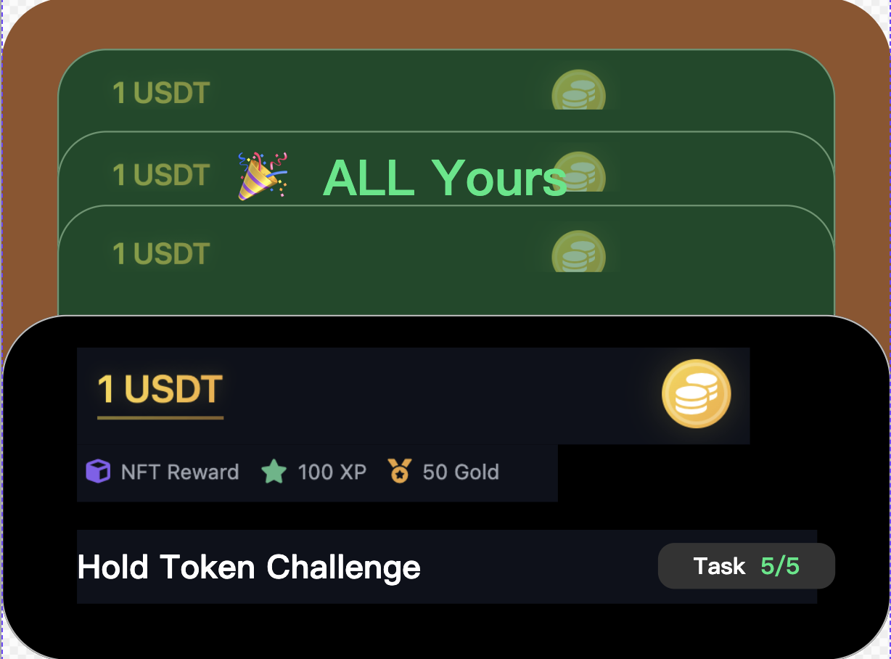
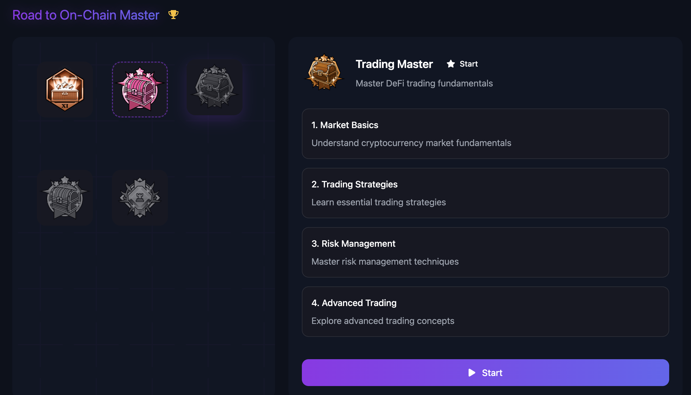

**c端 On-chain 落地页**

**演示效果**

**页面入口**

**一、导航栏增加入口**

交互逻辑:

在导航栏上 Hover ⚡️ Onchain 后显示下拉列表

在导航栏上 点击 ⚡️ Onchain 后跳转至 onchain 页面

**二、在首页增加一个模块放在 Trending Community 模块下面:**

从 onchain 任务列表中先过滤掉用户已领取奖励和已结束的任务后, 拉展示顺序
top 3 的任务卡片放在这里. 如果任务卡片数量不足1个, 则不展示该模块

点击 view all 后跳转到 onchain 页面

点击任务卡片后, 打开任务弹窗 (用户未登录情况下, 先登录,
登录后再打开弹窗)

**头部板块**

板块1: 用于介绍功能, 纯文本配置

板块2: 展示该功能下分发 Token 奖励的美元价值

5秒钟更新一次, 更新后数值有变化的情况下要有动效设计

注意: 非稳定币的 token 奖励需要转成美元价值

计算公式 = 初始值 + 该功能下分发 Token 奖励的美元价值
(初始值支持人工配置, 目的是为了功能上线初期数据太难看)

板块3: 展示用户获得的黄金积分的数量

当用户的积分有更新时, 该数值需要实时更新

**任务列表**

**In progress 快速筛选**

该模块下展示用户参与中的任务和任务合集:

参与中的任务定义: 任务中有多个 step, 用户未完成所有 step

参与中的任务合集定义: 任务合集中任意一个任务是参与中或已领奖状态,
且未领取所有任务奖励

**交互逻辑:**

按钮上显示项目数量

点击后, 下方显示的任务卡片范围更新. 再次点击后, 展示所有任务卡片

用户没有参与中的任务和任务合集时, 不需要显示该按钮

**排序规则**

**1. 人工置顶优先**

所有被人工置顶的任务或任务集合，统一排在列表最前面。

置顶项内部保持人工设置的顺序。

**2. 状态优先级**

优先显示优先级高的任务或任务集合

优先级低的任务或任务集合排在后面

状态和显示优先级映射关系：

| **类型**             | **状态分类**      | **排序优先级** |
| -------------------------- | ----------------------- | -------------------- |
| 任务 (Task)                | 进行中 (Ongoing)        | 高                   |
|                            | 已结束 (名额满或时间到) | 低                   |
| 用户完成任务状态           | 未参与、参与中          | 高                   |
|                            | 已领奖                  | 低                   |
| 任务集合 (Task Collection) | 仍有进行中任务          | 高                   |
|                            | 所有任务均已结束        | 低                   |
| 用户在任务集合上的完成状态 | 未参与、参与中          | 高                   |
|                            | 已领取所有任务奖励      | 低                   |

**3. 奖励价值排序**

在状态相同的情况下，按奖励价值排序：

奖励 Token 总值（降序） - 数值越大越靠前。

若奖励 Token 为 0，则按黄金积分总值降序排序。

若奖励 黄金积分 为 0，则按积分总值降序排序。

**4. 次级排序规则**

如果以上条件都相同，则按创建时间降序排列（最新的排前），保证排序稳定。

**任务卡片**

**任务奖励**

在任务卡片的头部显示奖励:

奖励显示规则分为多种类型奖励和一种类型奖励:

多种类型奖励的情况下, 需要根据奖励类型的优先级选取一个主奖励展示.
奖励类型优先级: token 奖励 \> badge \> gold xp \> xp;
在主奖励展示下面再根据奖励类型优先级显示其他奖励. 副奖励显示规则

badge, badge 名称 + badge 图片

Gold xp, gold xp 数量 + logo

xp, xp 数量 + logo

一种类型奖励, 采用主奖励展示规则

不同类型主奖励的显示规则:

Token, 显示总共 token 奖励等值美元价值, 右侧 logo 采用 token logo

badge, 显示 badge 名称, 右侧 logo 采用 badge 图片

Gold xp, 显示总共奖励的 gold xp 数量, 右侧 logo 采用 gold xp logo

xp, 显示总共奖励的 xp 数量, 右侧 logo 采用 xp logo

**交互逻辑:**

针对 token 类型奖励, hover 到数字(\$200区域)上时, 展示以下弹框:

该弹框主要用于显示 token 奖励的数量, Token 名称, Token logo (有 token
logo 用 token logo, 没有的话用 project logo)

**Swap/Bridge**

<table border="1">
  <tr>
    <th>类型</th>
    <th>状态</th>
    <th>样式</th>
    <th>Hover 后样式</th>
  </tr>
  <tr>
    <td>swap/bridge</td>
    <td>未参与</td>
    <td>
      
      
<b>显示要素:</b>

      
• 奖励

      
• 任务标题

      
• 剩余份数/总份数

    </td>
    <td>
      
      
<b>交互逻辑:</b>

      
点击 start 后, 打开任务页面

    </td>
  </tr>
  <tr>
    <td>swap/bridge</td>
    <td>已领取奖励</td>
    <td></td>
    <td>无变化, 同左边</td>
  </tr>
  <tr>
    <td>swap/bridge</td>
    <td>名额满/时间到期</td>
    <td></td>
    <td></td>
  </tr>
</table>

**Hold Token**

<!-- 第一部分：Hold token + 天数 -->
<table border="1">
  <tr>
    <th>类型</th>
    <th>状态</th>
    <th>样式</th>
    <th>Hover 后样式</th>
  </tr>
  <!-- 未登记状态 -->
  <tr>
    <td rowspan="8">Hold token + 天数</td>
    <td>未登记</td>
    <td>
      
      
<b>显示要素:</b>

      
• 奖励

      
• 任务标题

      
• 要求持有的token数量

      
• 要求持有的天数

    </td>
    <td>
      
      
<b>交互逻辑:</b>

      
点击 start 后, 需要判断用户持有的token数量是否满足要求:

       
      
<b>如果满足要求:</b>

      
• 展开参与成功提示弹窗

      
• 关闭弹窗后进入[已登记-进行中]状态

      
• 打卡天数+1

       
      
<b>如果不满足要求:</b>

      
• 展示 hold 弹窗

      
• 引导用户通过 swap 来获得要求 token 的数量

       
      
<b>参与成功提示弹窗:</b>

      
       
      
文案上的 10 days(5/24) 是动态显示的

       
      
<b>10 days</b> - 展示要求剩余持有token的天数

      
计算公式: 任务要求持有天数 - 用户已持有天数

       
      
<b>5/24</b> - 是满足持有天数的日期

      
计算公式: 当天日期+剩余天数

       
      
<b>Hold 弹窗:</b>

      
       
      
弹窗采用通用化组件(参考ray的需求), 图中标记的三个元素需要特殊设计:

       
      
<b>组件1:</b> 显示任务要求持有token数量的要求

       
      
<b>组件2:</b> 显示用户需要额外购买的token数量;

      
计算公式: 要求的token数量 - 用户的token余额

       
      
<b>组件3:</b> 自动填入用户需要额外购买的token数量

       
      
点击 verify 后, 校验用户的token余额是否满足条件:

      
如果满足条件, 则现有弹窗关闭, 展开参与成功提示弹窗,

      
任务卡片进入[已登记-进行中]状态, 打卡天数+1

    </td>
  </tr>
  <!-- 已登记-进行中 -->
  <tr>
    <td>已登记-进行中</td>
    <td>
      
    </td>
    <td>
      
      
<b>注:</b> 按钮无法点击

    </td>
  </tr>
  <!-- 已登记-不满足hold token要求 -->
  <tr>
    <td>已登记-不满足 hold token 要求</td>
    <td>
      
    </td>
    <td>
      
      
<b>交互逻辑:</b>

      
点击 add balance 后, 展开 Hold 弹窗

    </td>
  </tr>
  <!-- 已登记-满足领取奖励条件但未领取 -->
  <tr>
    <td>已登记- 满足领取奖励 条件但未领取</td>
    <td>
      
      
<b>*在设计样式上要强化需要用户手动领取奖励</b>

    </td>
    <td>
      
      
<b>交互逻辑:</b>

      
点击 claim reward 后, 进入通用领取奖励的页面

      
(ray 那边的设计)

    </td>
  </tr>
  <!-- 已登记-已领取 -->
  <tr>
    <td>已登记-已领取</td>
    <td>
      
    </td>
    <td>同左边, 没有变化</td>
  </tr>
  <!-- 已登记-名额满不能领取奖励/时间到期结束 -->
  <tr>
    <td>已登记-名额满 不能领取奖励 /时间到期结束</td>
    <td>
      
    </td>
    <td>
      
    </td>
  </tr>
  <!-- 未登记-时间即将到期 -->
  <tr>
    <td>未登记- 时间即将到期  当前时间 +任务要求持有 的天数大于任 务的结束时间, 这种情况下用 户即使参与了, 也100%拿不到奖励</td>
    <td>
      
    </td>
    <td>
      
      
按钮不可点击

    </td>
  </tr>
  <!-- 未登记-时间到期 -->
  <tr>
    <td>未登记- 时间到期</td>
    <td>
      
    </td>
    <td>
      
    </td>
  </tr>
</table>

<!-- 第二部分：Hold token + 不加天数 -->
<table border="1">
  <tr>
    <th>类型</th>
    <th>状态</th>
    <th>样式</th>
    <th>Hover 后样式</th>
  </tr>
  <!-- 未登记 -->
  <tr>
    <td rowspan="3">Hold token + 不加天数</td>
    <td>未登记</td>
    <td>
      
    </td>
    <td>
      
      
<b>交互逻辑:</b>

      
点击 start 后, 需要判断用户持有的token数量是否满足要求:

       
      
<b>如果满足要求:</b>

      
• 进入通用领取奖励的页面(ray 那边的设计)

       
      
<b>如果不满足要求:</b>

      
• 展示 hold 弹窗

      
• 引导用户通过 swap 来获得要求 token 的数量

       
      
<b>Hold 弹窗:</b>

      
       
      
点击 verify 后, 校验用户的token余额是否满足条件:

      
如果满足条件, 则进入通用的奖励领取页面

    </td>
  </tr>
  <!-- 已领取 -->
  <tr>
    <td>已领取</td>
    <td>
      
      
在任务标题下加个

      
Required Amount

    </td>
    <td>同左边</td>
  </tr>
  <!-- 名额满/时间到期 -->
  <tr>
    <td>名额满/时间到期</td>
    <td>
      
      
在任务标题下加个

      
Required Amount

    </td>
    <td>
      
    </td>
  </tr>
</table>

**Task Collection**

包含了多个任务的 task collection

参考设计概念:

<table>
  <tr>
    <th><b>状态</b></th>
    <th><b>样式</b></th>
    <th><b>Hover 后样式</b></th>
  </tr>
  <tr>
    <td>未登记</td>
    <td>
      

      
<b>显示要素:</b>

      
最多展示三个任务卡片,

      
卡片上只露出主奖励.

      
有超过3个任务卡片的情况下

      
将所有任务的奖励加起来后展示

      
任务集合名称

      
显示用户已领取奖励的任务及所有任务数

    </td>
    <td>
      

      
<b>交互逻辑:</b>

      
点击 Start 后, 进入 task

      
collection 页面

    </td>
  </tr>
  <tr>
    <td>部分任务完成奖励领取</td>
    <td></td>
    <td>同上</td>
  </tr>
  <tr>
    <td>全部任务完成奖励领取</td>
    <td></td>
    <td>同左</td>
  </tr>
  <tr>
    <td>部分任务名额满/时间到期</td>
    <td></td>
    <td>同左</td>
  </tr>
  <tr>
    <td>全部任务名额满/时间到期</td>
    <td></td>
    <td></td>
  </tr>
</table>

**数据统计**

需要按 Task_id 粒度统计以下数据:

| **指标**                   | **定义**                         | **备注**                                               |
| -------------------------------- | -------------------------------------- | ------------------------------------------------------------ |
| 任务弹窗查看人数                 | 任务弹窗查看用户数                     | 任务弹窗模块是 ray 那边需求上的                              |
| 任务参与人数                     | 完成任务中至少 1个 step 的用户数       | 该指标只统计除 holding task (包含 holding 天数) 外的其他任务 |
| 任务完成人数                     | 完成任务中所有 step 的用户数           | 该指标只统计除 holding task (包含 holding 天数) 外的其他任务 |
| Holding task (包含天数) 参与人数 | Holding 天数至少 1天的用户数           |                                                              |
| Holding task (包含天数) 完成人数 | Holding 天数完成要求的用户数           |                                                              |
| Holding task (包含天数) 领奖人数 | Holding 天数完成要求且完成领奖的用户数 |                                                              |

需要按 Task_collection_id 粒度统计以下数据:

| **指标**               | **定义**                             | **备注**                              |
| ---------------------------- | ------------------------------------------ | ------------------------------------------- |
| Task_collection 弹窗查看人数 | Task_collection 弹窗查看用户数             | Task_collection 弹窗模块是 ray 那边需求上的 |
| Task_collection 参与人数     | 完成 Task_collection 中至少1个任务的用户数 |                                             |
| Task_collection 完成人数     | 完成 Task_collection 中所有任务的用户数    |                                             |

除此之外, 需要记录导航栏按钮点击的 pv 和 uv

**教育板块**

左侧的徽章墙上显示的徽章通过人工配置徽章 id 指定,
并且需要支持顺序配置(需要支持灵活配置, 变更不需要发版)

右侧是对应获取徽章需要完成的任务(根据任务的奖励关联而来)

**注: 属于教育板块下的任务不需要出现在任务列表下, 也就是说,
任务列表下需要过滤出现教育板块下的任务, 避免重复出现**

**交互逻辑**

点击左侧徽章, 右侧内容切换, 右侧内容显示要素(从上到下):

徽章标题

徽章描述

任务 Step 1标题

任务 Step 2标题

\...

根据任务的不同完成状态, 有不同的显示样式和文案:

<table>
  <tr>
    <th><b>状态</b></th>
    <th><b>截图</b></th>
    <th><b>交互逻辑</b></th>
  </tr>
  <tr>
    <td>未参与</td>
    <td></td>
    <td>点击 start 按钮, 打开弹窗</td>
  </tr>
  <tr>
    <td>进行中</td>
    <td></td>
    <td>
      
点击 continue 按钮,

      
打开弹窗,

      
展示最靠前未完成的 step

    </td>
  </tr>
  <tr>
    <td>已领取</td>
    <td></td>
    <td>按钮无法点击</td>
  </tr>
</table>
