# 产品设计文档模板：Edit Task 优化

## 一、产品概述

### 1. 产品背景

目前 Community 中编辑 task 的功能较为复杂，用户难以理解。需要从设计和交互上进行优化，使其更贴近"所见即所得"，提升用户体验和易用性。

### 2. 产品愿景

提供一个直观、易用的任务编辑界面，让社区管理员能够轻松高效地管理任务。

### 3. 用户故事

作为社区管理员，我希望编辑任务的界面能像最终用户看到的那样，可以直接在页面上添加、编辑、删除任务和分区 (Sector)，操作更直观，减少理解成本。

## 二、业务流程

### 1. 全局业务流程图

1.  **进入编辑**: 从 Community Hub 进入 Edit Task 页面。
2.  **浏览/筛选**: 页面默认展示所有 Sector 及 Task，样式接近 C 端。顶部提供 Filter 功能。
3.  **添加任务**: 在指定 Sector 点击 "Add task" -> 右侧滑出任务类型列表 -> 选择任务类型 -> 弹出任务详情配置 -> 保存/发布。
4.  **编辑任务**: 点击任务卡片上的编辑按钮 -> 弹出任务详情配置 -> 保存/发布。
5.  **管理 Sector**: 点击 Sector 旁的编辑/删除按钮进行操作；点击页面底部的 "Add Sector" 添加新分区。
6.  **多选操作**: 点击 "Select Multiple Tasks" 进入多选模式进行批量操作。
7.  **Smart Task**: 点击 "Smart Task" 进入智能任务配置侧滑。

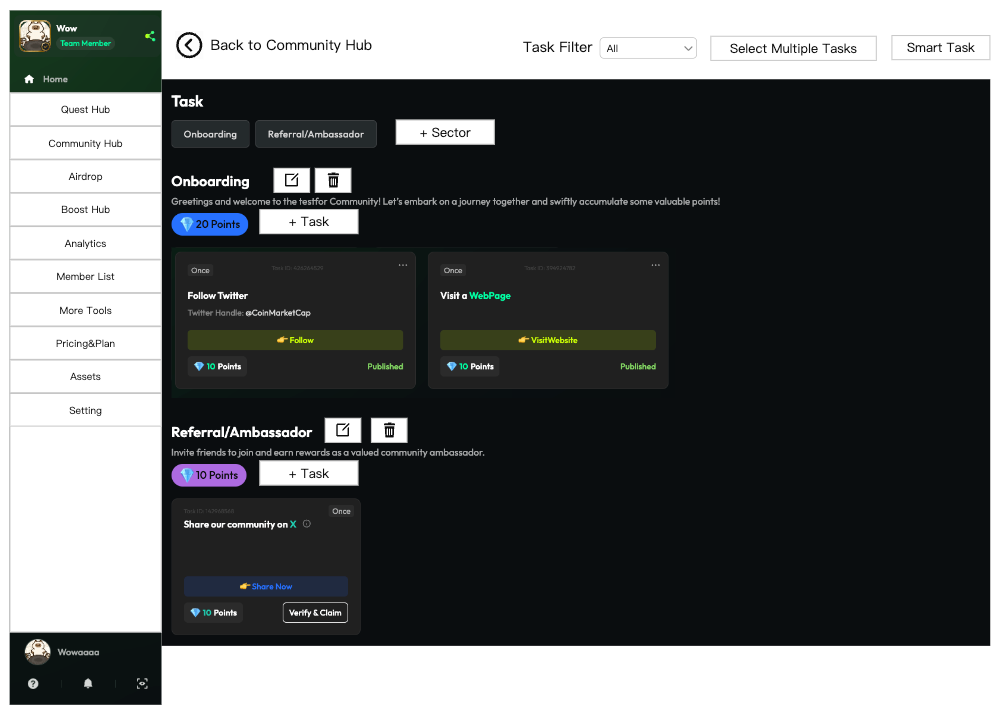

### 2. 关键子流程图

**添加任务流程:**

-   点击 Sector 下的 "Add task" 按钮。
    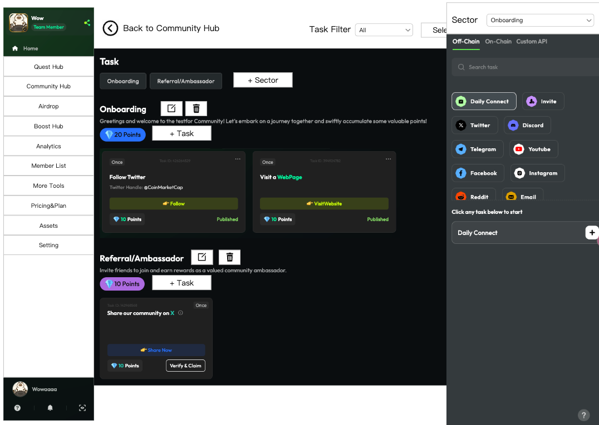
-   右侧滑出任务列表，顶部显示当前 Sector。
-   点击具体任务类型的 "+" 号。
    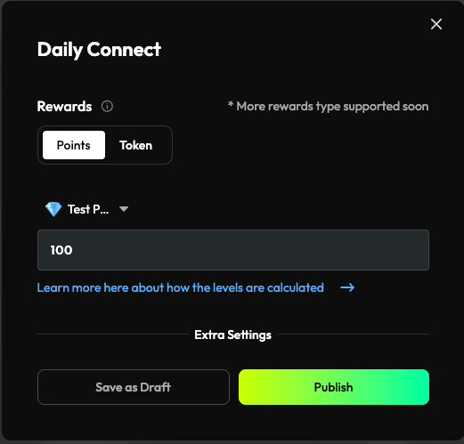
-   弹出任务详情配置窗口，填写信息。
-   点击 Publish 或 Save。
    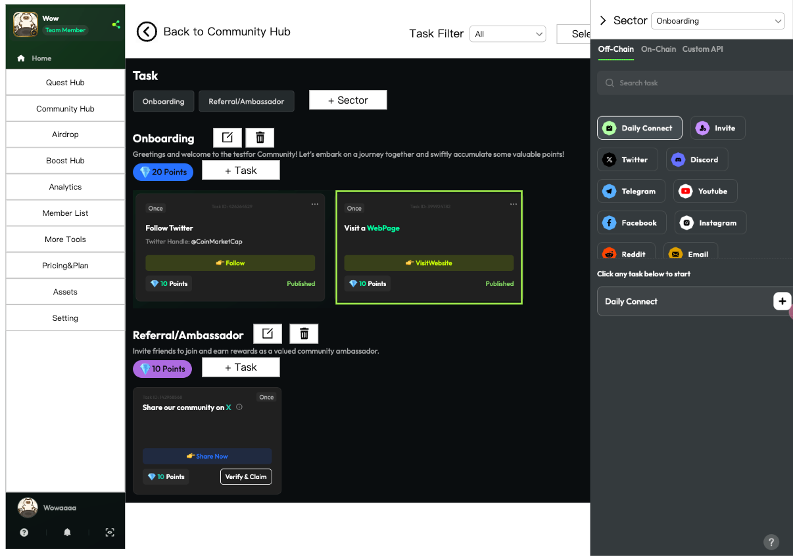
-   任务卡片出现在对应 Sector，页面定位并高亮显示。

**编辑 Sector 流程:**

-   点击 Sector 名称旁的编辑按钮。
    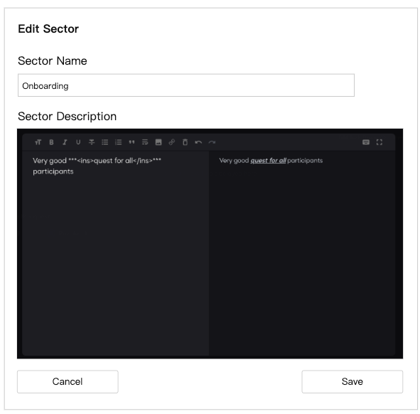
-   弹出编辑窗口，修改信息后保存。

**删除 Sector 流程:**

-   点击 Sector 名称旁的删除按钮。
-   若 Sector 下无任务，直接删除并提示。
-   若 Sector 下有任务，弹出确认窗口。
    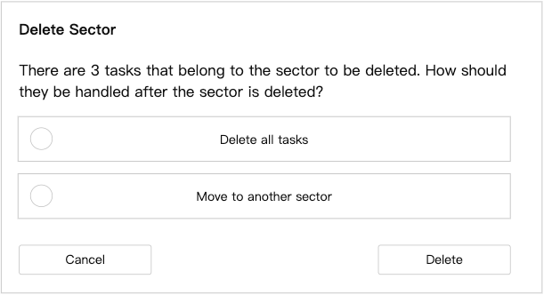
-   选择 "Delete all tasks" 或 "Move to another sector"。
    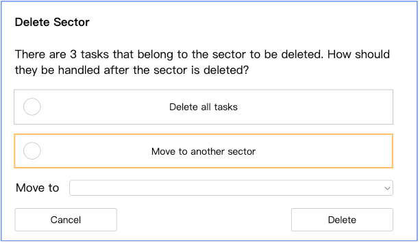
-   确认后执行删除或移动，并提示。

**添加 Sector 流程:**

-   点击页面底部的 "Add Sector" 按钮。
    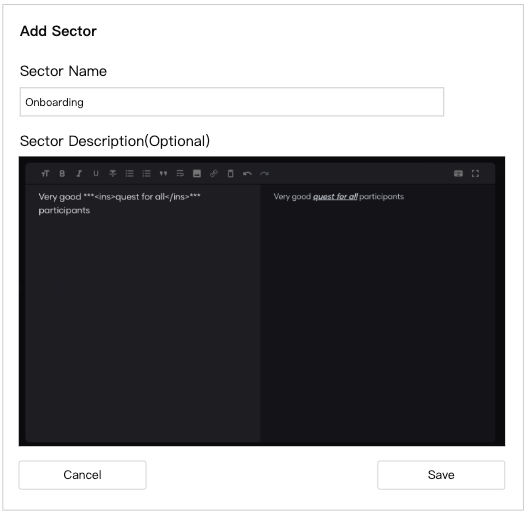
-   弹出添加窗口，填写 Name (必填) 和 Description (选填)。
-   Description 支持富文本编辑（所见即所得）。
-   保存。

## 三、功能设计

### 1. 功能地图

-   **Edit Task 页面 (核心)**
    -   任务筛选 (Filter: All, Published, Draft, Delist, Expired)
    -   多选任务 (Select Multiple Tasks)
    -   Smart Task 管理
    -   Sector 列表展示
        -   添加 Sector
        -   编辑 Sector
        -   删除 Sector (含任务迁移)
    -   Task 列表展示 (按 Sector 分组)
        -   添加 Task
        -   编辑 Task (复用现有逻辑)
        -   删除 Task (复用现有逻辑)
        -   任务状态显示 (Published, Draft, Delist, Expired)
-   **Add Task 侧滑**
    -   Sector 切换
    -   任务类型选择
    -   任务详情配置 (弹窗，复用现有逻辑)
-   **Smart Task 侧滑**
    -   Smart Task 类型展示 (X, Youtube, Medium)
    -   开启/关闭 Smart Task
    -   编辑 Smart Task (含 Sector 选择)

### 2. 功能描述模板

#### Edit Task 页面

-   **进入条件**: Community Hub 页，点击 "Edit Task"。
-   **页面布局**: 顶部为 Filter, Select Multiple Tasks, Smart Task 按钮。下方平铺展示所有 Sector 及其包含的 Task 卡片。每个 Sector 显示名称、描述、积分、编辑/删除按钮、"Add task" 按钮。页面底部有 "Add Sector" 按钮。任务卡片显示状态。
    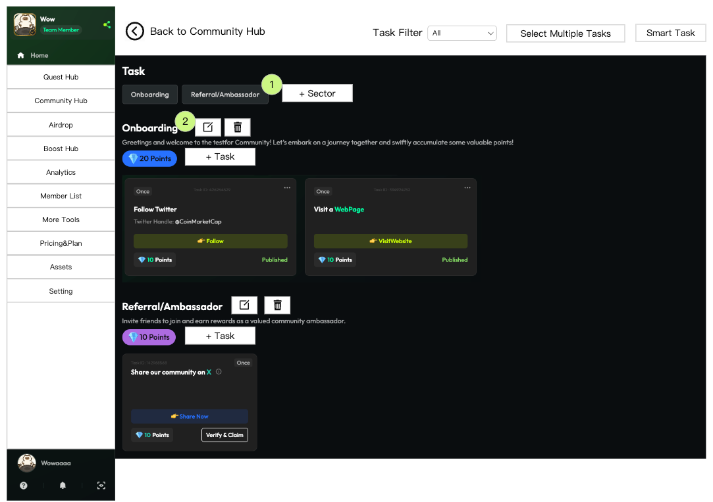
-   **交互逻辑**:
    -   **返回**: 点击 Back 返回 Hub 页。
    -   **Filter**: 下拉选择 All, Published, Draft, Delist, Expired。Expired 视为普通状态。
    -   **Select Multiple Tasks**: 进入多选模式，可跨 Sector 选择。
    -   **Smart Task**: 点击打开 Smart Task 配置侧滑 (见下文)。
    -   **Sector 点击**: 点击 Sector 标题可筛选仅显示该 Sector 的任务 (类似 C 端逻辑)，再次点击取消筛选。
    -   **Add Sector**: 弹出添加窗口 (见上文流程)。 **UI**: 
    -   **Edit Sector**: 弹出编辑窗口，逻辑同添加。**UI**: 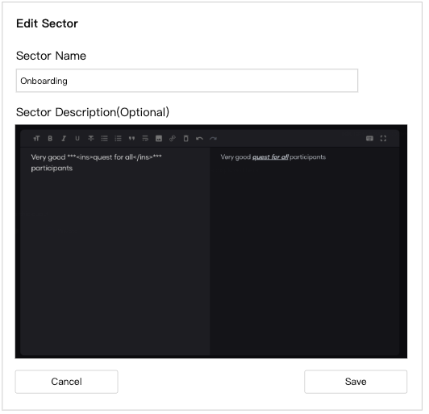
    -   **Delete Sector**: 触发删除流程 (见上文流程)。**UI**: , 
    -   **Add Task**: 点击对应 Sector 下的按钮，打开 Add Task 侧滑 (见下文)。
    -   **Task 卡片操作**: 复用现有 B 端任务卡片的操作逻辑。
    -   **空 Sector**: 即使 Sector 下没有任务，也要显示 Sector 标题和 "Add task" 按钮。

#### Add Task 侧滑

-   **进入条件**: 在 Edit Task 页面点击某个 Sector 下的 "Add Task" 按钮。
-   **侧滑布局**: 顶部显示当前 Sector (下拉可切换)，下方为任务类型列表 (复用现有添加 Task 流程)。
     *(注：此图在原文中既用于展示添加任务，也用于展示侧滑布局)*
-   **交互逻辑**:
    -   **收起**: 点击侧滑箭头收起。
    -   **切换 Sector**: 下拉菜单切换任务归属的 Sector。
    -   **添加具体任务**: 点击任务类型 "+"，弹出编辑任务信息的弹窗 (复用线上逻辑)。
    -   **保存/发布**: 左侧 Edit Task 页面对应 Sector 下出现新任务卡片，页面滚动定位到该卡片并高亮 3 秒。需考虑侧滑遮挡，保证新卡片至少部分可见。
        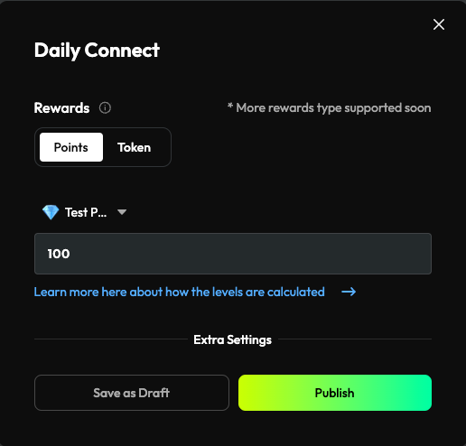 *(注：此图展示保存后的高亮效果)*

#### Smart Task 侧滑

-   **进入条件**: 在 Edit Task 页面点击 "Smart Task" 按钮。
-   **侧滑布局**: 展示 3 类 Smart Task (X, Youtube, Medium)。每类卡片显示是否开启，若开启则显示编辑按钮。整个卡片可点击。
    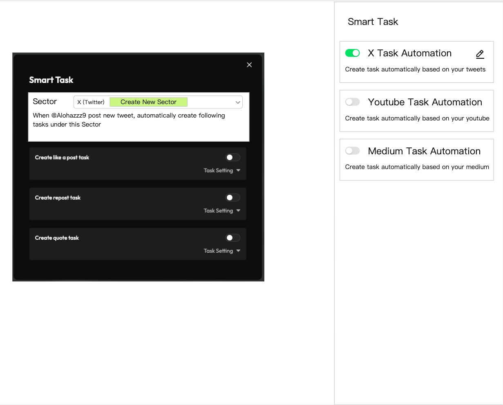
-   **交互逻辑**:
    -   **规则变更**: 每个 Smart Task (如 X Like) 只能存在于一个 Sector，不能重复创建。
    -   **点击卡片**: 打开 Smart Task 编辑弹窗。
    -   **编辑弹窗**: 增加 "Sector" 选择下拉框。
        -   若 Smart Task 已开启，显示当前归属 Sector。
        -   若未开启，默认选中 "Create new Sector" (X 任务对应 "X (Twitter)", Youtube 对应 "Youtube", Medium 对应 "Medium")。
        -   下拉列表包含所有其他已存在的 Sector。
    -   **开关**: 开关交互逻辑不变。
    -   **其他**: 其他逻辑保持不变。

## 四、业务规则

### 1. 业务规则概述

-   **所见即所得**: Edit Task 页面布局和样式尽量贴近 C 端展示。
-   **Sector 管理**: Sector 名称必填，描述选填。删除 Sector 时必须处理其中的任务 (全部删除或移动)。空 Sector 必须可见以便添加任务。
-   **Task 管理**: 任务有 Published, Draft, Delist, Expired 四种状态，样式需明确区分。添加/编辑任务详情复用现有逻辑。
-   **Smart Task 唯一性**: 同一类型的 Smart Task (如 X Like) 在一个 Community 内只能存在于一个 Sector。
-   **富文本编辑**: Sector 描述支持所见即所得的富文本编辑。

### 2. 业务规则列表模板

| 规则ID | 规则名称 | 规则描述 | 规则类型 | 涉及功能 |
|---|---|---|---|---|
| R001 | Sector 名称必填 | 创建或编辑 Sector 时，名称不能为空 | 强制性 | Edit Task 页面 |
| R002 | Sector 删除处理 | 删除有任务的 Sector 时，必须选择处理方式（全删/移动） | 强制性 | Edit Task 页面 |
| R003 | 空 Sector 可见 | 没有任务的 Sector 仍需在 Edit Task 页面显示 | 强制性 | Edit Task 页面 |
| R004 | Task 状态区分 | Published, Draft, Delist, Expired 状态样式需明显不同 | 显示规则 | Edit Task 页面 |
| R005 | Smart Task Sector 唯一 | 同一 Smart Task 类型只能分配给一个 Sector | 强制性 | Smart Task 侧滑 |
| R006 | 新增 Task 定位高亮 | 添加 Task 成功后，页面需定位到新卡片并高亮 | 交互规则 | Add Task 侧滑 |

## 五、数据需求

### 数据流说明

-   **Sector 数据**: 需要存储 Sector ID, 名称, 描述 (支持富文本), 关联的 Community ID, 包含的任务列表。
-   **Task 数据**: 复用现有 Task 数据结构，确保包含状态 (Published, Draft, Delist, Expired), 所属 Sector ID。
-   **Smart Task 配置**: 需要存储每种 Smart Task 类型是否开启，以及开启时关联的 Sector ID。

*(注：具体的数据表结构和字段可根据现有系统设计)* 