# 热力图+可交互Tutorial产品文档

## 一、产品概述

### 1. 产品背景
- 为提升用户体验和增加平台活跃度，需要在首页增加热力图功能
- 热力图将展示项目活跃度和互动可能性，吸引用户参与

### 2. 产品愿景
- 通过直观的热力图展示，帮助用户快速发现有价值的项目和可交互内容
- 建立完整的教程互动体系，提高用户参与度和留存率
- 创建从发现→学习→完成→获益的闭环用户体验

### 3. 用户故事
**C端用户**
- 作为一名普通用户，我希望在首页直观地看到热门项目，以便快速发现有价值的内容
- 作为项目探索者，我希望能通过标签识别有交互教程的项目，以便获得潜在收益
- 作为学习者，我希望通过结构化教程快速了解项目，并通过完成任务获得奖励

**平台运营**
- 作为运营人员，我需要能够管理和编辑项目教程内容，以保证内容质量
- 作为产品负责人，我希望通过自动化分析和生成教程来提高效率

### 4. 核心概念关系

#### 层级关系图

```
Project (项目)
├── Community (社区，可选)
└── Tutorials (教程集合)
    └── Tasks (任务集合)
```

#### 详细关系说明

##### Project（项目）
- **定义**：代表一个区块链或Web3项目的基本单位
- **特性**：在热力图上以节点形式展示
- **关系**：一个Project可以有多个Tutorial，可以有或没有Community

##### Community（社区）
- **定义**：项目的用户社区，是Project的一个属性或关联实体
- **特性**：
  - 有Community的项目在热力图上会显示"Community"标签
  - 某些Community可设置为C端不可见（仅用于后台管理）
- **关系**：
  - 与Project是1:1或0:1关系（一个项目有一个或没有社区）
  - 在文档中提到的特殊Community是指运营用于管理Tutorial的权限组

##### Tutorial（教程）
- **定义**：指导用户如何使用或参与项目的教程内容
- **特性**：
  - 有状态属性（活跃/已结束；用户层面：未开始/进行中/已完成）
  - 可以是自动生成的或人工编辑的
- **关系**：
  - 从属于Project（多对一）
  - 包含多个Task（一对多）
  - 如果Project有Community，Tutorial会引导用户参与该Community

##### Task（任务）
- **定义**：用户需要完成的具体操作步骤
- **特性**：
  - 有完成状态验证机制
  - 完成后用户获得EXP奖励
- **关系**：
  - 从属于Tutorial（多对一）
  - 可以从第三方网站抓取或由运营人员手动添加
  - 相同任务在不同Tutorial中可共享状态（用户只需完成一次）

#### 业务场景示例

1. **使用流程**：用户在热力图选择Project → 进入Project详情页的Tutorial标签 → 选择并完成Tutorial中的Tasks → 获取奖励

2. **标签展示**：
   - 有Community的项目：标签显示为"Community"
   - 无Community但有交互教程的项目：显示为"Potential Airdrop"或"Points Farming"

3. **内容生成**：
   - 自动流程：系统抓取Project的Tutorial → 分析类型 → Quest类Tutorial自动抓取Tasks → 生成可交互Tutorial
   - 人工流程：运营人员阅读教程内容 → 手动添加匹配的Tasks → 优化文案 → 发布

4. **后台管理**：运营人员通过特定Community权限 → 管理Projects → 编辑相关Tutorials → 添加Tasks


## 二、业务流程

### 1. 全局业务流程图
**C端用户流程**
1. 在Home页看到热力图，有交互的项目会有高亮和标签
2. 用户点击有交互的项目，直接进入项目详情页，并定位在Tutorial板块
3. 用户查看项目信息和攻略，执行可互动任务
4. 用户完成任务，获取Taskon平台的EXP
5. 用户通过EXP经验条进入平台激励系统


**平台工作流程**
1. 从三方网站抓取Project的Tutorial
2. 放入Tutorial自动分析流程，分析处理方式
   - 分支一：Quest类Tutorial → 自动抓取任务 → 生成可交互Tutorial
   - 分支二：其他类型Tutorial → 人工处理流程

### 2. 关键子流程图
**自动生成可交互Tutorial流程**
1. 自动生成标题
2. 自动生成时间范围
3. 自动生成简介
4. 自动为每个task配置描述
5. 生成Tutorial并关联到Project
6. 针对有Community的情况，生成引导用户参与Community的内容

**人工处理流程**
1. 热点项目优先处理
2. 非热点项目次要处理
3. 运营在后台打开教程，阅读内容
4. 去项目官网做quest，查看任务
5. 在后台添加匹配的task到教程中
6. 优化教程文案，保证阅读流畅
7. 完成编辑，标记为Complete

## 三、功能设计

### 1. 功能地图
**功能清单**
- 首页增加热力图（P0）
- Alpha Project页面去掉热力图的样式（P0）
- C端Project Detail页+Tutorial板块优化（P0）
- 后台管理系统，查看和编辑Tutorial（P0）
- Tutorial自动分析系统（P1）
- Task抓取系统（P1）
- 可交互Tutorial自动生成系统（P1）
- 项目入驻，自动同步task的完成状态到Community（P1）
- EXP+运营系统（P1）
- 增加Tutorial数据源，dropstab+galxe（P2）

### 2. 功能描述模板

#### 首页增加热力图
**进入条件**：首页

**页面布局**：
- 顶部位置，去掉Trending Quests上方的内容，替换成Alpha Map热力图
- 有标签的项目增加高亮展示样式
- 右上角有more projects按钮

**交互逻辑**：
- 点击有交互项目，进入Project详情页，并定位在Tutorial tab
- 点击无交互项目，进入Project详情页，并定位在Overview tab
- 点击More Projects，进入Alpha Projects列表页


#### Alpha Projects页面优化
**进入条件**：路径保持为：/alpha/home，替换掉之前的页面

**页面布局**：
- 左侧保留之前的/alpha/projects页面内容
- 右侧放置之前/alpha/home页面的右侧三个板块
- Track Feeds右边的more按钮加强，文案改为View Feeds


#### C端Project Detail页+Tutorial板块优化
**核心旅程流程**：发现教程 → 学习内容 → 完成任务 → 探索新教程


**主要模块**：
1. **粘性标题栏**：显示教程标题、状态和进度指示器
2. **信息栏**：显示估计完成时间和活动起止日期
3. **教程内容区**：教程描述和任务模块
4. **教程卡片区**：展示教程标题、状态和辅助信息

**教程内容区示例**：

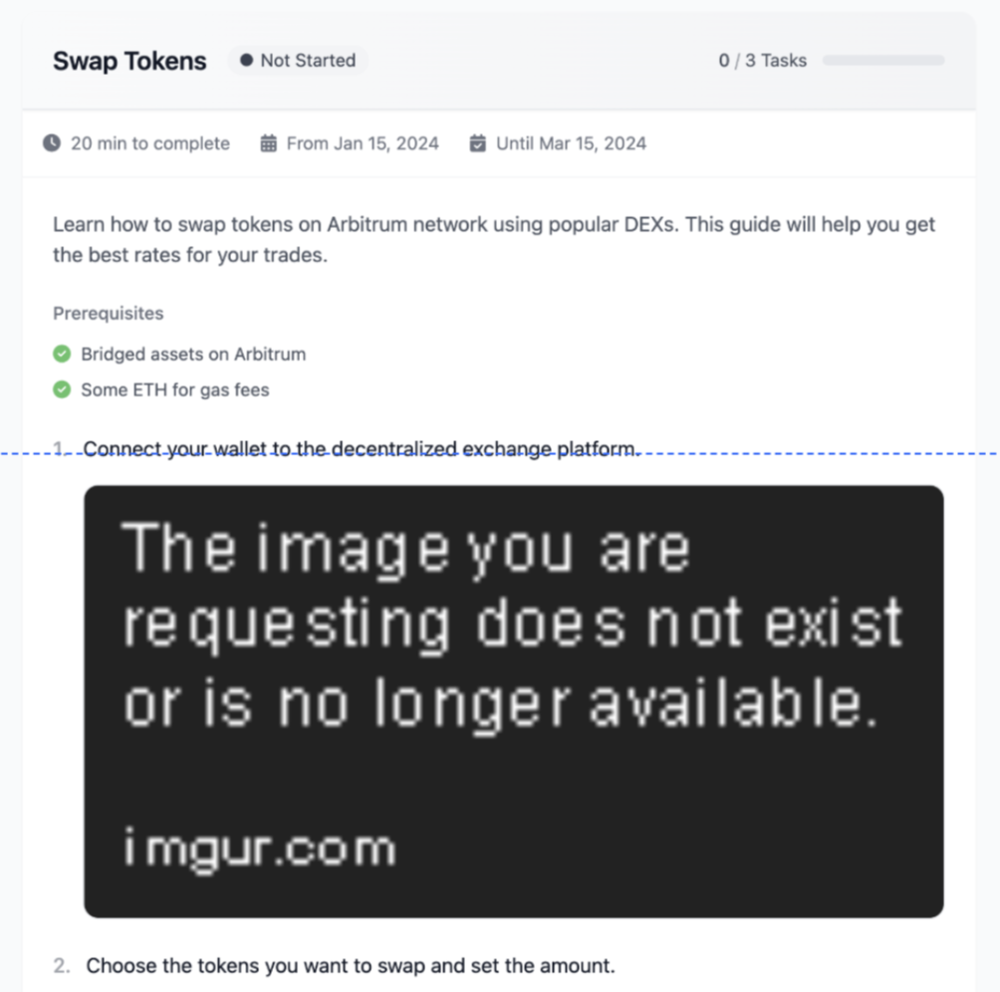

**粘性标题栏示例**：


**信息栏示例**：


**教程内容详情**：

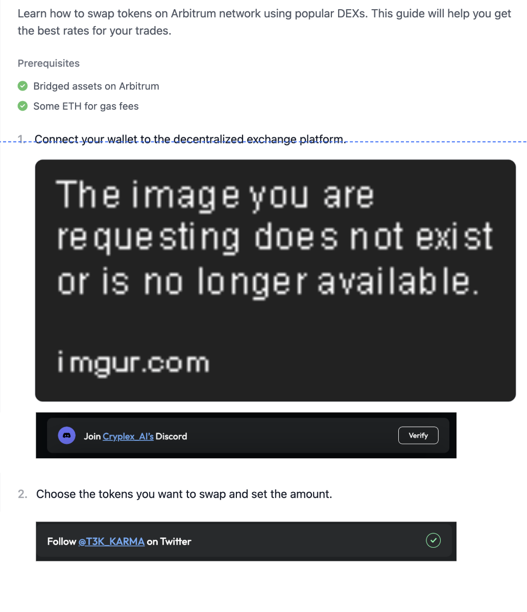

**教程卡片区示例**：

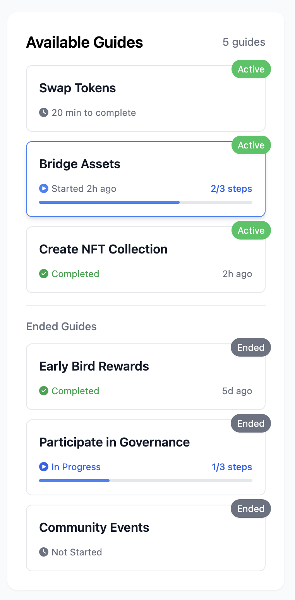

**状态系统**：
- 教程活动状态：活跃/已结束
- 用户完成状态：未开始/进行中/已完成

**活跃+未开始状态示例**：


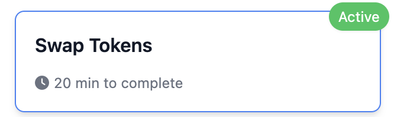

**活跃+进行中状态示例**：


**活跃+已完成状态示例**：


**已结束状态通用元素**：

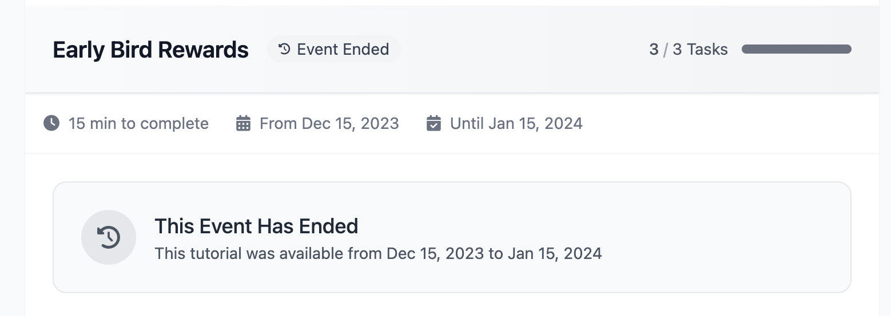

**已结束+未开始卡片示例**：

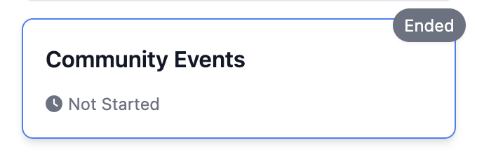

**已结束+进行中卡片示例**：

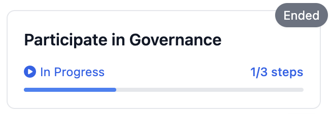

**已结束+已完成卡片示例**：

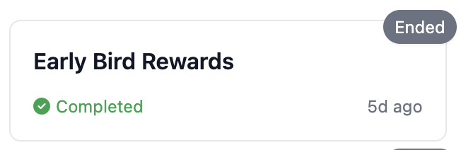

#### 后台管理系统
**主要功能**：
1. **Project列表页**：查看和管理所有项目及其教程状态
2. **Tutorial列表页**：管理所有教程内容
3. **Tutorial详情页**：编辑教程内容和添加任务

**Project Detail页头部优化**：


**Overview优化**：


**Fundraising优化**：


**后台管理菜单栏**：


**Project列表页**：

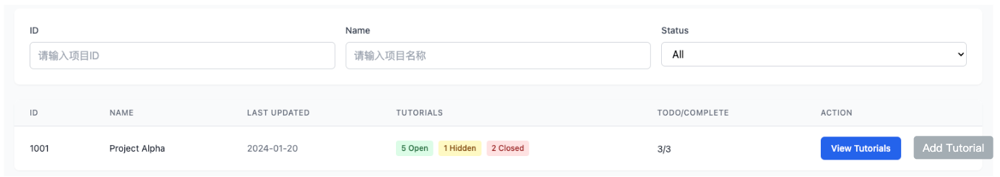

**Tutorial列表页**：


**状态修改弹窗**：


**Tutorial详情页**：

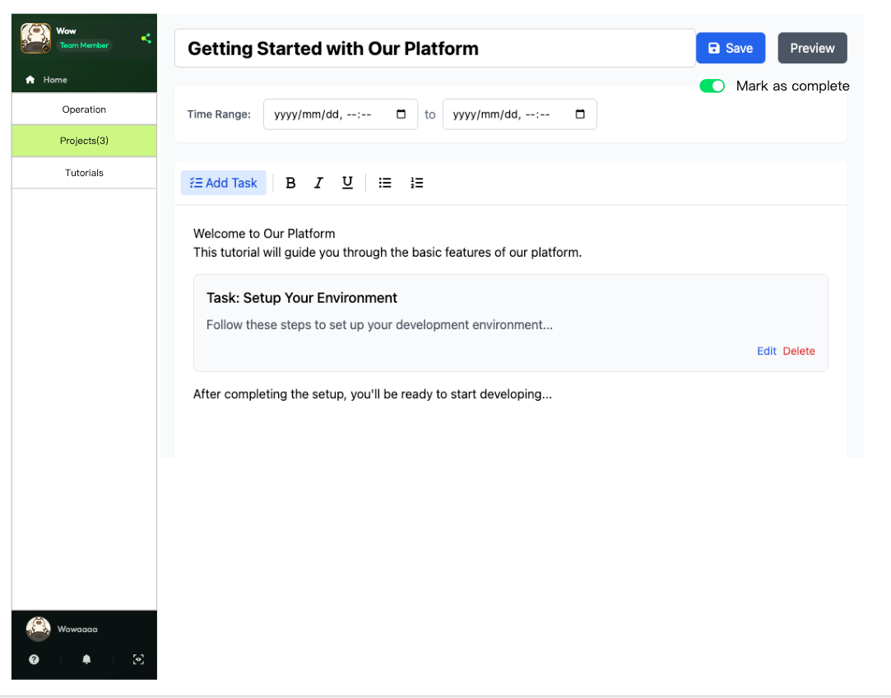

**保存提示弹窗**：

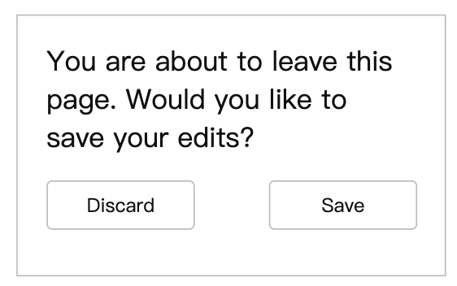

**添加Task界面**：


## 四、业务规则

### 1. 业务规则概述
- 热力图上的项目分为有交互和无交互两种类型
- 有标签的项目根据状态展示为community/Potential Airdrop/Points Farming
- 教程状态根据活动时间和用户完成进度动态变化
- 运营可以通过后台管理系统创建和编辑教程内容

### 2. 业务规则列表模板

| 规则ID | 规则描述 | 触发条件 | 执行动作 |
|--------|----------|----------|----------|
| 01 | 热力图项目交互规则 | 点击有交互项目 | 进入Project详情页，定位到Tutorial Tab |
| 02 | 热力图项目无交互规则 | 点击无交互项目 | 进入Project详情页，定位到Overview Tab |
| 03 | 教程状态变更规则 | 教程超出结束日期 | 状态自动变更为"已结束" |
| 04 | 用户完成状态规则 | 完成至少一个任务 | 状态变更为"进行中" |
| 05 | 教程完成标记规则 | 用户点击标记完成 | 若所有任务已完成，状态变更为"已完成" |
| 06 | 已结束教程任务规则 | 教程状态为"已结束" | 禁用所有任务操作按钮 |
| 07 | 教程排序规则 | 运营点击Top按钮 | 教程放在该Project的第一位置 |

## 五、数据需求

### 数据流说明
**教程数据统计**：
- 教程浏览人数：查看过教程的用户数
- 教程任务参与人数：至少完成过1个任务的用户数
- 教程任务完成人数：教程下的任务全部完成的用户数
- 教程完成人数：用户标记教程已完成的用户数

**数据来源**：
1. 主要Tutorial数据：从第三方网站抓取
2. Task数据：自动抓取系统或人工添加
3. 用户交互数据：用户在平台内的操作记录
4. 计划增加数据源：dropstab和galxe 