# CRM系统优化

## 一、产品概述

### 1. 产品背景

当前CRM系统在使用过程中存在一些不足，如字段不合理、菜单栏结构不清晰、列表页面信息不完整等问题，导致BD工作效率不高。通过本次优化，旨在提升CRM系统的易用性和工作效率。

### 2. 产品愿景

优化CRM系统的用户体验，提高BD团队的工作效率，实现客户管理的精细化和标准化，增强数据分析能力，从而提升整体业务转化率。

### 3. 用户故事

- 作为BD，我希望能够快速记录和查看客户的跟进状态，以便更高效地管理客户关系
- 作为BD，我希望能清晰区分竞品客户和发币客户，以便制定不同的跟进策略
- 作为BD，我希望能一次性编辑多个跟进信息，减少操作步骤
- 作为管理者，我希望能清晰了解项目的绑定和转化情况，做出更准确的业务决策

## 二、业务流程

### 1. 全局业务流程图

项目管理流程：
未分配项目 → 预绑定 → 正式绑定 → 成单

### 2. 关键子流程图

BD跟进流程：

1. 项目分配/绑定到BD
2. BD进行客户跟进（记录会议状态、Next Action等）
3. 根据跟进情况更新客户状态
4. 成功转化为正式客户或失效返回未分配池

## 三、功能设计

### 1. 功能地图

- 系统字段优化

  - 新增字段：是否是竞品客户、是否发币、最近跟进时间
  - 字段显示调整：URL类型字段点击后打开新页面
  - 日期字段支持选择时间
- 菜单栏优化

  - 归属项目（原项目管理）
  - 总项目（原归属项目）
  - 预绑定（新分配和新绑定状态合并）
  - 正式绑定
  - 按优先级分类
  - 最近正式绑定
  - 成单
- 列表页显示优化

  - 归属项目列表增加字段
  - 未分配项目列表增加字段
  - 成交项目列表增加字段
- 操作优化

  - 增加"跟进"按钮
  - 标签编辑逻辑优化
  - 自动分配逻辑调整
- 数据分析优化

  - 百分比显示格式优化
  - 增加预绑定项目数显示

### 2. 功能描述模板

#### 新增字段

1. **是否是竞品客户**

   - 描述：标记客户是否为竞品（zealy或galxe）客户
   - 规则：如果是zealy或galxe客户，则该字段标记为"是"，若都不是，则标记为"否"
   - 位置：基本信息中，放在原Network位置

   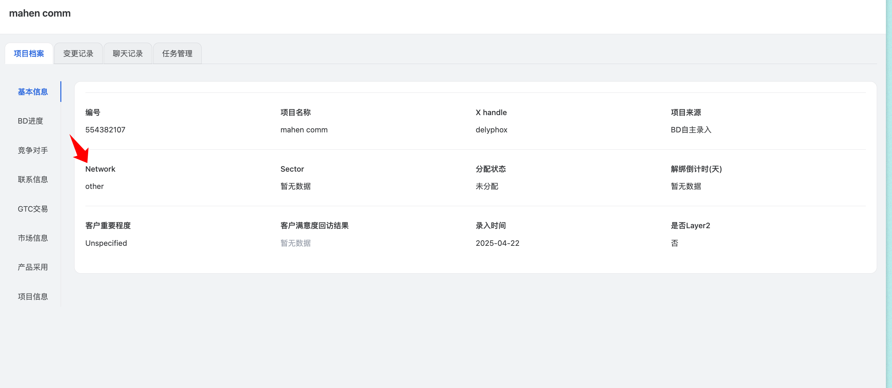
2. **是否发币**

   - 描述：标记客户是否已发行代币
   - 规则：若项目方的symbol字段不为空，则标记为"是"，反之，标记为空
   - 位置：基本信息中，放在"是否是竞品客户"之后
3. **最近跟进时间**

   - 描述：记录BD最近一次跟进客户的时间
   - 规则：若BD对以下任意一个字段有编辑（Next Action、备注、标签、重要程度(BD)、会议状态、预计下次沟通时间、预估成交金额），则更新最近跟进时间
   - 位置：BD进度中，绑定日期之后

#### 菜单栏优化

菜单结构调整为：

- 归属项目（原来的项目管理，只是改名字）
- 总项目（原来的归属项目，只是改名字）
- 预绑定（新分配和新绑定状态不修改，只是菜单和计数合并）
- 正式绑定
- 全部
- 优先级：高
- 优先级：中
- 优先级：低
- 最近正式绑定（定义是：正式绑定30天内的项目）
- 成单（保留现状）
- 未分配项目
  - 全部
  - 自然注册（项目来源）
  - 系统抓取（项目来源）

#### 跟进按钮功能

在归属项目的操作栏中增加「跟进」按钮，点击后展开弹窗：

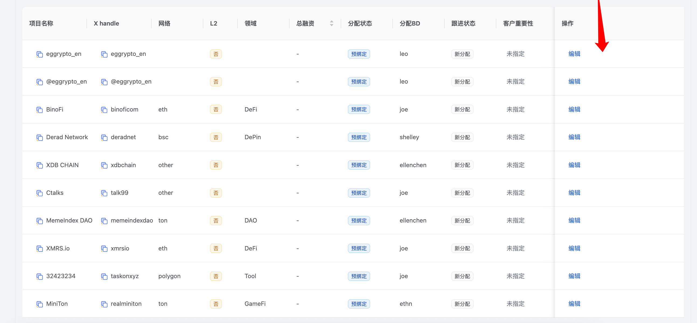

弹窗中包含以下字段，让BD可以一次性进行编辑：

- 备注（支持增加图片）
- 会议状态
- Next Action
- 标签
- 最近一次沟通时间
- 预计下次沟通时间
- 预估成交金额

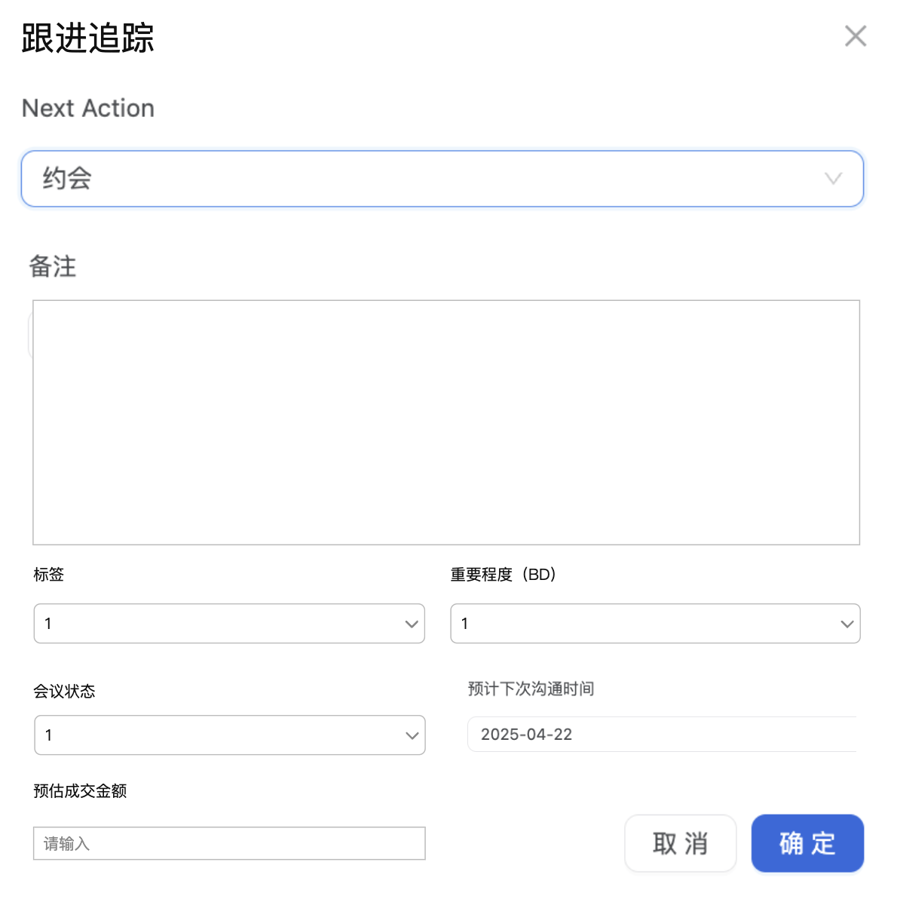

#### 列表页显示字段优化

1. **归属项目下的所有页面**
   增加显示字段：最近跟进时间、项目来源、推特粉丝数、会议状态、Next Action(hover后同时显示备注)、预估成交金额、是否发币
   去掉字段：分配BD和客户重要性

   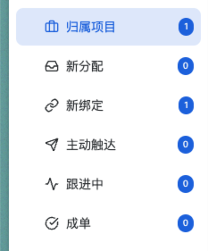
2. **未分配项目的项目列表**
   增加字段：项目录入时间、是否是竞品客户、推特粉丝数
3. **成交项目的列表**
   增加字段：套餐到期时间、套餐种类

#### BD跟进字段调整

BD跟进字段顺序调整为：

- 归属BD
- 绑定状态
- TG群链接
- 绑定日期
- 重要程度(BD)
- 会议状态
- 标签
- 备注[跟进记录]
- Next Action
- 最近一次沟通时间
- 预计下次沟通时间
- 预估成交金额
- 求助BD

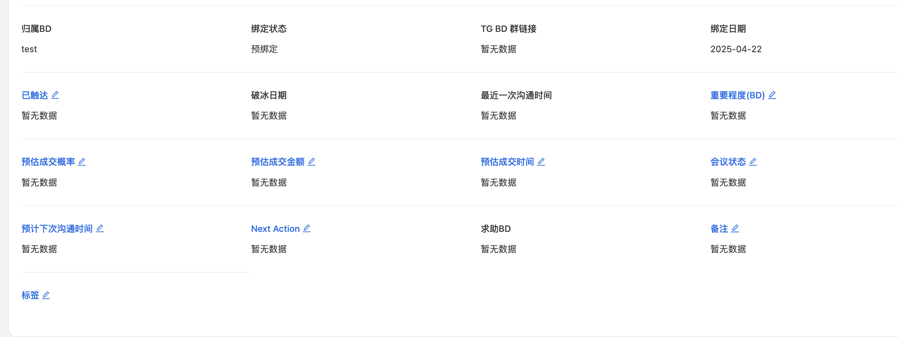

#### 标签编辑逻辑优化

标签作为固定下拉列表从数据库中读取，不再支持添加或搜索：

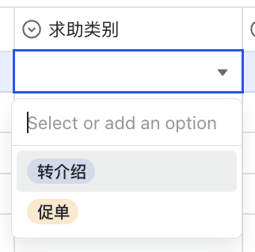

#### 其他优化

1. **BD进度位置调整**

   - BD进度放第一个，放在基本信息前面

   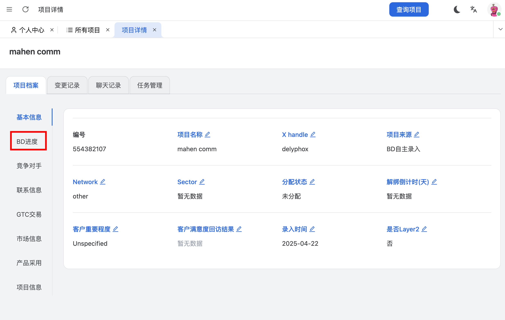
2. **URL链接跳转功能**

   - URL类型的字段，点击链接后打开一个新页面，跳转到对应链接

   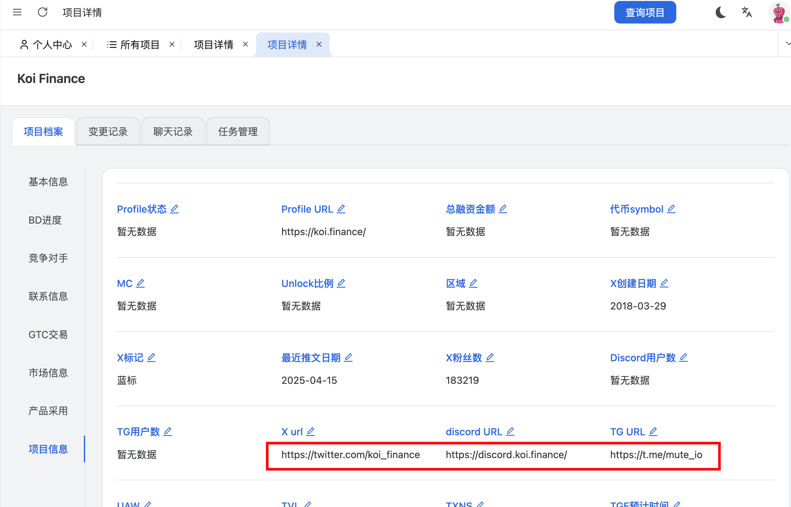

   - 以下是目前URL类型的字段

   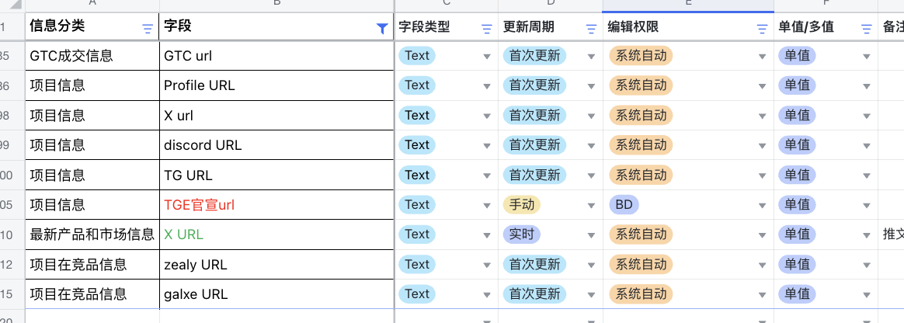

## 四、业务规则

### 1. 业务规则概述

本次CRM系统优化涉及多项业务规则调整，主要包括项目自动分配规则、绑定失效规则和数据更新规则。

### 2. 业务规则列表

| 规则ID | 规则名称             | 规则描述                                                                                                                            |
| ------ | -------------------- | ----------------------------------------------------------------------------------------------------------------------------------- |
| R001   | 最近跟进时间更新规则 | 若BD对以下任意一个字段有编辑（Next Action、备注、标签、重要程度(BD)、会议状态、预计下次沟通时间、预估成交金额），则更新最近跟进时间 |
| R002   | 项目绑定失效规则     | 状态变更为"预绑定"后的三个月内若未转化为"正式绑定"或"已成交"，则状态变更为"未分配"                                                  |
| R003   | 自然注册项目分配规则 | 针对自然注册的项目，随机分配给在职BD（该功能需要做成可配置的）                                                                      |
| R004   | 是否竞品客户标记规则 | 如果是zealy或galxe客户，则该字段标记为"是"，若都不是，则标记为"否"                                                                  |
| R005   | 是否发币标记规则     | 若项目方的symbol字段不为空，则标记为"是"，反之，标记为空                                                                            |
| R006   | 最近正式绑定定义规则 | 正式绑定30天内的项目（当天日期-正式绑定日期小于30）                                                                                 |

## 五、数据需求

### 数据流说明

1. **数据展示优化**

   - 数据分析中的成交转化率转成用百分比显示，百分比后不需要保留小数
   - 成交金额和客单价不需要保留小数，使用整数即可
   - 在成交项目数左侧加入预绑定项目数

   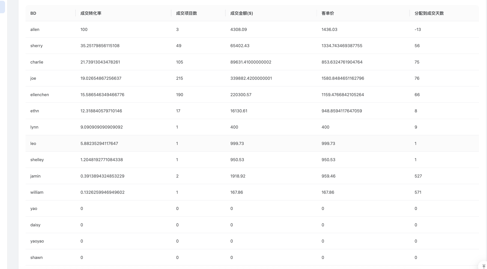
2. **数据问题修复**

   - 搜索x handle有问题，如搜索zksync，最精准匹配的结果出现在后面页码

   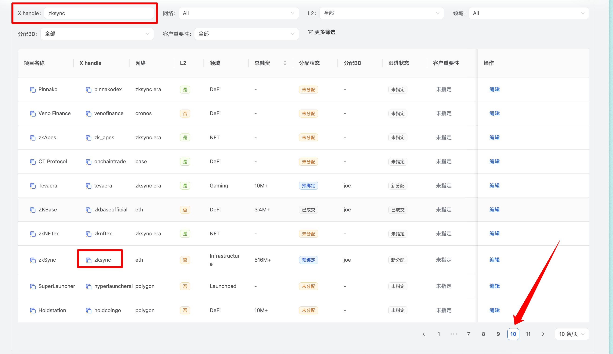

   - 解决discord/twitter/network数据缺失问题
   - 更多筛选中增加搜索功能，方便定位到具体字段

   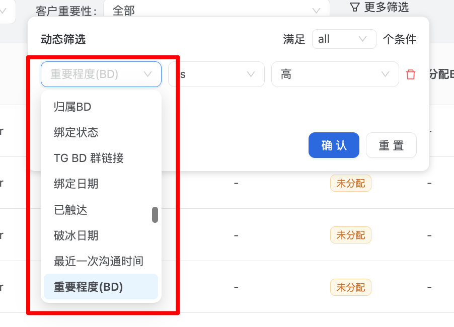
3. **UI交互优化**

   - URL类型字段点击后打开新页面跳转到对应链接

   

   - 日期类字段增加选择时间功能

   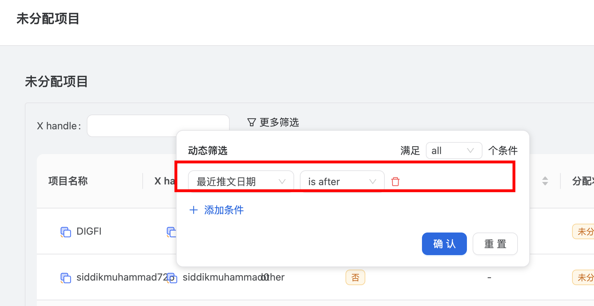

   - 列表字段名称与筛选字段名称统一

   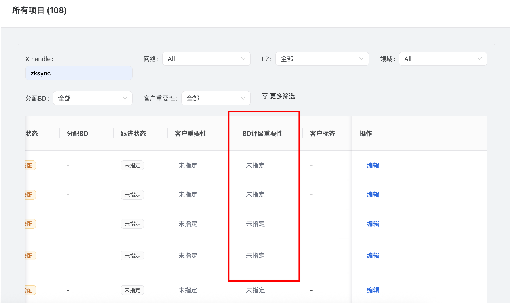 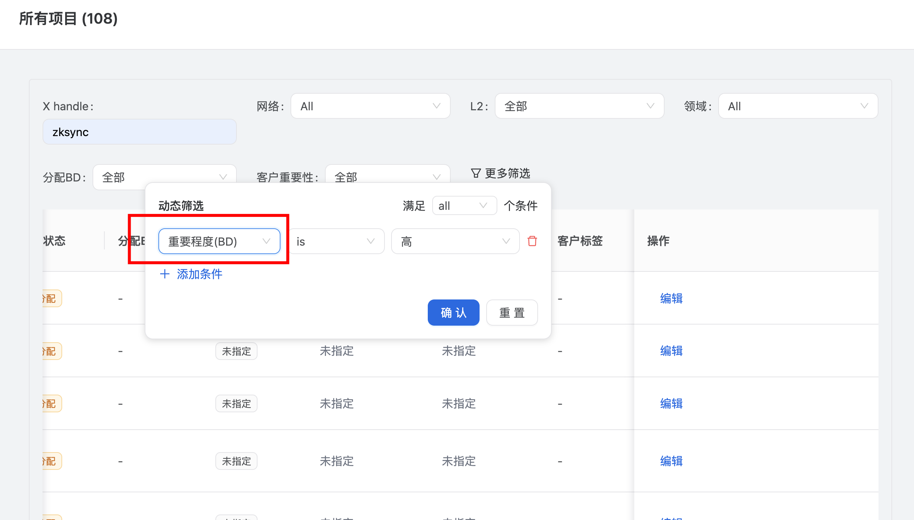

## 前端开发任务

1. **新增字段开发**

   - 实现"是否是竞品客户"字段的UI和逻辑
   - 实现"是否发币"字段的UI和逻辑
   - 实现"最近跟进时间"字段的UI和逻辑
2. **菜单栏结构优化**

   - 调整菜单名称和层级结构
   - 实现菜单项之间的联动和计数
3. **跟进按钮功能实现**

   - 设计跟进弹窗UI组件
   - 实现支持图片上传的备注编辑器
   - 整合相关字段到弹窗中并实现一次性编辑保存
4. **列表页面优化**

   - 调整各列表页显示字段
   - 实现hover显示备注的交互
   - 优化列表页字段顺序
5. **数据展示优化**

   - 调整百分比、金额等数据的显示格式
   - 实现URL字段的链接跳转功能
   - 实现日期字段的时间选择功能
6. **搜索和筛选优化**

   - 添加更多筛选中的搜索功能
   - 统一列表字段名称与筛选字段名称

## 后端开发任务

1. **数据模型调整**

   - 添加新字段到数据库表结构
   - 实现字段默认值和计算逻辑
2. **业务规则实现**

   - 开发项目绑定失效规则的定时任务
   - 实现自然注册项目自动分配的可配置功能
   - 实现最近跟进时间的自动更新规则
3. **API接口开发**

   - 提供新增字段的CRUD接口
   - 优化搜索x handle的算法，提高精准匹配的排序权重
   - 开发一次性编辑多个跟进字段的接口
4. **数据修复**

   - 解决discord/twitter/network数据缺失问题
   - 统一字段名称规范
5. **性能优化**

   - 优化列表查询性能
   - 添加必要的数据库索引

## 测试用例

### 功能测试

#### TC001: 新增字段测试

| 测试项         | 测试步骤                                                       | 预期结果                         |
| -------------- | -------------------------------------------------------------- | -------------------------------- |
| 是否是竞品客户 | 1. 创建一个zealy客户 ` `2. 查看是否是竞品客户字段         | 字段显示为"是"                   |
| 是否是竞品客户 | 1. 创建一个非zealy/galxe客户 ` `2. 查看是否是竞品客户字段 | 字段显示为"否"                   |
| 是否发币       | 1. 创建一个symbol不为空的客户 ` `2. 查看是否发币字段      | 字段显示为"是"                   |
| 是否发币       | 1. 创建一个symbol为空的客户 ` `2. 查看是否发币字段        | 字段显示为空                     |
| 最近跟进时间   | 1. 编辑Next Action字段 ` `2. 查看最近跟进时间             | 最近跟进时间更新为编辑操作的时间 |

#### TC002: 菜单栏功能测试

| 测试项         | 测试步骤                                                        | 预期结果                                                     |
| -------------- | --------------------------------------------------------------- | ------------------------------------------------------------ |
| 菜单名称和结构 | 1. 检查菜单栏结构 ` `2. 点击各菜单项                       | 菜单名称和层级结构符合设计要求，点击各菜单正确跳转到对应页面 |
| 预绑定菜单     | 1. 查看预绑定菜单项 ` `2. 确认计数逻辑                     | 预绑定菜单包含新分配和新绑定状态的项目，计数正确             |
| 最近正式绑定   | 1. 创建一个30天内正式绑定的项目 ` `2. 查看最近正式绑定菜单 | 该项目出现在最近正式绑定菜单中                               |

#### TC003: 跟进按钮功能测试

| 测试项         | 测试步骤                                        | 预期结果                     |
| -------------- | ----------------------------------------------- | ---------------------------- |
| 跟进按钮显示   | 1. 进入归属项目列表 ` `2. 检查操作栏       | 操作栏中显示跟进按钮         |
| 跟进弹窗       | 1. 点击跟进按钮 ` `2. 查看弹窗内容         | 弹窗包含设计中指定的所有字段 |
| 备注图片上传   | 1. 在跟进弹窗中点击备注区域 ` `2. 上传图片 | 图片成功上传并显示在备注中   |
| 一次性编辑保存 | 1. 在弹窗中编辑多个字段 ` `2. 点击保存     | 所有编辑的字段同时保存成功   |

#### TC004: 标签编辑测试

| 测试项         | 测试步骤                                | 预期结果                   |
| -------------- | --------------------------------------- | -------------------------- |
| 标签下拉列表   | 1. 点击标签字段 ` `2. 查看下拉列表 | 下拉列表显示预设的标签选项 |
| 标签选择       | 1. 从下拉列表中选择标签 ` `2. 保存 | 选中的标签保存成功         |
| 标签不支持添加 | 尝试在标签下拉列表中添加新标签          | 不允许添加新标签           |

### 集成测试

#### TC005: 业务规则自动执行测试

| 测试项               | 测试步骤                                                                          | 预期结果                   |
| -------------------- | --------------------------------------------------------------------------------- | -------------------------- |
| 项目绑定失效规则     | 1. 创建一个预绑定状态的项目 ` `2. 模拟时间经过三个月 ` `3. 检查项目状态 | 项目状态自动变更为"未分配" |
| 自然注册项目分配规则 | 1. 开启自动分配功能 ` `2. 创建一个自然注册的项目 ` `3. 检查项目分配情况 | 项目自动分配给某个在职BD   |

#### TC006: 数据分析功能测试

| 测试项           | 测试步骤                                            | 预期结果                               |
| ---------------- | --------------------------------------------------- | -------------------------------------- |
| 成交转化率显示   | 1. 进入数据分析页面 ` `2. 查看成交转化率       | 成交转化率以百分比形式显示，不保留小数 |
| 金额显示         | 1. 进入数据分析页面 ` `2. 查看成交金额和客单价 | 金额以整数形式显示，不保留小数         |
| 预绑定项目数显示 | 1. 进入数据分析页面 ` `2. 查看成交项目数左侧   | 显示预绑定项目数                       |
