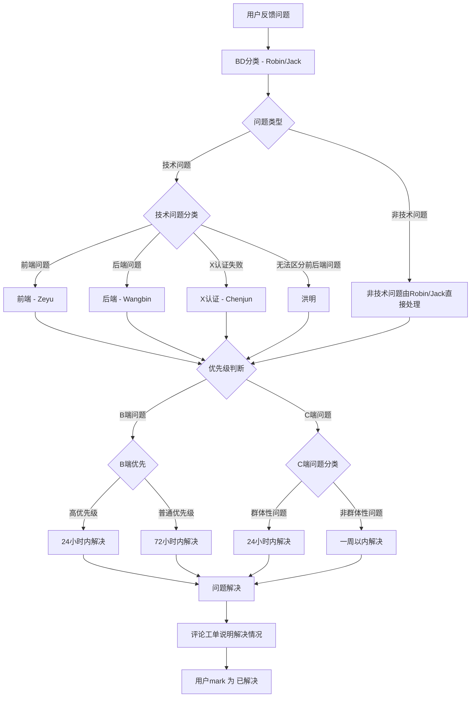

# B/C端用户反馈工单处理流程

## 流程图

## 处理说明

1. **问题分类阶段**

   - BD团队成员(Robin/Jack)负责对用户反馈问题进行初步分类
   - 将问题分为技术问题和非技术问题两大类
2. **非技术问题处理**

   - 非技术问题由BD团队成员(Robin/Jack)直接处理
   - 根据问题性质决定是否需要其他部门协助
3. **技术问题分配**

   - 前端问题：分配给Zeyu前端内部处理
   - 后端问题：分配给Wangbin后端内部处理
   - X认证失败问题：分配给Chenjun处理
   - 无法区分前后端问题：分配给洪明处理
4. **优先级规则**

   - B端用户反馈的问题优先于C端用户反馈的问题
   - B端问题按照优先级分类处理：
     - 高优先级问题：24小时内完成解决
     - 普通优先级问题：72小时内完成解决
   - C端问题按照影响范围分类处理：
     - 群体性问题：24小时内完成解决
     - 非群体性问题：一周以内完成解决
5. **问题解决及反馈**

   - 问题解决后，需及时向用户反馈处理结果
   - 确认用户满意后，完成结案
6. **定期回顾**

   - 定期进行一次问题处理回顾会议
   - 分析常见问题类型，优化产品和技术
