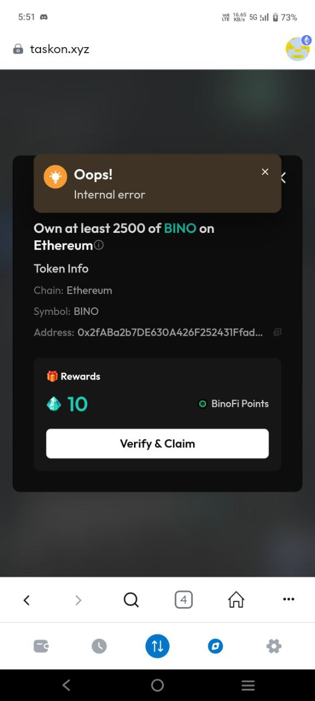

**🙋C端社群用户问题**

**无法验证类：**

Question：I cont verify and claim my binofi points in taskon +【图片】

{width="1.7291666666666667in"
height="3.84375in"}

Answer1：Could you show me more details,like wallet address and this
quest link,We will further look into your problem.

**钱包类：**

Question1：my linked primary has been compromised it has a sweeper bot..
i was requesting to unlink it please

Question2：I added a secondary wallet address just need to remove
compromised wallet address

Answer1：

There are several things I need to confirm with you.

Apart from logging in with your wallet, have you bound any other social
media accounts on Taskon, such as Twitter, Discord, Google, etc.?

If you have bound them, you can fill out the following
form:https://docs.google.com/forms/d/e/1FAIpQLSd73g_KQyGHIIzF5ErpPcMymP4_oNhv-\_wYbd-qQ0cBdmmUMQ/viewform?usp=dialog

If not, then I can\'t help you.

After you have completed filling it out, please tell me your wallet
address and Twitter ID.

I\'ll update you if there is any further information.

Question1：I did a Solana WD from Taskon, currently the status is still
pending. Even though it has been several days it has not entered my
wallet.

Answer1：Could you show me more details,Such as screenshots, or videos
of the problem occurring.

**用户diss类：**

Question1：taskon is no longer comfortable, taskon is now a bit
complicated, please change it

Answer1：You can put forward any suggestions. We\'ll take them down.
