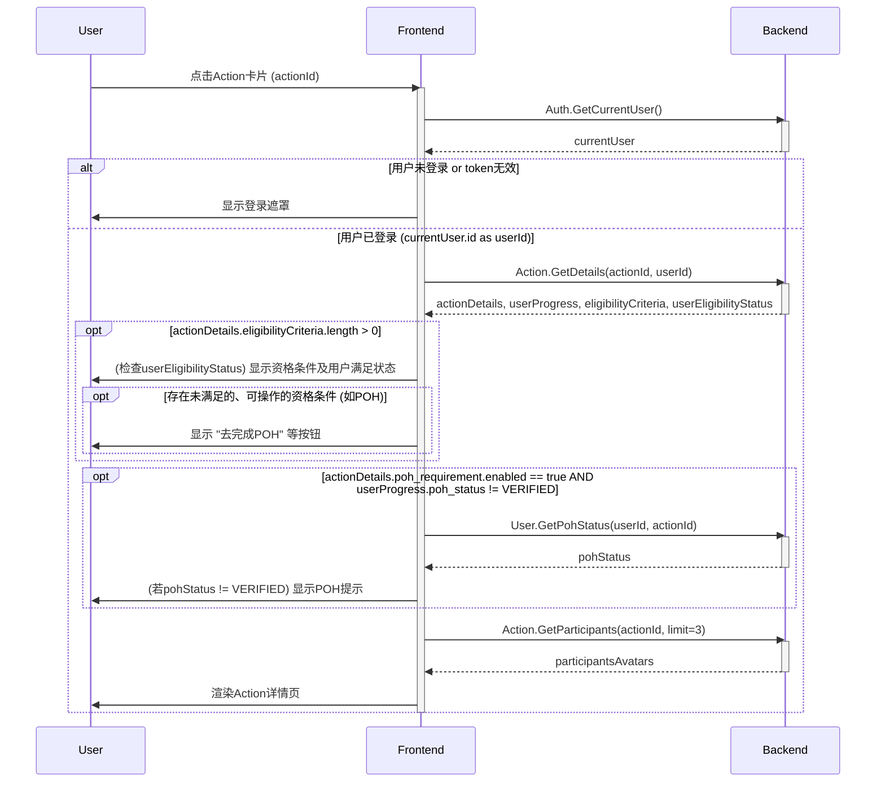
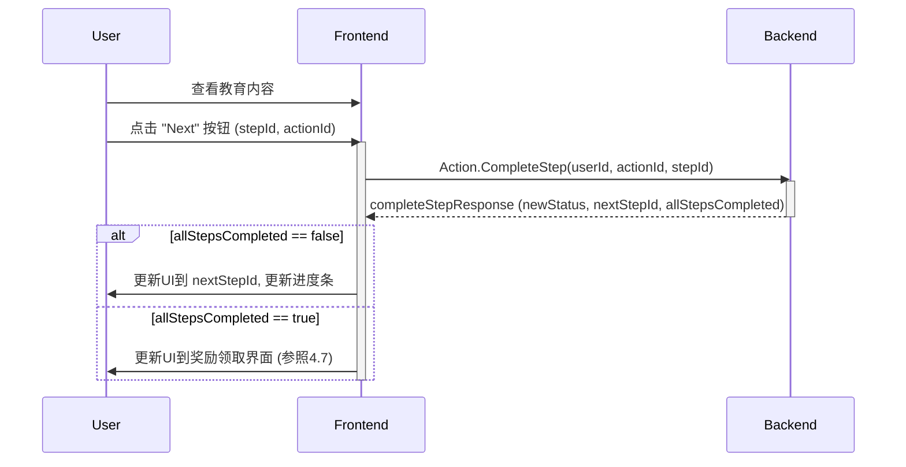
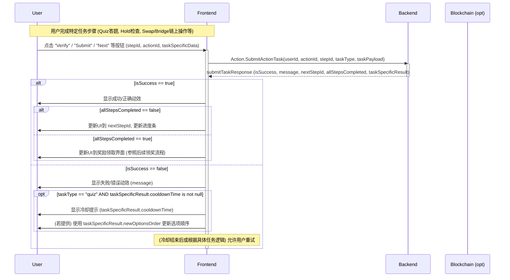
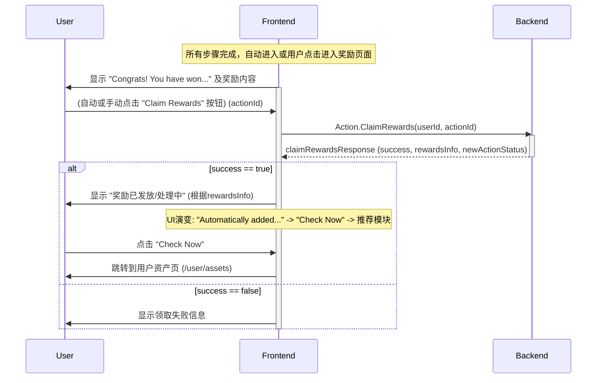
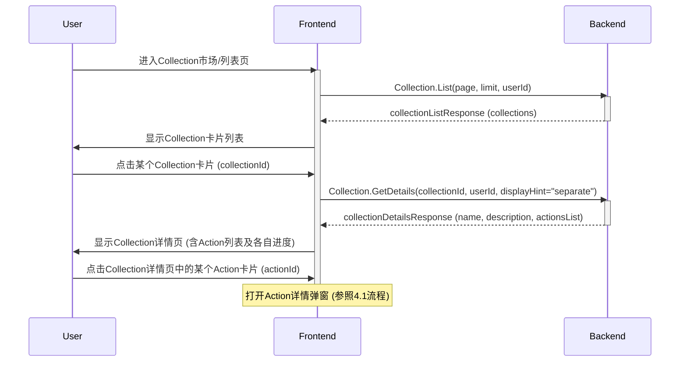
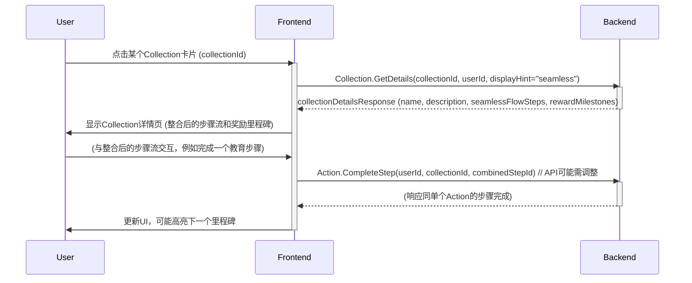

# Onchain C端需求 - 后端视角

本文档从后端开发的角度梳理 Onchain 模块 C 端的核心需求，重点描述业务规则，定义支持前端界面展示与交互所需的API接口（概念性名称和关键参数），并列出界面元素与接口的对应关系及主要交互时序。

## 1. 核心业务概述

C 端 Onchain 模块旨在引导用户参与各类链上行为 (Actions)，如教育学习、Quiz、持有代币 (Hold)、交换代币 (Swap)、跨链桥 (Bridge) 等。用户完成 Action 后可以获得奖励 (Token, NFT, XP, Golden XP)。系统需要支持用户进度跟踪、奖励发放、防机器人机制、资格条件判断 (Eligibility) 和可选的 POH (Proof of Humanity) 验证。核心目标是提高平台用户的 Onchain 日活，并为 B 端 CPS 需求建立用户基础。

设计思路上强调通过页面关键元素引导用户决策，限制操作范围以引导下一步，完成后给予正反馈，形成操作闭环。

## 2. 功能清单与 C 端核心模块需求

### 功能点清单 (根据 `.mhtml` 梳理)

| 编号  | 优先级 | 功能模块             | 子功能点 (来自 `.mhtml`)                                                                                                | 关联的后端主要需求章节 |
|:----|:-------|:---------------------|:----------------------------------------------------------------------------------------------------------------------|:-------------------|
| 2.1 | 高     | C端Action详情页      | 2.1.1 详情页框架, 2.1.2 教育 UI, 2.1.3 Quiz UI, 2.1.4 内嵌执行 UI (Swap), 2.1.5 奖励展示/领取, 2.1.6 Collection 展示 | 2.1.1 - 2.1.8      |
| 2.2 | 中     | Bridge内嵌执行       | (已整合入2.1.6业务规则及2.1.9 API映射中的BridgeUI部分)                                                                     | 2.1.6, 2.3         |
| 2.3 | 中     | Hold任务增加Swap功能 | (已整合入2.1.7业务规则及2.1.9 API映射中的HoldUI部分)                                                                      | 2.1.7, 2.4         |
| 2.4 | 低     | 登陆默认选项变为钱包 |                                                                                                                       | 2.5                |

### 2.1 C端Action详情页 (基于 `.mhtml` 功能点 2.1)

这是用户参与 Onchain 活动的核心页面/弹窗。

#### 2.1.1 业务规则 (详情页框架、信息区、进度区、奖励区、资格条件)

*   **Action配置**: Action 由运营后台配置，包含多种步骤。每个 Action 具有标题、Logo、开始和结束时间、奖励、参与资格条件 (Eligibility)。
*   **参与信息**:
    *   展示 Action 的开始和结束时间，结束时间需强化。
    *   展示少量 (如1-3个) 参与用户头像。
    *   参与人数：若奖励无限，展示实际参与用户数；若奖励有限，展示 "已完成用户数 / 总名额上限"。
*   **用户进度**:
    *   模块化展示用户当前完成进度，UI需有分步骤感。
    *   文案提示用户当前步骤及总步骤数 (例如 "步骤 1/5")。未登录用户也显示初始状态。
*   **奖励展示**:
    *   **单奖励**: 固定文案 "Rewards"。展示奖励主体 (Token图片金额, NFT图片徽章信息, XP/Golden XP图片数值)。
    *   **多奖励**: 每种奖励类型在单个 Action 中只能添加一种。多奖励轮播切换，按优先级 (Token > NFT > Golden XP > XP) 展示。
    *   **人数限定**: 若 Action 参与人数有上限，新增展示剩余 Spot、进度条，并根据百分比用不同颜色增加紧迫感。
*   **资格条件 (Eligibility UI - C端视角)**:
    *   在用户尝试参与或查看Action时，前端需根据从后端获取的Action配置中定义的资格条件以及当前用户的状态，判断用户是否满足所有条件。
    *   **Anti-Bot条件**: 如X账户验证、链上活动验证、POH。
    *   **目标用户选择条件**: 如需完成特定前置Action、持有特定NFT、满足最低代币余额、特定国家地区等。
    *   **社区中心用户选择条件**: 如成员等级、用户积分、完成特定社区任务。
    *   **UI展示**:
        *   如果用户不满足某些条件，应在Action详情页清晰展示这些未满足的条件及其当前状态（例如 "未完成：持有XXX NFT"）。
        *   对于某些可由用户主动完成的条件（如POH、连接X账户、完成前置Action），UI应提供明确的引导或操作入口（如按钮链接到POH流程、链接到前置Action页面）。
        *   用户完成某个资格条件后（可能需要用户手动刷新或后端推送更新），UI应实时更新该条件的状态。
        *   在所有硬性资格条件满足前，用户可能无法开始执行Action步骤或领取奖励。
*   **主页面 (Step操作与领奖区)**: 用户操作各 Step 和领奖的主区域。
*   **关闭逻辑**:
    *   点击关闭按钮：弹窗缩小到对应卡片，有特效提示。
    *   点击区域外空间 (可选)：弹窗缩小到C端落地页卡片。

#### 2.1.2 业务规则 (未登录、机器人、新用户POH状态处理)

*   **未登录状态**: 页面显示 Login 遮罩，用户不能点击除关闭、Login 按钮以外的操作。
*   **已登录但判定为机器人**:
    *   判定规则倾向于使用第三方钱包地址信息。
    *   页面提示用户使用常用钱包或进行 POH 认证。
    *   用户在通过验证前不能进行其他页面操作。
*   **已登录但需要POH认证 (Action特定或全局)**:
    *   页面提醒用户进行 POH 认证。
    *   提供刷新按钮以更新 POH 状态。点击 "Start POH" 按钮引导至 POH 执行页。
    *   用户在通过 POH 验证前不能进行其他页面操作（除非该POH是可选的或仅影响部分奖励）。

#### 2.1.3 业务规则 (教育UI - 基于 `.mhtml` 2.1.2)
*   **页面元素**: 标题和富文本主体 (支持图片/视频)。
*   **交互**: 阅读，外链确认，视频控制。通用：返回/下一步。最后一步 "Next" 进入领奖或下一环节。

#### 2.1.4 业务规则 (Quiz UI - 基于 `.mhtml` 2.1.3)
*   **页面元素**: Quiz 标题和选项 (可含图片)。
*   **交互**:
    *   **选对**: 动效，自动到下一步。
    *   **选错**: 特效，冷却提示 (时长可配)。单选达上限则长冷却 (可配)。选项随机排序。

#### 2.1.5 业务规则 (Swap UI - 内嵌执行 - 基于 `.mhtml` 2.1.4)
*   **页面元素**: 内嵌 Swap 组件。
*   **交互**: 用户完成 Swap 后，点击 "Verify"。考虑自动校验可能性。

#### 2.1.6 业务规则 (Bridge UI - 内嵌执行 - 基于 `.mhtml` 2.2)
*   **页面元素**: 内嵌 Bridge 组件。
*   **交互**: 类似 Swap。非EVM钱包可能需连接两次。限制 Bridge 范围。已绑定的其他EVM地址可供切换。完成后点击 "Verify"。

#### 2.1.7 业务规则 (Hold UI - 结合 `.mhtml` 2.1主页面 及 2.3 Hold任务增加Swap功能)
*   **页面元素**: 展示需持有的代币信息。
*   **交互**: 点击 "Verify"。增加常驻 "Swap" 按钮，点击打开 Swap 组件。Verify失败提示使用Swap。

#### 2.1.8 业务规则 (奖励展示/领取 UI - 基于 `.mhtml` 2.1.5)
*   **通用中奖文案**: "Congrats!", "You Have Won"。
*   **Token/NFT/XP领奖**: 展示对应信息。领取提示状态演变："Automatically added..." -> "Check Now"按钮 -> "Check Now" + 推荐模块。
*   **推荐逻辑 (领奖后)**: 推荐 Action List 中下一个用户未完成的Action。若无则不显示。
*   **多奖励领取**: 分主次奖励，UI有区分。

#### 2.1.9 C端Action详情页：界面与 API 概念映射

| 界面区域/用户状态        | 主要读取数据 (API概念)                                   | 关键请求参数                                 | 关键响应数据                                                                 | 主要交互操作与所需API (概念)                                                                                                                              |
|--------------------------|-------------------------------------------------------|---------------------------------------------|-----------------------------------------------------------------------------|----------------------------------------------------------------------------------------------------------------------------------------------------|
| **整体框架加载**         | `Backend.GetActionDetails`                            | `actionId`, `userId (opt)`                  | `actionDetails` (标题, Steps, 奖励, eligibilityCriteria), `userProgress` (各Step状态, 总体状态, eligibilityStatus) | -                                                                                                                                                  |
| Action参与信息区         | `Backend.GetActionParticipants`                       | `actionId`, `limit`                         | `participants` (头像URLs)                                                   | -                                                                                                                                                  |
| **资格条件检查与展示**   | (数据来自 `Backend.GetActionDetails`)                   | -                                           | `eligibilityCriteria` (列表), `eligibilityStatus` (各项是否满足)      | 对于需用户操作的条件 (如POH): 点击 "Start POH" -> `Backend.InitiatePohProcess(actionId, pohProvider)`                                                 |
| **未登录遮罩**           | (前端判断或 `Backend.GetCurrentUser (现有接口)` 未认证)            | -                                           | `isAuthenticated=false`                                                     | 点击登录: `Backend.LoginWithWallet(walletAddress, signature)`, `Backend.LoginWithOther(credentials)`                                                       |
| **已登录 - 机器人提示**  | `Backend.GetCurrentUser (现有接口)`                              | -                                           | `user.isRobot=true`                                                         | (前端禁止操作)                                                                                                                                   |
| **已登录 - 新用户POH**   | `Backend.GetCurrentUser (现有接口)`, `Backend.GetActionDetails`    | -                                           | `user.pohStatus != VERIFIED`, `actionDetails.pohRequirement.enabled=true`   | 点击Start (POH): `Backend.InitiatePohProcess(actionId)`   刷新POH: `Backend.GetPohStatus()`                                                            |
| **步骤: 教育UI**         | (来自 `actionDetails.steps.content`)                  | -                                           | `educationContent` (富文本, URLs)                                           | 点击Next: `Backend.CompleteActionStep(actionId, stepId)`                                                                                                   |
| **步骤: QuizUI**         | (来自 `actionDetails.steps.content`)                  | -                                           | `quizContent` (问题, 选项)                                                  | 选择答案: `Backend.SubmitActionTask(actionId, stepId, taskType="quiz", payload={selectedOptions})` -> `taskStatus`, `nextStepId (opt)`, `taskSpecificData` (e.g. cooldown, newOptionsOrder) |
| **步骤: HoldUI**         | (来自 `actionDetails.steps.content`)                  | -                                           | `holdContent` (代币, 数量)                                                  | 点击Verify: `Backend.SubmitActionTask(actionId, stepId, taskType="hold", payload={walletAddress})` -> `taskStatus`, `nextStepId (opt)`   点击Swap: (打开Swap组件)                  |
| **步骤: SwapUI (内嵌)**  | (来自 `actionDetails.steps.content`)                  | -                                           | `swapContent` (配置参数)                                                    | 完成内嵌Swap后点击Verify: `Backend.SubmitActionTask(actionId, stepId, taskType="swap", payload={txHash (opt)})` -> `taskStatus`, `nextStepId (opt)`                                    |
| **步骤: BridgeUI (内嵌)**| (来自 `actionDetails.steps.content`)                  | -                                           | `bridgeContent` (配置参数)                                                  | 完成内嵌Bridge后点击Verify: `Backend.SubmitActionTask(actionId, stepId, taskType="bridge", payload={txHash (opt)})` -> `taskStatus`, `nextStepId (opt)`   连接钱包: `Backend.AddUserWallet(address, chain)` |
| **所有步骤完成后领奖**   | (前端判断 `userProgress.overallStatus == COMPLETED`)    | -                                           | (奖励信息来自 `actionDetails.rewards`)                                      | 领取: `Backend.ClaimActionRewards(actionId)` -> `claimStatus`, `rewardsReceived`   获取推荐: `Backend.GetActionRecommendations(userId, currentActionId)` -> `recommendedActions` |

### 2.2 Collection 展示 (基于 `.mhtml` 功能点 2.1.6)

#### 2.2.1 业务规则
*   以卡片样式展示 Collection 列表。
*   Collection 详情页根据运营配置的样式（Seamless 或 Separate）展示其下的 Action。
    *   **Seamless (无缝模式)**:
        *   按运营配置的顺序将 Collection 内所有 Action 的步骤和领奖环节拼接成一个连续的流程。
        *   用户只有在完成整个 Collection (即最后一个 Action 的最后一个步骤并领奖) 后，才会在领奖页面看到针对 Collection 完成的额外推荐。
        *   页面可能设有里程碑式UI，展示每个 Action 的奖励作为节点，节点间连接代表需完成的步骤数量。用户获奖时里程碑有特效。
    *   **Separate (独立模式)**:
        *   类似现有 Epic 下 Quest 的展示方式，在 Collection 详情页中列出各个 Action 卡片。
        *   列表可滚动，每个 Action 卡片显示其 Logo、标题，并考虑增加独立的进度条和完成状态的强化显示。

#### 2.2.2 Collection：界面与 API 概念映射

| 界面区域/用户状态     | 主要读取数据 (API概念)                               | 关键请求参数                                 | 关键响应数据                                                                 | 主要交互操作与所需API (概念)                                                                               |
|-----------------------|-------------------------------------------------------|---------------------------------------------|-----------------------------------------------------------------------------|-----------------------------------------------------------------------------------------------------------|
| **Collection列表页**  | `Backend.ListCollections`                             | `page`, `limit`, `userId (opt)`             | `collections` (列表: id, name, image, totalActions, userCompletedActions) | 点击Collection卡片: (前端路由)                                                                        |
| **Collection详情页 (通用)** | `Backend.GetCollectionDetails`                      | `collectionId`, `userId (opt)`              | `collectionDetails` (id, name, description, displayStyle: "seamless"\|"separate", actionsList/seamlessFlowSteps) | -                                                                                                         |
| Collection详情页 (Separate模式) | (数据已在 `Backend.GetCollectionDetails` 中)          | -                                           | `actionOverviews` (含各自进度)                                              | 点击Action卡片: (打开Action详情弹窗, `Backend.GetActionDetails(actionId, userId)`)                             |
| Collection详情页 (Seamless模式) | (数据已在 `Backend.GetCollectionDetails` 中)          | -                                           | `seamlessSteps` (含内容, 奖励节点)                                        | 用户按流程交互 (API调用同单个Action的步骤交互)                |

### 2.3 Bridge 内嵌执行 (基于 `.mhtml` 2.2)
已整合入 Action 详情页的 BridgeUI 部分 (2.1.6)。

### 2.4 Hold任务增加Swap功能 (基于 `.mhtml` 2.3)
已整合入 Action 详情页的 HoldUI 部分 (2.1.7)。

### 2.5 登陆默认选项变为钱包 (基于 `.mhtml` 2.4)

#### 2.5.1 业务规则
*   登录界面的默认选项调整为钱包登录。
*   钱包选项展开在钱包区域下方，非钱包类登录方式在视觉上适当弱化。

#### 2.5.2 登录界面调整：对 API 的影响
*   主要影响前端UI/UX。后端 `Backend.LoginWithWallet` 接口需稳定。

## 3. 后端其他考虑点 (通用)

-   **异步处理**: 链上操作的验证 (Verify) 和奖励发放 (Claim) 可能耗时，应采用异步任务队列，并提供查询任务状态的接口或通过WebSocket/服务端事件推送更新。
-   **错误处理**: API 接口需定义清晰的错误码和错误信息。
-   **安全性**:
    -   所有用户状态变更接口需身份验证。
    -   防止重放攻击。
    -   输入验证。
    -   机器人检测逻辑和阈值配置。
-   **数据一致性**: 确保用户进度、奖励状态等数据的一致性。
-   **可配置性**: Action的参数 (冷却时间、奖励、POH要求、Eligibility规则等) 应可在运营后台配置。
-   **链相关配置**: 后端需管理支持的链、RPC节点、合约地址等。
-   **API 版本管理**: 若后续API有较大变更，应考虑版本控制。

## 4. UI界面时序图 (Mermaid语法 - 简化版)

以下时序图描述了主要UI界面和核心交互流程中前端与统一后端之间的交互。

### 4.1 Action详情页加载 (已登录用户)

### 4.2 完成教育步骤

### 4.3 提交Action任务 (通用流程)

### 4.4 领取奖励

### 4.5 查看Collection列表和详情 (Separate模式示例)

### 4.6 查看Collection详情 (Seamless模式示例)

