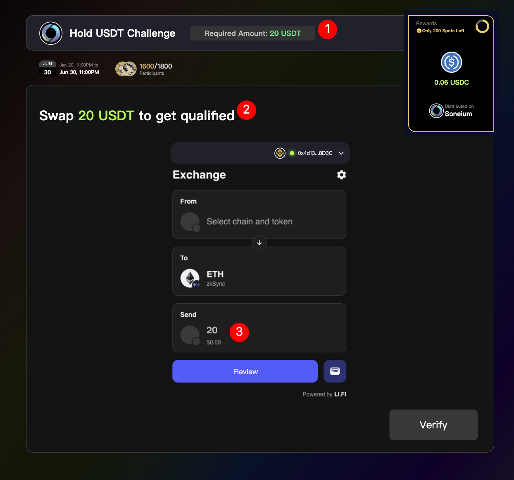
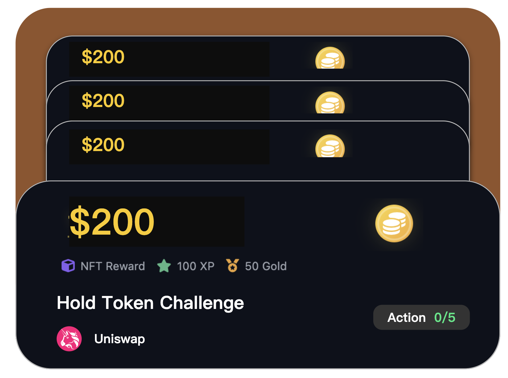

**c端 On-chain 落地页**

**演示效果**

**页面入口**

**一、导航栏增加入口**

交互逻辑:

在导航栏上 Hover ⚡️ Onchain 后显示下拉列表

在导航栏上 点击 ⚡️ Onchain 后跳转至 onchain 页面

**二、在首页增加一个模块放在 quest 模块下面:**

从 onchain Action列表(ongoing
且没有被隐藏)中先过滤掉用户已领取奖励和已结束的Action(名字改成 action)
和Action合集后, 拉展示顺序 top 3 的Action卡片放在这里.
如果Action卡片数量不足1个, 则不展示该模块

点击 view all 后跳转到 onchain 页面

Action卡片上的交互参考下方「Action卡片」章节上的说明

**头部板块**

**板块1:** 用于介绍功能, 纯文本配置

**板块2:** 展示 on-chain 板块下分发 Token 奖励的美元价值

5秒钟更新一次, 更新后数值有变化的情况下要有动效设计

注意: 非稳定币的 token 奖励需要转成美元价值

计算公式 = 初始值 + 该功能下分发 Token 奖励的美元价值
(初始值支持人工配置, 目的是为了功能上线初期数据太难看)

**板块3:** 展示用户获得的黄金积分的数量

当用户的积分有更新时, 该数值需要实时更新

未登录的样式, 点击 login to check 后跳出登录弹窗

**Action列表**

显示所有状态为\"进行中\"和\"已过期\"的可见Action与Collection，并过滤教育板块中与指定徽章关联的Action。

**交互逻辑:**

一次性最多显示18个, 下拉按瀑布流的方式进行加载.

**In progress 快速筛选**

该模块下展示用户参与中且可参与的Action和Action合集:

参与中的Action定义: Action中有多个 step, 用户未完成所有 step/holding
token 未完成的Action

参与中的Action合集定义: Action合集中任意一个Action是参与中或已领奖状态,
且未领取所有Action奖励

**交互逻辑:**

按钮上显示参与中的Action和Action合集数量

点击后, 下方显示的Action卡片仅展示参与中的Action和Action合集.
再次点击后, 展示所有Action卡片

用户没有参与中的Action和Action合集时, 不需要显示该按钮

**排序规则**

<strong>分三层进行排序:</strong>

<strong>第一层：</strong>基础排序

<ul>
  <li>先把已结束的和用户已领取奖励的Action或Action集合排序靠后</li>
  <li>所有被人工置顶的Action或Action集合，统一排在列表最前面，置顶项内部保持人工设置的顺序
     <i>（人工置顶顺序从运营后台设置而来，需求放在ray那边）</i>
  </li>
</ul>

<strong>第二层：</strong>奖励价值排序

<ul>
  <li>剩下的先按奖励价值进行排序，然后再根据排序系数进行排序
     <i>（排序系数由运营后台配置而来，需求放在Ray那边）</i>
  </li>
</ul>

<u>奖励价值排序逻辑:</u>

<ol>
  <li>奖励 Token 美元总值（降序）- 数值越大越靠前</li>
  <li>若奖励 Token 为 0，则按黄金积分总值降序排序</li>
  <li>若奖励 黄金积分 为 0，则按积分总值降序排序</li>
</ol>

<u>排序系数逻辑:</u>

<ul>
  <li>默认是1，即在奖励价值排序的基础上，不调整任何排序</li>
  <li>系数值越低，排序越靠后</li>
</ul>

<strong>第三层：</strong>相对排名计算

计算公式：相对排名 = 奖励排名 / 排序系数

最终排名按相对排名进行升序排列

<i>演示示例(仅做示例!!具体方案由技术确定):</i>

<table>
  <tr>
    <th><b>奖励排名</b></th>
    <th><b>Action Reward</b></th>
    <th><b>排序系数</b></th>
    <th><b>相对排名</b></th>
    <th><b>最终排名</b></th>
  </tr>
  <tr>
    <td style="text-align: center;">1</td>
    <td style="text-align: center;">$200</td>
    <td style="text-align: center;">0.1</td>
    <td style="text-align: center;">10</td>
    <td style="text-align: center;">6</td>
  </tr>
  <tr>
    <td style="text-align: center;">2</td>
    <td style="text-align: center;">$150</td>
    <td style="text-align: center;">1</td>
    <td style="text-align: center;">2</td>
    <td style="text-align: center;">1</td>
  </tr>
  <tr>
    <td style="text-align: center;">3</td>
    <td style="text-align: center;">50 Gold XP</td>
    <td style="text-align: center;">1</td>
    <td style="text-align: center;">3</td>
    <td style="text-align: center;">2</td>
  </tr>
  <tr>
    <td style="text-align: center;">4</td>
    <td style="text-align: center;">40 Gold XP</td>
    <td style="text-align: center;">1</td>
    <td style="text-align: center;">4</td>
    <td style="text-align: center;">3</td>
  </tr>
  <tr>
    <td style="text-align: center;">5</td>
    <td style="text-align: center;">30 XP</td>
    <td style="text-align: center;">1</td>
    <td style="text-align: center;">5</td>
    <td style="text-align: center;">4</td>
  </tr>
  <tr>
    <td style="text-align: center;">6</td>
    <td style="text-align: center;">10 XP</td>
    <td style="text-align: center;">1</td>
    <td style="text-align: center;">6</td>
    <td style="text-align: center;">5</td>
  </tr>
</table>

**Action卡片**

**Action奖励**

在Action卡片的头部显示奖励:

奖励显示规则分为多种类型奖励和一种类型奖励:

多种类型奖励的情况下, 需要根据奖励类型的优先级选取一个主奖励展示.
奖励类型优先级: token 奖励 \> badge \> gold xp \> xp;
在主奖励展示下面再根据奖励类型优先级显示其他奖励. 副奖励显示规则

Badge: badge 名称 + badge 图片

Gold xp: gold xp 数量 + logo

Xp: xp 数量 + logo

一种类型奖励, 采用主奖励展示规则

不同类型主奖励的显示规则:

Token, 显示总共 token 奖励等值美元价值, 右侧 logo 采用 Actionon 设计的
token logo

badge, 显示 badge 名称, 右侧 logo 采用 badge 图片

Gold xp, 显示总共奖励的 gold xp 数量, 右侧 logo 采用 gold xp logo

xp, 显示总共奖励的 xp 数量, 右侧 logo 采用 xp logo

**交互逻辑:**

针对 token 类型奖励, hover 到数字(\$200区域)上时, 展示以下弹框:

该弹框主要用于显示 token 奖励的数量, Token 名称, 真实的 Token logo (有
token logo 用 token logo, 没有的话用 project logo)

**Swap/Bridge**

<table>
  <tr>
    <th>类型</th>
    <th>状态</th>
    <th>样式</th>
    <th>Hover 后样式</th>
  </tr>
  <tr>
    <td rowspan="3">swap/bridge</td>
    <td>未参与</td>
    <td>
       
      显示要素: 
      奖励 
      Action标题 
      项目方的 logo 和名称 
      剩余份数/总份数(仅在有设置Token奖励的action上显示, 总份数对应运营后台奖励设置中的participated wallets)
    </td>
    <td>
       
      <b>交互逻辑:</b> 
      点击 start 后, 打开Action页面
    </td>
  </tr>
  <tr>
    <td>已领取奖励</td>
    <td>
      
    </td>
    <td>无变化, 同左边</td>
  </tr>
  <tr>
    <td>Action结束(名额满/时间到期/手动结束...)</td>
    <td>
      
    </td>
    <td>
      
    </td>
  </tr>
</table>

**Hold Token**

<table>
  <tr>
    <th>类型</th>
    <th>状态</th>
    <th>样式</th>
    <th>Hover 后样式</th>
  </tr>
  <tr>
    <td rowspan="8">Hold token + 天数</td>
    <td>未登记</td>
    <td>
       
      显示要素: 
      奖励 
      Action标题 
      Action 关联 Request 的项目方 logo 和名称 
      要求持有的token 数量 
      要求持有的天数
    </td>
    <td>
       
      <b>交互逻辑:</b> 
      点击 start 后, 需要判断用户持有的token 数量是否满足要求: 
      如果满足要求, 展开参与成功提示弹窗. 关闭弹窗后进入[已登记-进行中]状态. 
      如果不满足要求, 展示 hold 弹窗. 引导用户通过 swap 来获得要求 token 的数量 
       
      <b>参与成功提示弹窗:</b> 
       
      文案上的 10 days(5/24) 是动态显示的 
      10 days 展示要求剩余持有 token 的天数. 计算公式: Action要求持有天数 - 用户已持有天数 
      5/24 是满足持有天数的日期. 计算公式: 当天日期+剩余天数 
       
      <b>Hold 弹窗:</b> 
       
      弹窗采用 Actionon aggregator 组件引导用户去 swap token (参考 ray 的需求), 图中标记的三个元素需要特殊设计: 
      组件1: 显示Action要求持有 token 数量的要求 
      组件2: 显示用户需要额外购买的 token 数量; token 数量 = 要求的token数量 - 用户的token 余额 
      组件3: 自动填入用户需要额外购买的 token 数量 
      点击 verify 后, 校验用户的 token 余额是否满足条件, 如果满足条件, 则现有弹窗关闭, 展开参与成功提示弹窗, Action卡片进入[已登记-进行中]状态, 打卡天数+1
    </td>
  </tr>
  <tr>
    <td>已登记-进行中</td>
    <td>
       
      <b>交互逻辑:</b> 
      用户点击刷新按钮后, 实时查询用户的 token balance 是否满足条件. 进入查询状态 
       
      查询结果出来后, 如果用户的持币余额满足条件, 则使用以下界面, 提示文案: Requirement met, we're recording your progress! 
       
      若用户的持币余额不满足条件, 则卡片进入「已登记-不满足 hold token 要求」状态的显示, 看👇
    </td>
    <td>同左</td>
  </tr>
  <tr>
    <td>已登记-不满足 hold token 要求</td>
    <td>
       
      <b>交互逻辑:</b> 
      用户点击刷新按钮后, 实时查询用户的 token balance 是否满足条件, 进入查询状态: 
      立即隐藏"Insufficient token balance"提示 
      刷新按钮改成加载动画 
      查询结果出来后 
      如果用户的持币余额满足条件, 则使用以下界面, 提示文案: Requirement met, we're recording your progress! 
       
      若用户的持币余额不满足条件, 则卡片进入「已登记-不满足 hold token 要求」状态的显示, 即恢复点击刷新按钮前的原样
    </td>
    <td>
       
      <b>交互逻辑:</b> 
      点击 add balance 后, 展开 Hold 弹窗
    </td>
  </tr>
  <tr>
    <td>已登记-满足领取奖励条件但未领取</td>
    <td>
       
      <b>[*在设计样式上要强化引导用户手动领取奖励]</b>
    </td>
    <td>
       
      <b>交互逻辑:</b> 
      点击 claim reward 后, 进入通用领取奖励的页面 (ray 那边的设计)
    </td>
  </tr>
  <tr>
    <td>已登记-已领取</td>
    <td>
      
    </td>
    <td>同左边, 没有变化</td>
  </tr>
  <tr>
    <td>已登记-名额满不能领取奖励/时间到期结束</td>
    <td>
      
    </td>
    <td>
      
    </td>
  </tr>
  <tr>
    <td>未登记-时间即将到期 当前时间+Action要求持有的天数大于Action的结束时间, 这种情况下用户即使参与了, 也100%拿不到奖励</td>
    <td>
      
    </td>
    <td>
       
      交互逻辑: 按钮不可点击
    </td>
  </tr>
  <tr>
    <td>未登记 - action 结束(名额满/时间到期/手动结束...)</td>
    <td>
      
    </td>
    <td>
      
    </td>
  </tr>
  <tr>
    <td rowspan="3">Hold token + 不加天数</td>
    <td>未登记</td>
    <td>
      
    </td>
    <td>
       
      <b>交互逻辑:</b> 
      点击 start 后, 需要判断用户持有的token 数量是否满足要求: 
      如果满足要求, 进入通用领取奖励的页面 (ray 那边的设计) 
      如果不满足要求, 展示 hold 弹窗. 引导用户通过 swap 来获得要求 token 的数量 
       
      <b>Hold 弹窗:</b> 
       
      点击 verify 后, 校验用户的 token 余额是否满足条件, 如果满足条件, 则进入通用的奖励领取页面
    </td>
  </tr>
  <tr>
    <td>已领取</td>
    <td>
       
      在Action标题下加个 Required Amount
    </td>
    <td>同左边</td>
  </tr>
  <tr>
    <td>Action 结束(名额满/时间到期/手动结束...)</td>
    <td>
       
      在Action标题下加个 Required Amount
    </td>
    <td>
      
    </td>
  </tr>
</table>

**Action Collection**

包含了多个Action的 Action collection

参考设计概念:

<table>
  <tr>
    <th>状态</th>
    <th>样式</th>
    <th>Hover 后样式</th>
  </tr>
  <tr>
    <td>未登记</td>
    <td>
       
      显示要素: 
      最多展示三个Action卡片, 卡片上只露出主奖励. 有超过3个Action卡片的情况下, 显示最多奖励的三个 
      将所有Action的奖励加起来后的奖励池 
      Action集合名称 
      项目方的logo 和名称(有多个项目方的情况下, 仅显示 logo, 采用叠加的效果) 
      显示用户已领取奖励的Action及所有Action数
    </td>
    <td>
       
      <b>交互逻辑:</b> 
      加了 Start 后, 进入 Action collection 页面
    </td>
  </tr>
  <tr>
    <td>已登记-部分Action完成奖励领取</td>
    <td>
       
      Action 上的进度更新
    </td>
    <td>
       
      <b>交互逻辑:</b> 
      点进去后的 collection 详情页跳转到最先未完成的那一个action
    </td>
  </tr>
  <tr>
    <td>全部Action完成奖励领取</td>
    <td>
      
    </td>
    <td>同左</td>
  </tr>
  <tr>
    <td>全部Action结束(名额满/时间到期/手动结束...)</td>
    <td>
      
    </td>
    <td>
      
    </td>
  </tr>
</table>

**数据统计**

需要按 Action_id 粒度统计以下数据:

<table>
  <tr>
    <th><b>指标</b></th>
    <th><b>定义</b></th>
    <th><b>备注</b></th>
  </tr>
  <tr>
    <td>Action详情页查看人数</td>
    <td>Action弹窗查看用户数</td>
    <td>Action弹窗模块是 ray 那边需求上的</td>
  </tr>
  <tr>
    <td>Action参与人数</td>
    <td>完成Action中至少 1个 step 的用户数</td>
    <td>该指标只统计除 holding Action (包含 holding 天数) 外的其他Action</td>
  </tr>
  <tr>
    <td>Action完成人数</td>
    <td>完成Action中所有 step 的用户数</td>
    <td>该指标只统计除 holding Action (包含 holding 天数) 外的其他Action</td>
  </tr>
  <tr>
    <td>Holding Action (包含天数) 参与人数</td>
    <td>Holding 天数至少 1天的用户数</td>
    <td></td>
  </tr>
  <tr>
    <td>Holding Action (包含天数) 完成人数</td>
    <td>Holding 天数完成要求的用户数</td>
    <td></td>
  </tr>
  <tr>
    <td>Holding Action (包含天数) 领奖人数</td>
    <td>Holding 天数完成要求且完成领奖的用户数</td>
    <td></td>
  </tr>
</table>

需要按 Action_collection_id 粒度统计以下数据:

<table>
  <tr>
    <th><b>指标</b></th>
    <th><b>定义</b></th>
    <th><b>备注</b></th>
  </tr>
  <tr>
    <td>Action_collection 详情页查看人数</td>
    <td>Action_collection 弹窗查看用户数</td>
    <td>Action_collection 弹窗模块是 ray 那边需求上的</td>
  </tr>
  <tr>
    <td>Action_collection 参与人数</td>
    <td>完成 Action_collection 中至少1个Action的用户数</td>
    <td></td>
  </tr>
  <tr>
    <td>Action_collection 完成人数</td>
    <td>完成 Action_collection 中所有Action的用户数</td>
    <td></td>
  </tr>
</table>

除此之外, 需要记录导航栏按钮/home组件点击的 pv 和 uv

**教育板块**

左侧的徽章墙上显示的徽章通过人工配置徽章 id 指定,
并且需要支持顺序配置(需要支持灵活配置, 变更不需要发版)

徽章墙上的 1/5 是代表用户已拿到的徽章和全部徽章数量

右侧是对应获取徽章需要完成的 Action (根据Action奖励中配置的徽章关联而来)

**徽章的配置来源:**

徽章通过人工上传的方式确定, 包括的字段有:

徽章名字

徽章描述

徽章图片

完成上传后, 每个徽章会给一个固定的徽章id

**交互逻辑**

点击左侧徽章(默认选中第一个), 右侧内容切换, 右侧内容显示要素(从上到下):

徽章标题

徽章描述

Action Step 1标题

Action Step 2标题

\...

根据Action的不同完成状态, 有不同的显示样式和文案:

<table>
  <tr>
    <th>状态</th>
    <th>截图</th>
    <th>交互逻辑</th>
  </tr>
  <tr>
    <td>未参与</td>
    <td>
       
      徽章上要有特定的显示样式, 比如置灰的
    </td>
    <td>点击 start 按钮, 打开弹窗</td>
  </tr>
  <tr>
    <td>进行中</td>
    <td>
       
      徽章上要有特定的显示样式, 比如有虚线包裹
    </td>
    <td>点击 continue 按钮, 打开弹窗, 展示最靠前未完成的 step</td>
  </tr>
  <tr>
    <td>已领取</td>
    <td>
       
      徽章上要有特定的显示样式, 比如点亮了的
    </td>
    <td>按钮无法点击</td>
  </tr>
  <tr>
    <td>Action过期</td>
    <td></td>
    <td></td>
  </tr>
</table>

**工单入口**

放在页面右下角, 点击后自动关联工单分类: Onchain Support

Onchain Support 是C端新增的工单分类, 位置放在 other support 上面

**移动端设计**

与PC端的差异点主要在教育板块, 以下是差异点的说明:

改成2\*4的布局, 如果徽章的数量大于8个的情况下:

支持通过水平滑动切换(每页8个轮播翻整页)

显示当前页面/全部页码

去掉了选中徽章之后, 会详细展示 action 每一个 step 的模块. 只需要显示
steps 的进度
