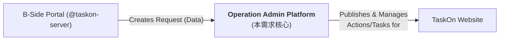
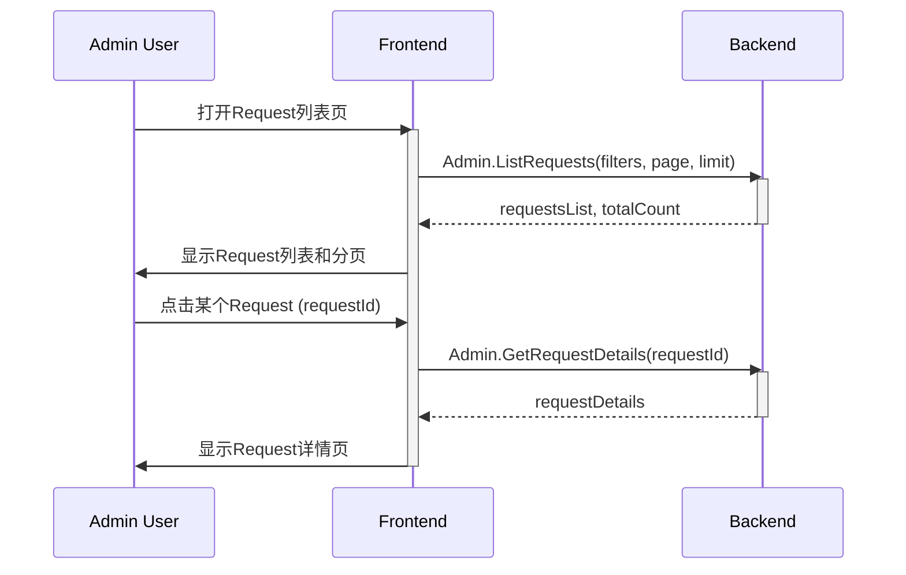
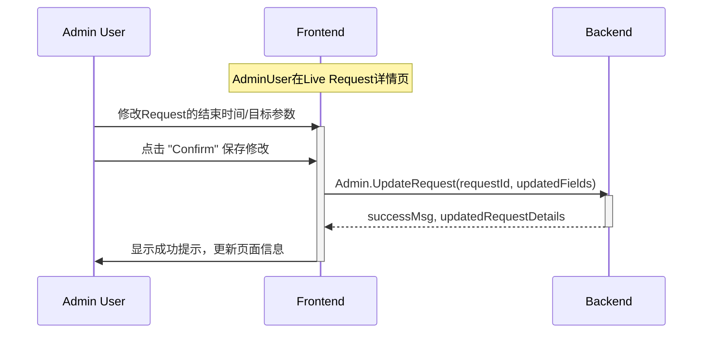
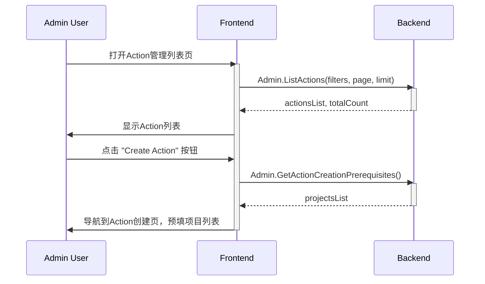
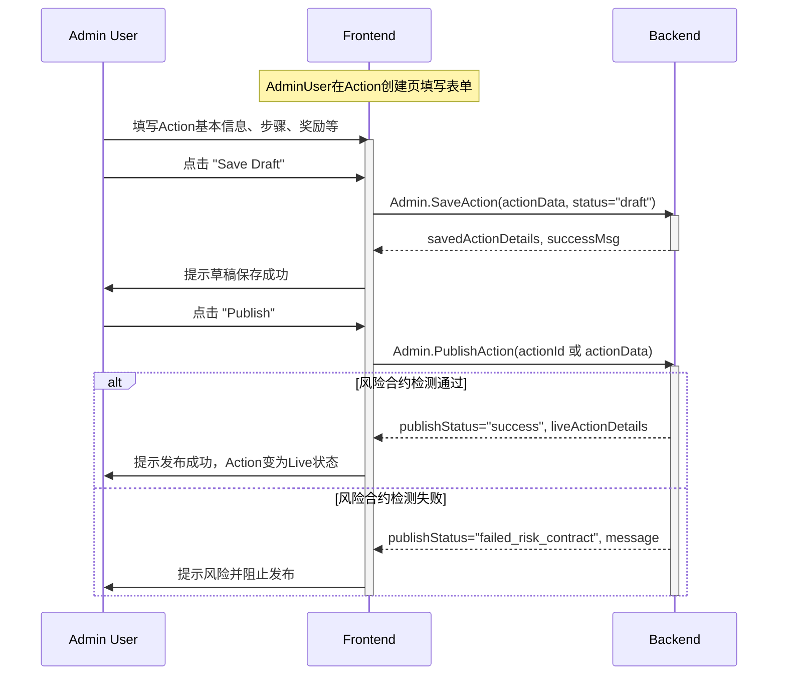
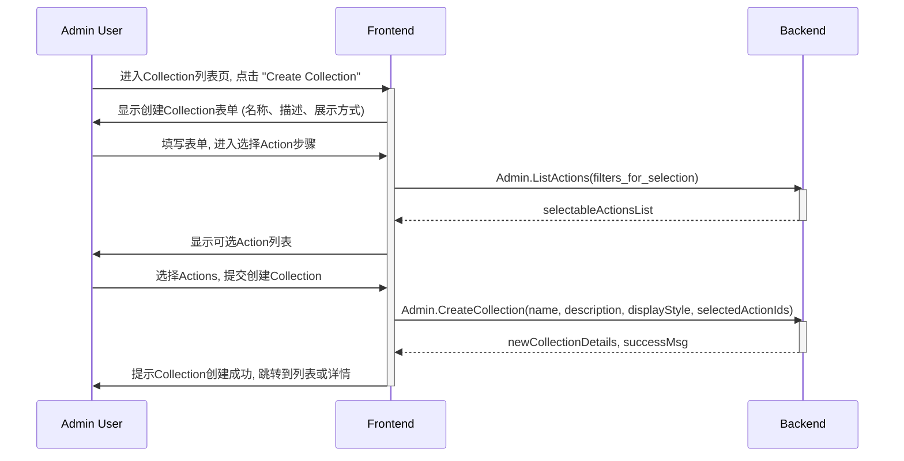

# 运营工具后台 - 后端视角

本文档从后端开发的角度梳理运营工具后台的核心需求，重点描述业务规则，定义支持前端界面展示与交互所需的API接口（概念性名称和关键参数），并列出界面元素与接口的对应关系及主要交互时序。主要聚焦于 Action 运营配置工具。

## 1. 核心业务概述

**运营工具后台 (Operation Admin Platform)** 是本需求文档的核心关注点。它的主要目标是支持运营团队高效管理B端用户/项目方（B-Side User / Project）通过 B端门户 (B side portal, @taskon-server，其他模块) 发起的Onchain Boost Request。**Operation Admin Platform** 负责将这些Request（或平台自有的营销活动）转化为C端用户（C side User）在 TaskOn网站 (C端产品，其他模块) 上可见并能参与的Action或Action Collection。**Operation Admin Platform** 的核心职责包括对Request的生命周期管理（例如，审核状态跟踪、信息聚合展示）、对Action的创建与精细化配置（基本信息、步骤设计、奖励机制、参与资格等）、Action的发布审批流程以及后续的活动管理与数据监控，最终目的是提升C端用户活跃度和满足B端推广需求。

为了更直观地展示各主要平台和用户之间的基本交互流程，下图示意了Operation Admin Platform在整体生态中的位置：

基于您提供的交互图和详细流程图，核心业务流程可以进一步细化（并明确各方职责）为以下几个主要方面：

A. B端用户 (Project) 流程 (主要由B端门户负责，**Operation Admin Platform** 可能提供数据支持或接收其输出):
1.  **发现入口**: B端用户在 B端门户 发现 Onchain Boost 功能入口。
2.  **创建任务 (Request)**: B端用户通过 B端门户 创建 Onchain Task (Request)，包含活动目标和预算（如 Deposit Token）。此信息将传递给 **Operation Admin Platform** 进行后续处理。
3.  **数据监控**: B端用户在 B端门户 实时查看其发起的Task的C端用户完成情况 (数据可能由 **Operation Admin Platform** 通过API提供给B端门户)。
4.  **接收退款**: 若Task提前结束或预算未消耗完毕，B端用户在 B端门户 收到相应的退款 (退款的发起和计算可能由 **Operation Admin Platform** 或专门的财务系统处理，并通过B端门户展示给用户)。

B. C端用户流程 (主要由C端网站和底层系统/合约负责，**Operation Admin Platform** 负责内容配置与推送):
1.  **发现活动**: C端用户在 TaskOn网站 上看到由 **Operation Admin Platform** 配置并推送的推荐Action或Task。
2.  **参与活动**: C端用户在 TaskOn网站 上点击并跳转至活动详情页，开始完成指定的Action/Task步骤。
3.  **获得奖励**: 完成所有步骤并通过 系统/智能合约 (其他模块) 的验证后，C端用户获得相应的奖励（Token, NFT, XP等）。奖励的发放可能由 系统/智能合约 直接执行，奖励的类型和数量由 **Operation Admin Platform** 配置。

C. **Operation Admin Platform** - B端Task管理流程 (本项目核心职责):
1.  **接收与筛选**: **Operation Admin Platform** 从B端门户接收B端提交的Task (Request)，并在后台界面中向运营人员展示Request列表，提供筛选和搜索功能。
2.  **合约审核 (协调与记录)**: **Operation Admin Platform** 内记录Task涉及的合约信息。若涉及新合约，运营人员通过 **Operation Admin Platform** 标记并启动外部审核流程（如通知Donald审核，此审核过程可能在平台外进行）。**Operation Admin Platform** 记录审核结果。
3.  **Task合理性评估**: 运营人员使用 **Operation Admin Platform** 提供的界面和信息，评估Task内容是否合理、目标是否可达成。
4.  **接受与审批**:
    *   若Task合理且合约通过（或无需审核），运营人员在 **Operation Admin Platform** 上将Task标记为"接受"状态，并可能触发平台内部设定的"接受审批"流程（此审批流可能内建于 **Operation Admin Platform** 或通过集成外部系统实现）。
    *   审批通过后，运营人员在 **Operation Admin Platform** 上完成Task的最终配置（如关联Action模板、调整参数等），并将其发布上线，使其在C端可见。
5.  **拒绝与审批**:
    *   若Task不合理或合约未通过，运营人员在 **Operation Admin Platform** 上将Task标记为"拒绝"状态，并可能触发平台内部设定的"拒绝审批"流程。
    *   审批通过后，**Operation Admin Platform** 会记录此状态，并可能触发通知给 **B端门户/财务系统** 以便进行预算退款。
6.  **数据监控与管理**: 运营人员通过 **Operation Admin Platform** 提供的仪表盘或报表，实时查看已上线Task的C端用户完成数据、参与进度等。
7.  **到期处理**: **Operation Admin Platform** 监控Task的有效期。对于到期但未完成所有目标的Task，运营人员可通过 **Operation Admin Platform** 查看情况，并根据策略启动相应处理流程（如手动退款协调）。

D. **Operation Admin Platform** - 平台自有Action推送流程 (本项目核心职责):
1.  **创建Action**: 运营人员使用 **Operation Admin Platform** 提供的工具，根据平台活动需求创建新的Action（包括配置步骤、奖励、资格等）。
2.  **配置目标用户**: 运营人员在 **Operation Admin Platform** 上设置Action的目标受众，用于C端精准推荐。
3.  **提交审批**: 创建或修改后的Action，在 **Operation Admin Platform** 内提交审批（审批流程可能内建或集成外部系统）。
4.  **上线与推送**:
    *   审批通过后，运营人员通过 **Operation Admin Platform** 将Action发布上线，使其在C端新板块或活动区可见。
    *   **Operation Admin Platform** 可能负责将Action信息推送给 **C端网站** 的推荐系统。
    *   若审批不通过，Action状态在 **Operation Admin Platform** 内标记为不通过，流程结束。
5.  **数据监控**: 运营人员通过 **Operation Admin Platform** 查看自有Action的C端用户完成数据。

E. 系统及审批辅助流程 (部分能力由**Operation Admin Platform**提供或协调，部分依赖外部):
1.  **审批节点管理**: **Operation Admin Platform** 可能内建部分审批工作流，或提供接口与外部审批系统集成，用于处理运营提交的各类审批请求。运营人员通过 **Operation Admin Platform** 查看审批状态。
2.  **状态流转管理**: **Operation Admin Platform** 负责根据审批结果或预设规则，自动更新Action或Task的状态。
3.  **任务验证协调**: C端用户完成任务的验证主要由 系统/智能合约 (其他模块) 或特定验证服务执行。**Operation Admin Platform** 可能负责接收这些验证结果的信号，或为某些链下任务提供简易的验证管理界面。
4.  **奖励配置与发放协调**: 奖励的具体发放由 系统/智能合约或专门的奖励发放服务 (其他模块) 执行。**Operation Admin Platform** 的核心职责是准确配置奖励的类型、数量、规则，并确保在任务完成后能触发正确的发放指令或传递必要信息给发放模块。

## 2. 功能清单与核心模块需求 (基于 "📌 2 0 运营工具后台 .md")

### 2.1 功能点清单总览 (基于 `.md` 文件 2.2 Action运营配置工具)

| 模块编号 (源) | 主要功能模块     | 子功能点/主要关注点 (来自源文档)                                                                 |
|:--------------|:-----------------|:------------------------------------------------------------------------------------------------|
| 2.2.1         | Request列表      | 状态筛选、项目筛选、Action类型筛选、项目名/Request ID搜索、Request列表展示（状态、预算、关联Action数） |
| 2.2.2         | Request详情页    | 查看不同状态的Request详情、项目信息、预算、B端目标、关联Action、(Live状态下)编辑Request、创建Action快捷入口 |
| 2.2.3         | Action管理列表   | Action列表Tab (筛选、搜索、状态、类型、参与度、预算使用)、Collection列表Tab (查看、创建、管理)          |
| 2.2.4         | Action创建/编辑页 | Basic Info (项目关联、Logo、标题、时间、白名单)、Action Setup (步骤类型、顺序、内容配置)、Rewards Setup (关联Request、预算、参与上限、单钱包奖励) |
| 2.2.5         | Action排序       | (TBD, 需确认) 调整Action在C端展示的顺序                                                              |
| -             | 风险合约检测     | Action发布时进行风险合约检测并提示                                                                    |

## 3. 核心模块详细需求与API概念映射

### 3.1 Request列表 (对应源文档 2.2.1)

#### 3.1.1 业务规则
*   支持按项目、Request状态（Pending, Canceled, Rejected, Live, Completed, Expired）、Action类型（Swap, Bridge, Hold）进行筛选。
*   支持按项目名或Request ID进行模糊搜索。
*   列表展示Request的关键信息：项目方、状态、预算、关联Action数量。
*   分页加载。

#### 3.1.2 Request列表：界面与 API 概念映射

| 界面区域/用户状态 | 主要读取数据 (API概念)              | 关键请求参数                                                                 | 关键响应数据                                                                                                   |
|-------------------|------------------------------------|------------------------------------------------------------------------------|---------------------------------------------------------------------------------------------------------------|
| 页面加载/筛选/搜索 | `Admin.ListRequests`               | `page`, `limit`, `filters` (projectIds, statuses, actionTypes), `searchKeyword` | `requests` (列表: id, projectName, projectLogo, status, budgetInfo, associatedActionCount), `totalCount`         |
| 获取项目筛选列表  | `Admin.GetProjectFilterOptions`    | -                                                                            | `projects` (列表: id, name)                                                                                   |

### 3.2 Request详情页 (对应源文档 2.2.2)

#### 3.2.1 业务规则
*   展示指定Request的详细信息，包括项目基本信息、Request状态、时间、预算、B端设置的目标（Wallet, Volume, Txns）及当前进度。
*   运营可以根据Request状态进行不同操作：
    *   **Pending**: 主要为查看，可准备创建Action或调整Request。
    *   **Live**: 可编辑Request的结束时间、B端目标，修改关联Action配置（可能受限），或快速创建新Action。
*   编辑操作需要确认后生效。
*   提供"Create Action"快捷按钮，能将Request信息预填到Action创建页。
*   不同状态（Pending, Live, Completed, Expired）下详情页展示内容和可操作项可能不同。Canceled和Rejected状态主要是信息展示。

#### 3.2.2 Request详情页：界面与 API 概念映射

| 界面区域/用户状态        | 主要读取数据 (API概念)                 | 关键请求参数                | 关键响应数据                                                                                                                             | 主要交互操作与所需API (概念)                                                                                                                               |
|--------------------------|---------------------------------------|-----------------------------|------------------------------------------------------------------------------------------------------------------------------------------|-------------------------------------------------------------------------------------------------------------------------------------------------------|
| **Request详情加载**      | `Admin.GetRequestDetails`             | `requestId`                 | `requestDetails` (id, status, projectInfo, timeInfo, budgetInfo, bSideTargets, currentProgress, associatedActions)                      | -                                                                                                                                                     |
| **(Live状态)编辑Request**| -                                     | -                           | -                                                                                                                                        | 点击Edit按钮启用编辑   保存修改: `Admin.UpdateRequest(requestId, updates={endDate, targets, actionConfigs})` -> `success`, `updatedRequestDetails` |
| **(Live状态)创建Action** | -                                     | -                           | -                                                                                                                                        | 点击Create Action: (前端导航到Action创建页，预填 `projectId`, `requestId`, `title`, `coreActionParams`, `participationCap`)                            |

### 3.3 Action管理列表 (对应源文档 2.2.3)

#### 3.3.1 业务规则
*   包含两个主要Tab: "Action List" 和 "Collection List"。
*   **Action List**:
    *   支持按项目、Action状态（Draft, Live, Expired, Hidden）、Action类型进行筛选。
    *   支持按Action名或项目名进行模糊搜索。
    *   列表展示Action关键信息：名称、项目方、状态、类型、参与人数/进度、Budget使用进度。
    *   提供 "Create Action" 按钮。
    *   操作包括：编辑、查看详情、改变状态（如Hide/Unhide, End）。
*   **Collection List**:
    *   展示Collection列表：名称、包含Action数、状态等。
    *   支持创建新的Collection：定义名称、描述、包含的Actions（从已有Action中选择）、展示模式（Seamless/Separate）。
    *   支持编辑、查看、管理Collection。

#### 3.3.2 Action管理列表：界面与 API 概念映射

| 界面区域/用户状态             | 主要读取数据 (API概念)                   | 关键请求参数                                                                      | 关键响应数据                                                                                                                             | 主要交互操作与所需API (概念)                                                                                                                                                                |
|-------------------------------|-----------------------------------------|-----------------------------------------------------------------------------------|------------------------------------------------------------------------------------------------------------------------------------------|------------------------------------------------------------------------------------------------------------------------------------------------------------------------------------------|
| **Action列表加载/筛选**       | `Admin.ListActions`                     | `page`, `limit`, `filters` (projectIds, statuses, actionTypes), `searchKeyword`    | `actions` (列表: id, name, projectName, status, type, participantsInfo, budgetUsage), `totalCount`                                           | 点击Action: (导航到Action编辑页/详情页)   改变状态: `Admin.UpdateActionStatus(actionId, newStatus)`                                                                                     |
| **Collection列表加载**        | `Admin.ListCollections`                 | `page`, `limit`, `searchKeyword`                                                  | `collections` (列表: id, name, actionCount, status), `totalCount`                                                                          | 点击Collection: (导航到Collection编辑页/详情页)                                                                                                                                           |
| **创建Collection (第一步)**   | -                                       | -                                                                                 | -                                                                                                                                        | `Admin.CreateCollection(name, description, displayStyle, actionIds)` -> `collectionDetails`                                                                                               |
| **(创建Collection)选择Action**| `Admin.ListActions` (用于选择器)        | `filters` (e.g., status=Live, projectId -可选), `selectable=true`                 | `actions` (用于选择)                                                                                                                       | -                                                                                                                                                                                        |

### 3.4 Action创建/编辑页 (对应源文档 2.2.4)

#### 3.4.1 业务规则
*   支持从头创建Action或编辑现有Action (Draft, Live状态均可编辑，但Live状态编辑可能有限制或需特殊处理)。
*   **Basic Info**:
    *   关联项目 (必选)。
    *   Logo: 可使用项目默认Logo或上传自定义Logo。
    *   Title (必填)。
    *   开始时间、结束时间 (结束时间可选 "Never Expire"，此时Action在奖励耗尽后自动结束)。
    *   Target Audience: Everyone 或白名单用户 (上传地址列表)。
*   **Action Setup**:
    *   支持多种步骤类型：教育(文本/视频)、Quiz、链上行为(Swap, Bridge, Hold)。
    *   步骤可以拖拽排序。
    *   每个步骤有其特定的配置项 (如Quiz的题目选项、Swap的代币对和链等)。复用C端Action的步骤配置逻辑。
*   **Rewards Setup**:
    *   关联Request (可选，若不关联则为平台自身运营活动)。
    *   展示关联Request的进度和可用预算 (若关联)。
    *   配置参与人数上限 (Participantion Cap)。
    *   配置单钱包奖励金额/类型。
*   **状态管理**: Action有Draft, Live, Ended等状态。发布Action (从Draft到Live) 时可能触发风险合约检测。
*   风险合约检测：发布Action时，若配置的链上步骤涉及的合约地址被系统识别为风险合约，应阻止发布并提示运营。

#### 3.4.2 Action创建/编辑页：界面与 API 概念映射

| 界面区域/用户状态             | 主要读取数据 (API概念)                      | 关键请求参数                                     | 关键响应数据                                                                                                                                  | 主要交互操作与所需API (概念)                                                                                                                                                                       |
|-------------------------------|--------------------------------------------|--------------------------------------------------|---------------------------------------------------------------------------------------------------------------------------------------------|---------------------------------------------------------------------------------------------------------------------------------------------------------------------------------------------------|
| **创建页加载 (空表单)**       | `Admin.GetActionCreationPrerequisites`       | -                                                | `projects` (列表供选择), `defaultStepConfigs` (可选)                                                                                         | -                                                                                                                                                                                                 |
| **编辑页加载 (填充表单)**     | `Admin.GetActionDetailsForEdit`              | `actionId`                                       | `actionData` (包含所有Basic Info, Action Setup步骤, Rewards Setup的当前配置), `projects`                                                           | -                                                                                                                                                                                                 |
| **(白名单)上传地址**        | `Admin.UploadWhitelist`                    | `file`                                           | `whitelistId`, `addressCount`                                                                                                                 | -                                                                                                                                                                                                 |
| **保存Action (Draft/Update)** | `Admin.SaveAction`                         | `actionData` (包含所有配置)                        | `actionDetails` (保存后的完整Action信息), `status` (e.g., "draft_saved", "updated")                                                             | `actionData` 中包含: `projectId`, `logoUrl`, `title`, `startTime`, `endTime`, `isNeverExpire`, `targetAudienceType`, `whitelistId (opt)`, `steps` (数组，每个step含类型和配置), `rewardsConfig` (关联request, cap, rewardAmount) |
| **发布Action**                | `Admin.PublishAction`                      | `actionId`, `actionData (opt, if changes pending)` | `publishStatus` ("success", "failed_risk_contract"), `message (opt)`, `liveActionDetails (opt)`                                                 | (后端执行风险合约检测)                                                                                                                                                                           |
| **获取关联Request列表(奖励配置用)**| `Admin.ListRequests` (用于选择器)         | `filters` (projectId, status=Live), `selectable=true`| `requests` (列表: id, name, budgetInfo)                                                                                                      | -                                                                                                                                                                                                 |
| **获取项目Logo**              | `Admin.GetProjectLogo`                     | `projectId`                                      | `logoUrl`                                                                                                                                     | -                                                                                                                                                                                                 |

## 4. 后端其他考虑点 (通用)

*   **权限控制**: 运营人员需要有相应的权限才能访问和操作这些后台功能。不同角色的运营权限可能不同。
*   **审计日志**: 对关键操作（如Request状态变更、Action创建/修改/发布、预算调整）应有详细的审计日志。
*   **异步任务**: 某些耗时操作（如大规模白名单处理、复杂的Action发布校验）可考虑异步处理，并提供任务状态跟踪。
*   **数据校验**: 所有API接口需进行严格的输入校验。
*   **配置管理**: 链信息、支持的Action类型、风险合约库等应可配置。
*   **与B端系统交互**: 若Request信息、预算等与B端系统有联动，需明确接口和数据同步机制。
*   **错误处理与国际化**: API错误码和信息需清晰。若支持多语言后台，需考虑国际化。
*   **安全性**: 防止未授权访问、XSS、CSRF等常见Web安全风险。

## 5. UI界面时序图 (Mermaid语法 - 简化版)

以下时序图描述了主要UI界面和核心交互流程中前端与统一后端之间的交互。

### 5.1 查看Request列表并进入详情

### 5.2 (Live Request) 编辑Request信息

### 5.3 查看Action列表并创建新Action

### 5.4 创建Action并发布

### 5.5 创建Collection

