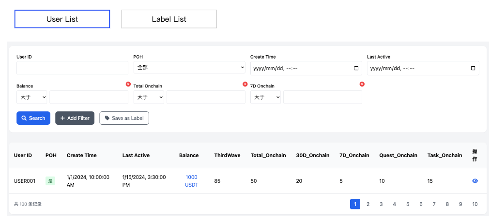
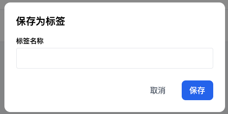
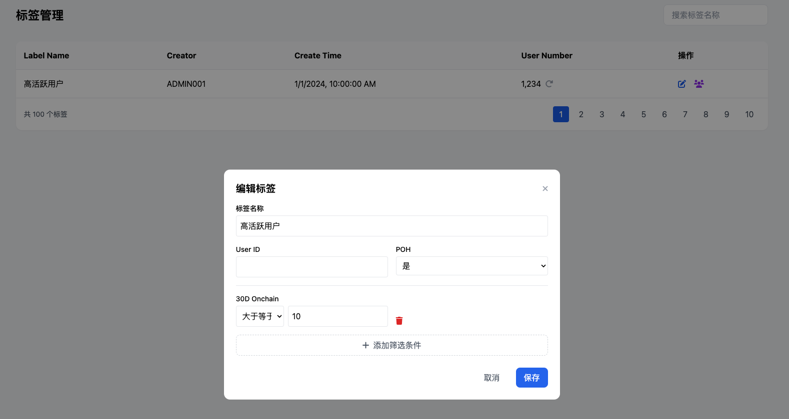

**c端精准推荐**

**演示效果**

**出现逻辑**

当用户的可见广告数量大于等于1的时候才展示该模块

**可见广告定义:**

<table border="1" width="100%" cellspacing="0" cellpadding="8">
  <thead>
    <tr>
      <th align="left" width="30%"><strong>广告内容类型</strong></th>
      <th align="left" width="70%"><strong>可见逻辑</strong></th>
    </tr>
  </thead>
  <tbody>
    <tr>
      <td valign="top">Action - 单action</td>
      <td>
        满足以下所有条件:  
        <ul>
          <li>Action 处于 ongoing 状态</li>
          <li>非隐藏</li>
          <li>用户未领取奖励</li>
          <li>当前时间处于广告设置的开始时间和结束时间范围内</li>
          <li>用户符合广告投放设置的命中用户群</li>
        </ul>
      </td>
    </tr>
    <tr>
      <td valign="top">Action - collection</td>
      <td>
        满足以下所有条件:  
        <ul>
          <li>Collection 中起码有1个 action 处于 ongoing 状态</li>
          <li>非隐藏</li>
          <li>用户未领取完所有 action 的奖励</li>
          <li>当前时间处于广告设置的开始时间和结束时间范围内</li>
          <li>用户符合广告投放设置的命中用户群</li>
        </ul>
      </td>
    </tr>
    <tr>
      <td valign="top">Custom</td>
      <td>
        满足以下所有条件:  
        <ul>
          <li>当前时间处于广告设置的开始时间和结束时间范围内</li>
          <li>用户符合广告投放设置的命中用户群</li>
        </ul>
      </td>
    </tr>
  </tbody>
</table>

<strong>出现页面:</strong>

Home (https://taskon.xyz/home) 
Quest 列表页 
Quest 详情页 
Asset 页(https://taskon.xyz/user/assets) 
<del>Alpha (https://taskon.xyz/alpha/home)</del>

<strong>其他逻辑:</strong>

需要定时刷新机制, 确保用户不能看见不可见的广告

**交互样式**

<strong>展开样式</strong>

<strong>一、Action 类型广告样式</strong>

<strong>显示元素:</strong>

Action/Action Collection标题 
Action/Action Collection 总共奖励 token 的等值美元价值 
其他奖励的显示, 展示顺序 (badge>gold xp >xp) 
Action button

<strong>1/3 这个组件仅当用户的可见广告数量是1个以上时才显示:</strong>

1 是当前查看的第几个广告 
3 是指用户总共可见的广告数

有多个可见广告的情况下, 广告 ongoing 生效时间靠后的顺序往前放, 也就是越晚推的顺序越靠前

<strong>二、Custom 类型广告样式</strong>

<strong>交互逻辑:</strong>

针对 Custom 样式的广告, 点击图片按钮, 打开新页面跳转 
针对Action 样式的广告, 点击Action上的 action 按钮, 打开新页面跳转 
如果有多个广告的情况下, 每隔5秒轮播, 用户也可以通过底部的导航组件进行切换, 支持循环切换 
点击左侧的卡通人物后, 进入收起样式

<strong>收起样式</strong>

当新增可见广告，且用户未点击玩偶查看时，显示"NEW"提示。

<strong>交互逻辑:</strong>

点击该玩偶, 使用抽屉的展开样式

<strong>展开/收起逻辑</strong>

当且仅当同时满足以下所有条件时，用户进入Home（<a href="https://taskon.xyz/home">https://taskon.xyz/home</a>）、Quest列表页或 Asset 页会默认展开该模块：

用户未在当前的可见广告下点击过"收起"按钮（当可见广告有新增时，无论用户是否收起过该模块，都视为满足此条件）

<strong>特殊情形：</strong> 当存在 epic 时，用户访问 Home 和 Quest 列表页将始终不展开该模块（无论是否满足上述条件）

