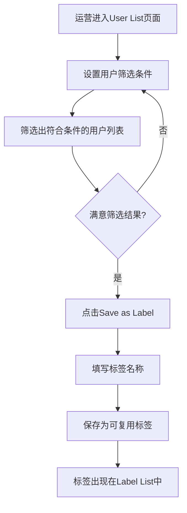
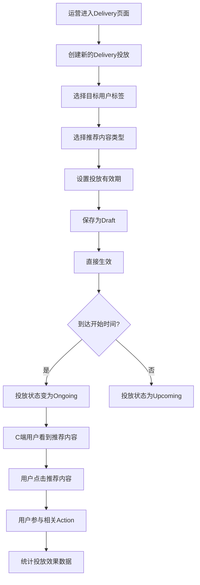
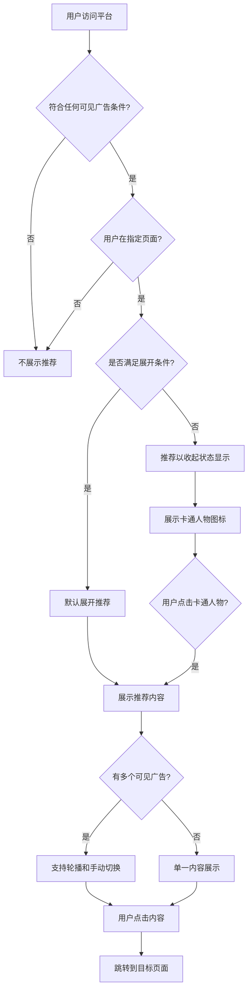
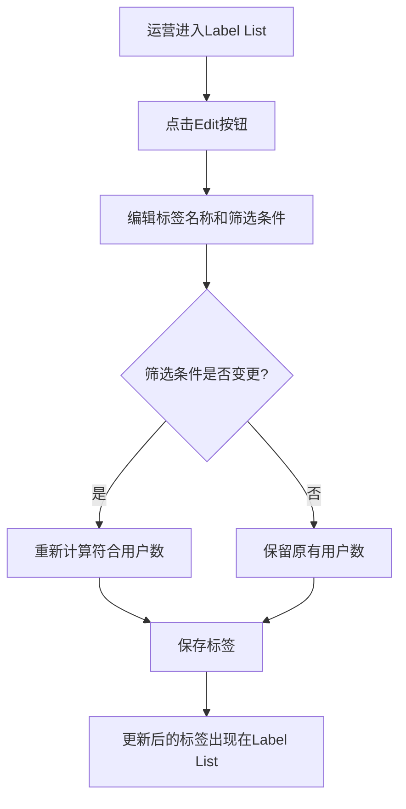
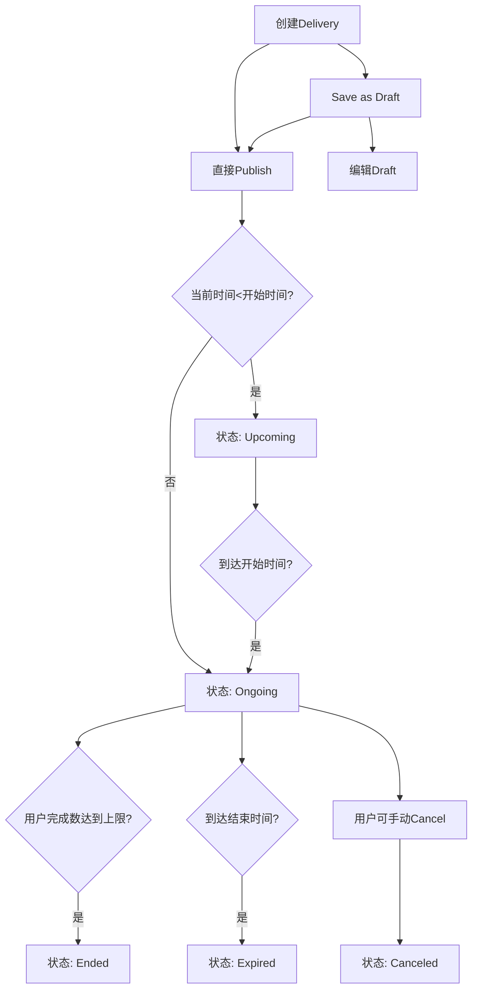
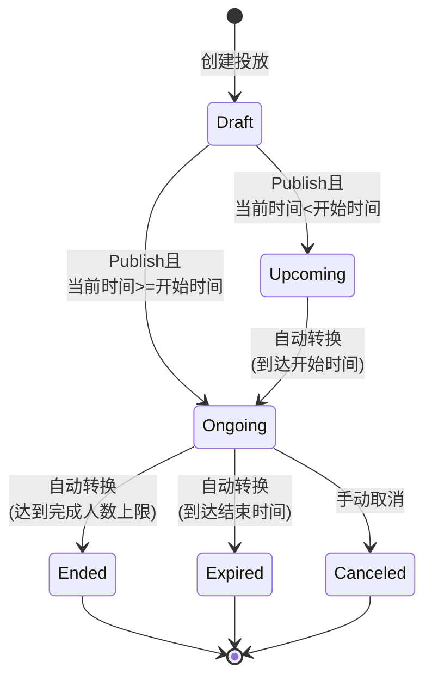
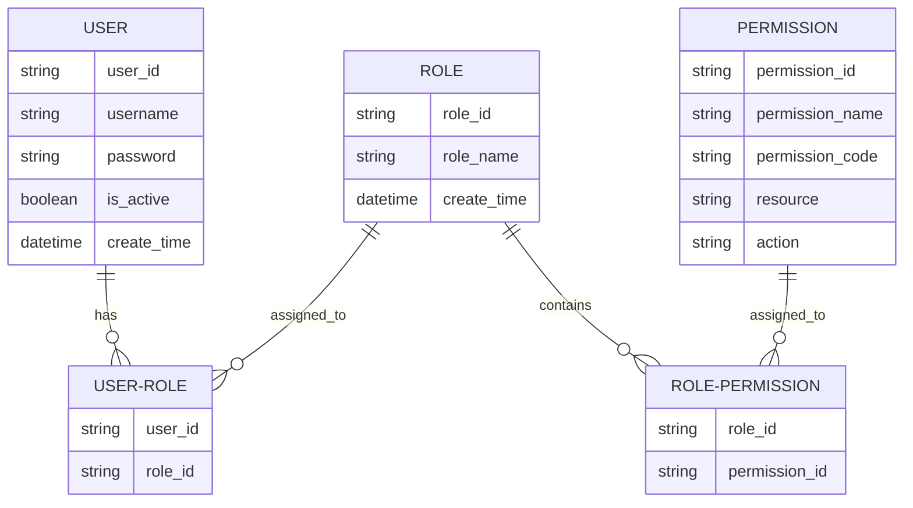
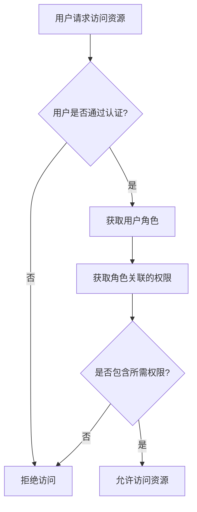

# new 标签&精准推荐需求结构化整理

## 一、产品概述

### 1. 产品背景

用户标签和精准推荐系统旨在解决以下几个关键问题：

- **运营精准化挑战**：随着平台用户规模扩大，不同用户的行为、偏好和需求各不相同，无法通过统一的运营策略满足所有用户
- **用户参与度优化**：需要提高现有内容和活动的触达效率，减少无效曝光，增加用户参与度
- **个性化需求**：用户期望获得更加个性化的内容推荐，特别是与其链上行为相关的Onchain任务推荐
- **运营效率提升**：运营团队需要一套自助式工具，无需技术团队介入即可实现用户细分和内容精准投放

基于以上挑战，我们需要构建一套完整的用户标签和精准推荐系统，包括用户特征数据收集、自定义标签创建、精准推荐投放和效果追踪的全流程解决方案。

### 2. 产品愿景

标签和精准推荐系统的产品愿景是：

- **打造精准运营平台**：构建一套完整的精准运营平台，让运营人员可以高效地定位目标用户群体，实现精准内容投放
- **提升用户体验**：通过为用户提供与其行为和偏好匹配的内容推荐，提高用户体验和参与度
- **促进平台内容循环**：建立用户画像、内容匹配和效果反馈的闭环系统，持续优化推荐精准度
- **赋能运营决策**：通过数据驱动的用户分析，帮助运营团队更好地理解用户行为，制定更有效的运营策略
- **增加内容触达率**：提高推荐内容的点击率和转化率，使有价值的内容能够触达最适合的用户

### 3. 用户故事

根据需求文档，可以总结出以下用户故事：

**运营人员用户故事**：

- 作为一名运营人员，我希望能够根据用户的各种特征（如链上行为、持有资产、活跃度等）创建自定义用户标签，以便精准定位目标用户群体
  > 来源：[运营后台-自定义标签+精准推荐.md](./运营后台-自定义标签+精准推荐.md)
  >
- 作为一名运营人员，我希望能够查看用户列表并应用各种筛选条件，以便分析用户特征和行为模式
  > 来源：[运营后台-自定义标签+精准推荐.md](./运营后台-自定义标签+精准推荐.md)
  >
- 作为一名运营人员，我希望能够将筛选结果保存为可复用的标签，以便后续运营活动重复使用
  > 来源：[运营后台-自定义标签+精准推荐.md](./运营后台-自定义标签+精准推荐.md)
  >
- 作为一名运营人员，我希望能够针对特定用户标签创建精准推荐投放计划，以提高内容触达效率
  > 来源：[运营后台-自定义标签+精准推荐.md](./运营后台-自定义标签+精准推荐.md)
  >
- 作为一名运营人员，我希望能够监控推荐内容的展示量、点击量和完成量，以评估投放效果
  > 来源：[运营后台-自定义标签+精准推荐.md](./运营后台-自定义标签+精准推荐.md)
  >

**C端用户故事**：

- 作为一名平台用户，我希望看到与我相关且感兴趣的Onchain任务推荐，避免无关内容干扰
  > 来源：[c端精准推荐.md](./c端精准推荐.md)
  >
- 作为一名平台用户，我希望在浏览不同页面时能够看到个性化的推荐内容，提升我的使用体验
  > 来源：[c端精准推荐.md](./c端精准推荐.md)
  >
- 作为一名平台用户，我希望收到的推荐能考虑我的历史行为和偏好，推荐更符合我需求的内容
  > 来源：[c端精准推荐.md](./c端精准推荐.md)
  >
- 作为一名平台用户，我希望能够方便地查看和参与被推荐的任务，简化我的操作流程
  > 来源：[c端精准推荐.md](./c端精准推荐.md)
  >

**管理员用户故事**：

- 作为一名系统管理员，我希望能够管理运营人员的账号和权限，确保系统安全和规范使用
  > 来源：[运营后台框架需求.md](./运营后台框架需求.md)
  >
- 作为一名系统管理员，我希望能够审核运营人员创建的推荐内容，确保内容质量和合规性
  > 来源：[运营后台框架需求.md](./运营后台框架需求.md)
  >
- 作为一名系统管理员，我希望能够查看系统操作日志，监控系统使用情况
  > 来源：[运营后台框架需求.md](./运营后台框架需求.md)
  >

## 二、业务流程

### 1. 全局业务流程图

标签与精准推荐系统涉及两个主要业务流程：用户标签创建流程和精准推荐投放流程。

**用户标签创建流程**

> 来源：[运营后台-自定义标签+精准推荐.md](./运营后台-自定义标签+精准推荐.md)

**精准推荐投放流程**

> 来源：[运营后台-自定义标签+精准推荐.md](./运营后台-自定义标签+精准推荐.md)

### 2. 关键子流程图

**C端用户推荐展示流程**

> 来源：[c端精准推荐.md](./c端精准推荐.md)

**标签编辑流程**

> 来源：[运营后台-自定义标签+精准推荐.md](./运营后台-自定义标签+精准推荐.md)

**Delivery状态流转图**

> 来源：[运营后台-自定义标签+精准推荐.md](./运营后台-自定义标签+精准推荐.md)

## 三、功能设计

### 1. 功能地图

根据需求文档，可以梳理出以下核心功能模块：

**1. 用户特征系统**

- 用户特征数据收集

  - 基本信息数据
  - POH认证信息
  - 链上数据 (EVM)
  - Onchain行为数据

  > 来源：[运营后台-自定义标签+精准推荐.md](./运营后台-自定义标签+精准推荐.md)
  >
- 用户特征宽表

  - 数据定期同步
  - 特征值计算
  - 数据存储管理

  > 来源：[运营后台-自定义标签+精准推荐.md](./运营后台-自定义标签+精准推荐.md)
  >

**2. 用户管理系统**

- 用户列表功能

  - 用户列表展示
  - 多条件筛选
  - 筛选条件保存
  - 用户详情查看

  > 来源：[运营后台-自定义标签+精准推荐.md](./运营后台-自定义标签+精准推荐.md)
  >
- 后台用户权限管理

  - 用户账号管理
  - 角色权限配置
  - 操作日志记录

  > 来源：[运营后台框架需求.md](./运营后台框架需求.md)
  >

**3. 标签管理系统**

- 自定义标签创建

  - 多条件组合筛选
  - 标签命名与保存
  - 标签用户数统计

  > 来源：[运营后台-自定义标签+精准推荐.md](./运营后台-自定义标签+精准推荐.md)
  >
- 标签列表管理

  - 标签列表展示
  - 标签编辑功能
  - 用户列表直达

  > 来源：[运营后台-自定义标签+精准推荐.md](./运营后台-自定义标签+精准推荐.md)
  >

**4. 精准推荐系统**

- 推荐内容管理

  - Action推荐
  - 自定义内容推荐
  - 内容配置

  > 来源：[运营后台-自定义标签+精准推荐.md](./运营后台-自定义标签+精准推荐.md)
  >
- 推荐投放管理

  - 投放目标设置
  - 投放时间管理
  - 投放状态控制
  - 投放效果统计

  > 来源：[运营后台-自定义标签+精准推荐.md](./运营后台-自定义标签+精准推荐.md)
  >

**5. C端推荐展示**

- 推荐展示组件

  - 展开样式
  - 收起样式
  - 轮播功能

  > 来源：[c端精准推荐.md](./c端精准推荐.md)
  >
- 展示逻辑控制

  - 可见性控制
  - 展示页面控制
  - 刷新机制

  > 来源：[c端精准推荐.md](./c端精准推荐.md)
  >
- 交互功能

  - 点击跳转
  - 展开收起
  - 手势操作

  > 来源：[c端精准推荐.md](./c端精准推荐.md)
  >

### 2. 功能描述模板

#### 用户特征宽表

**功能概述**：
提供用户特征数据的收集、存储和管理功能，作为用户标签创建和精准推荐的基础数据支撑。

**数据范围**：

- 基本字段：User ID、Last Active
- POH信息：POH状态、各类认证信息（ZKMe NFT、BABT、Galxe passport等）
- 链上数据：首次活动时间、交易笔数、钱包余额、代币持有情况、交易价值、各类评分指标、机器人预警指标等
- Onchain行为：完成Onchain action数量（总计/30天/7天）、完成Quest和Task数量

**更新机制**：

- 不同数据类型有不同更新频率：实时更新、每日更新
- 数据保存期限根据类型有所不同：从3个月到永久

**用途说明**：
作为内部数据分析和运营推荐的基础数据源，支持用户标签创建、精准推荐和用户行为分析。

> 来源：[运营后台-自定义标签+精准推荐.md](./运营后台-自定义标签+精准推荐.md)

#### 用户列表功能

**功能概述**：
提供运营人员查看、筛选和分析用户数据的界面，支持多条件组合筛选和保存为标签。

**主要组件**：

- 筛选区域：常驻筛选项（User ID、POH、Create Time、Last Active）和可添加筛选项
- 操作按钮：Search（执行搜索）、Add Filter（添加筛选条件）、Save as Label（保存为标签）
- 用户列表：展示符合筛选条件的用户，包括用户ID、POH状态、注册时间、最后活跃时间、积分数据、钱包评分、Onchain活动数据等

**交互逻辑**：

- 用户可以设置多个筛选条件组合查询
- 查询结果支持分页展示，默认按Last Active时间倒序排列
- 可以将当前筛选条件保存为标签，用于后续精准推荐

> 来源：[运营后台-自定义标签+精准推荐.md](./运营后台-自定义标签+精准推荐.md)

#### 标签管理功能

**功能概述**：
提供运营人员创建、管理和应用用户标签的功能，实现用户群体的精细化分类。

**主要组件**：

- 标签列表：展示所有已创建标签，包括标签名称、创建者、创建时间、符合用户数量等信息
- 操作按钮：Edit（编辑标签）、Go to User List（跳转至用户列表页面）

**交互逻辑**：

- 点击Edit可以编辑标签名称和筛选条件
- 编辑标签会实时更新符合条件的用户数量
- 点击Go to User List可以查看符合该标签条件的用户详情

> 来源：[运营后台-自定义标签+精准推荐.md](./运营后台-自定义标签+精准推荐.md)

#### 精准推荐投放功能

**功能概述**：
提供运营人员创建和管理精准推荐投放任务的功能，包括目标用户设置、内容选择和投放时间安排。

**创建流程**：

1. **Target设置**：选择目标用户标签，展示预计触达用户数量
2. **Content设置**：选择内容类型（Action/自定义内容），配置相关信息
3. **Schedule设置**：设置投放有效期（开始时间和结束时间）

**投放状态管理**：

- Draft：草稿状态，可以编辑或发布
- Upcoming：已发布但未到开始时间，C端不可见
- Ongoing：已开始且在有效期内，C端可见
- Ended：达到完成人数上限，提前结束
- Expired：超过结束时间
- Canceled：手动取消

**数据统计**：

- Target User：目标用户数量
- View User：看到推荐的用户数量
- Click User：点击过推荐的用户数量
- Complete User：完成推荐任务的用户数量

> 来源：[运营后台-自定义标签+精准推荐.md](./运营后台-自定义标签+精准推荐.md)

#### C端推荐展示组件

**功能概述**：
在C端展示个性化推荐内容，提供良好的用户体验和交互方式。

**展示样式**：

- 展开样式：显示推荐内容详情、奖励信息和操作按钮
- 收起样式：显示卡通人物图标，有新内容时显示"NEW"提示

**展示规则**：

- 仅当用户符合可见广告条件时展示
- 仅在指定页面展示（Home、Quest列表页、Quest详情页、Asset页）
- 有多个可见广告时支持轮播展示，每隔5秒自动轮播一次
- 当存在epic（平台特殊的大型活动或突出展示的重要内容）时，用户访问Home和Quest列表页将始终不展开该推荐模块

**交互逻辑**：

- 点击Action按钮跳转到相应页面
- 点击自定义内容图片跳转到设定的URL
- 点击卡通人物图标展开/收起推荐
- 支持手动切换多个推荐内容
- 用户可通过底部的导航组件在多个广告间进行切换，支持循环切换

> 来源：[c端精准推荐.md](./c端精准推荐.md)

## 四、业务规则

### 1. 业务规则概述

标签和精准推荐系统涉及多个业务规则，主要包括：

- **可见广告规则**：定义哪些用户可以看到哪些广告内容的条件
- **展开/收起逻辑**：控制推荐内容的默认展示状态
- **标签重复性规则**：防止创建重复标签的校验规则
- **投放状态流转规则**：定义投放任务在不同状态间的转变条件
- **用户筛选条件规则**：定义用户筛选时可用的条件和操作符
- **UI展示规则**：定义不同类型内容的UI展示方式
- **用户权限管理规则**：定义不同角色的权限和限制

这些规则共同确保标签和推荐系统的有效性、准确性和用户体验。

### 2. 业务规则列表模板

#### 可见广告定义规则

**规则说明**：
定义用户能够看到特定广告内容的条件。

<table border="1" width="100%" cellspacing="0" cellpadding="8">
  <thead>
    <tr>
      <th align="left" width="30%"><strong>广告内容类型</strong></th>
      <th align="left" width="70%"><strong>可见逻辑</strong></th>
    </tr>
  </thead>
  <tbody>
    <tr>
      <td valign="top">Action - 单action</td>
      <td>
        满足以下所有条件:  
        <ul>
          <li>Action 处于 ongoing 状态</li>
          <li>非隐藏</li>
          <li>用户未领取奖励</li>
          <li>当前时间处于广告设置的开始时间和结束时间范围内</li>
          <li>用户符合广告投放设置的命中用户群</li>
        </ul>
      </td>
    </tr>
    <tr>
      <td valign="top">Action - collection</td>
      <td>
        满足以下所有条件:  
        <ul>
          <li>Collection 中起码有1个 action 处于 ongoing 状态</li>
          <li>非隐藏</li>
          <li>用户未领取完所有 action 的奖励</li>
          <li>当前时间处于广告设置的开始时间和结束时间范围内</li>
          <li>用户符合广告投放设置的命中用户群</li>
        </ul>
      </td>
    </tr>
    <tr>
      <td valign="top">Custom</td>
      <td>
        满足以下所有条件:  
        <ul>
          <li>当前时间处于广告设置的开始时间和结束时间范围内</li>
          <li>用户符合广告投放设置的命中用户群</li>
        </ul>
      </td>
    </tr>
  </tbody>
</table>

**出现页面**：

- Home (https://taskon.xyz/home)
- Quest 列表页
- Quest 详情页
- Asset 页(https://taskon.xyz/user/assets)
- ~~Alpha (https://taskon.xyz/alpha/home)~~

**其他逻辑**：
需要定时刷新机制，确保用户不能看见不可见的广告

#### 展开/收起显示规则

**规则说明**：
定义推荐内容在页面上的默认展示状态（展开或收起）。

**默认展开条件**：
当且仅当同时满足以下所有条件时，用户进入Home、Quest列表页或Asset页会默认展开该模块：

- 用户未在当前的可见广告下点击过"收起"按钮（当可见广告有新增时，无论用户是否收起过该模块，都视为满足此条件）

**特殊情形**：
当存在epic时，用户访问Home和Quest列表页将始终不展开该模块（无论是否满足上述条件）。Epic是指平台上的特殊大型活动或需要重点突出的内容。

**状态指示**：
当新增可见广告，且用户未点击玩偶查看时，显示"NEW"提示。

#### 标签重复性校验规则

**规则说明**：
防止创建重复标签，确保标签的唯一性。

**重复标签校验**：

- 如果有筛选项完全一致的标签（即筛选条件的字段、操作符和值完全相同），保存时报错提示：`Repeatable label: xxxxx`（展示重复的那个Label name）
- 如果Label name已存在（即使筛选条件不同），报错提示：`Label name is already used`
- 校验在用户点击"Save as Label"按钮时执行，在弹窗中显示错误信息
- 重复性校验针对所有字段进行完全匹配，包括筛选条件的顺序

#### Delivery投放状态规则

**规则说明**：
定义精准推荐投放任务在不同状态间的转换条件。

**状态定义**：

- **Draft**：草稿状态，可编辑但C端不可见
- **Upcoming**：已发布但未到开始时间，C端不可见
- **Ongoing**：已开始且在有效期内，C端可见
- **Ended**：已达到完成人数上限，提前结束投放
- **Expired**：已超过结束时间
- **Canceled**：已被手动取消

**状态流转**：

- Draft状态可通过Publish转为Upcoming或Ongoing（取决于当前时间是否已到开始时间）
- Upcoming状态在到达开始时间后自动转为Ongoing
- Ongoing状态可能转为：
  - 达到完成人数上限时自动转为Ended
  - 到达结束时间时自动转为Expired
  - 手动取消时转为Canceled

**状态扭转图**：

**状态转换条件详解**：

| 起始状态 | 目标状态 | 转换类型 | 转换条件                                        |
| -------- | -------- | -------- | ----------------------------------------------- |
| Draft    | Upcoming | 手动触发 | 运营点击Publish且当前时间早于投放开始时间       |
| Draft    | Ongoing  | 手动触发 | 运营点击Publish且当前时间已达或超过投放开始时间 |
| Upcoming | Ongoing  | 自动触发 | 系统检测到当前时间已达到投放开始时间            |
| Ongoing  | Ended    | 自动触发 | 系统检测到完成用户数已达到预设上限              |
| Ongoing  | Expired  | 自动触发 | 系统检测到当前时间已达到投放结束时间            |
| Ongoing  | Canceled | 手动触发 | 运营在投放列表页点击Cancel按钮                  |

> 来源：[运营后台-自定义标签+精准推荐.md](./运营后台-自定义标签+精准推荐.md)

#### 用户筛选条件规则

**规则说明**：
定义User List页面可用的筛选条件和操作符。

**常驻筛选项**：

- User ID
- POH：下拉选项（All、True、False）
- Create time：时间段筛选，包括开始时间和结束时间
- Last Active：时间筛选，包括开始时间和结束时间

**非常驻筛选项**：

- XP：大于/等于/大于等于/小于/小于等于一个数值（支持五种数值操作符号）
- Gold XP：大于/等于一个数值
- Balance：大于/等于/大于等于/小于/小于等于一个数值（支持五种数值操作符号）
- Total Txn：大于/等于一个数值
- Total Volume：大于/等于一个数值
- ThirdWave：大于/等于一个数值
- Total_Onchain：大于/等于一个数值
- 30D_Onchain：大于/等于一个数值
- 7D_Onchain：大于/等于一个数值
- Quest_Onchain：大于/等于一个数值
- Task_Onchain：大于/等于一个数值

#### 后台用户与权限管理规则

**规则说明**：
定义后台系统的用户、角色和权限管理规则。

**用户管理规则**：

- 只有管理员角色可以创建用户
- 创建用户时必须指定一个角色
- 用户只能修改自己的密码
- 管理员可以禁用/启用其他用户，但不能禁用管理员角色的用户
- 管理员可以编辑其他用户的角色和密码，但不能编辑其他管理员

**角色管理规则**：

- 系统默认有管理员和Operator两个角色
- 管理员角色无法被删除或编辑
- 只有在角色下没有任何用户时才能删除该角色
- 角色通过权限列表定义其能力范围

**权限配置**：
系统支持以下12个权限字段，每个角色可分配不同的权限组合：

1. 用户管理：包括创建用户、禁用用户、编辑用户
2. 角色管理
3. 操作日志查看
4. User list运营（TaskOn平台用户，非后台用户）
5. Label运营：查看Label列表，创建label、编辑label、删除label
6. Delivery运营：查看delivery列表，create，填写内容，保存草稿，Delete草稿
7. Delivery管理：Publish，Edit，Cancel
8. B端Request运营：查看所有信息
9. B端Request管理：Accept、Reject、编辑、退款
10. Onchain Action运营：查看列表，create，填写内容，保存草稿，Delete草稿
11. Onchain Action管理：Publish，Edit已发布Action，End
12. 审核风险合约

**RBAC权限模型实现（ 自己整理部分，需求没整理）**：

系统采用标准的RBAC(基于角色的访问控制)模型实现权限管理，主要包含以下核心组件：

**RBAC模型组件说明**：

1. **用户(User)**：系统的操作者，每个用户拥有唯一标识
2. **角色(Role)**：代表用户在组织中的职能，如管理员、运营人员等
3. **权限(Permission)**：定义对特定资源执行特定操作的能力
4. **用户-角色映射**：定义用户和角色之间的多对多关系
5. **角色-权限映射**：定义角色和权限之间的多对多关系

**权限校验流程**：

**系统权限资源与操作明细表**：

**命名规范说明**:

- **资源编码**: 使用 `RES_`前缀加模块标识符和序号，例如 `RES_USR_001`
- **操作编码**: 使用 `ACT_`前缀加操作类型标识符和序号，例如 `ACT_CRE_001`
- **权限编码**: 资源编码+操作编码组合，例如 `RES_USR_001:ACT_CRE_001`
- **前端权限检查**: 可使用 `checkPermission('RES_USR_001:ACT_CRE_001')`格式进行权限验证

| 权限类别                     | 资源           | 资源编码     | 操作      | 操作编码     | 权限编码                  | 说明                   |
| ---------------------------- | -------------- | ------------ | --------- | ------------ | ------------------------- | ---------------------- |
| **用户管理**           | 后台用户       | RES_USR_001  | 创建      | ACT_CRE_001  | RES_USR_001:ACT_CRE_001   | 添加新的后台用户账号   |
|                              | 后台用户       | RES_USR_001  | 禁用/启用 | ACT_STA_001  | RES_USR_001:ACT_STA_001   | 禁用或重新启用用户账号 |
|                              | 后台用户       | RES_USR_001  | 编辑      | ACT_EDT_001  | RES_USR_001:ACT_EDT_001   | 修改用户信息和角色     |
| **角色管理**           | 角色           | RES_ROL_001  | 创建      | ACT_CRE_001  | RES_ROL_001:ACT_CRE_001   | 添加新角色             |
|                              | 角色           | RES_ROL_001  | 编辑      | ACT_EDT_001  | RES_ROL_001:ACT_EDT_001   | 修改现有角色的权限     |
|                              | 角色           | RES_ROL_001  | 删除      | ACT_DEL_001  | RES_ROL_001:ACT_DEL_001   | 删除未绑定用户的角色   |
| **操作日志查看**       | 操作日志       | RES_LOG_001  | 查看      | ACT_VIEW_001 | RES_LOG_001:ACT_VIEW_001  | 查看系统操作记录       |
| **User list运营**      | 平台用户       | RES_PUSR_001 | 查看      | ACT_VIEW_001 | RES_PUSR_001:ACT_VIEW_001 | 查看TaskOn平台用户列表 |
|                              | 平台用户       | RES_PUSR_001 | 筛选      | ACT_FLT_001  | RES_PUSR_001:ACT_FLT_001  | 使用条件筛选用户       |
|                              | 平台用户       | RES_PUSR_001 | 详情查看  | ACT_DTL_001  | RES_PUSR_001:ACT_DTL_001  | 查看用户详细信息       |
| **Label运营**          | 标签           | RES_LBL_001  | 查看      | ACT_VIEW_001 | RES_LBL_001:ACT_VIEW_001  | 查看Label列表          |
|                              | 标签           | RES_LBL_001  | 创建      | ACT_CRE_001  | RES_LBL_001:ACT_CRE_001   | 创建新的用户标签       |
|                              | 标签           | RES_LBL_001  | 编辑      | ACT_EDT_001  | RES_LBL_001:ACT_EDT_001   | 修改已有标签           |
|                              | 标签           | RES_LBL_001  | 删除      | ACT_DEL_001  | RES_LBL_001:ACT_DEL_001   | 删除标签               |
| **Delivery运营**       | Delivery       | RES_DEL_001  | 查看      | ACT_VIEW_001 | RES_DEL_001:ACT_VIEW_001  | 查看delivery列表       |
|                              | Delivery       | RES_DEL_001  | 创建      | ACT_CRE_001  | RES_DEL_001:ACT_CRE_001   | 创建新的投放           |
|                              | Delivery       | RES_DEL_001  | 填写内容  | ACT_CON_001  | RES_DEL_001:ACT_CON_001   | 配置投放内容           |
|                              | Delivery       | RES_DEL_001  | 保存草稿  | ACT_SAV_001  | RES_DEL_001:ACT_SAV_001   | 将投放保存为草稿状态   |
|                              | Delivery       | RES_DEL_001  | 删除草稿  | ACT_DEL_001  | RES_DEL_001:ACT_DEL_001   | 删除草稿状态的投放     |
| **Delivery管理**       | Delivery       | RES_DEL_001  | Publish   | ACT_PUB_001  | RES_DEL_001:ACT_PUB_001   | 发布投放使其生效       |
|                              | Delivery       | RES_DEL_001  | Edit      | ACT_EDT_002  | RES_DEL_001:ACT_EDT_002   | 编辑已发布的投放       |
|                              | Delivery       | RES_DEL_001  | Cancel    | ACT_CAN_001  | RES_DEL_001:ACT_CAN_001   | 取消进行中的投放       |
| **B端Request运营**     | B端Request     | RES_BREQ_001 | 查看      | ACT_VIEW_001 | RES_BREQ_001:ACT_VIEW_001 | 查看所有B端请求信息    |
| **B端Request管理**     | B端Request     | RES_BREQ_001 | Accept    | ACT_ACC_001  | RES_BREQ_001:ACT_ACC_001  | 接受B端请求            |
|                              | B端Request     | RES_BREQ_001 | Reject    | ACT_REJ_001  | RES_BREQ_001:ACT_REJ_001  | 拒绝B端请求            |
|                              | B端Request     | RES_BREQ_001 | 编辑      | ACT_EDT_001  | RES_BREQ_001:ACT_EDT_001  | 编辑B端请求            |
|                              | B端Request     | RES_BREQ_001 | 退款      | ACT_REF_001  | RES_BREQ_001:ACT_REF_001  | 处理B端请求退款        |
| **Onchain Action运营** | Onchain Action | RES_OCA_001  | 查看      | ACT_VIEW_001 | RES_OCA_001:ACT_VIEW_001  | 查看Onchain task列表   |
|                              | Onchain Action | RES_OCA_001  | 创建      | ACT_CRE_001  | RES_OCA_001:ACT_CRE_001   | 创建新的Onchain Action |
|                              | Onchain Action | RES_OCA_001  | 填写内容  | ACT_CON_001  | RES_OCA_001:ACT_CON_001   | 配置Action内容         |
|                              | Onchain Action | RES_OCA_001  | 保存草稿  | ACT_SAV_001  | RES_OCA_001:ACT_SAV_001   | 将Action保存为草稿     |
|                              | Onchain Action | RES_OCA_001  | 删除草稿  | ACT_DEL_001  | RES_OCA_001:ACT_DEL_001   | 删除草稿状态的Action   |
| **Onchain Action管理** | Onchain Action | RES_OCA_001  | Publish   | ACT_PUB_001  | RES_OCA_001:ACT_PUB_001   | 发布Action使其生效     |
|                              | Onchain Action | RES_OCA_001  | Edit      | ACT_EDT_002  | RES_OCA_001:ACT_EDT_002   | 编辑已发布的Action     |
|                              | Onchain Action | RES_OCA_001  | End       | ACT_END_001  | RES_OCA_001:ACT_END_001   | 结束正在进行的Action   |
| **审核风险合约**       | 合约           | RES_CNT_001  | 查看      | ACT_VIEW_001 | RES_CNT_001:ACT_VIEW_001  | 查看合约列表           |
|                              | 合约           | RES_CNT_001  | 添加      | ACT_ADD_001  | RES_CNT_001:ACT_ADD_001   | 添加新合约             |
|                              | 合约           | RES_CNT_001  | 更改状态  | ACT_STA_001  | RES_CNT_001:ACT_STA_001   | 修改合约的信任状态     |

**资源编码对照表**：

| 资源代码     | 资源名称       | 说明                |
| ------------ | -------------- | ------------------- |
| RES_USR_001  | 后台用户       | 运营后台的用户账号  |
| RES_ROL_001  | 角色           | 用户角色定义        |
| RES_LOG_001  | 操作日志       | 系统操作记录        |
| RES_PUSR_001 | 平台用户       | TaskOn平台的C端用户 |
| RES_LBL_001  | 标签           | 用户标签            |
| RES_DEL_001  | Delivery       | 内容投放配置        |
| RES_BREQ_001 | B端Request     | B端业务请求         |
| RES_OCA_001  | Onchain Action | 链上活动            |
| RES_CNT_001  | 合约           | 智能合约            |

**操作编码对照表**：

| 操作代码     | 操作名称     | 说明                |
| ------------ | ------------ | ------------------- |
| ACT_VIEW_001 | 查看         | 查看资源列表或详情  |
| ACT_CRE_001  | 创建         | 创建新资源          |
| ACT_EDT_001  | 编辑(草稿)   | 编辑未发布/草稿资源 |
| ACT_EDT_002  | 编辑(已发布) | 编辑已发布资源      |
| ACT_DEL_001  | 删除         | 删除资源            |
| ACT_STA_001  | 状态变更     | 变更资源状态        |
| ACT_FLT_001  | 筛选         | 按条件筛选资源      |
| ACT_DTL_001  | 详情查看     | 查看资源详情        |
| ACT_CON_001  | 内容配置     | 配置资源内容        |
| ACT_SAV_001  | 保存草稿     | 保存为草稿状态      |
| ACT_PUB_001  | 发布         | 发布资源使其生效    |
| ACT_CAN_001  | 取消         | 取消进行中的资源    |
| ACT_ACC_001  | 接受         | 接受请求            |
| ACT_REJ_001  | 拒绝         | 拒绝请求            |
| ACT_REF_001  | 退款         | 处理退款            |
| ACT_ADD_001  | 添加         | 添加新资源          |
| ACT_END_001  | 结束         | 结束进行中的资源    |

**预设角色权限配置**：

| 角色               | 拥有权限                                                                                               |
| ------------------ | ------------------------------------------------------------------------------------------------------ |
| **管理员**   | 所有权限                                                                                               |
| **运营人员** | User list运营 ` `Label运营 ` `Delivery运营 ` `B端Request运营 ` `Onchain Action运营 |

**RBAC模型优势**：

- **简化管理**：通过角色对权限进行分组管理，降低权限分配的复杂度
- **职责分离**：可以基于业务职能划分角色，符合实际业务场景
- **最小权限原则**：用户只能获得执行其职责所需的最小权限集合
- **审计便利**：系统可以轻松记录和审计用户通过角色获得的权限
- **动态调整**：可以动态调整角色的权限集合，无需修改用户与角色的关联

> 来源：[运营后台框架需求.md](./运营后台框架需求.md)

**标准运营角色权限**：

- User list运营
- Label运营
- Delivery运营
- B端Request运营
- Onchain Action运营

## 五、数据需求

### 数据流说明

标签和精准推荐系统的核心数据需求是建立用户特征宽表，该表整合了用户的各种特征数据，作为标签创建和精准推荐的基础。

#### 用户特征宽表结构

下表定义了用户特征宽表的字段、数据类型、更新频率和保存期限：

| 分类        | 字段                               | 说明                               | 类型                 | 更新频率 | 保存期限 |
| ----------- | ---------------------------------- | ---------------------------------- | -------------------- | -------- | -------- |
| 基本字段    | User ID                            |                                    |                      |          |          |
|             | Last Active                        | 用户最后一次活跃的时间             | 时间戳               |          |          |
| POH信息     | POH                                | bool值                             | bool                 |          | 永久     |
|             | ZKMe NFT                           | bool                               | bool                 | 实时     | 永久     |
|             | Binance BABT                       | bool值，是否有                     | bool                 | 实时     | 永久     |
|             | Galxe passport                     | bool值，是否有                     | bool                 | 实时     | 永久     |
|             | Binance KYC                        | bool值，是否有                     | bool                 | 实时     | 12个月   |
|             | OKX KYC                            | bool值，是否有                     | bool                 | 实时     | 12个月   |
|             | Coinbase KYC                       | bool值，是否有                     | bool                 | 实时     | 12个月   |
|             | Bybit KYC                          | bool值，是否有                     | bool                 | 实时     | 12个月   |
|             | Gate KYC                           | bool值，是否有                     | bool                 | 实时     | 12个月   |
|             | Kucoin KYC                         | bool值，是否有                     | bool                 | 实时     | 12个月   |
| 链上数据EVM | 首次活动时间                       | 钱包首次活动时间                   | 时间戳               | 每日     | 3个月    |
|             | 总交易笔数                         | 排除received transaction的交易笔数 | int                  | 每日     | 3个月    |
|             | balance                            | 钱包余额(USD)                      | Float (USD)          | 每日     | 3个月    |
|             | ERC20 Token Holdings               | ERC20 tokens列表                   | Object Array         | 每日     | 3个月    |
|             | Native Token Holdings              | 原生代币列表                       | Object Array         | 每日     | 3个月    |
|             | 总交易价值                         | 钱包所有交易的总金额价值（USD）    | Float (USD)          | 每日     | 3个月    |
|             | Thirdwave's钱包评分                | 第三方钱包评分，0-100              | Integer              | 每日     | 3个月    |
|             | NFTHolder评分                      | NFT持有倾向性评分，0-100           | Integer              | 每日     | 3个月    |
|             | 钱包链上参与度评分                 | 链上活跃度评分，0-100              | Integer              | 每日     | 3个月    |
|             | botWarning                         | 机器人预警                         | Boolean (true/false) | 每日     | 3个月    |
|             | transactionPatterns.HIGH_VELOCITY  | 操作频率指标，识别机器人           | Boolean              | 每日     | 3个月    |
|             | transactionPatterns.TIMED          | 定时任务指标                       | Boolean              | 每日     | 3个月    |
|             | transactionPatterns.CONTINUOUS     | 操作连续性指标                     | Boolean              | 每日     | 3个月    |
|             | transactionPatterns.FUNDINGNETWORK | 可疑资金指标                       | Boolean              | 每日     | 3个月    |
|             | associatedWallets                  | 关联钱包列表                       | Object Array         | 每日     | 3个月    |
|             | active_chains                      | 持有代币的网络列表                 | JSON Object          | 每日     | 3个月    |
| Onchain行为 | 完成过Onchain action-Total         | 完成过1个onchain quest或task算1个  | int                  | 每日     | 永久     |
|             | 完成过Onchain action-30D           | 30天内完成的数量                   | int                  | 每日     | 永久     |
|             | 完成过Onchain action-7D            |                                    | int                  | 每日     | 永久     |
|             | 完成过Onchain quest-Total          | 只计算Quest数量                    | int                  | 每日     | 永久     |
|             | 完成过Onchain task-Total           | 只计算Community task数量           | int                  | 每日     | 永久     |

**数据同步机制**：

- 技术团队需要按照上表中的要求，定期跑数据，同步到用户特征宽表中
- 不同数据来源和类型有不同的更新机制：
  - 实时更新：POH相关认证信息需要实时同步
  - 每日更新：链上数据、行为数据等需要每日批量更新
- 数据查询和运营都直接基于此宽表进行，避免实时计算带来的性能问题
- 宽表仅用于内部数据分析和运营推荐体系，不对外暴露

#### 标签数据模型

**标签表**:

- **Label ID**: 标签唯一标识
- **Label Name**: 标签名称
- **Creator**: 创建者ID
- **Create Time**: 创建时间
- **Filter Conditions**: JSON格式存储的筛选条件，包含所有筛选字段、操作符和值
- **User Count**: 符合该标签的用户数量(定期更新)

> 来源：[运营后台-自定义标签+精准推荐.md](./运营后台-自定义标签+精准推荐.md)

#### 推荐投放数据模型

**Delivery表**:

- **Delivery ID**: 投放唯一标识
- **Label ID**: 关联的标签ID
- **Content Type**: 内容类型(Action/Custom)
- **Content ID**: 内容ID(Action ID或自定义内容ID)
- **Creator**: 创建者ID
- **Create Time**: 创建时间
- **Start Time**: 开始时间
- **End Time**: 结束时间
- **Status**: 状态(Draft/Upcoming/Ongoing/Ended/Expired/Canceled)
- **Target Users**: 目标用户数量
- **Viewed Users**: 已查看用户数量
- **Clicked Users**: 已点击用户数量
- **Completed Users**: 已完成用户数量(仅Action类型)

> 来源：[运营后台-自定义标签+精准推荐.md](./运营后台-自定义标签+精准推荐.md)

## 六、埋点需求

根据原始需求文档，以下是需要通过埋点收集的关键数据统计指标：

### C端推荐展示数据需求

**展示和点击统计**:

- 需要统计用户是否看到推荐内容（View User数量）
- 需要统计用户是否点击推荐内容（Click User数量）
- 需要记录每个用户的有效点击（每个用户只计算一次）

**交互数据**:

- 需要实现定时刷新机制，确保用户不能看见不可见的广告
- 需要监控用户对推荐内容的展开/收起行为

> 来源：[c端精准推荐.md](./c端精准推荐.md)

### 投放效果统计需求

**效果数据**:

- 需要统计目标用户数量（Target User）
- 需要统计查看推荐的用户数量（View User）
- 需要统计点击过推荐的用户数量（Click User）
- 需要统计完成推荐任务的用户数量（Complete User，仅针对Action类型）

**数据应用**:

- 这些统计数据将显示在Delivery列表中，便于运营评估投放效果
- 数据需要在后台页面实时更新，反映当前投放状态

> 来源：[运营后台-自定义标签+精准推荐.md](./运营后台-自定义标签+精准推荐.md)

### 详细埋点规范

#### 展示和点击埋点明细

以下是精准推荐展示和点击相关的核心埋点事件：

| 事件名称                      | 触发时机                     | 采集字段                                                                                                                           | 说明                                                        |
| ----------------------------- | ---------------------------- | ---------------------------------------------------------------------------------------------------------------------------------- | ----------------------------------------------------------- |
| `recommend_impression`      | 推荐内容展示在用户可视区域内 | `delivery_id`: 投放ID, `user_id`: 用户ID, `content_type`: 内容类型(Action/Custom), `page`: 页面标识, `timestamp`: 时间戳 | 用于统计View User数量，每个用户对同一delivery_id只记录一次  |
| `recommend_click`           | 用户点击推荐内容             | `delivery_id`: 投放ID, `user_id`: 用户ID, `content_type`: 内容类型, `page`: 页面标识, `timestamp`: 时间戳                | 用于统计Click User数量，每个用户对同一delivery_id只记录一次 |
| `recommend_expand_collapse` | 用户展开或收起推荐内容       | `delivery_id`: 投放ID, `user_id`: 用户ID, `action`: 动作类型(expand/collapse), `page`: 页面标识, `timestamp`: 时间戳     | 记录用户对推荐内容的展开/收起行为                           |
| `recommend_complete`        | 用户完成推荐的Action         | `delivery_id`: 投放ID, `user_id`: 用户ID, `action_id`: Action ID, `timestamp`: 时间戳                                      | 用于统计Complete User数量，仅适用于Action类型推荐           |

#### 埋点实现要求

1. **数据去重机制**：

   - 对于 `recommend_impression`和 `recommend_click`事件，同一用户对同一投放只计算一次
   - 设置合理的会话周期，例如24小时内的重复展示和点击不重复计数
2. **数据实时性要求**：

   - 展示和点击事件应实时上报，确保投放效果数据及时反映
   - 完成事件应在用户完成相关Action后立即触发
3. **数据质量保障**：

   - 埋点应有防抖机制，避免短时间内重复触发
   - 应确保埋点数据的完整性和准确性，特别是用户ID和投放ID的关联
4. **数据统计与展示**：

   - 埋点数据应支持按投放ID、时间段进行汇总统计
   - 在后台投放列表中实时展示各项统计指标

## 七、开发任务拆解

> 注：以下开发任务拆解是基于对原始需求文档的综合分析和整理，非原始文档直接提供的内容。各任务均链接到对应的原始需求来源。

根据以上需求分析，以下是按业务重要程度排序的开发任务拆解，每个任务按照2天工期进行估算。

### 后端任务

#### 高优先级任务

1. **用户特征数据模型设计（数据部分 陈俊）**

   - 设计用户特征宽表数据库结构
   - 定义字段类型、索引和关系
   - 编写数据库迁移脚本

   > 来源：[运营后台-自定义标签+精准推荐.md](./运营后台-自定义标签+精准推荐.md)
   >
2. **基础用户数据同步机制（数据部分 陈俊）**

   - 开发用户基本信息和POH信息同步模块
   - 实现实时数据更新机制
   - 构建数据一致性校验逻辑

   > 来源：[运营后台-自定义标签+精准推荐.md](./运营后台-自定义标签+精准推荐.md)
   >
3. **链上数据采集与同步（数据部分 陈俊）**

   - 对接第三方链上数据API
   - 开发链上数据批量同步任务
   - 实现数据转换和标准化处理

   > 来源：[运营后台-自定义标签+精准推荐.md](./运营后台-自定义标签+精准推荐.md)
   >
4. **Onchain行为数据处理（数据部分 陈俊）**

   - 开发平台内Onchain行为数据统计模块
   - 实现数据聚合和计算逻辑
   - 构建数据定期更新机制

   > 来源：[运营后台-自定义标签+精准推荐.md](./运营后台-自定义标签+精准推荐.md)
   >
5. **标签数据模型设计**

   - 设计标签相关数据表结构
   - 实现标签与用户的关联逻辑
   - 开发标签数据存取API

   > 来源：[运营后台-自定义标签+精准推荐.md](./运营后台-自定义标签+精准推荐.md)
   >
6. **用户筛选条件引擎**

   - 开发动态筛选条件解析器
   - 实现复杂条件组合查询逻辑
   - 构建高效查询优化机制

   > 来源：[运营后台-自定义标签+精准推荐.md](./运营后台-自定义标签+精准推荐.md)
   >
7. **标签管理服务**

   - 实现标签CRUD操作接口
   - 开发标签用户数统计功能
   - 构建标签重复性校验逻辑

   > 来源：[运营后台-自定义标签+精准推荐.md](./运营后台-自定义标签+精准推荐.md)
   >
8. **推荐投放数据模型设计**

   - 设计推荐投放相关数据表
   - 实现内容类型和标签的关联逻辑
   - 开发投放状态管理机制

   > 来源：[运营后台-自定义标签+精准推荐.md](./运营后台-自定义标签+精准推荐.md)
   >
9. **推荐内容管理服务**

   - 开发推荐内容CRUD接口
   - 实现不同类型内容的配置逻辑
   - 构建内容关联和验证机制

   > 来源：[运营后台-自定义标签+精准推荐.md](./运营后台-自定义标签+精准推荐.md)
   >
10. **投放状态管理服务**

    - 实现投放状态流转控制逻辑
    - 开发定时任务处理状态自动变更
    - 构建投放取消和结束机制

    > 来源：[运营后台-自定义标签+精准推荐.md](./运营后台-自定义标签+精准推荐.md)
    >
11. **C端推荐API服务**

    - 开发C端推荐内容获取接口
    - 实现可见性控制和用户匹配逻辑
    - 构建推荐内容刷新机制

    > 来源：[c端精准推荐.md](./c端精准推荐.md)
    >
12. **用户行为追踪服务（埋点服务）**

    - 实现用户查看和点击行为记录接口
    - 开发数据去重和统计逻辑
    - 构建实时数据更新机制

    > 来源：[c端精准推荐.md](./c端精准推荐.md)
    >

#### 中优先级任务

1. **推荐匹配服务**

   - 开发用户-内容匹配
   - 实现推荐内容筛选逻辑

   > 来源：[c端精准推荐.md](./c端精准推荐.md)
   >
2. **埋点数据分析（数据部分 陈俊）**

   - 开发埋点数据收集和处理API
   - 实现数据聚合和统计功能
   - 构建数据存储和查询优化

   > 来源：[c端精准推荐.md](./c端精准推荐.md)
   >
3. **用户权限模型实现（不排，采用开源项目）**

   - 实现RBAC权限模型
   - 开发权限验证中间件
   - 构建角色和权限分配机制

   > 来源：[运营后台-自定义标签+精准推荐.md](./运营后台-自定义标签+精准推荐.md)
   >
4. **操作日志服务（不排，采用开源项目）**

   - 开发操作日志记录机制
   - 实现日志查询和筛选接口
   - 构建日志数据存储和清理策略

   > 来源：[运营后台-自定义标签+精准推荐.md](./运营后台-自定义标签+精准推荐.md)
   >

### 前端任务

#### 高优先级任务

1. **用户列表页面开发**

   - 实现用户列表UI组件
   - 开发多条件筛选界面
   - 集成数据分页和排序功能

   > 来源：[运营后台-自定义标签+精准推荐.md](./运营后台-自定义标签+精准推荐.md)
   >
2. **标签创建与编辑界面**

   - 开发标签创建表单
   - 实现筛选条件可视化编辑器
   - 集成表单验证和错误提示

   > 来源：[运营后台-自定义标签+精准推荐.md](./运营后台-自定义标签+精准推荐.md)
   >
3. **标签列表管理界面**

   - 开发标签列表展示组件
   - 实现标签编辑和用户查看功能
   - 集成标签筛选和排序功能

   > 来源：[运营后台-自定义标签+精准推荐.md](./运营后台-自定义标签+精准推荐.md)
   >
4. **投放创建与设置界面**

   - 开发投放创建向导组件
   - 实现目标用户、内容和时间设置界面
   - 集成表单验证和预览功能

   > 来源：[运营后台-自定义标签+精准推荐.md](./运营后台-自定义标签+精准推荐.md)
   >
5. **投放列表与管理界面**

   - 开发投放列表展示组件
   - 实现投放状态管理和操作界面
   - 集成投放效果数据展示功能

   > 来源：[运营后台-自定义标签+精准推荐.md](./运营后台-自定义标签+精准推荐.md)
   >
6. **推荐组件UI开发**

   - 设计并实现推荐展示组件
   - 开发展开/收起状态切换功能
   - 实现内容轮播和交互效果

   > 来源：[c端精准推荐.md](./c端精准推荐.md)
   >
7. **推荐逻辑与展示控制**

   - 开发推荐内容获取和展示逻辑
   - 实现根据页面和条件控制显示状态
   - 构建内容刷新和更新机制

   > 来源：[c端精准推荐.md](./c端精准推荐.md)
   >
8. **用户交互和跳转实现**

   - 开发点击跳转和操作响应逻辑
   - 实现用户行为埋点功能
   - 构建交互反馈和状态更新机制

   > 来源：[c端精准推荐.md](./c端精准推荐.md)
   >

#### 中优先级任务

1. **投放效果分析界面（数据部分 陈俊）**

   - 开发投放效果数据可视化组件
   - 实现数据筛选和导出功能
   - 集成图表和趋势分析展示

   > 来源：[运营后台-自定义标签+精准推荐.md](./运营后台-自定义标签+精准推荐.md)
   >
2. **后台用户管理界面（不排，采用开源项目）**

   - 开发用户管理组件
   - 实现用户创建和编辑功能
   - 集成权限分配和状态管理

   > 来源：[运营后台-自定义标签+精准推荐.md](./运营后台-自定义标签+精准推荐.md)
   >
3. **角色与权限配置界面**

   - 开发角色管理组件
   - 实现权限配置和分配界面
   - 集成权限预览和测试功能

   > 来源：[运营后台-自定义标签+精准推荐.md](./运营后台-自定义标签+精准推荐.md)
   >
4. **UI/UX优化与统一**

   - 优化组件样式和交互体验
   - 统一页面风格和视觉效果
   - 实现响应式适配和兼容性测试

   > 来源：综合需求（基于[c端精准推荐.md](./c端精准推荐.md)和[运营后台-自定义标签+精准推荐.md](./运营后台-自定义标签+精准推荐.md)的UI要求）
   >

#### 低优先级任务

1. **操作日志查看界面（不排，采用开源项目）**

   - 开发日志列表展示组件
   - 实现日志筛选和搜索功能
   - 集成日志详情查看功能

   > 来源：[运营后台-自定义标签+精准推荐.md](./运营后台-自定义标签+精准推荐.md)
   >
