**运营后台框架需求**

**需求背景**

我们会提供给运营一套后台系统，让运营可以通过系统设置Onchain任务和奖励，设置各类活动，精准投放广告，查看用户信息。考虑到可扩展性和权限控制，运营后台系统需要有一套灵活的角色和权限控制系统。

**各类概念**

**用户**：每一个员工有一个账号，定义为用户，每个用户有用户名和密码；

**权限**：每个权限与某一个功能对应，文档会给出功能和权限对照表，以后运营后台增加的每一个功能，都会增加一个权限

**角色**：管理员可以创建角色，每个角色有多个权限，每个用户可以赋予一个角色

**管理员**：管理员也是一个角色，管理员角色无法被删除

**后台基础功能**

**用户**

  登陆：使用用户名、密码

  创建：只能管理员创建，创建时需要赋予一个角色

  密码：只能自己改自己密码

  禁用：管理员可以禁用用户

  编辑：管理员可以编辑某个用户的角色，可以编辑某个用户的密码

**角色**

  创建：管理员可以创建角色，创建角色需要勾选角色的权限表

  删除：管理员可以删除角色（必须在该角色下没有任何用户才可以执行）

  编辑：管理员可以编辑角色的权限表

**操作日志**

  所有用户行为和操作，都要记录日志，永久保存

~~审核~~

  ~~需要审批的事项：投放广告、审批风险合约、审批接受B端onchain boost、审批C端发布onchain action~~

  ~~查看待审核列表~~

  ~~审批通过~~

**功能明细**

**1. 用户**

  **1.1 用户登陆**

  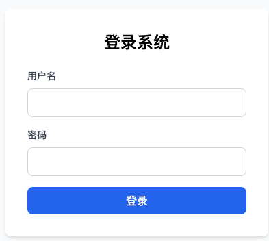

    用户名

    密码

    登陆按钮

    密码错误：你输入的密码错误

  **1.2 登陆后用户头像**

    鼠标悬浮可以展开两个tab：修改密码、登出

  **1.3 修改密码**

  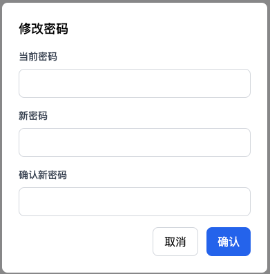

    输入老密码

    输入新密码

    再次输入新密码

    确定修改

    老密码错误：你输入的老密码错误

    再次输入新密码不匹配：你两次输入的新密码不匹配

**2. 菜单栏**

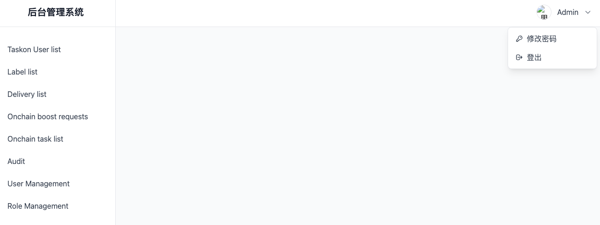

  Taskon User list

  Label list

  Delivery list

  Onchain boost requests

  Action&Collection list

  用二级菜单展示
  - Action List
  - Collection List

  Audit

  User Management

  Role Management

  个人头像

**3. 1/2/3三个tab，见下面文档**

  [运营后台-自定义标签+精准推荐](https://ontology.sg.larksuite.com/wiki/A8oowsocBih03YkZ8sIl3RcIgGS)

**4. 4/5两个tab，见下面文档**

**5. Audit**

  **审批类别**

    ~~B端 Onchain boost request~~
    - ~~Accept~~
    - ~~Reject~~
    - ~~Edit~~
    - ~~Refund~~

    ~~Onchain action~~
    - ~~Publish~~
    - ~~Edit~~
    - ~~End~~

    ~~Delivery~~
    - ~~Publish~~
    - ~~Edit~~
    - ~~Cancel~~

    Contract
    - 高信任：针对Onchain新板块，对安全性要求高
    - 低信任：针对GTC项目方自己配置的，对安全性要求低
    - 未审核

  **页面布局**

    头部是标签切换，每个标签后面跟着一个数字，数字是待审批的数量（只保留合约审核）

    ~~Onchain boost requests（包括接受和拒绝两类，都要审批）~~

    ~~Onchain task~~

    ~~Delivery~~

    Contract：如果包含未审核或低信任合约，在合约变为高信任之前，无法Accept B端Request，也无法Publish相关task

    下面就是每个具体的待审批列表

  **5.1 ~~Onchain boost requests~~**

  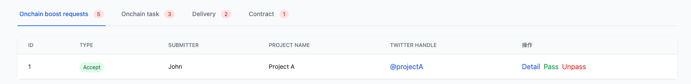

    **~~列表字段~~**

      ~~ID~~

      ~~Type：审批类别，包括Accept、Reject、Edit、Refund~~

      ~~Submitter：提交者name（指的是提交审批的运营人员）~~

      ~~Project name：这是在我们这边注册B端的Project name~~

      ~~Twitter handle：点击可以跳转推特~~

      ~~操作按钮~~
      - ~~Detail：查看Request详情页，打开一个新页面~~
      - ~~Pass：审批通过~~
      - ~~Unpass：审批不通过，状态变更为Unpass~~

  **5.2 ~~Onchain task~~**

  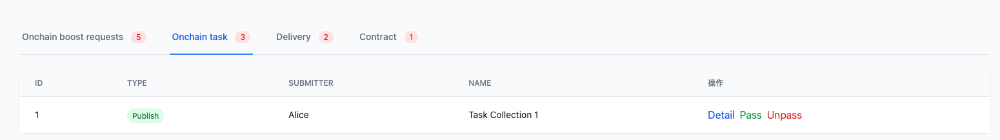

    **~~列表字段~~**

      ~~ID~~

      ~~Type：审批类别，包括Publish、Edit、End~~

      ~~Submitter：创建者name~~

      ~~Name：配置的Task name或者Task Collection name~~

      ~~操作按钮~~
      - ~~Detail：查看Onchain Task详情页，打开一个新页面~~
      - ~~Pass：审批通过~~
      - ~~Unpass：审批不通过，状态变更为Unpass~~

  **5.3 ~~Delivery~~**

  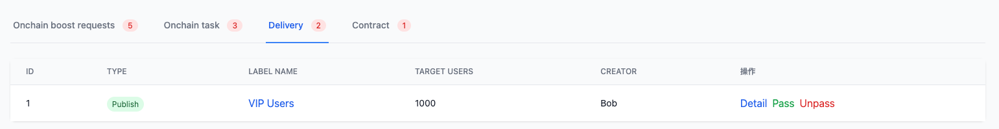

    **列表字段**

      ID

      Type：审批类别，包括Publish、Edit、Cancel

      Label name：可以点击，点击弹窗，展示Label的规则

      Target users：目标用户人数

      Creator：创建者name

      操作按钮
      - Detail：查看Delivery详情页，打开一个新页面
      - Pass：审批通过
      - Unpass：审批不通过，状态变更为Unpass

  **5.4 Contract**

  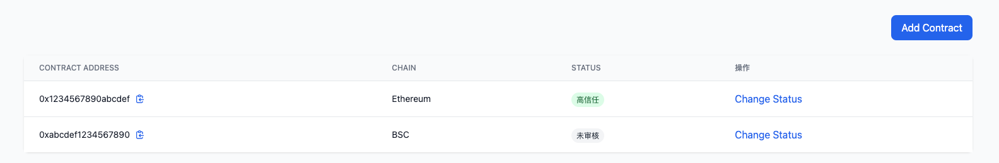

    **顶部区域**

      最右边有一个按钮：Add contract

    **列表字段**

      Contract Address：合约地址，可以复制

      Chain：合约所在的链

      Status：三个状态，高信任、低信任、未审核

      操作按钮
      - Change Status，点击弹窗，可以编辑状态

    **点击Add按钮**

      弹窗，需要填写如下字段：

      Contract address

      Chain：下拉列表，展示我们目前支持的所有链

      Status：下拉列表，包括：高信任、低信任，默认不选中，必填字段

      Confirm按钮：点击则直接添加该Contract

      Cancel按钮

**6. User Management**

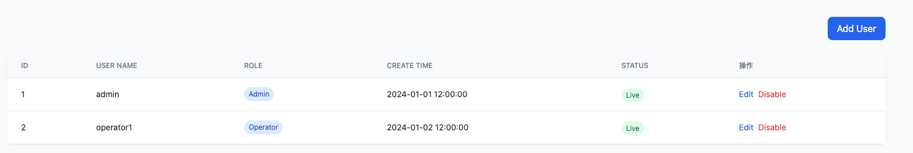

  **页面布局**

    顶部有一个按钮：Add User

    点击弹窗，弹窗需要填写字段：
    - User name
    - Password
    - Role：下拉列表，选择角色

    > 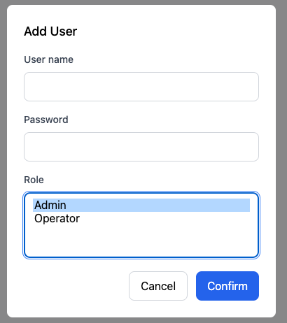

    下面是列表

  **数据字段**

    ID

    User name

    Role：是一个列表，展示用户所有的role

    Create time

    按钮：Edit
    - 点击弹窗，编辑字段：
      - User name
      - Password
      - Role：下拉列表，选择角色
    - 管理员Role的用户，无法被Edit

    按钮：两个状态切换
    - 对于Live的user，按钮为Disable，点击会禁用该用户
    - 管理员Role的用户，无法被禁用
    - 对于禁用的user，按钮为Release，点击会解除禁用

    禁用的用户无法登陆，没有任何操作权限，但是不会影响他相关的所有数据

**7. Role Management**

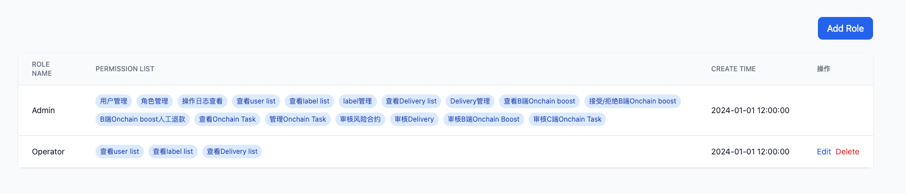

  **页面布局**

    顶部有一个按钮：Add User

    点击弹窗，弹窗需要填写字段：
    - Role name
    - Permission list：所有权限列表，每个前面都有一个复选框可以勾选

    > 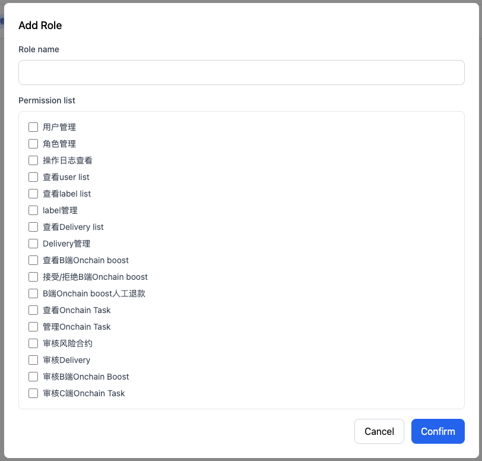

    下面是列表

  **数据字段**

    Role name：默认有管理员和Operator两个角色

    Permission list：权限表，一个列表，写清楚role有哪些权限

    Create time

    按钮：Edit（管理员角色不能edit）
    - 点击弹窗，可编辑字段：
      - Role name
      - Permission list：所有权限列表，每个前面都有一个复选框可以勾选

    > 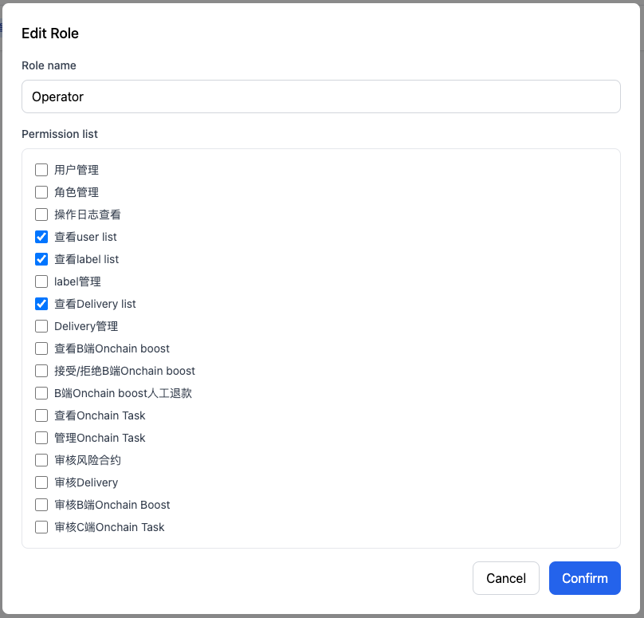

    按钮：Delete（管理员角色不能delete）
    - Delete需要校验该Role是否还绑定用户，如果有绑定则提示：还有用户属于该角色，请先变更用户角色，再删除Role

  **权限配置表**

    一共有12个权限字段，每一个前面都有一个复选框可以勾选
    - 用户管理：包括创建用户、禁用用户、编辑用户
    - 角色管理
    - 操作日志查看
    - user list运营（这个是taskon用户，不是后台用户）
    - label运营：查看Label列表，创建label、编辑label、删除label
    - Delivery运营：查看delivery列表，create，填写内容，保存草稿，Delete草稿
    - Delivery管理：Publish，Edit，Cancel
    - B端Request运营：看所有信息
    - B端Request管理：Accept、Reject、编辑、退款
    - Onchain Action运营：查看Onchain task列表，create，填写内容，保存草稿，Delete草稿
    - Onchain Action管理：Publish，Edit已发布Action，End
    - 审核风险合约

    运营角色权限：
    - User list运营
    - label运营
    - Delivery运营
    - B端Request运营
    - Onchain Action运营
