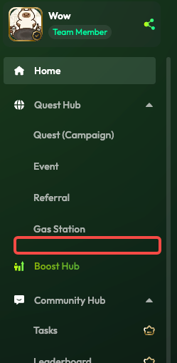

**任意Swap任务**

<table border="1" width="100%" cellspacing="0" cellpadding="5">
  <thead>
    <tr>
      <th align="left" width="20%">链</th>
      <th align="left" width="80%">地址</th>
    </tr>
  </thead>
  <tbody>
    <tr>
      <td>EVM</td>
      <td></td>
    </tr>
    <tr>
      <td>Berachain(EVM)</td>
      <td></td>
    </tr>
    <tr>
      <td>Sonic(EVM)</td>
      <td></td>
    </tr>
    <tr>
      <td>Solana</td>
      <td></td>
    </tr>
    <tr>
      <td>SUI</td>
      <td>0xae3be08f06ce1f4cdb34fae801fb1d7e788b28239abc88bc08c1fb0ba021d34f</td>
    </tr>
    <tr>
      <td>TON</td>
      <td>UQBBLBTfBfzv3ZVWCPfusOgTSdfx3myGSYJbxam2qxYwZJlw</td>
    </tr>
    <tr>
      <td>Aptos</td>
      <td>0x1d356e92d575d571d7dbc413dd2b69e83d260382cdd7d1d4b00d8298bb82422b</td>
    </tr>
  </tbody>
</table>

**B端UI**

**新增任务模板**

任务名为Swap Token

基础字段和Swap一致

新增字段

Swap Through Specified DEX

默认关闭

开启后出现下拉选项

列表为对应的链下OO已经支持的DEX列表

排序按字母或者知名度（如果OO有类似的排序直接用）

**\*确认B端能输入的币对组合是否OO一定能交易**

任务需要能在Quest、GTC、Tutorial中使用

**C端展示**

任务名

如果B端指定了DEX

展示和现有Swap一致

如果B端没有指定DEX

Quest和GTC Task中任务名最后的 on \[DEX\] 移除

Quest中的Swap文案增加下划线，点击打开通用Swap组件

