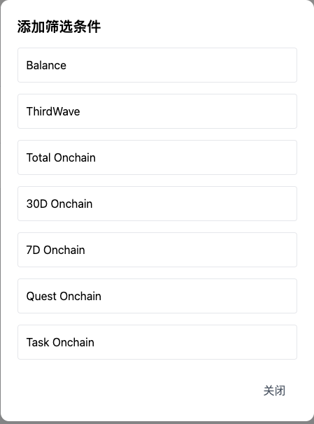

**c端精准推荐**

**演示效果**

{width="5.75in"
height="2.90625in"}

**出现逻辑**

当用户的可见广告数量大于等于1的时候才展示该模块

**可见广告定义:**

+:--------------+:-----------------------------------------------------+
| **广          | **可见逻辑**                                         |
| 告内容类型**  |                                                      |
+---------------+------------------------------------------------------+
| Action - 单   | 满足以下所有条件:                                    |
| action        |                                                      |
|               | Action 处于 ongoing 状态                             |
|               |                                                      |
|               | 非隐藏                                               |
|               |                                                      |
|               | 用户未领取奖励                                       |
|               |                                                      |
|               | 当前时间处于广告设置的开始时间和结束时间范围内       |
|               |                                                      |
|               | 用户符合广告投放设置的命中用户群                     |
+---------------+------------------------------------------------------+
| Action -      | 满足以下所有条件:                                    |
| collection    |                                                      |
|               | Collection 中起码有1个 action 处于 ongoing 状态      |
|               |                                                      |
|               | 非隐藏                                               |
|               |                                                      |
|               | 用户未领取完所有 action 的奖励                       |
|               |                                                      |
|               | 当前时间处于广告设置的开始时间和结束时间范围内       |
|               |                                                      |
|               | 用户符合广告投放设置的命中用户群                     |
+---------------+------------------------------------------------------+
| Custom        | 满足以下所有条件:                                    |
|               |                                                      |
|               | 当前时间处于广告设置的开始时间和结束时间范围内       |
|               |                                                      |
|               | 用户符合广告投放设置的命中用户群                     |
+---------------+------------------------------------------------------+

出现页面:

Home (https://taskon.xyz/home)

Quest 列表页

Quest 详情页

Asset 页(https://taskon.xyz/user/assets)

~~Alpha (https://taskon.xyz/alpha/home)~~

其他逻辑:

需要定时刷新机制, 确保用户不能看见不可见的广告

**交互样式**

**展开样式**

**一、Action 类型广告样式**

{width="5.75in"
height="2.21875in"}

显示元素:

Action/Action Collection标题

Action/Action Collection 总共奖励 token 的等值美元价值

其他奖励的显示, 展示顺序 (badge\>gold xp \>xp)

Action button

1/3 这个组件仅当用户的可见广告数量是1个以上时才显示:

1 是当前查看的第几个广告

3 是指用户总共可见的广告数

有多个可见广告的情况下, 广告 ongoing 生效时间靠后的顺序往前放,
也就是越晚推的顺序越靠前

**二、Custom 类型广告样式**

{width="5.75in"
height="2.4375in"}

**交互逻辑:**

针对 Custom 样式的广告, 点击图片按钮, 打开新页面跳转

针 对Action 样式的广告, 点击Action上的 action 按钮, 打开新页面跳转

如果有多个广告的情况下, 每隔5秒轮播,
用户也可以通过底部的导航组件进行切换, 支持循环切换

点击左侧的卡通人物后, 进入收起样式

**收起样式**

{width="2.6666666666666665in"
height="3.09375in"}

当新增可见广告，且用户未点击玩偶查看时，显示\"NEW\"提示。

交互逻辑:

点击该玩偶, 使用抽屉的展开样式

**展开/收起逻辑**

当且仅当同时满足以下所有条件时，用户进入
Home（[[https://taskon.xyz/home](https://taskon.xyz/home%EF%BC%89%E3%80%81Quest))]{.underline}
Quest 列表页或 Asset 页会默认展开该模块：

用户未在当前的可见广告下点击过\"收起\"按钮
（当可见广告有新增时，无论用户是否收起过该模块，都视为满足此条件）

特殊情形： 当存在 epic 时，用户访问 Home 和 Quest
列表页将始终不展开该模块（无论是否满足上述条件）
