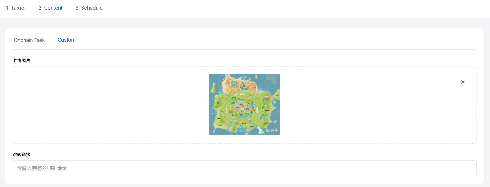
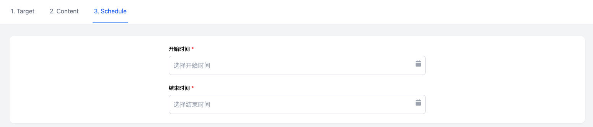

**运营后台-自定义标签+精准推荐**

**需求背景**

为了实现运营更精准和个性化的实现C端增长，需要给运营实现一套自定义用户标签和精准推荐的系统。

**功能清单**

用户特征值表

自定义标签系统

精准推荐系统

**功能详情**

1\. **用户特征值表**

技术需要按照下表中的要求，定期跑数据，同步到一张用户特征宽表中，后续的运营数据查询，都通过直接查询这张宽表来实现。

该宽表只用于内部的数据分析和运营推荐体系。

| 分类        | 字段                               | 说明                               | 类型                 | 更新频率 | 保存期限 |
| ----------- | ---------------------------------- | ---------------------------------- | -------------------- | -------- | -------- |
| 基本字段    | User ID                            |                                    |                      |          |          |
|             | Last Active                        | 用户最后一次活跃的时间             | 时间戳               |          |          |
| POH信息     | POH                                | bool值                             | bool                 |          | 永久     |
|             | ZKMe NFT                           | bool                               | bool                 | 实时     | 永久     |
|             | Binance BABT                       | bool值，是否有                     | bool                 | 实时     | 永久     |
|             | Galxe passport                     | bool值，是否有                     | bool                 | 实时     | 永久     |
|             | Binance KYC                        | bool值，是否有                     | bool                 | 实时     | 12个月   |
|             | OKX KYC                            | bool值，是否有                     | bool                 | 实时     | 12个月   |
|             | Coinbase KYC                       | bool值，是否有                     | bool                 | 实时     | 12个月   |
|             | Bybit KYC                          | bool值，是否有                     | bool                 | 实时     | 12个月   |
|             | Gate KYC                           | bool值，是否有                     | bool                 | 实时     | 12个月   |
|             | Kucoin KYC                         | bool值，是否有                     | bool                 | 实时     | 12个月   |
| 链上数据EVM | 首次活动时间                       | 钱包首次活动时间                   | 时间戳               | 每日     | 3个月    |
|             | 总交易笔数                         | 排除received transaction的交易笔数 | int                  | 每日     | 3个月    |
|             | balance                            | 钱包余额(USD)                      | Float (USD)          | 每日     | 3个月    |
|             | ERC20 Token Holdings               | ERC20 tokens列表                   | Object Array         | 每日     | 3个月    |
|             | Native Token Holdings              | 原生代币列表                       | Object Array         | 每日     | 3个月    |
|             | 总交易价值                         | 钱包所有交易的总金额价值（USD）    | Float (USD)          | 每日     | 3个月    |
|             | Thirdwave's钱包评分                | 第三方钱包评分，0-100              | Integer              | 每日     | 3个月    |
|             | NFTHolder评分                      | NFT持有倾向性评分，0-100           | Integer              | 每日     | 3个月    |
|             | 钱包链上参与度评分                 | 链上活跃度评分，0-100              | Integer              | 每日     | 3个月    |
|             | botWarning                         | 机器人预警                         | Boolean (true/false) | 每日     | 3个月    |
|             | transactionPatterns.HIGH_VELOCITY  | 操作频率指标，识别机器人           | Boolean              | 每日     | 3个月    |
|             | transactionPatterns.TIMED          | 定时任务指标                       | Boolean              | 每日     | 3个月    |
|             | transactionPatterns.CONTINUOUS     | 操作连续性指标                     | Boolean              | 每日     | 3个月    |
|             | transactionPatterns.FUNDINGNETWORK | 可疑资金指标                       | Boolean              | 每日     | 3个月    |
|             | associatedWallets                  | 关联钱包列表                       | Object Array         | 每日     | 3个月    |
|             | active_chains                      | 持有代币的网络列表                 | JSON Object          | 每日     | 3个月    |
| Onchain行为 | 完成过Onchain action-Total         | 完成过1个onchain quest或task算1个  | int                  | 每日     | 永久     |
|             | 完成过Onchain action-30D           | 30天内完成的数量                   | int                  | 每日     | 永久     |
|             | 完成过Onchain action-7D            |                                    | int                  | 每日     | 永久     |
|             | 完成过Onchain quest-Total          | 只计算Quest数量                    | int                  | 每日     | 永久     |
|             | 完成过Onchain task-Total           | 只计算Community task数量           | int                  | 每日     | 永久     |

2\. **自定义标签系统**

自定义标签系统是基于用户特征宽表，可以由运营添加个性化筛选条件。

**进入条件**

左侧菜单栏，增加User和Label

**工作流程**

填写筛选条件

筛选出用户列表和用户总人数

如果满意，可以保存为标签

2.1 **User List**

**页面布局（新增了两个字段，下面标黄了）**

{width="5.75in"
height="2.5833333333333335in"}

顶部是筛选区域，默认展开：User ID，POH，Create Time，Last Active

有三个按钮

Search：点击执行搜索操作

Add
Filter：点击后可以从弹窗展示非常驻筛选项，选择增加一个筛选项，选择后这个条件就会出现在页面上

具体非常驻筛选项内容，见下文的非常驻筛选项部分，比弹窗截图里的多几个

> {width="4.677083333333333in"
> height="6.3125in"}

Save as Label：点击弹窗，运营填写标签名称，点击保存就可以保存为一个Label

重复性校验

如果有筛选项完全一致的标签，则保存的时候报错提示

Repeatable label: xxxxx（这里展示重复的那个Label name）

如果Label name已存在，报错

Label name is already used

> {width="4.822916666666667in"
> height="2.40625in"}

下面是列表区，50个用户一页，分页展示，默认按照Last Active时间倒序

**数据字段**

User ID

POH: true or false, 可以点击查看POH明细

Create Time：注册时间

Last Active: 最后活跃时间

XP：积分数量

Gold XP：黄金积分数量

Balance：钱包余额，点击可以查看所有钱包数据字段

ThirdWave：ThirdWave钱包评分

Total_Onchain：完成过Onchain action-Total

30D_Onchain：完成过Onchain action-30D

7D_Onchain：完成过Onchain action-7D

Quest_Onchain：完成过Onchain quest-Total

Task_Onchain：完成过Onchain task-Total

Detail：按钮，点击可以查看用户详情

**筛选项**

User ID

POH：下拉选项（All、True、False）

Create time：时间段筛选，包括开始时间和结束时间，可以不填

Last Active：时间筛选，包括开始时间和结束时间，可以不填

**非常驻筛选项**

XP：大于/等于/大于等于/小于/小于等于一个数值（支持五种数值操作符号，以下都支持这五种）

Gold XP：大于/等于一个数值

Balance：大于/等于/大于等于/小于/小于等于一个数值（支持五种数值操作符号，以下都支持这五种）

Total Txn：大于/等于一个数值

Total Volume: 大于/等于一个数值

ThirdWave：大于/等于一个数值

Total_Onchain：大于/等于一个数值

30D_Onchain：大于/等于一个数值

7D_Onchain：大于/等于一个数值

Quest_Onchain：大于/等于一个数值

Task_Onchain：大于/等于一个数值

2.2 **Label List**

{width="5.75in"
height="3.0520833333333335in"}

**数据字段**

Label name

Creator：创建者的ID

Create Time

User
Number：符合这个Label的用户数，这里可能存在性能问题，注意一下，一个可选做法是加个刷新按钮

Edit：按钮，点击展开弹窗，可以编辑Label name，也可以编辑所有的筛选项

Go to User List：按钮，带着该Label的筛选参数，跳转User List页面

3\. **精准投放系统**

精准投放系统让运营可以针对符合某个Label的用户群体，精准推荐某个内容。

**进入条件**

左侧菜单栏，增加Delivery

**工作流**

运营新建一个Delivery任务

选择一个Label，自动刷新该Label的用户数量

选择要推送的内容，可以推荐Onchain Task和自定义内容

填写投放有效期，在开始时间触发Delivery展示，在有效期结束时间后Delivery不在展示

运营填写完信息，点击Save as draft

管理员点击Publish，直接生效，根据开始时间变更为Upcoming或者Ongoing

~~管理员审核通过，才会进入Upcoming或Ongoing状态~~

~~审批拒绝，进入Unpass状态，Unpass类似Draft~~

C端用户只能看到状态为Ongoing的投放推送，其他状态都看不到

**页面布局**

{width="5.75in"
height="1.53125in"}

标题是Delivery，有一个按钮Create

筛选项Status，是一个下拉选项，包括：All、Draft、~~Pending、Unpass、~~Upcoming、Ongoing、Ended、Expired、Canceled

这里要注意Ended，指的是Onchain
task已经达到了完成人数上限，后续不能参加，会自动把Delivery设置成Ended

Expired，指的是超过了结束时间

Publish之后，才可以Cancel

~~Publish、Edit、Cancel三个操作都需要审批，在审批之前会停留在pending对应的状态~~

~~Pending依然可以编辑~~

~~Publish之后，Edit才需要审批，Draft状态不需要~~

~~Edit如果审批拒绝，会自动回滚编辑内容~~

~~Edit只保存两个版本，一个是Release版本，一个是待审批版本，在pending期间任意Edit都会修改待审批版本，但不会影响Release版本，C端可见的是Release版本~~

下面是列表，展示所有的Delivery

**数据字段**

ID

Label：Label name

Create Time

Creator：创建者

Period：有效期，开始时间和结束时间

Target User：目标用户数量

View User：看到的用户数量（技术实现考虑埋点）

Click User：点击过的用户数量（每个用户只算一次）

Complete user：完成Task的用户数量（每个用户只算一次，只统计投放Onchain
task的完成情况）

Content：投放的内容链接（如果投放Onchain
task，就是task的链接；如果是自定义内容，就是带上的跳转url）

Edit：点击跳转进入编辑，页面与Create流程一致，所有字段都可以编辑

Duplicate：复制一个内容完全一致的草稿

Cancel：点击后取消该投放，按钮变成Canceled不可点击

3.1 **Create流程-Step 1-选择Target**

**页面布局**

{width="5.75in"
height="1.8333333333333333in"}

顶部有三步骤的导航（Target、Content、Schedule），导航可以自由切换

底部常驻着两个按钮：Save as draft（点击会保存为draft）、Next

中间是一个下拉列表，可以选择Label（有搜索框，可以模糊搜索Label
name），选中Label后，展示该Label的筛选项和目标用户数

3.2 **Create流程-Step 2-Content**

**页面布局**

顶部有三步骤的导航（Target、Content、Schedule），导航可以自由切换

底部常驻着三个按钮：Back（点击回到上一步）、Save as
draft（点击会保存为draft）、Next

中间是两个tab：~~Onchain Task~~ Action和Custom

默认选择 Action

> {width="5.75in"
> height="1.4375in"}

列表展示所有Ongoing的Action 和 action collection. 如果是 action
的话字段包括：action name、action type; 如果是 action collection 的话,
字段包括：collection name(name 加个前缀 Collection, 如 Collection: USDT
holding challenge), related action(展示 collection 下的所有 action time,
用逗号隔开)

只能单选

选择后才能点击next

如果选择了Custom tab

> {width="5.75in"
> height="2.1979166666666665in"}

需要上传一张图片

需要填写一个url链接

3.3 **Create流程-Step 3-Schedule**

**页面布局**

{width="5.75in"
height="1.2291666666666667in"}

顶部有三步骤的导航（Target、Content、Schedule），导航可以自由切换

底部常驻着三个按钮：Back（点击回到上一步）、Save as
draft（点击会保存为draft）、Publish（点击会直接发布，进入upcoming或ongoing状态）

中间是Schedule，Start Time和End Time，都是必填项

**交互逻辑**

点击Publish，需要校验所有字段都填写了并且合法，如果有字段有问题，就跳到第一个有问题字段的位置，并标红；
