# 热力图+可交互Tutorial需求文档

## 一、产品概述

### 1. 产品背景

在TaskOn平台上实现热力图功能和可交互的Tutorial系统，帮助用户更直观地了解热门项目并通过交互式教程参与项目活动。该功能将优化用户体验，提高用户参与度，同时搭建完整的运营激励体系，通过宝箱和NFT集合的玩法，进一步提升用户的参与积极性。

### 2. 产品愿景

通过热力图直观展示热门项目，通过可交互教程引导用户完成项目任务，提升用户参与度和留存率，同时为项目方提供更好的用户引导工具。借助运营体系，通过任务完成后获得宝箱、开宝箱获得NFT、集齐NFT获取奖励的流程，形成完整的激励闭环。

### 3. 用户故事

- 作为一个普通用户，我希望能在首页直观地看到热门项目，以便我快速了解最新的区块链项目动态
- 作为一个普通用户，我希望能通过交互式教程，一步步完成项目任务，以便我更容易参与项目活动
- 作为一个普通用户，我希望完成任务后能获得奖励，增加我参与的动力
- 作为一个项目方，我希望能提供交互式教程，以便更好地引导用户参与我的项目

## 二、业务流程

### 1. 全局业务流程图


### 2. 关键子流程图

#### C端用户流程

1. 在Home页看到热力图，有交互的项目会有高亮和标签
2. 用户点击有交互的项目，直接进入项目详情页，并定位在Tutorial板块
3. 用户查看项目信息和攻略，所有可执行的交互动作都有类似task的跳转链接和验证机制
4. 用户执行某一个action，该task勾选变成已完成状态
5. 完成task后获得宝箱，用户可以开启宝箱获得NFT
6. 用户集齐特定NFT组合后，可以在规定时间内claim奖励


#### 平台工作流程

1. 从三方网站抓取到Project的Tutorial
2. 放入Tutorial自动分析流程，分析如何处理
   - 分支一，Quest类Tutorial，进入Task自动抓取流程
   - 分支二，其他类型Tutorial，进入人工处理流程
3. 分支一：执行Task自动抓取流程
   - 去Quest网站上把task抓取下来
   - 与我们的task模板匹配
   - 相同task去重
   - 进入自动生成可交互Tutorial流程
4. 自动生成可交互Tutorial流程
   - 自动生成标题
   - 自动生成时间范围
   - 自动生成简介
   - 自动为每一个task配置描述
   - 生成Tutorial并关联到Project
   - 针对有Community的情况，生成Tutorial引导用户参与Community
5. 分支二：人工处理流程
   - 热点项目优先处理
   - 非热点项目次要处理
   - 没有教程的项目，可以手动添加一个教程

#### 运营激励流程

1. 后台设置当前有效NFT列表和概率
2. 后台设置下一次开奖时间、奖励金额和奖励梯度
3. 后台可以配置不同任务，获得不同数量的宝箱
4. 用户完成任务获得宝箱，开启宝箱获得NFT
5. 用户集齐指定NFT，在倒计时结束时claim奖励

## 三、功能设计

### 1. 功能地图

**功能清单**

1. 首页增加热力图（P0）- 已完成
2. Alpha Project页面去掉热力图的样式（P0）- 已完成
3. C端Project Detail页+Tutorial板块优化（P0）- 已完成
4. 后台管理系统，查看和编辑Tutorial（P0）- 已完成
5. C端运营活动页面（P1）
6. 后台运营配置页面（P1）
7. Tutorial自动分析系统（P1）
8. Task抓取系统（P1）
9. 可交互Tutorial自动生成系统（P1）
   - Quest类Tutorial
   - Community Tutorial
10. 项目入驻，自动同步task的完成状态到Community（P1）
11. 增加Tutorial数据源，dropstab+galxe（P2）
12. NFT合约开发（P1）

### 2. 功能描述模板

#### 1. 首页增加热力图

**进入条件**：首页

**页面布局**：

- 顶部的位置，去掉Trending Quests上方的内容，替换成Alpha Map的热力图
- 有标签的项目增加高亮展示的样式
- 右上角有more projects按钮

标签展示规则：

- 有community的，标签展示为community
- 没有community，但是有open状态的交互教程的，展示标签为Potential Airdrop（未发币）或者Points Farming（已发币）

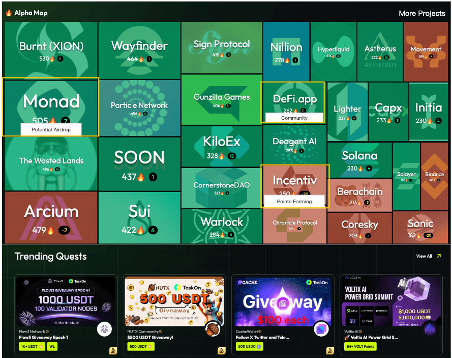

**交互逻辑**：

- 点击有交互项目，进入Project详情页，并定位在Tutorial tab
- 点击无交互项目，进入Project详情页，并定位在Overview tab
- 点击More Projects，进入Alpha Projects列表页

#### 2. Alpha Projects页面优化

**进入条件**：路径保持为：/alpha/home，替换掉之前的页面

**页面布局**：

- 左侧就是之前的/alpha/projects页面
- 右侧把之前/alpha/home页面的右侧三个板块方过来
- 把Track Feeds右边的more按钮加强，文案改为View Feeds

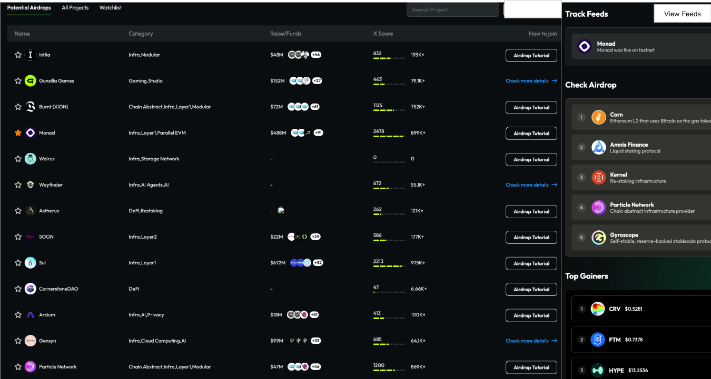

#### 3. C端Project Detail页+Tutorial板块优化

**3.1 Tutorial 板块**

Tutorial Tab 位置调到左边第一位

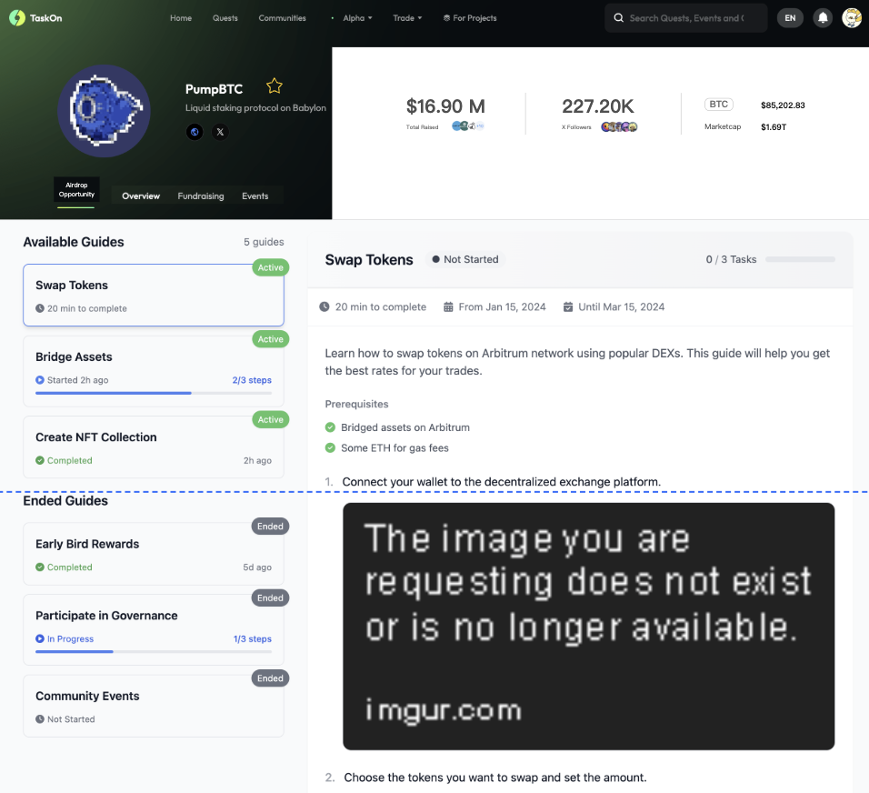

**3.1.1 教程内容区**


**粘性标题栏**


**布局**：

- 显示教程标题和状态标签
- 进度指示器（完成任务数/总任务数）
- 滚动时保持可见

**交互**：

- 随页面滚动始终保持在视图顶部
- 状态标签根据当前教程状态动态变化
- 进度指示器实时反映任务完成情况

**信息栏**


**布局**：

- 估计完成时间
- 活动起止日期
- 非滚动固定位置

**教程内容区**


**布局**：

- 教程描述
- 任务模块（若后端运营工具在教程内有配置任务)

**任务卡片**上要显示以下要素:


- 任务标题
- 任务奖励(本期没有, 后期会加上去, 需要预留位置)
- Action 按钮
- Verify 按钮

**任务弹窗**上要显示以下要素:


- 要将原有显示积分奖励的模块, 替换成 Potenail Airdrop from xxx ; xxx 是项目名称

**交互**：

- 图片支持点击放大查看
- 任务卡片与 Community 的任务卡片交互逻辑保持一致
- 点击 Action 按钮, 跳转到对应的页面或打开任务弹窗
- 点击 Verify 按钮, 校验任务是否完成
- 任务完成后, 任务卡片和任务弹窗需要展示对应的完成样式


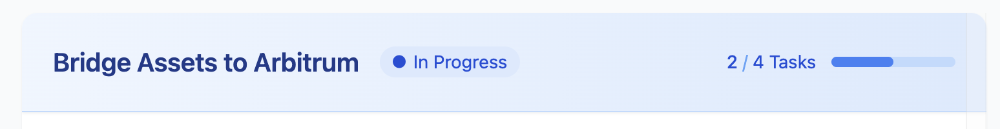

**3.1.2 教程卡片区**

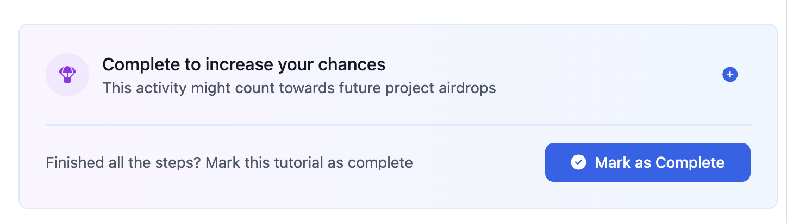

**布局**：

- 教程标题
- 教程状态
- 根据教程的完成状态, 显示不同的辅助信息

**交互**

- 教程卡片点击：点击后滚动至对应教程详情，同时高亮显示选中的卡片
- 进度滚动同步：滚动查看教程时，右侧卡片列表自动同步高亮当前查看的教程

**3.1.3 状态系统**

状态定义表:

| **状态类型**     | **状态值** | **定义**                 | **触发条件**         | **UI表现**     |
| ---------------------- | ---------------- | ------------------------------ | -------------------------- | -------------------- |
| **教程活动状态** | 活跃             | 可参与并获得奖励               | 当前日期在活动范围内       | 正常色彩，功能完整   |
|                        | 已结束           | 不可参与，仅供参考             | 超出结束日期或运营手动设置 | 灰色系，功能受限     |
| **用户完成状态** | 未开始           | 尚未开始任何步骤               | 首次查看教程               | 灰色进度条，时钟图标 |
|                        | 进行中           | 部分完成任务                   | 完成至少一个任务           | 蓝色进度条，播放图标 |
|                        | 已完成           | 完成了教程内指定需要完成的操作 | 用户手动标记完成           | 勾选图标             |

状态组合:

| **组合**  | **主要特点**             |
| --------------- | ------------------------------ |
| 活跃 + 未开始   | 全功能可用，鼓励开始           |
| 活跃 + 进行中   | 突出进度，鼓励继续             |
| 活跃 + 已完成   | 展示完成信息，推荐新教程       |
| 已结束 + 未开始 | 显示已结束通知，内容参考       |
| 已结束 + 进行中 | 保留已完成进度，禁用未完成任务 |
| 已结束 + 已完成 | 显示历史完成信息               |

**3.1.4 活跃教程的UI与交互**

**活跃 + 未开始**

教程详情页:
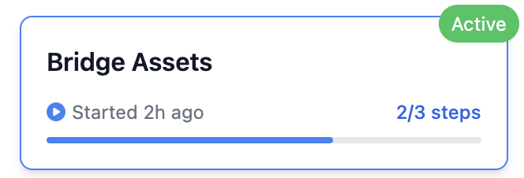

教程卡片:


**活跃 + 进行中**

教程详情页:


在教程详情页的底部提供手动标记完成的按钮:


教程卡片:


**活跃 + 已完成**

教程详情页:


教程卡片:


**3.1.5 已结束教程的UI与交互**

通用结束状态元素:


**已结束 + 未开始**

教程卡片:


**已结束 + 进行中**

教程卡片:


**已结束 + 已完成**

教程卡片:


**3.1.6 数据统计**

需要以教程为维度, 记录以下指标:

| **指标**   | **定义**                   |
| ---------------- | -------------------------------- |
| 教程浏览人数     | 查看过教程的用户数               |
| 教程任务参与人数 | 至少完成过1个任务的用户数        |
| 教程任务完成人数 | 教程下的任务全部都完成了的用户数 |
| 教程完成人数     | 用户标记了教程已完成的用户数     |

**3.2 Project Detail页头部优化**


**布局:**

- 融资模块（融资总额、融资机构）
- 推特模块（推特粉丝、Top Followers）
- 代币模块（Token Symbol、代币价格、代币市值）

**3.3 Overview 优化**


**右侧布局:**

- 原来的 Fund Raising 板块(样式需要重新设计, 强调融资金额)
- X performance 板块(样式需要重新设计, 强调粉丝数)
- 新增 Available Guides 板块

**3.4 Fundraising 优化**


**3.5 去掉 Quest Tab**

移除Quest选项卡

#### 4. 后台管理系统，查看和编辑Tutorial

**准备工作**

- 运营创建一个新的community，并且该community能在C端隐藏，不可见
- 后台编辑Tutorial的板块，只有该community能看到和使用

左侧菜单栏:

- Operation下面有Projects和Tutorials两个菜单
- Projects后面的数字=在热力图上，并且todo>0的项目数（默认选项）


**4.1 Project列表页**

**页面布局**


**Project字段表**

- ID
- Name
- Last Updated
- Tutorials：Open/Hiden/Closed
- Todo/Complete
- Action：操作按钮（View Tutorials、Add Tutorial）

**筛选项**

- ID：精确搜索
- Name：模糊搜索
- Status：下拉选择（All、Have Tutorial、Todo、Hot）

**4.2 Tutorial列表页**

**页面布局**

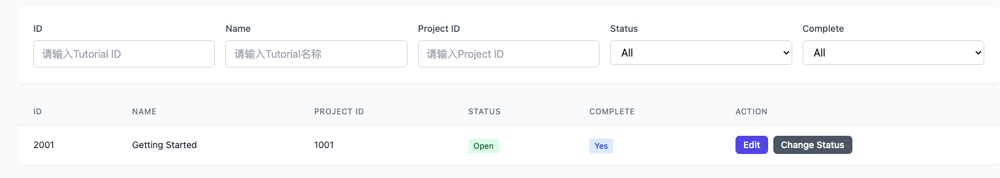

**Tutorial字段表**

- ID
- Name
- 所属Project ID
- Last Updated
- Status：Open/Hiden/Closed
- Complete：Yes/No
- Action：操作按钮（Edit、Change Status、Top）

**筛选项**

- ID：精确搜索
- Name：模糊搜索
- Project ID：精确搜索
- Status：下拉选择（All、Open、Hiden、Closed）
- Complete：下拉选择（All、Complete、Not Complete）

**Change Status弹窗**


**4.3 Tutorial详情页**

**页面布局**

- Tutorial Name
- 时间范围（Optional）
- 正文区域：富文本编辑器
- Add Task按钮


**未保存提醒**


**Add Task侧栏**


#### 5. C端运营活动页面

**进入条件**

- 导航栏新增入口

**页面布局**

- 顶部是一张Banner图
- 奖池区域，展示奖池总金额、第一名奖金、参与人数、倒计时等信息
- 中奖记录滚动区域
- 本周集卡任务区域，展示需要集齐的NFT
- My TaskonBox区域，展示宝箱数量和开启按钮
- Referral区域
- My NFT列表
- My History


#### 6. 后台运营配置页面

**进入条件**

- 后台管理系统，增加一个新tab：Collect2Earn

**页面布局**

- 配置Banner（可选）
- 奖池配置区（奖池的claim时间、奖励梯度等）
- 需要集齐的NFT列表
- NFT管理区


**NFT管理功能**

- Total count：所有NFT抽取频次的总和
- 每个NFT有自己的抽取频次，频次是运营设置的数值（默认为0）
- NFT的抽取概率=NFT抽取频次/Total count
- NFT按照三类不同的稀有度分开展示

## 四、业务规则

### 1. 业务规则概述

1. 教程可见性规则：

   - Open状态的教程在C端可见
   - Hidden状态的教程在C端不可见
   - Closed状态的教程在C端显示为已结束
2. 教程完成状态规则：

   - 用户可手动标记教程为完成状态
   - 如果教程中有任务，建议用户先完成所有任务再标记完成
3. 热力图项目显示规则：

   - 有Community的项目标签显示为"Community"
   - 无Community但有开放状态交互教程的未发币项目显示为"Potential Airdrop"
   - 无Community但有开放状态交互教程的已发币项目显示为"Points Farming"
4. 任务奖励规则：

   - 每完成一个task，可以获得1个宝箱（可配置）
   - 开启宝箱可以获得不同稀有度的NFT
   - 集齐指定NFT可以在倒计时结束后claim奖励
5. NFT获取规则：

   - NFT按不同稀有度分类
   - 每个NFT的获取概率可在后台配置
   - 用户开箱次数受POH分数限制，每周有固定的开箱上限

### 2. 业务规则列表模板

| **规则ID** | **规则名称** | **规则描述**                      | **适用范围** | **例外情况**             |
| ---------------- | ------------------ | --------------------------------------- | ------------------ | ------------------------------ |
| R001             | 教程可见性规则     | 决定教程在C端的显示状态                 | 所有教程           | 无                             |
| R002             | 教程完成状态规则   | 决定用户如何完成教程                    | 所有教程           | 无                             |
| R003             | 热力图项目显示规则 | 决定项目在热力图上的标签显示            | 所有项目           | 无                             |
| R004             | 教程优先级规则     | Top状态的教程显示在项目教程列表的最前面 | 所有教程           | 无                             |
| R005             | 教程自动分析规则   | 决定如何处理抓取的教程                  | 所有抓取的教程     | 无                             |
| R006             | 宝箱获取规则       | 每完成一个task获得一个宝箱              | 所有任务           | 运营可配置特殊任务获得多个宝箱 |
| R007             | NFT抽取规则        | 根据后台设置的权重决定NFT抽取概率       | 所有NFT            | 无                             |
| R008             | 开箱限制规则       | 根据用户POH分数决定每周开箱上限         | 所有用户           | 无                             |
| R009             | 奖励发放规则       | 集齐指定NFT的用户可按梯度获得奖励       | 所有参与用户       | 无                             |

## 五、数据需求

### 数据流说明

1. **教程数据**

   - 教程基本信息：标题、描述、时间范围、状态
   - 教程内容：富文本内容、嵌入任务
   - 教程统计数据：浏览人数、任务参与人数、任务完成人数、教程完成人数
2. **任务数据**

   - 任务基本信息：标题、描述、操作类型
   - 任务执行数据：完成状态、完成时间
   - 任务统计数据：参与人数、完成人数
3. **项目数据**

   - 项目基本信息：名称、描述、类型
   - 项目关联数据：教程列表、社区信息
   - 项目统计数据：热度、参与人数
4. **用户行为数据**

   - 浏览行为：浏览时间、浏览页面
   - 交互行为：完成任务、标记教程完成
   - 转化数据：从热力图点击到教程完成的转化率
5. **激励系统数据**

   - 宝箱数据：用户拥有宝箱数量、开启记录
   - NFT数据：NFT种类、稀有度、获取时间
   - 奖励数据：开奖时间、奖励金额、获奖记录

## 六、Project、Community、Tutorial和Task之间的关系解析

### 1. 实体关系概述

TaskOn平台的核心实体包括Project、Community、Tutorial和Task，它们之间形成了一套完整的层级关系和功能体系：

| **实体** | **定义**             | **上级关系**  | **下级关系**  | **主要属性**         |
| -------------- | -------------------------- | ------------------- | ------------------- | -------------------------- |
| Project        | 区块链项目，是最顶层实体   | 无                  | Community、Tutorial | 名称、描述、类型、热度     |
| Community      | 项目的社区，用户参与的空间 | Project             | Task                | 名称、成员数、可见性       |
| Tutorial       | 项目的教程，引导用户参与   | Project             | Task                | 标题、状态、完成状态、时间 |
| Task           | 具体的用户任务             | Community、Tutorial | 无                  | 标题、操作类型、完成状态   |

### 2. 详细关系说明

#### Project与Community的关系

- 一个Project可以关联一个Community（非必须）
- 有Community的Project在热力图上标签显示为"Community"
- Community是用户参与项目的社交空间
- Community在C端可能可见或隐藏，取决于配置

#### Project与Tutorial的关系

- 一个Project可以有多个Tutorial
- Tutorial是用户了解和参与Project的指南
- Tutorial可以是自动生成的，也可以是人工创建的
- Tutorial有三种状态：Open（开放）、Hidden（隐藏）、Closed（已结束）

#### Community与Task的关系

- Community包含多个Task
- 用户完成Community中的Task可以获得积分或其他奖励
- Task的完成状态可以在Community中展示

#### Tutorial与Task的关系

- Tutorial中可以嵌入多个Task
- Tutorial中的Task可能与Community中的Task相同，如果动作和参数一致
- 用户完成Tutorial中的Task会影响Tutorial的进度
- 完成Tutorial中的Task可以获得宝箱奖励

#### Task的特殊性

- Task可以同时存在于Community和Tutorial中
- 如果Task的动作和参数完全一致，则使用相同的Task ID
- 用户在一处完成Task，在其他地方看到同一Task也会显示为已完成
- Task通常包含Action（操作）和Verify（验证）两个主要步骤

### 3. 数据流转关系

1. **教程自动生成流程中的关系**

   - 从第三方网站抓取Project的Tutorial
   - 分析并抓取相关Task
   - 将Task与TaskOn平台的模板匹配
   - 生成Tutorial并关联到Project
   - 如果Project有Community，生成引导用户参与Community的内容
2. **用户参与流程中的关系**

   - 用户通过热力图点击Project
   - 进入Project详情页的Tutorial板块
   - 完成Tutorial中的Task
   - 获得宝箱，开启获得NFT
   - 可能被引导加入Project的Community
   - 在Community中继续完成更多Task
3. **后台管理流程中的关系**

   - 运营创建隐藏的Community用于管理Tutorial
   - 通过该Community编辑Project关联的Tutorial
   - 在Tutorial中添加Task，可能来自已有Community
   - 设置Task完成后获得的宝箱数量

### 4. 关系图示

```
Project
├── 基本信息（名称、描述、类型）
├── Community（可选）
│   └── Task集合
└── Tutorial集合
    ├── Tutorial 1
    │   └── Task集合（可能与Community中的Task共用ID）
    ├── Tutorial 2
    └── Tutorial 3
```

在这个体系中，Project是核心实体，Community和Tutorial是附属于Project的两种不同类型的用户参与渠道，而Task则是用户实际执行的具体操作单元，可以存在于Community和Tutorial中，形成完整的用户参与生态系统。

## 七、需求澄清事项

在需求文档的实施过程中，以下几点需要进一步明确和澄清：

### 1. 热力图相关

- 热力图的具体显示算法和数据来源尚未详细说明
- 热力图中项目高亮和标签的具体触发条件需要量化标准
- 热力图的更新频率和数据实时性要求未明确
- 未指明用户可以在热力图上同时看到多少个项目的上限

### 2. Tutorial系统相关

- Tutorial自动分析系统的具体工作机制和判断标准不够明确
- Task自动抓取系统的技术实现方案和抓取失败的处理流程未详细说明
- Tutorial内容渲染的具体技术实现未明确（如富文本编辑器的具体选型）
- 未明确定义什么样的Task才被视为"相同"以便复用Task ID

### 3. 运营体系相关

- 宝箱数量与Task复杂度的对应关系未建立明确标准
- NFT稀有度的具体分级和各级别的抽取概率范围未明确
- 用户POH分数与开箱上限的具体对应关系未明确
- 奖励梯度的具体设计（如何分配奖池总额到不同名次）未详细描述
- 未明确说明集齐指定NFT后如何验证NFT的真实性

### 4. 后台管理相关

- 运营创建的隐藏Community的具体权限设置和安全控制未详细说明
- Tutorial编辑器的具体功能限制和内容审核流程未明确
- 未说明如何处理已发布Tutorial的内容修改对已完成用户的影响
- Add Task组件的任务模板管理和更新机制未明确

### 5. 用户体验相关

- 未详细说明Tutorial完成状态在多端同步的延迟要求
- 未明确定义"手动标记完成"的业务规则（是否有最低完成Task数量要求）
- 教程内容区域中图片的大小、格式限制未明确规定
- 未详细说明用户在完成部分Task后离开，再返回时的状态保持机制

### 6. 技术实现相关

- NFT合约的具体技术规范和安全审计要求未明确
- 链上Task的验证机制和防作弊策略未详细说明

### 7. 数据需求相关

- 缺少明确的数据归档和清理策略（如历史奖励数据保存时长）
- 缺少关键数据指标的具体计算公式（如项目热度如何计算）
- 未详细说明数据分析和报表需求

## 八、流程图与状态流转

以下流程图和状态流转图使用Mermaid语法描述，可以直观地展示系统的业务流程和状态变化。

### 1. 核心业务流程图

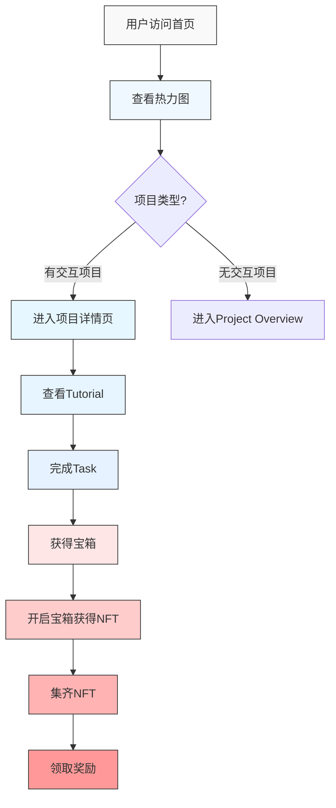

### 2. 教程状态流转图

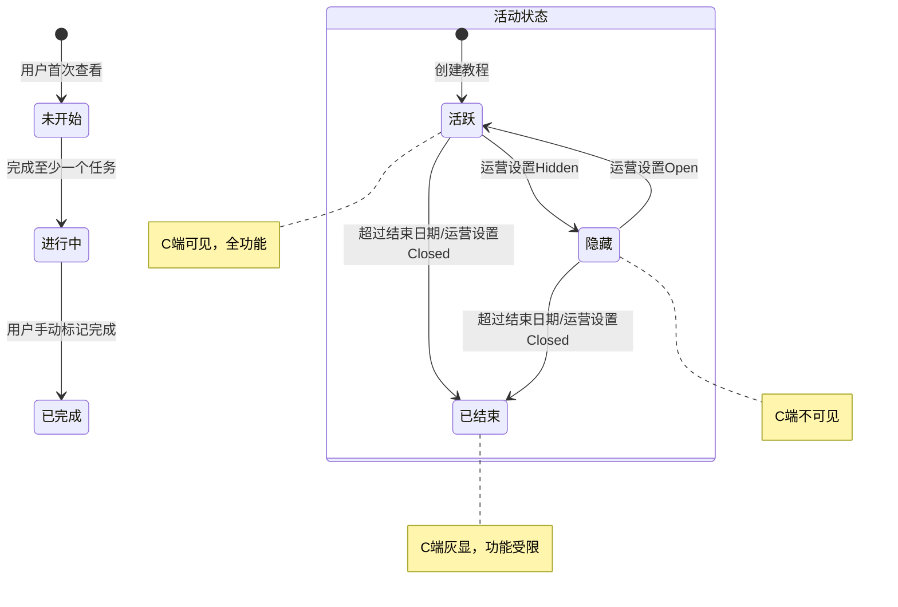

### 3. 任务状态流转图

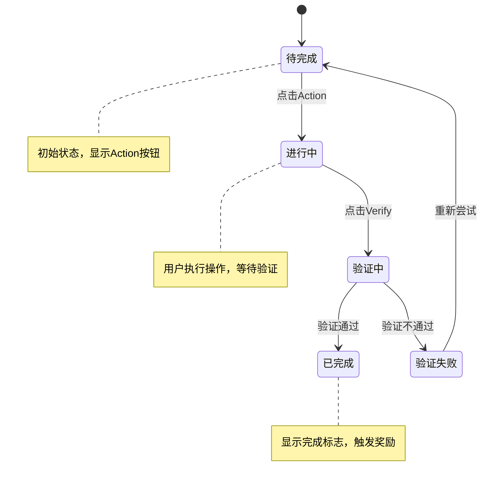

### 4. 实体关系图

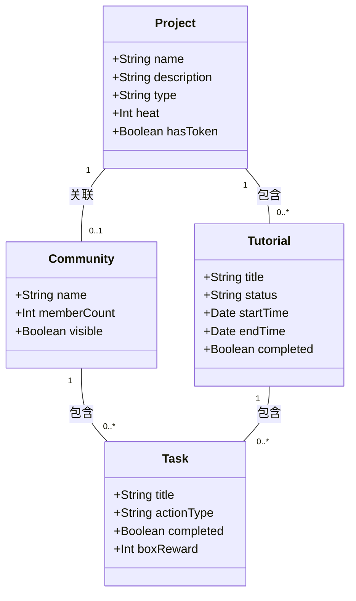

### 5. 数据流转图

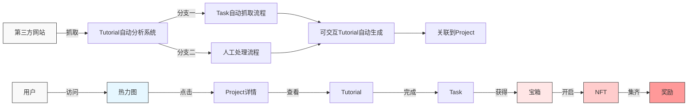

### 6. 奖励系统流程图

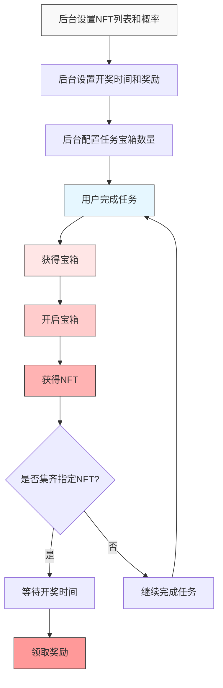
