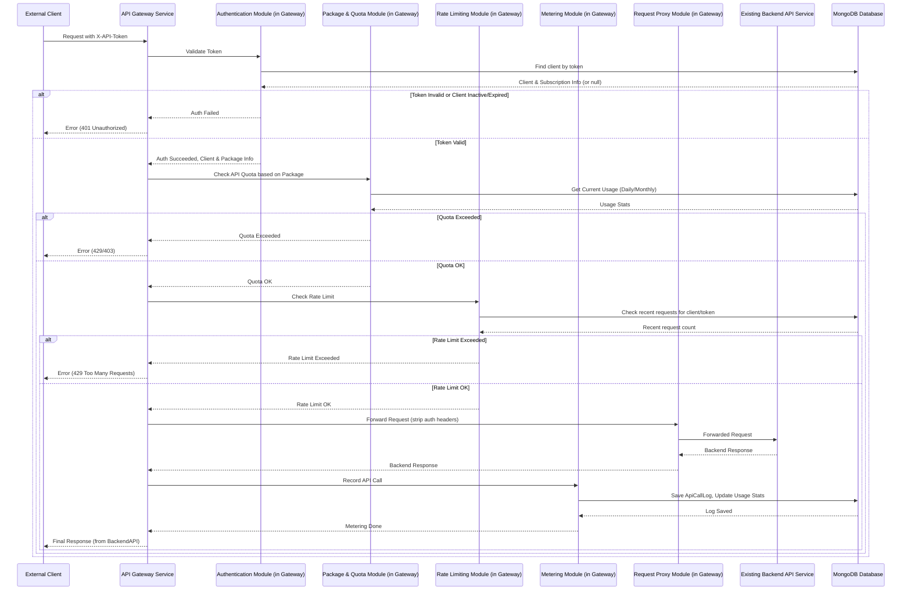

# API网关服务技术方案 (外部调用与套餐管理)

## 1. 背景

现有项目需要对外提供API服务，并对外部调用方进行身份认证、API调用计量、以及基于套餐的访问控制和计费管理。为确保不侵入现有系统代码、保证现有功能稳定，并提供良好的可扩展性，拟设计并实现一个独立的API网关服务。本方案在原《外部API服务身份认证和计量技术方案》基础上进行扩展，核心变化是将相关功能独立为网关服务，并引入"套餐"概念。

## 2. 需求分析

### 2.1 核心需求 (P0 - 本期开发)

1. **独立网关服务 (P0)**：将身份认证、权限校验、流量控制、API计量等功能从原应用中剥离，形成独立的网关应用。
2. **身份认证 (P0)**：外部调用方需携带唯一身份凭证 (`X-API-Token`) 进行访问，网关负责鉴权。详细机制见 [3.3.1 认证鉴权模块 (Authentication &amp; Authorization) (P0)](#331-认证鉴权模块-authentication--authorization-p0) 和 [3.6 Token生成与认证机制 (P0)](#36-token生成与认证机制-p0)。
3. **套餐管理 (P0)**：
   * 支持定义多种API调用套餐（如：基础版、专业版、企业版）。
   * 每个套餐包含不同的API调用配额（如每日/每月调用上限）、速率限制（如每秒/每分钟请求数）、有效期。
   * 外部调用方可以选择或被分配特定的套餐。
4. **配额与限流 (P0)**：
   * 根据调用方当前生效的套餐配置，实时检查API调用是否超出配额。
   * 对超出配额或速率限制的请求进行拒绝或限流。
5. **API调用计量 (P0)**：精确记录每个外部调用方对各API的成功和失败调用次数、调用时间等信息。
6. **套餐有效期管理 (P0)**：支持套餐的到期处理，如到期后自动降级、禁用或提醒续费。
7. **客户端管理 (P0)**：提供API接口，用于创建、查询、更新、禁用/启用外部调用方及其套餐信息。
8. **安全性 (P0)**：保证API Token的安全存储和传输；网关本身具备一定的安全防护能力。
9. **兼容性 (P0)**：不修改现有后端API的接口定义（请求参数和响应结构）。网关负责处理新增的认证和控制逻辑。

### 2.2 可选需求 (P1 - 本期暂不开发)

1. **按量计费 (P1)**：支持超出套餐额度后的按实际调用量计费模式。
2. **自定义套餐 (P1)**：允许为特定大客户定制套餐。
3. **详细审计日志 (P1)**：记录更详细的操作审计日志 (目前 `api_call_logs` 已比较详细，此处指更细化的管理操作审计)。
4. **开发者门户 (P1)**：提供一个简单的UI界面供外部开发者注册、获取Token、查看用量和管理套餐。
5. **多级Token权限 (P1)**：支持主Token和子Token，子Token继承主Token的部分权限和配额。

## 3. 技术方案

### 3.1 整体架构设计

API网关将作为所有外部API请求的统一入口，位于外部客户端和现有后端API服务之间。

**架构图描述：**

```
外部客户端 ---> API网关服务 ---> 现有后端API服务
                ^         |
                |         |
                |         v
                +-----> MongoDB (存储客户端、套餐、日志等)
```

**核心流程：**

1. 外部客户端携带 `X-API-Token` 和 `X-External-Client: true` (必须，用于明确标识) header 发起请求到API网关。
2. API网关进行身份认证：验证 `X-API-Token` 的有效性，查询客户端信息及其当前套餐。
3. API网关进行权限与配额校验：
   * 检查客户端状态（是否激活、套餐是否过期）。
   * 根据套餐配置检查API调用是否在速率限制内。
   * 检查API调用是否超出日/月配额。
4. 如果认证或校验失败，网关直接返回相应的错误响应 (e.g., 401, 403, 429)。
5. 如果校验通过，网关将请求（移除认证相关的header后）转发至相应的后端API服务。
6. 后端API服务处理请求并返回响应给网关。
7. API网关记录API调用日志（成功/失败、耗时等），更新用量统计。
8. API网关将后端API的响应返回给外部客户端。

**调用链路图 (Sequence Diagram):**



### 3.2 数据模型设计

使用MongoDB存储相关数据。

**1. `external_clients` (外部调用方信息)**

```python
{
    "_id": "client_internal_db_id", // MongoDB自动生成或自定义内部ID
    "client_api_id": "publicly_visible_client_id_string", // (P0) 用于API调用时传递的、可公开的客户端ID，唯一且可索引
    "client_name": "外部项目方名称",
    "hashed_api_token": "secure_hashed_api_token_string", // (P0) 存储哈希后的API Token
    "status": "active/inactive/suspended/expired", // 客户端状态
    "contact_email": "client_contact@example.com", // 可选联系方式
    "created_at": "timestamp",
    "updated_at": "timestamp",
    "notes": "可选备注信息"
}
```

* 索引: `client_api_id` (unique), `hashed_api_token` (如果需要直接通过token哈希调试，但通常不用于认证路径), `client_name`

**2. `packages` (套餐定义)**

```python
{
    "_id": "package_id_string", # 套餐唯一ID (e.g., "basic_v1", "pro_v2")
    "package_name": "套餐名称 (e.g., 基础版, 专业版)",
    "description": "套餐详细描述",
    "api_quota": {
        "daily_limit": 10000,           # 每日总调用次数上限
        "monthly_limit": 300000,        # 每月总调用次数上限
        "rate_limit_per_minute": 100,   # 每分钟请求速率限制
        "rate_limit_per_second": 10     # 每秒请求速率限制 (可选)
        # "specific_api_limits": {      # 可选：针对特定API路径的限制
        #     "/api/v1/users": {"daily": 100, "rate_per_minute": 10},
        #     "/api/v1/orders": {"daily": 500, "rate_per_minute": 30}
        # }
    },
    "price_monthly": 29.99, # 月度价格 (可选, 用于计费或展示)
    "duration_days": 30,    # 套餐有效期天数 (0 表示永久或依赖订阅周期)
    "is_active": True,      # 套餐是否可被订阅或分配
    "features": ["feature1", "access_to_advanced_analytics"], # 套餐包含的特性列表
    "created_at": "timestamp",
    "updated_at": "timestamp"
}
```

* 索引: `package_name` (unique), `is_active`

**3. `client_package_subscriptions` (客户端套餐订阅)**

```python
{
    "_id": "subscription_id_string", # 订阅记录唯一ID
    "client_id": "client_id_string", # 关联到 external_clients
    "package_id": "package_id_string", # 关联到 packages
    "subscribed_at": "timestamp", # 订阅或续费开始时间
    "expires_at": "timestamp", # 套餐过期时间
    "status": "active/expired/cancelled/pending_payment", # 订阅状态
    "auto_renew": False, # 是否自动续费
    "payment_info": { # 可选，支付相关信息
        "transaction_id": "...",
        "amount_paid": 29.99
    },
    "created_at": "timestamp",
    "updated_at": "timestamp"
}
```

* 索引: `client_id`, `package_id`, `status`, `expires_at`
* 复合索引: (`client_id`, `status`, `expires_at`) 用于快速查找客户当前有效套餐

**4. `api_call_logs` (API调用明细日志)**

```python
{
    "_id": "auto_generated_id",
    "client_id": "client_id_string",
    "api_token_prefix": "first_8_chars_of_token", # 用于快速关联，但不暴露完整token
    "package_id_at_call": "package_id_string", # 调用时使用的套餐
    "request_id": "unique_request_id", # 网关生成的请求ID
    "timestamp": "unix_timestamp_float_seconds", # 精确到毫秒的请求时间
    "api_path": "/api/v1/resource",
    "http_method": "GET/POST/PUT/DELETE",
    "source_ip": "client_ip_address",
    "user_agent": "client_user_agent_string",
    "request_headers_size": 1024, # bytes
    "request_body_size": 2048, # bytes
    "response_status_code": 200, # 后端服务返回的状态码
    "is_success": True, # 根据 status_code < 400 判断
    "processing_time_ms_gateway": 5, # 网关自身处理耗时（不含后端）
    "processing_time_ms_backend": 50, # 后端服务处理耗时
    "processing_time_ms_total": 55, # 总耗时
    "response_headers_size": 512, # bytes
    "response_body_size": 4096, # bytes
    "error_message": "Optional error message if request failed in gateway or backend"
}
```

* 索引: `client_id`, `timestamp`, `api_path`, `response_status_code`
* TTL索引: `timestamp` (例如，自动删除90天前的明细数据，具体根据需求定)
  `db.api_call_logs.createIndex({"timestamp": 1}, {expireAfterSeconds: 90 * 24 * 60 * 60})`

**5. `api_usage_daily` (每日API用量统计)**

```python
{
    "_id": "auto_generated_id",
    "client_id": "client_id_string",
    "package_id": "package_id_string", # 当日主要使用的套餐
    "date": "YYYY-MM-DD", # 统计日期
    "api_path": "/api/v1/resource", # 或 "ALL" 代表所有路径总计
    "total_calls": 1200,
    "successful_calls": 1150,
    "failed_calls": 50,
    "hourly_breakdown": { # 可选，按小时细分
        "00": {"total": 50, "success": 48, "fail": 2},
        "01": {"total": 60, "success": 58, "fail": 2}
        # ...
    },
    "last_updated": "timestamp"
}
```

* 索引: (`client_id`, `date`), (`client_id`, `api_path`, `date`)

**6. `api_usage_monthly` (每月API用量统计)**

```python
{
    "_id": "auto_generated_id",
    "client_id": "client_id_string",
    "package_id": "package_id_string", # 当月主要使用的套餐
    "month": "YYYY-MM", # 统计月份
    "api_path": "/api/v1/resource", # 或 "ALL"
    "total_calls": 25000,
    "successful_calls": 24000,
    "failed_calls": 1000,
    "last_updated": "timestamp"
}
```

* 索引: (`client_id`, `month`), (`client_id`, `api_path`, `month`)

### 3.3 网关服务核心模块设计

API网关服务将采用模块化设计，主要包括以下模块：

#### 3.3.1 认证鉴权模块 (Authentication & Authorization) (P0)

* **Token与ClientID提取**：从请求Header中获取 `X-API-Token` 和 `X-Client-ID`。
* **客户端查询**：使用 `X-Client-ID` 查询 `external_clients` 集合，获取客户端信息，包括存储的 `hashed_api_token` 和客户端状态。
* **Token验证**：使用 `passlib` 将客户端提供的 `X-API-Token` 与数据库中存储的 `hashed_api_token` 进行安全比较 (e.g., `pwd_context.verify(provided_token, hashed_token_from_db)`)。
* **状态检查**：验证客户端状态是否为 `active`。
* **套餐状态检查**：查询 `client_package_subscriptions` 确定客户端当前是否有有效的、未过期的 `active` 套餐。
* **权限预留 (P1)**：未来可扩展基于套餐或角色的细粒度API访问权限。

#### 3.3.2 套餐与配额管理模块 (Package & Quota Management) (P0)

* **配额查询**：根据客户端当前套餐，从 `packages` 集合获取日/月调用总额度。
* **用量查询**：从 `api_usage_daily` 和 `api_usage_monthly` 集合查询客户端当日/当月的已用量。
* **配额检查**：比较已用量和总额度，判断是否超出。
* **套餐订阅管理**：提供内部API，支持管理员为客户订阅、续费、取消或更改套餐。
* **过期处理**：定期任务检查 `client_package_subscriptions` 中的过期套餐，并更新其状态或客户端状态。
* **所有管理API需要有严格的认证和授权保护**。

#### 3.3.3 限流模块 (Rate Limiting)

* **速率获取**：根据客户端当前套餐，从 `packages` 集合获取每分钟/每秒的速率限制。
* **请求计数**：使用Redis或MongoDB（对于较低速率）作为计数器，记录客户端在当前时间窗口内（如1秒、1分钟）的请求次数。
  * 推荐使用Redis的滑动窗口算法或固定窗口算法实现，当前阶段采用内存吧。
  * 例如：`INCR` 一个 `client:<client_id>:path:<api_path>:timestamp:<current_minute_or_second>` 的key，并设置过期时间。
* **超限判断**：如果计数超过套餐定义的速率限制，则拒绝请求。

#### 3.3.4 请求代理模块 (Request Proxy)

**原理：**

请求代理模块是API网关的核心组件之一，扮演着客户端与后端服务之间的桥梁角色。在所有前置策略（如认证、授权、限流、配额检查）成功执行后，代理模块负责将经过处理和验证的请求准确、高效地转发至目标后端服务，并随后将后端服务的响应安全地回传给原始请求方。其主要目标是实现客户端与后端服务的解耦，提供统一的API入口，并为实施各种横切关注点（如Header转换、路径重写）提供执行点。

**核心实现逻辑：**

* **1. Header处理 (P0)**：

  * **移除敏感Header**：在请求转发至后端服务前，必须移除或清理与网关认证、客户端识别相关的Header，例如 `X-API-Token`、`X-Client-ID`、`X-External-Client` 等，避免这些信息泄露到后端服务。
  * **添加内部追踪/用户信息Header**：可以根据需要向后端请求中注入一些对后端服务有用的、经过网关验证的内部信息。例如：
    * `X-Request-ID`: 用于追踪分布式链路的唯一请求ID（如果上游未提供，网关应生成一个）。
    * `X-Authenticated-Client-ID`: 经过认证的客户端 `client_api_id`。
    * `X-Subscribed-Package-ID`: 客户端当前订阅的套餐ID。
    * `X-Forwarded-For`: 附加原始客户端的IP地址 (如果网关是第一层代理)。
    * `X-Forwarded-Proto`: 原始请求的协议 (http/https)。
  * **Host Header管理**：正确设置转发到后端服务请求的 `Host` Header，通常应设置为后端服务期望的Host，或者根据配置进行转换。
  * **透传与过滤**：大部分其他非敏感的HTTP Header（如 `Content-Type`, `Accept`, `User-Agent`, 以及业务自定义Header）应被透传到后端。但需注意配置黑名单或白名单，避免透传不必要的或可能引起安全问题的Header。
* **2. 路径映射与路由 (P0 - 简化版，兼顾未来扩展)**：

  * **P0阶段核心目标：实现基础请求转发**

    * **配置驱动的后端服务地址 (P0)**：网关应能通过配置文件（或环境变量）指定唯一的后端目标服务的基础URL (e.g., `http://your-internal-service-address:port`)。这是P0阶段最重要的配置。
    * **直接路径与参数透传 (P0)**：对于所有到达网关的请求（在通过认证、限流等检查之后），网关将请求的原始子路径（即域名之后的部分）和查询参数 (query parameters) **原封不动地**附加到配置的后端服务基础URL之后，然后进行转发。
      * 例如：外部请求 `https://api.yourgateway.com/some/api/path?param=value`，如果配置的后端服务基础URL是 `http://internal.host/`，则网关会转发到 `http://internal.host/some/api/path?param=value`。
      * 此阶段**不涉及复杂的路径重写规则**（如添加/移除前缀、正则表达式匹配等），以最大限度减少P0开发量。
    * **支持所有HTTP方法 (P0)**：确保对所有标准HTTP方法 (GET, POST, PUT, DELETE, PATCH, OPTIONS, HEAD等) 都能按照上述方式正确代理。
  * **为未来演进预留设计 (P0的技术实现应考虑)**：

    * **可配置的路由表结构 (P0底层设计)**：虽然P0阶段可能只有一个全局的"全部转发到某后端"的规则，但底层代码设计上，应预留一个简单的路由表或规则匹配机制的雏形。这可以是配置文件中的一个简单列表，P0只使用其中一个"通配"规则。
    * **模块化**：路由决策逻辑应作为一个独立的子模块，即使P0实现简单，也方便未来替换或增强。
  * **P1阶段的路径映射与路由增强 (本期不开发，仅作说明)**：

    * **(P1) 灵活的路径重写**：支持基于规则（如正则表达式）对请求路径进行修改、添加或移除前缀/后缀。
    * **(P1) 多后端路由**：支持根据请求路径、Header或其他条件将请求路由到不同的后端服务。
    * **(P1) API版本管理路由**：例如，`/v1/*` 和 `/v2/*` 路由到不同的后端实现。
    * **(P1) 动态路由更新**：通过管理API动态更新路由规则，无需重启网关。
  * **P0阶段的价值**：即便P0阶段的路径映射极为简单（接近1:1转发），建立此模块并进行配置化管理，也为系统提供了必要的抽象层。这使得未来后端服务的地址变更、路径调整或引入更复杂的路由策略时，可以对外部客户端保持透明，增强了系统的可维护性和扩展性，而无需在P0阶段投入过多开发精力实现复杂路由逻辑。
* **3. 请求转发 (P0)**：

  * **异步HTTP客户端**：必须使用异步HTTP客户端（如Python中的 `httpx`）来执行对后端服务的请求转发。这确保了网关的非阻塞特性，能够高效处理大量并发请求，不会因为等待后端响应而阻塞其他请求的处理。
  * **请求体处理**：
    * 正确处理和转发不同类型的请求体（如JSON, XML, form-data, binary）。
    * 对于大型请求体，应考虑使用流式传输 (streaming) 以避免将整个请求体读入内存，从而减少网关的内存消耗和延迟。
  * **连接池管理**：异步HTTP客户端应维护到后端服务的连接池，以复用连接，减少TCP握手开销，提高性能。
* **4. 响应处理 (P0)**：

  * **状态码透传**：通常情况下，后端服务返回的HTTP状态码应直接透传给客户端。
  * **Header处理**：
    * 后端服务返回的Header也应被代理回客户端。
    * 同样需要过滤掉后端服务可能返回的内部敏感Header（如 `X-Powered-By` 或其他内部调试信息），避免泄露给外部客户端。
  * **响应体处理**：
    * 与请求体类似，对于大型响应体，也应采用流式传输的方式将其写回给客户端，优化内存使用和响应时间。
  * **错误处理**：
    * 当后端服务无响应、连接超时或返回特定错误（如5xx）时，网关应能捕获这些异常，并向客户端返回一个明确的错误响应（例如，标准的502 Bad Gateway, 503 Service Unavailable, 或 504 Gateway Timeout）。
    * 避免直接暴露后端服务的原始错误信息（除非明确配置为调试目的），以防泄露内部架构细节。
* **5. 超时与重试 (P0基本，P1增强)**：

  * **超时配置 (P0)**：为对后端服务的连接和请求配置合理的超时时间（连接超时、读取超时）。如果后端在规定时间内未响应，网关应中止请求并返回错误（如504）。
  * **重试机制 (P1)**：
    * 对某些类型的错误（如网络瞬时故障、后端返回可重试的5xx错误）和幂等请求 (Idempotent requests: GET, HEAD, OPTIONS, PUT, DELETE)，可以配置自动重试机制。
    * 重试应配置最大次数和退避策略 (backoff strategy, 如指数退避加随机抖动)，避免因集中重试导致后端服务雪崩。
* **(P1) 负载均衡**：如果一个后端服务部署了多个实例，请求代理模块可能需要集成客户端负载均衡能力（如轮询、最少连接、基于权重的路由）。或者，这部分功能可以依赖于部署环境（如Kubernetes Service, Nginx等外部负载均衡器）提供的服务发现和负载均衡机制。P0阶段可先假定后端服务地址是单一或已由基础设施处理负载均衡。

通过这些核心逻辑的实现，请求代理模块能够确保API网关在完成安全和策略控制后，可靠地将流量导向正确的后端服务，并管理好整个请求-响应的生命周期。

#### 3.3.5 计量模块 (Metering)

* **日志记录**：在请求处理完成后（无论成功失败），异步记录详细的API调用信息到 `api_call_logs` 集合。
* **用量聚合**：通过后台定时任务（或流式处理），从 `api_call_logs` 聚合适时数据到 `api_usage_daily` 和 `api_usage_monthly`，以提高查询效率。

#### 3.3.6 管理API模块 (Admin API)

* **客户端管理**：
  * `POST /admin/clients`: 创建新客户端，生成API Token。
  * `GET /admin/clients/{client_id}`: 获取客户端详情。
  * `PUT /admin/clients/{client_id}`: 更新客户端信息 (e.g., 状态, 名称)。
  * `POST /admin/clients/{client_id}/token/regenerate`: 重新生成API Token。
* **套餐管理**：
  * `POST /admin/packages`: 创建新套餐。
  * `GET /admin/packages`: 列出所有套餐。
  * `GET /admin/packages/{package_id}`: 获取套餐详情。
  * `PUT /admin/packages/{package_id}`: 更新套餐定义。
* **订阅管理**：
  * `POST /admin/clients/{client_id}/subscriptions`: 为客户端订阅套餐。
  * `GET /admin/clients/{client_id}/subscriptions`: 查看客户端的订阅历史和当前订阅。
  * `PUT /admin/subscriptions/{subscription_id}`: 更新订阅状态 (e.g., 取消, 激活)。
* **用量查询API**：
  * `GET /admin/clients/{client_id}/usage/daily?date=YYYY-MM-DD`: 查询客户端日用量。
  * `GET /admin/clients/{client_id}/usage/monthly?month=YYYY-MM`: 查询客户端月用量。
* 所有管理API需要有严格的认证和授权保护。

### 3.4 核心功能流程 (P0)

**1. 外部API调用处理流程 (已在调用链路图中详细描述)**

* 接收请求 (包含 `X-Client-ID` 和 `X-API-Token`) -> 认证 (基于Client ID查找，验证Token哈希) -> 套餐/配额检查 -> 限流检查 -> 代理请求 -> 记录日志 -> 返回响应。

**2. 客户端注册与套餐订阅流程 (通过管理API)**

* **创建客户端**：管理员通过管理API创建 `external_clients` 记录。系统生成 `client_api_id`，并按照 [3.6 Token生成与认证机制 (P0)](#36-token生成与认证机制-p0) 生成API Token。明文Token只在创建成功时显示一次给管理员，用于分发给外部调用方。数据库中仅存储Token的哈希值和 `client_api_id`。
* **分配/订阅套餐**：管理员通过管理API为 `client_id` (通常指 `client_api_id` 或内部ID) 创建一条 `client_package_subscriptions` 记录，关联到某个 `package_id`，并设置生效和过期时间。

### 3.5 技术选型 (P0 核心功能所需)

* **编程语言**：Python 3.x
* **Web框架 (网关服务)**：FastAPI (异步，高性能，自带数据校验和文档生成)
* **HTTP客户端 (请求代理)**：`httpx` (支持异步请求)
* **数据库**：首选MongoDB (详细讨论见 [3.7 存储方案选型](#37-存储方案选型))
  * **MongoDB驱动**：`motor` (异步MongoDB驱动，配合FastAPI)
* **限流组件**：
  * Redis (高性能，适合精确的速率限制，可使用 `redis-py` 库)
  * 或者基于MongoDB的简单计数器（适用于较低QPS场景或作为Redis故障时的降级方案）
  * FastAPI集成库如 `slowapi` 也可以考虑。
* **配置管理**：`Pydantic` (FastAPI内置，用于环境变量和配置模型)
* **密码哈希**：`passlib` (用于安全存储和验证API Token的哈希值，推荐使用Argon2或bcrypt算法)
* **任务队列 (后台聚合、过期处理)**：Celery (配合Redis或RabbitMQ) 或 `arq` (异步任务队列，更轻量)。对于P0阶段，若聚合逻辑简单，也可考虑FastAPI的 `BackgroundTasks` 或简单的定时脚本，以降低初期复杂度。

### 3.6 Token生成与认证机制 (P0)

**1. Token生成**

* **唯一性与随机性**：API Token必须具有足够的随机性以防止猜测。推荐使用Python的 `secrets` 模块生成。
  ```python
  import secrets
  api_token = secrets.token_urlsafe(32)  # 生成一个32字节（约43个字符）的URL安全字符串
  ```
* **长度**：建议Token原始长度至少为32字节。
* **格式**：`token_urlsafe` 生成的字符串包含大小写字母、数字、`-` 和 `_`，适合在HTTP Header中使用。可以考虑为其添加可识别的前缀（如 `tsk_`)，但这主要用于辨识，而非安全。
* **`client_api_id`生成**：与API Token分开生成，可以是UUID或使用 `secrets.token_hex(16)` 生成的较短的、唯一的、公开可见的ID。
* **分发**：新生成的API Token（明文）和 `client_api_id` 应仅在创建客户端时显示给管理员一次。管理员负责安全地将API Token分发给外部调用方，`client_api_id` 则可公开使用。系统不应再次以明文形式存储或展示API Token。

**2. Token存储**

* **哈希存储**：**严禁以明文形式存储API Token。** 应存储Token的哈希值。使用 `passlib` 库进行哈希处理。

  ```python
  from passlib.context import CryptContext
  # 推荐使用 Argon2，bcrypt作为备选
  pwd_context = CryptContext(schemes=["argon2", "bcrypt"], deprecated="auto")

  def hash_token(token: str) -> str:
      return pwd_context.hash(token)

  def verify_token(plain_token: str, hashed_token: str) -> bool:
      return pwd_context.verify(plain_token, hashed_token)
  ```

  `hashed_api_token = hash_token(api_token)` 将存储在数据库的 `external_clients.hashed_api_token` 字段。
* **`client_api_id`存储**：以明文形式存储在 `external_clients.client_api_id`，并建立唯一索引。

**3. Token认证流程 (推荐方案: Client ID + API Token)**

* **客户端请求**：外部调用方在请求时，必须在HTTP Header中同时提供：
  * `X-Client-ID`: 值为其获得的 `client_api_id`。
  * `X-API-Token`: 值为其获得的明文API Token。
* **网关处理**：
  1. 从Header中提取 `X-Client-ID` 和 `X-API-Token`。
  2. 使用 `X-Client-ID` (即 `client_api_id`) 查询 `external_clients` 数据库集合，找到对应的客户端记录。此查询应利用 `client_api_id` 上的索引，速度快。
  3. 如果未找到记录，或记录的 `status` 不是 `active`，则认证失败 (返回401或403)。
  4. 如果找到记录，取出该记录中存储的 `hashed_api_token`。
  5. 使用 `verify_token(provided_X_API_Token, hashed_api_token_from_db)` 函数验证客户端提供的Token是否与存储的哈希匹配。
  6. 如果验证通过，则认证成功。后续进行套餐、配额、限流等检查。
  7. 如果验证失败，则认证失败 (返回401 Unauthorized)。
* **安全性**：
  * 此方案通过 `client_api_id` 快速定位用户，避免了对整个Token哈希集合的扫描。
  * `passlib` 的 `verify` 方法会自动处理盐值（salt）并能抵御时序攻击（timing attacks）。
  * 由于API Token本身是高熵随机串，即使 `client_api_id` 是公开的，暴力破解Token也是不可行的。

### 3.7 存储方案选型

对于API网关所需的数据存储，主要涉及客户端信息、套餐定义、订阅关系、API调用日志和统计数据。

**1. MongoDB (首选方案)**

* **优点**：

  * **灵活的Schema (P0)**：非常适合存储结构可能经常变化的套餐特性、日志字段等。`api_call_logs` 的字段较多且可能扩展，文档模型能很好地适应。
  * **高性能读写 (P0)**：对于API调用日志这种写密集型场景，MongoDB表现良好。认证时通过 `client_api_id` (已索引) 查询客户端信息也很快。
  * **可扩展性 (P1考虑)**：良好的水平扩展能力（Sharding），适合未来数据量增长。
  * **JSON友好 (P0)**：与Python FastAPI等现代Web框架配合自然，数据交互方便。
  * **异步驱动支持 (P0)**：`motor` 驱动与FastAPI的异步特性完美契合。
  * **TTL索引 (P0)**：便于自动清理过期的 `api_call_logs`。
  * **聚合框架 (P0)**：强大的聚合框架便于生成 `api_usage_daily` 和 `api_usage_monthly` 等统计数据。
* **缺点**：

  * **事务支持**：相较于关系型数据库，MongoDB的事务支持（尤其是在多文档事务方面）在早期版本中较弱，但目前已显著增强。对于本网关的核心场景（如创建客户端时同时写入多个关联信息、更新套餐订阅和用量），如果需要强事务，需要仔细设计或使用MongoDB的事务功能。但很多场景可以通过原子操作或最终一致性来满足。
  * **数据一致性**：默认配置下可能更偏向可用性而非强一致性（CAP理论），但可调整读写关注（Read/Write Concerns）级别。
  * **运维复杂度 (P1考虑)**：相较于某些云托管的关系型数据库服务，自建MongoDB集群运维可能稍复杂。若使用云服务商提供的MongoDB（如MongoDB Atlas），可大幅降低运维负担。

**2. 关系型数据库 (如 PostgreSQL with JSONB)**

* **优点**：

  * **成熟稳定**：久经考验，生态完善。
  * **强一致性与事务 (ACID)**：非常可靠，对于需要多表原子操作的场景有优势。
  * **SQL表达能力强**：对于复杂查询和关联，SQL是标准。
  * **JSONB支持**：PostgreSQL的JSONB类型可以很好地存储半结构化数据，如套餐的特定配置或日志的某些字段，可以部分弥补文档数据库的灵活性。
* **缺点**：

  * **Schema刚性**：对于频繁变更的字段（如 `api_call_logs` 可能新增监控维度），需要 `ALTER TABLE`，不如MongoDB灵活。即使使用JSONB，复杂查询JSONB内部也不如MongoDB原生。
  * **写密集型日志**：对于大量API调用日志的写入，传统关系型数据库可能面临性能瓶颈，除非进行特定优化（如分区表、优化索引策略）。
  * **水平扩展 (P1考虑)**：关系型数据库的水平扩展通常比MongoDB更复杂和昂贵。
  * **异步驱动**：虽然有异步驱动如 `asyncpg`，但在Python FastAPI生态中，MongoDB的 `motor` 更为常见和自然。

**3. 其他方案 (辅助或特定场景)**

* **Redis (P0辅助)**：

  * 非常适合做**限流计数器**、**短期缓存**（如缓存热门Token的认证结果或套餐信息）。
  * 不适合作为主要持久化存储（除非使用Redis Enterprise或特定配置并理解其持久化限制）。
  * 在本方案中，Redis是作为MongoDB的辅助，用于高性能限流。
* **TimescaleDB (基于PostgreSQL的时间序列数据库) (P1考虑)**：

  * 如果API调用日志的分析和查询有非常强的时间序列特性，且查询模式复杂（例如，复杂的窗口函数、趋势分析），TimescaleDB可能是一个好选择，尤其在日志存储和分析方面。
  * 但增加了技术栈的复杂度，P0阶段不推荐作为主存储。

**结论与推荐 (P0):**

对于本API网关项目的P0阶段，**MongoDB 仍然是推荐的首选主要数据存储方案**。其灵活性、针对日志和客户端信息的高性能读写、良好的可扩展性潜力以及与FastAPI异步生态的契合度，使其非常适合处理网关所需的多样化数据。

* **客户端信息、套餐、订阅**：文档模型能很好地表示这些实体及其关系。
* **API调用日志**：写密集，字段可能扩展，MongoDB能高效处理。TTL索引方便管理日志生命周期。
* **统计数据**：MongoDB的聚合框架能有效支持从日志生成统计。

**辅助使用Redis (P0)**：用于实现高精度的API请求速率限制是必要的。

因此，文档中的数据模型设计将继续基于MongoDB。如果未来P1阶段对日志数据的分析有极高的OLAP需求，或对事务一致性有更严格的跨集合要求，届时可以重新评估是否引入专门的数据仓库、时间序列数据库或调整MongoDB的使用策略（如启用更高级别的事务）。但对于P0核心功能，MongoDB是足够且合适的。

## 4. 数据库设计与初始化 (MongoDB)

### 4.1 集合创建

```javascript
// external_clients
db.createCollection("external_clients")
db.external_clients.createIndex({"api_token": 1}, {unique: true})
db.external_clients.createIndex({"client_name": 1})
db.external_clients.createIndex({"status": 1})

// packages
db.createCollection("packages")
db.packages.createIndex({"package_name": 1}, {unique: true})
db.packages.createIndex({"is_active": 1})

// client_package_subscriptions
db.createCollection("client_package_subscriptions")
db.client_package_subscriptions.createIndex({"client_id": 1})
db.client_package_subscriptions.createIndex({"package_id": 1})
db.client_package_subscriptions.createIndex({"status": 1})
db.client_package_subscriptions.createIndex({"expires_at": 1})
db.client_package_subscriptions.createIndex({"client_id": 1, "status": 1, "expires_at": 1})

// api_call_logs
db.createCollection("api_call_logs")
db.api_call_logs.createIndex({"client_id": 1, "timestamp": -1})
db.api_call_logs.createIndex({"request_id": 1}, {unique: true})
db.api_call_logs.createIndex({"api_path": 1, "timestamp": -1})
// TTL Index for api_call_logs (e.g., retain logs for 90 days)
db.api_call_logs.createIndex({"timestamp": 1}, {expireAfterSeconds: 90 * 24 * 60 * 60})

// api_usage_daily
db.createCollection("api_usage_daily")
db.api_usage_daily.createIndex({"client_id": 1, "date": -1})
db.api_usage_daily.createIndex({"client_id": 1, "api_path": 1, "date": -1}, {unique: true}) // Ensure one doc per client/path/day

// api_usage_monthly
db.createCollection("api_usage_monthly")
db.api_usage_monthly.createIndex({"client_id": 1, "month": -1})
db.api_usage_monthly.createIndex({"client_id": 1, "api_path": 1, "month": -1}, {unique: true}) // Ensure one doc per client/path/month

// external_clients (add index for client_api_id if using Token Auth Scheme B)
db.external_clients.createIndex({"client_api_id": 1}, {unique: true})
```

### 4.2 初始化数据 (示例)

* 创建默认套餐 (e.g., "Free Tier", "Basic Plan")
* (可选) 创建一个测试用的外部客户端和订阅。

## 5. 部署建议

* **独立部署**：API网关服务作为一个独立的微服务进行部署 (e.g., Docker容器化，部署在Kubernetes或类似PaaS平台)。
* **配置分离**：数据库连接信息、密钥、后端API地址等敏感配置通过环境变量或配置中心管理。
* **高可用性**：部署多个网关实例，并通过负载均衡器分发流量，确保高可用。
* **监控与告警**：
  * 监控网关服务的性能指标 (CPU, 内存, 延迟, 错误率)。
  * 监控API调用量、超限次数、各客户端用量。
  * 设置关键告警 (如服务不可用, 错误率激增, 某客户流量异常)。
* **日志管理**：集中管理网关应用日志和API调用日志。
* **安全性**：
  * 保护管理API的访问。
  * 定期审计API Token的安全性。
  * 考虑WAF (Web Application Firewall) 防护。
* **版本控制**：网关API和管理API应进行版本控制。

## 6. 与现有系统的关系

* **解耦**：API网关的引入使得外部认证、流量控制等逻辑与核心业务逻辑解耦，后端API服务无需关心这些细节。
* **请求流向**：所有外部请求先经过API网关，再由网关转发到现有后端API服务。
* **后端API不变**：后端API服务不需要做任何代码修改来适配网关，只需能接收来自网关的（已认证和授权的）请求即可。
* **内部调用**：现有系统内部服务间的调用可以绕过此API网关，直接通信，除非也希望将内部调用统一管理。

## 7. 总结

通过构建一个独立的API网关服务，可以有效地实现对外部API调用的身份认证、套餐管理、配额控制和计量，而无需修改现有后端服务。这种方式提供了更好的模块化、可扩展性和可维护性，并为未来引入更多高级API管理功能（如计费、开发者门户）奠定了基础。技术选型上推荐使用Python FastAPI配合MongoDB (主存储) 和 Redis (限流辅助)，以实现高性能和灵活的异步处理能力，满足P0阶段的核心需求。
