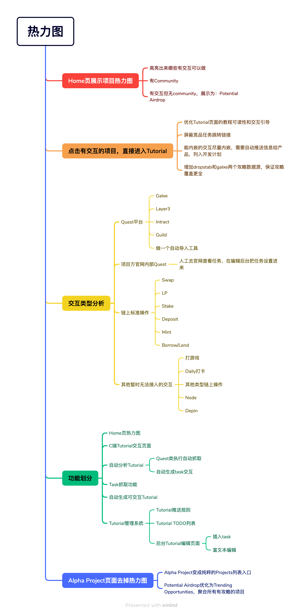
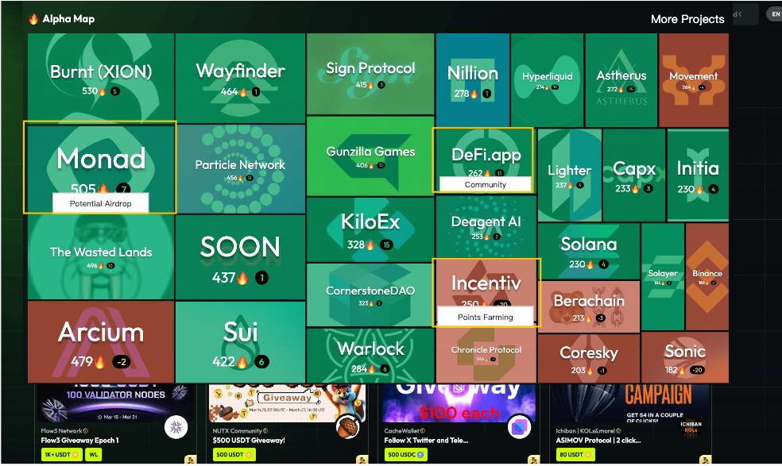

**热点+运营需求**

**需求背景**

热点Tutorial交互需要有运营体系来激励用户参与。

因此设计了一套用户做task得宝箱、开宝箱拿NFT、集齐NFT兑换奖金的玩法。

**用户流程**

在热点交互板块，每完成一个task，可以获得1个宝箱（宝箱是链下的）

用户可以看到自己当前的宝箱数量

用户可以开宝箱，开宝箱可以获得不同稀有度的NFT

每周/每月，会公布下一次要收集的NFT列表

如果用户集齐了指定的NFT，则可以在倒计时结束的时候去claim奖励

**后台配置流程**

后台设置当前有效NFT列表和概率；

后台设置下一次开奖时间、奖励金额和奖励梯度；

后台可以配置不同任务，获得不同数量的宝箱；

**功能详情**

1\. **C端活动页面**

**进入条件**

导航栏新增入口；

**页面布局**

{width="5.75in" height="7.114583333333333in"}

顶部是一张Banner图；

奖池区域，包括字段：

Prize Pool：奖池总金额（后台设置）

Max for each：第一名奖金（后台设置）

Max for each问号：点击展示明细规则

1789 participants：展示几个用户的头像和参与人数

倒计时：距离claim开始还有多久

Claim按钮：开始之前是灰色的

中奖记录滚动区域：左右滚动中奖记录

本周集卡任务区域

展示后台配置的NFT列表，一个NFT如果用户没有则是灰色的，用户有则是带颜色的

My TaskonBox

展示宝箱数量

如果可开数量=0，Open按钮都是灰色的

如果可开数量\<10，Open 10 Box按钮是灰色的，另一个是可点击的

Opening
limit：根据POH分数，每个用户每周可以开宝箱的数量是不一样的，7/20意思是本周已经开了7个，最高可开20个

Referral区域

My NFT列表

My History

2\. **后台配置页面**

**进入条件**

后台管理系统，增加一个新tab：Collect2Earn

**后台配置字段**

Banner

下一个奖池的时间/奖金/奖励梯度；

下一个奖池的NFT组合；

Box开启概率；

**页面布局**

配置Banner，banner是可选的，也可以不配置；

奖池配置区

tab可以切换当前奖池和下期奖池

配置奖池的claim时间

配置每个梯次的奖励，total prize pool是下面奖励的总和

需要集齐的NFT列表

NFT管理区

Total count：所有NFT抽取频次的总和

每个NFT：有自己的抽取频次，频次是运营设置的数值（默认为0），则该NFT的抽取概率=NFT抽取频次/Total
count

NFT按照三类不同的稀有度分开展示

按钮：Clear All、Save Change、Select Multiple NFT、Add New NFT

{width="5.75in" height="6.739583333333333in"}

3\. **合约需求**

3.1 **NFT合约**

NFT分不同稀有度（稀有度可后续增加，稀有度是否不需要上链，只是写在metadata里？）

每个稀有度分多种NFT：比如Common稀有度，有AAA、BBB、CCC三种NFT，每种可以有无数个
