**热力图+可交互Tutorial需求文档**

**整体思路**

{width="5.75in" height="11.65625in"}

**用户流程**

**C端用户流程**

在Home页看到热力图，有交互的项目会有高亮和标签；

热力图的文字/数字等大小样式，要根据UI稿再优化一下；

{width="5.75in" height="3.4270833333333335in"}

用户点击有交互的项目，直接进入项目详情页，并定位在Tutorial板块；

用户查看项目信息和攻略，所有可执行的交互动作都有类似task的跳转链接和验证机制；

用户执行某一个action，该task勾选变成已完成状态，用户获取Taskon平台的EXP；

获取到EXP的时候，通过动效让用户注意到导航栏有一个EXP的经验增长和距离下一个奖励层级的差距；

用户如果点击EXP经验条，再引导到Taskon的运营体系页面，可以看到周leaderboard等平台激励信息；

**平台工作流程**

从三方网站抓取到Project的Tutorial；

放入Tutorial自动分析流程，分析如何处理；

分支一，Quest类Tutorial，进入Task自动抓取流程；

分支二，其他类型Tutorial，进入人工处理流程；

分支一：执行Task自动抓取流程，去Quest网站上把task抓取下来

与我们的task模板匹配

相同task去重

进入自动生成可交互Tutorial流程

自动生成可交互Tutorial流程

自动生成标题

自动生成时间范围

自动生成简介

自动为每一个task配置描述

生成Tutorial并关联到Project

针对有Community的情况，生成Tutorial引导用户参与Community

分支二：人工处理流程

热点项目优先处理

非热点项目次要处理

没有教程的项目，可以手动添加一个教程

热点项目优先处理

上了热力图的项目，如果有Tutorial尚未处理，推送加入后台的todo list

非热点项目次要处理

没有加入todo
list的项目，运营可以在后台所有项目列表中看到哪些教程还没处理，有空慢慢处理

在后台打开教程，阅读内容

去项目官网做quest，需要打开项目官网，查看所有task，然后在后台把与taskon任务模板匹配的task手动加入到教程的相应位置

链上任务，如果已经支持了，直接把task手动加入到教程中

链上任务，如果没支持，提交给产品团队判断是否要支持

运营需要优化教程文案，保证教程在加入task之后阅读流畅

完成整个Tutorial的编辑，手动标记为Complete

**功能清单（1，2，3，4已完成，先交付）**

首页增加热力图（P0）

Alpha Project页面去掉热力图的样式（P0）

C端Project Detail页+Tutorial板块优化（P0）

后台管理系统，查看和编辑Tutorial（P0）

Tutorial自动分析系统（P1）

Task抓取系统（P1）

可交互Tutorial自动生成系统（P1）

Quest类Tutorial

Community Tutorial

项目入驻，自动同步task的完成状态到Community（P1）

EXP+运营系统（P1）

增加Tutorial数据源，dropstab+galxe（P2）

**功能明细**

1\. **首页增加热力图（Sam）**

**进入条件**

首页

**页面布局**

顶部的位置，去掉Trending Quests上方的内容，替换成Alpha Map的这个热力图；

如果热力图中的部分项目有标签

有community的，标签展示为community

没有community，但是有open状态的交互教程的，展示标签为Potential
Airdrop（未发币）或者Points Farming（已发币）

有标签的项目，增加高亮展示的样式

右上角有more projects按钮

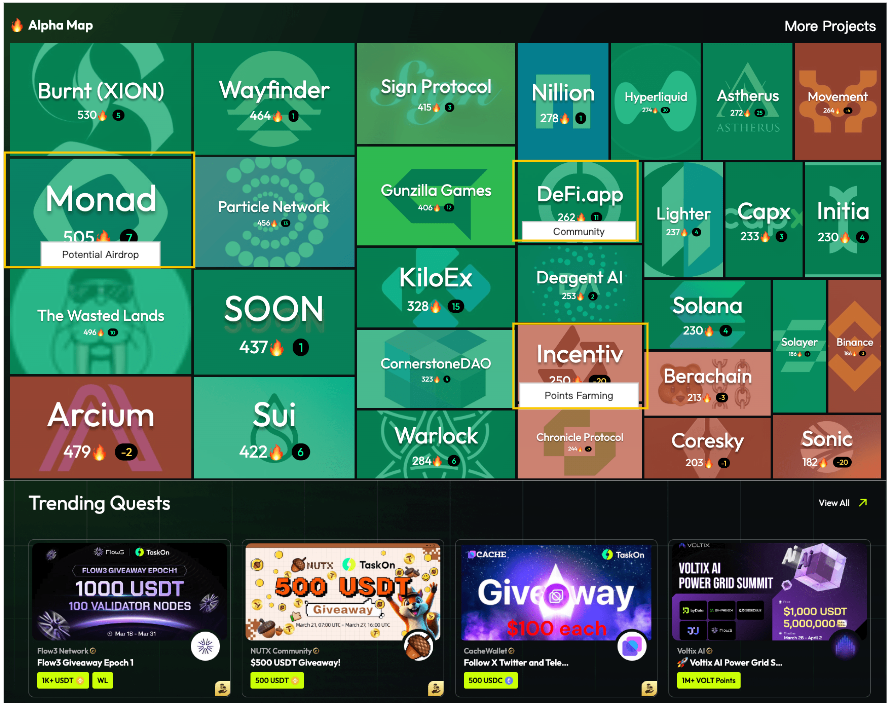{width="5.75in" height="4.541666666666667in"}

**交互逻辑**

点击有交互项目，进入Project详情页，并定位在Tutorial tab；

点击无交互项目，进入Project详情页，并定位在Overview tab；

点击More Projects，进入Alpha Projects列表页；

2\. **Alpha Projects（Sam）**

**进入条件**

路径保持为：/alpha/home，替换掉之前的页面

去掉/alpha/projects

**页面布局**

左侧就是之前的/alpha/projects页面；

右侧把之前/alpha/home页面的右侧三个板块方过来；

把Track Feeds右边的more按钮加强，文案改为View Feeds；

{width="5.75in" height="3.0625in"}

3\. **C端Project Detail页+Tutorial板块优化（billy）**

**3.1 Tutorial 板块**

Tutorial Tab 位置调到左边第一位

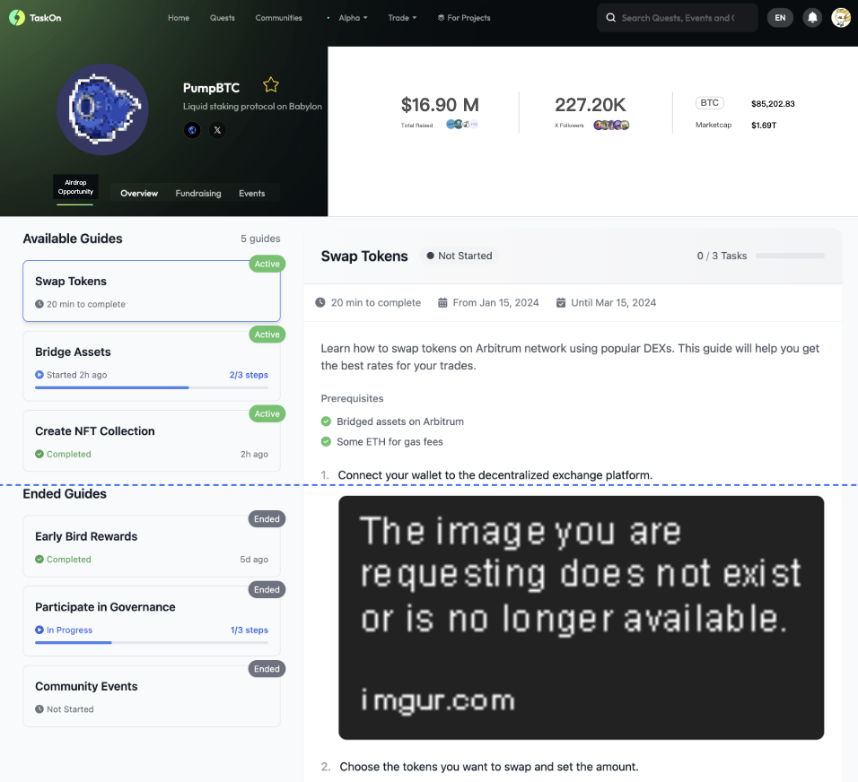{width="5.75in" height="5.239583333333333in"}

**核心旅程流程**

发现教程 → 学习内容 → 完成任务 → 探索新教程

+:----------------+:----------------+:---------------------------------+
| **旅程阶段**    | **对应模块**    | **用户行为**                     |
+-----------------+-----------------+----------------------------------+
| **1. 发现教程** | 教程卡片区      | • 浏览教程卡片\<br\>             |
|                 |                 |                                  |
|                 |                 | • 筛选活跃/已结束教程\<br\>      |
|                 |                 |                                  |
|                 |                 | • 基于状态选择感兴趣教程         |
+-----------------+-----------------+----------------------------------+
| **2. 学习内容** | 教程内容区      | • 查看教程步骤\<br\>             |
|                 |                 |                                  |
|                 |                 | • 阅读操作指南\<br\>             |
|                 |                 |                                  |
|                 |                 | • 浏览信息栏了解时间要求         |
+-----------------+-----------------+----------------------------------+
| **3. 完成任务** | 任务模块        | • 开始任务                       |
|                 |                 |                                  |
|                 |                 | • Verify 任务是否完成            |
|                 |                 |                                  |
|                 |                 | • 查看任务完成进度               |
+-----------------+-----------------+----------------------------------+
| **4.            | /               | • 完成所有任务后,                |
| 标记完成教程**  |                 | 将教程标记为已完成               |
+-----------------+-----------------+----------------------------------+
| **5.            | 推荐模块        | • 浏览其他推荐的教程             |
| 探索新教程**    |                 |                                  |
+-----------------+-----------------+----------------------------------+

**3.1.1 教程内容区**

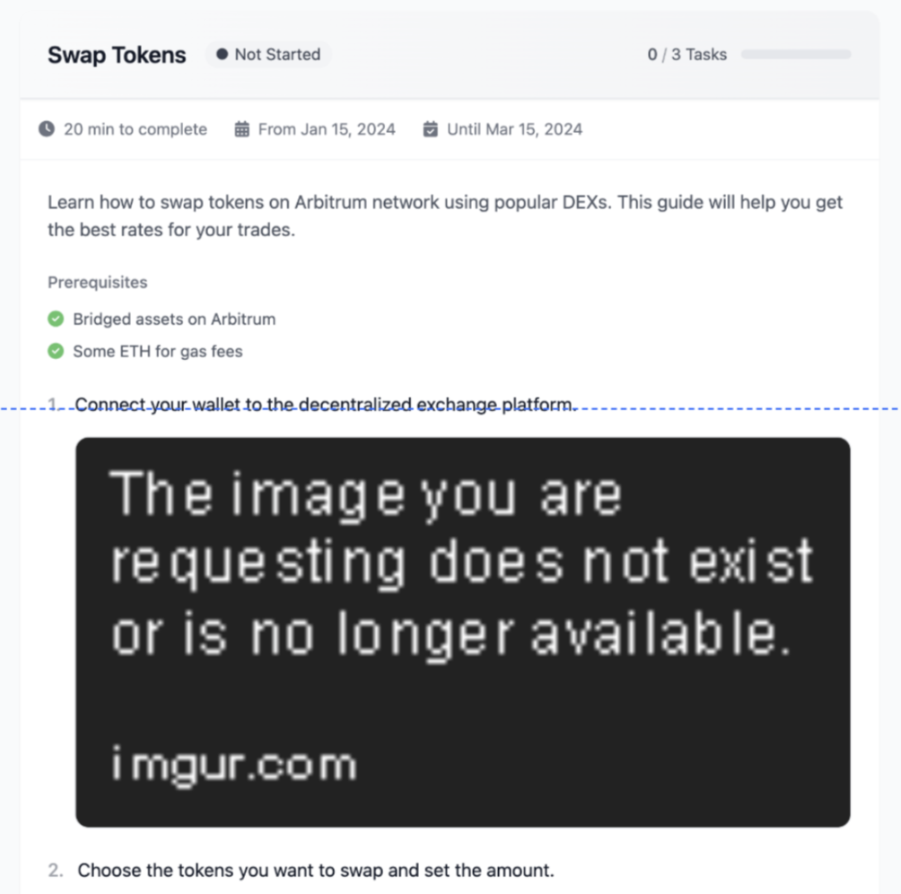{width="3.8333333333333335in" height="3.8125in"}

**粘性标题栏**

> 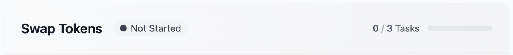{width="5.75in" height="0.6354166666666666in"}

**布局**：

显示教程标题和状态标签

进度指示器（完成任务数/总任务数）

滚动时保持可见

**交互**：

随页面滚动始终保持在视图顶部

状态标签根据当前教程状态动态变化

进度指示器实时反映任务完成情况

**信息栏**

> 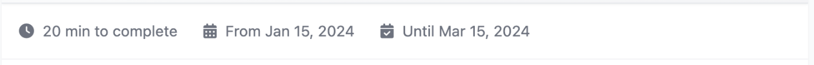{width="5.75in" height="0.46875in"}

**布局**：

估计完成时间

活动起止日期

非滚动固定位置

**交互**：

在标题栏下方固定显示，不随内容滚动

时间信息根据教程配置自动展示

**教程内容区**

> 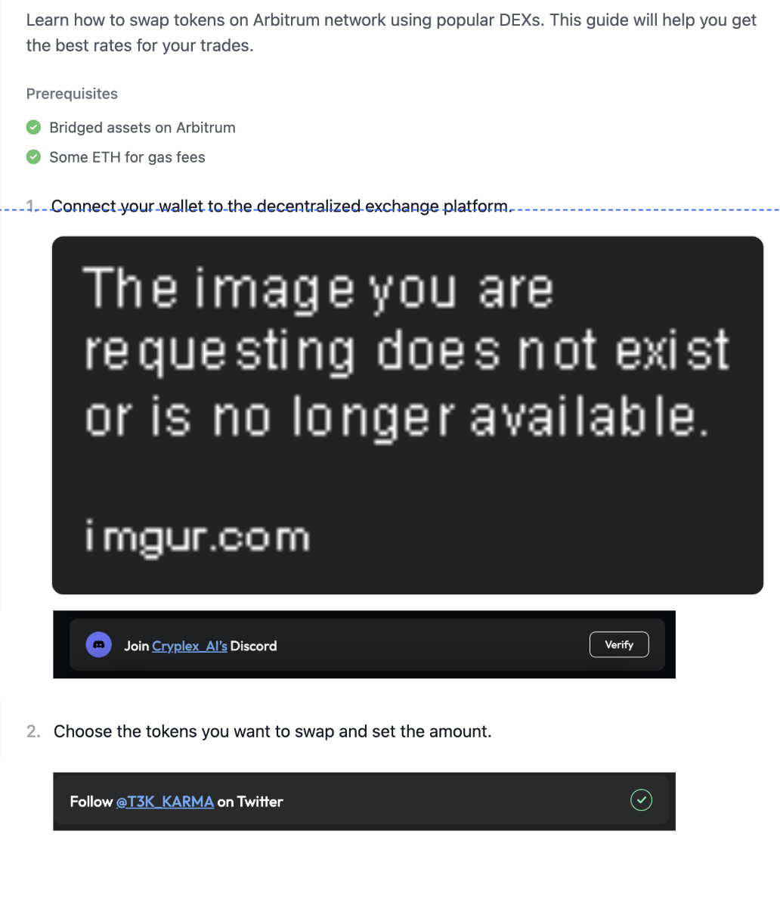{width="5.208333333333333in"
> height="6.052083333333333in"}

**布局**：

教程描述

任务模块（若后端有配置）(任务模块的卡片与 Quest
内的任务卡片显示样式保持一致)

**交互**：

图片支持点击放大查看

任务卡片与 Quest 内的任务卡片交互逻辑保持一致

任务模块根据完成状态展示不同样式

**3.1.2 教程卡片区**

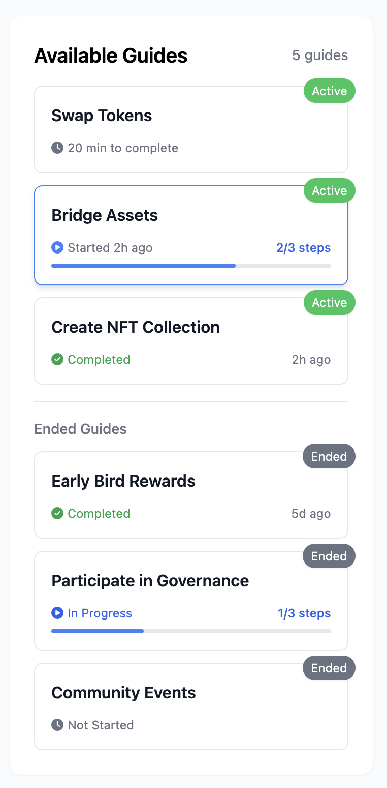{width="2.5833333333333335in" height="5.25in"}

**布局**：

**教程标题**

**教程状态**

根据教程的完成状态, 显示不同的**辅助信息**

**交互**

**教程卡片点击**：点击后滚动至对应教程详情，同时高亮显示选中的卡片

**进度滚动同步**：滚动查看教程时，右侧卡片列表自动同步高亮当前查看的教程

**3.1.2 状态系统**

状态定义表:

  ------------------ -------------- -------------------------------- ---------------------------- ----------------------
  **状态类型**       **状态值**     **定义**                         **触发条件**                 **UI表现**

  **教程活动状态**   活跃           可参与并获得奖励                 当前日期在活动范围内         正常色彩，功能完整

                     已结束         不可参与，仅供参考               超出结束日期或运营手动设置   灰色系，功能受限

  **用户完成状态**   未开始         尚未开始任何步骤                 首次查看教程                 灰色进度条，时钟图标

                     进行中         部分完成任务                     完成至少一个任务             蓝色进度条，播放图标

                     已完成         完成了教程内指定需要完成的操作   用户手动标记完成             勾选图标
  ------------------ -------------- -------------------------------- ---------------------------- ----------------------

状态组合:

  -------------------------- --------------------------------------------
  **组合**                   **主要特点**

  活跃 + 未开始              全功能可用，鼓励开始

  活跃 + 进行中              突出进度，鼓励继续

  活跃 + 已完成              展示完成信息，推荐新教程

  已结束 + 未开始            显示已结束通知，内容参考

  已结束 + 进行中            保留已完成进度，禁用未完成任务

  已结束 + 已完成            显示历史完成信息
  -------------------------- --------------------------------------------

**3.1.3 活跃教程的UI与交互**

**活跃 + 未开始**

**教程详情页:**

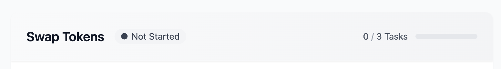{width="5.75in" height="0.7916666666666666in"}

**教程卡片:**

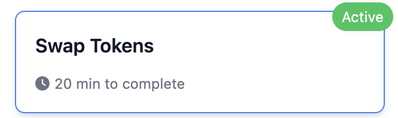{width="3.71875in"
height="1.1041666666666667in"}

**交互行为**

任务完成后自动更新状态为\"进行中\"

**活跃 + 进行中**

**教程详情页:**

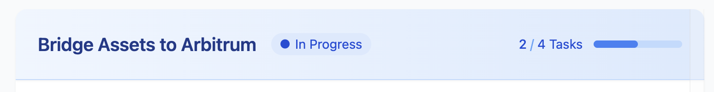{width="5.75in" height="0.7395833333333334in"}

在教程详情页的底部提供**手动标记完成**的按钮:

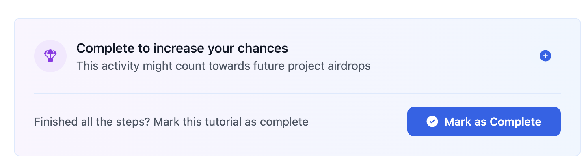{width="5.75in" height="1.6354166666666667in"}

**交互行为:**

若教程内没有任务, 则点击后将教程状态标记为已完成

若教程内有任务, 则点击后, 判断用户是否已完成所有任务:

未完成, 告知用户需要先完成所有任务, 才能标记为完成. 这里缺一个弹窗样式

已完成, 将教程状态标记为已完成

**教程卡片:**

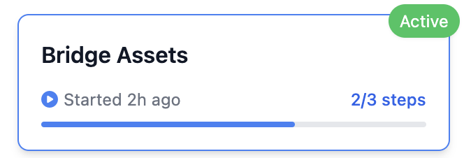{width="5.75in" height="1.9479166666666667in"}

**活跃 + 已完成**

**教程详情页:**

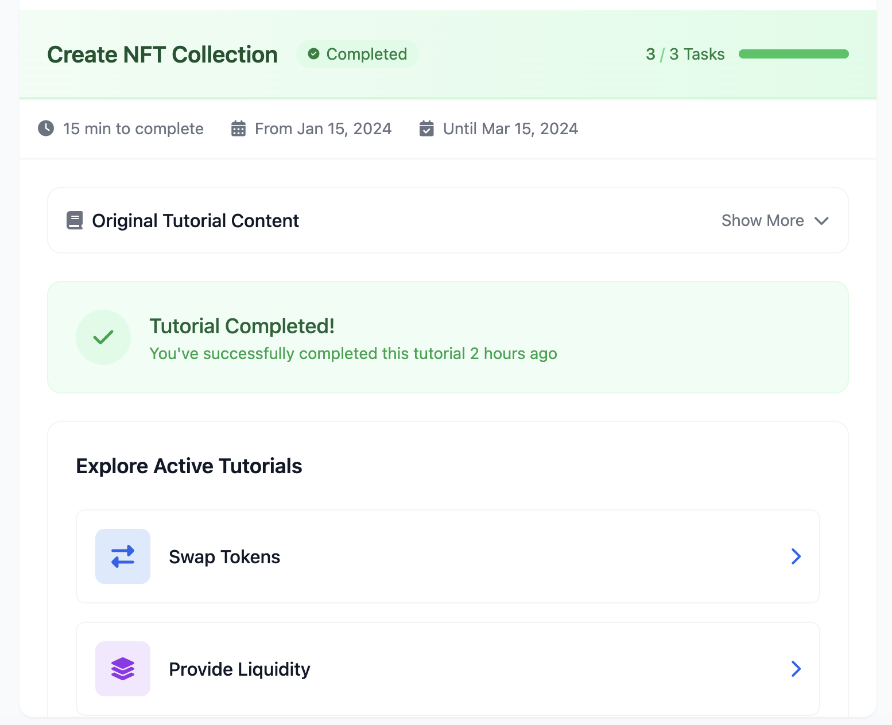{width="4.270833333333333in"
height="3.4791666666666665in"}

**内容展示:**

收起教程

绿色完成标志及完成时间

下一步推荐区域突出显示, 推荐用户参与同一个项目下其他未完成且活跃的教程.
如果没有符合条件的教程, 则不需要显示该模块

**交互行为**

点击教程展开/收起

通过推荐区导航至相关教程

**教程卡片:**

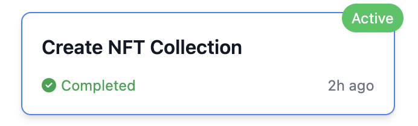{width="4.677083333333333in"
height="1.4270833333333333in"}

**3.1.4 已结束教程的UI与交互**

通用结束状态元素

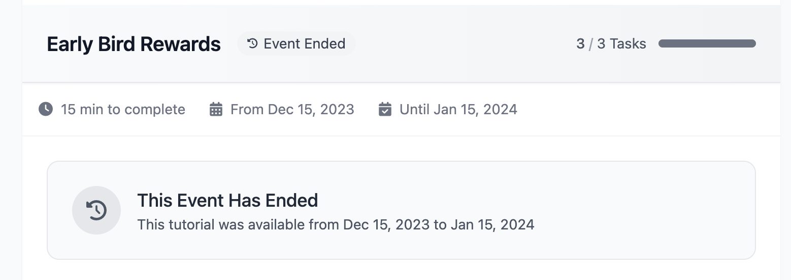{width="5.75in" height="2.0416666666666665in"}

界面布局

教程标题右侧的状态标记为已结束

在教程内容板块中增加结束通知模块

置于内容顶部

显示教程结束时间信息

**已结束 + 未开始**

**教程内容:**

教程标题上隐藏任务进度

教程内容中隐藏所有任务模块

隐藏 Mark as complete 模块

在教程底部显示下一步推荐区域突出显示,
推荐用户参与同一个项目下其他未完成且活跃的教程. 如果没有符合条件的教程,
则不需要显示该模块

**教程卡片:**

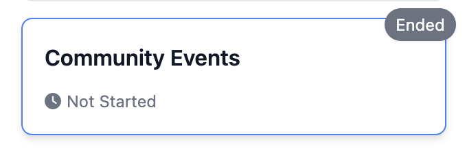{width="5.75in" height="1.8854166666666667in"}

**已结束 + 进行中**

**教程内容:**

禁用所有任务操作按钮

**教程卡片:**

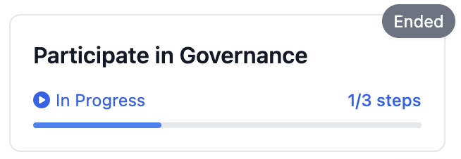{width="4.802083333333333in"
height="1.6666666666666667in"}

**已结束 + 已完成**

**教程内容:**

没变动

**教程卡片:**

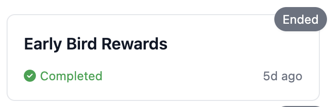{width="5.75in" height="1.8645833333333333in"}

完成标志使用灰绿色

显示完成时间

**3.1.5 数据统计**

需要以教程为维度, 记录以下指标:

  -------------------- --------------------------------------------------
  **指标**             **定义**

  教程浏览人数         查看过教程的用户数

  教程任务参与人数     至少完成过1个任务的用户数

  教程任务完成人数     教程下的任务全部都完成了的用户数

  教程完成人数         用户标记了教程已完成的用户数
  -------------------- --------------------------------------------------

用户标记: user_id

**3.2 Project Detail页头部优化**

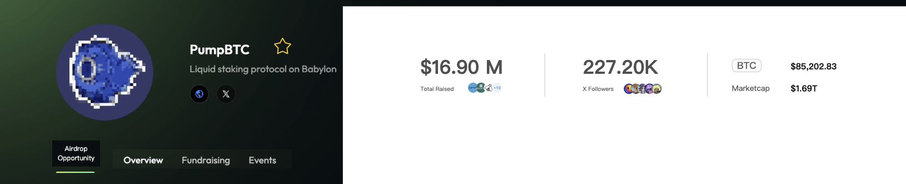{width="5.75in" height="1.1770833333333333in"}

原来放在页面右侧代币, 融资, 推特模块去掉. 将模块的关键信息放在页面头部.

**布局:**

融资模块

融资总额

融资机构

推特模块

推特粉丝

Top Followers

代币模块

Token Symbol

代币价格

代币市值

**3.3 Overview 优化**

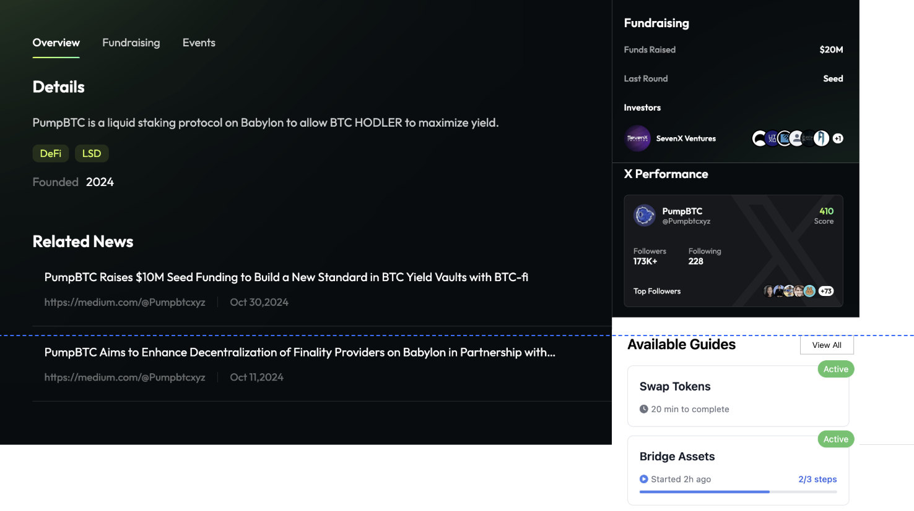{width="5.75in" height="3.21875in"}

**右侧布局:**

原来的 Fund Raising 板块(样式需要重新设计, 强调融资金额)

X performance 板块(样式需要重新设计, 强调粉丝数)

新增 Available Guides 板块, 放活跃且用户未完成的教程,
点击教程卡片后跳转至教程 Tab, 并定位至该教程; 点击 View all 跳转到教程
Tab

**3.4 Fundraising 优化**

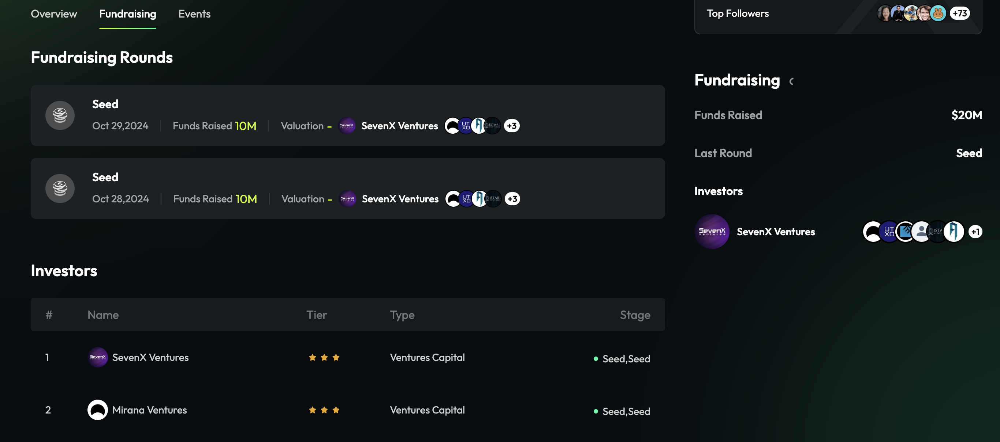{width="5.75in" height="2.5416666666666665in"}

**右侧布局:**

放原来的 Fund Raising 板块(样式需要重新设计, 强调融资金额)

**3.5 去掉 Quest Tab**

如题

4\. **后台管理系统，查看和编辑Tutorial（Sam）**

**准备工作**

运营创建一个新的community，并且该community能在C端隐藏，不可见

后台编辑Tutorial的板块，只有该community能看到和使用

左侧菜单栏如下

Operation下面有Projects和Tutorials两个菜单

Projects后面的数字=在热力图上，并且todo\>0的项目数（默认选项）

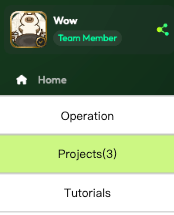{width="1.8125in" height="2.2395833333333335in"}

4.1 **Project列表页**

**进入条件**

左侧菜单栏，点击Projects

**页面布局**

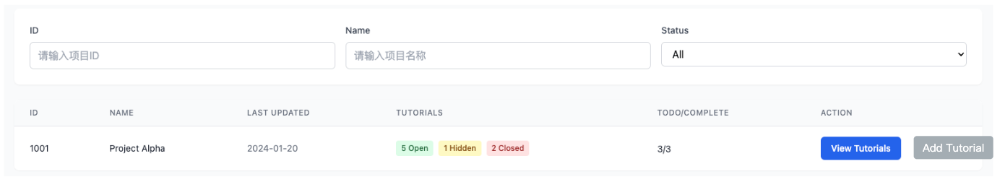{width="5.75in" height="1.0104166666666667in"}

**Project字段表**

ID

Name

Last Updated

Tutorials：Open/Hiden/Closed，比如5/1/2，代表5篇Open、1篇Hiden、2篇Closed

Hiden：所有Tutorial中，标题中带有（Galxe/Layer3/Layer
3/Zealy/Intract/Guild），设置为Hiden，C端不展示

Todo/Complete：3/3，代表3篇todo，3篇complete，todo的定义是Open+Hiden去掉标记为Complete剩下的

Action：操作按钮，按钮一个是View Tutorials，一个是Add Tutorial

**筛选项**

ID：精确搜索

Name：模糊搜索

Status：下拉选择

All：全部Project

Have Tutorial：筛选出有Tutorial的项目

Todo：筛选出todo\>0的项目

Hot：筛选出在热力图上，并且todo\>0的项目（默认选项）

**交互逻辑**

点击View Tutorials，跳转到Tutorial列表页，并设置筛选出该Project

点击Add
Tutorial，打开Tutorial详情页，所有字段初始为空，标题和正文区域为必填，点击Save时创建一篇新的Tutorial

搜索和筛选

4.2 **Tutorial列表页**

**进入条件**

左侧栏点击Tutorials

从Project列表，点击View Tutorial，带着Project ID作为搜索参数，来到该页面

**页面布局**

{width="5.75in" height="1.0208333333333333in"}

**Tutorial字段表**

ID

Name

所属Project ID

Last Updated

Status：Open/Hiden/Closed

Complete：Yes/No

Action：操作按钮，一个是Edit，一个是Change Status，一个是Top

**筛选项**

ID：精确搜索

Name：模糊搜索

Project ID：精确搜索

Status：下拉选择

All：所有Tutorial

Open

Hiden

Closed

Complete：下拉选择

All

Complete

Not Complete

**交互逻辑**

点击Edit按钮，进入Tutorial详情页

点击Change Status，弹窗修改状态

状态只能单选

选择状态后点击Confirm，修改生效

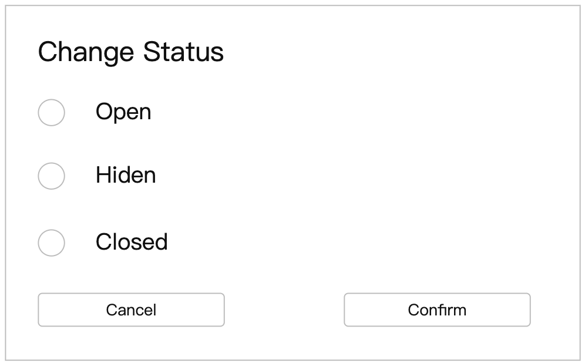{width="5.270833333333333in"
height="3.2708333333333335in"}

点击Top，把该文档放在该Project Tutorial的第一个位置

搜索和筛选功能

4.3 **Tutorial详情页**

**页面布局**

Tutorial Name

时间范围（Optional）

正文区域：富文本编辑器，能直接渲染出来页面样式和task卡片

Add Task按钮

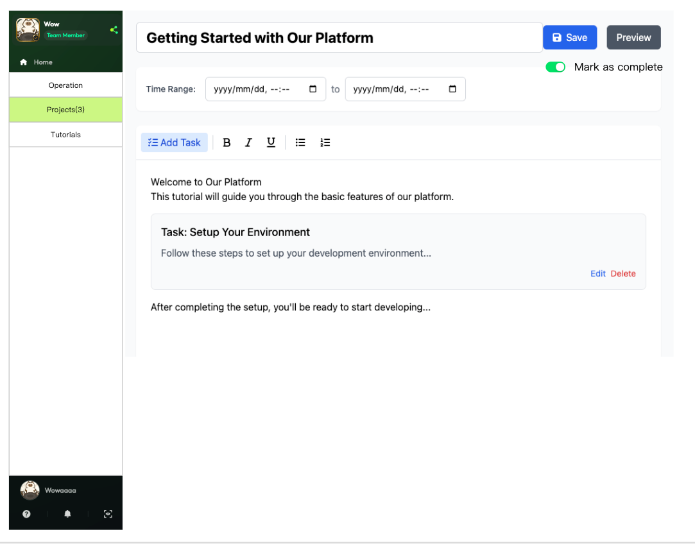{width="5.75in" height="4.5in"}

**交互逻辑**

可以直接编辑标题、时间和正文区域，但是点击Save才保存修改；

如果没有Save，要切换到其他页面，则弹窗提醒用户是否要Save；

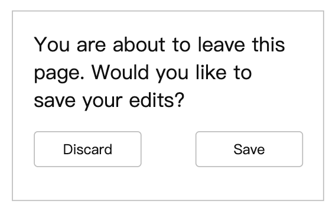{width="5.75in" height="3.59375in"}

点击Preview，打开一个新页面预览C端效果；

不保存技术上是否可以预览？成本高不高？

点击Add Task，右边侧滑出来添加task的组件

右侧点击添加某个task，直接插入在正文区域中光标所在的位置，并且立即收起右侧的添加task组件

其他添加task流程，与当前quest中添加task保持一致

这里添加的task，需要和community中的task一样，有独立的链接和task id

任何task，都可以随时编辑，不做任何限制

加积分的功能暂时禁用掉，后续设计好积分和运营体系再开放

如果添加的task，与任意教程中的某个task的动作和参数完全一致，则不用新建task，而是用相同的task
id，用户只要做完了task，在其他教程中看到同一个task，状态是已完成

> 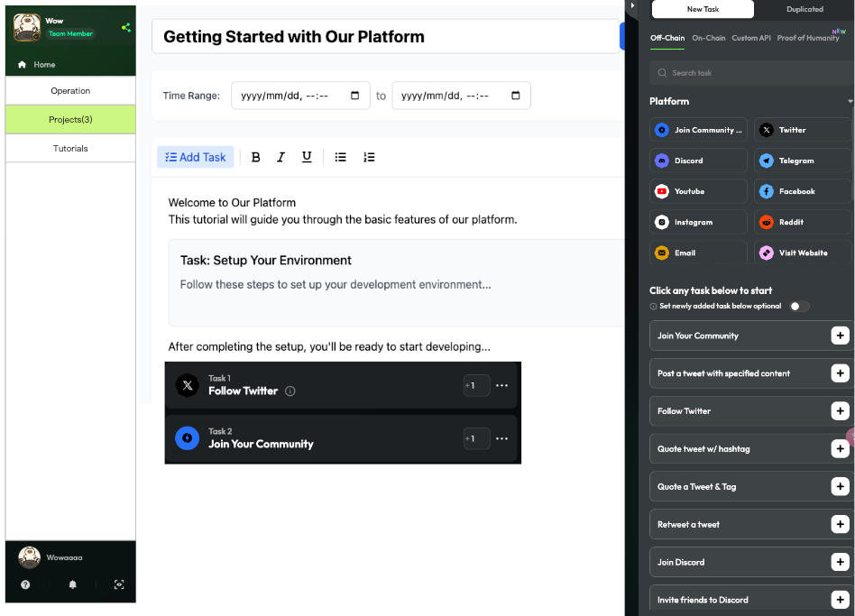{width="5.75in" height="4.135416666666667in"}

点击Save后，保存修改并生效，C端可以立即看到新文档（这里要处理一下缓存机制，要主动清掉C端该Tutorial的缓存）

打开Mark as complete，文档Complete状态变更为Yes，关闭Mark as
complete，文档Complete状态变更为No

5\. **Tutorial分析+Task抓取+Tutorial自动生成**

5.1 **Tutorial分析**

5.2 **Task抓取**

5.3 **Tutorial自动生成**

6\. **项目入驻流程**

7\. **运营体系**

[热点+运营需求](https://ontology.larksuite.com/wiki/EYSTwFQX3iTqdkkCxDzuFVkvskt)

8\. **增加Tutorial数据源**

8.1 **Dropstab**

8.2 **Galxe**
