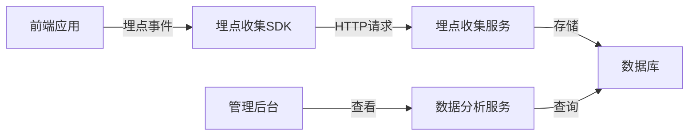

# 埋点技术方案

## 一、方案概述

本方案旨在为Onchain板块和标签&精准推荐系统提供统一的埋点解决方案，确保数据收集的一致性和准确性，同时保持开发成本低、实现难度小。

### 目标需求

根据原始需求文档，主要埋点需求包括：

**Onchain板块**：

- 页面浏览埋点：Onchain落地页访问
- 操作行为埋点：导航栏点击、卡片点击等
- 统计数据：PV/UV、用户行为路径、任务完成率

**标签&精准推荐**：

- 展示和点击统计：View User数量、Click User数量
- 交互数据：展开/收起行为
- 投放效果统计：完成用户数量等

## 二、技术架构

### 整体架构

采用前端触发、后端处理的经典埋点架构：



### 关键组件

1. **前端埋点SDK**：轻量级客户端JS库
2. **埋点收集服务**：专用API接收埋点数据
3. **数据存储**：结构化存储埋点数据
4. **数据分析服务**：实现基本统计和分析
5. **可视化展示**：在管理后台展示分析结果

## 三、埋点事件定义

### 通用事件属性

所有埋点事件共享的基础属性：

| 属性名     | 类型   | 说明                  |
| ---------- | ------ | --------------------- |
| event_id   | String | 事件唯一标识          |
| user_id    | String | 用户ID                |
| timestamp  | Number | 事件时间戳(毫秒)      |
| platform   | String | 平台(web/ios/android) |
| page       | String | 当前页面路径          |
| session_id | String | 会话ID                |

### Onchain板块埋点事件

#### 页面访问事件

| 事件名称  | 触发时机     | 额外字段            | 说明         |
| --------- | ------------ | ------------------- | ------------ |
| page_view | 页面加载完成 | page_name: 页面名称 | 记录页面访问 |

#### 操作行为事件

| 事件名称        | 触发时机   | 额外字段              | 说明           |
| --------------- | ---------- | --------------------- | -------------- |
| navbar_click    | 导航栏点击 | target: 点击目标      | 导航栏交互     |
| card_click      | 卡片点击   | card_id: 卡片ID       | Action卡片点击 |
| action_start    | 开始Action | action_id: ActionID   | 用户开始任务   |
| action_complete | 完成Action | action_id: ActionID   | 用户完成任务   |
| reward_claim    | 领取奖励   | reward_type: 奖励类型 | 用户领取奖励   |

### 标签&精准推荐埋点事件

#### 展示和点击事件

| 事件名称                  | 触发时机               | 额外字段                                                     | 说明              |
| ------------------------- | ---------------------- | ------------------------------------------------------------ | ----------------- |
| recommend_impression      | 推荐内容展示在可视区域 | delivery_id: 投放ID`<br>`content_type: 内容类型            | 统计View User     |
| recommend_click           | 用户点击推荐内容       | delivery_id: 投放ID`<br>`content_type: 内容类型            | 统计Click User    |
| recommend_expand_collapse | 用户展开/收起推荐内容  | delivery_id: 投放ID`<br>`action: 动作类型(expand/collapse) | 记录展开/收起行为 |
| recommend_complete        | 用户完成推荐Action     | delivery_id: 投放ID`<br>`action_id: Action ID              | 统计Complete User |

## 四、埋点实现方案

### 前端实现

采用简单的包装方法实现埋点SDK：

```javascript
// 埋点SDK简化实现
const TrackSDK = {
  // 初始化
  init(config = {}) {
    this.config = {
      apiUrl: '/api/track',
      batchSize: 10,
      ...config
    };
    this.eventQueue = [];
    this.sessionId = this._generateSessionId();
  
    // 定时发送队列中的事件
    setInterval(() => this.flush(), 5000);
  
    // 页面关闭前发送
    window.addEventListener('beforeunload', () => this.flush(true));
  },
  
  // 触发事件
  track(eventName, properties = {}) {
    const event = {
      event_name: eventName,
      user_id: this._getUserId(),
      timestamp: Date.now(),
      platform: 'web',
      page: window.location.pathname,
      session_id: this.sessionId,
      ...properties
    };
  
    this.eventQueue.push(event);
  
    // 达到批量大小则发送
    if (this.eventQueue.length >= this.config.batchSize) {
      this.flush();
    }
  },
  
  // 发送事件到服务器
  flush(isSync = false) {
    if (this.eventQueue.length === 0) return;
  
    const events = [...this.eventQueue];
    this.eventQueue = [];
  
    const sendData = () => {
      fetch(this.config.apiUrl, {
        method: 'POST',
        headers: { 'Content-Type': 'application/json' },
        body: JSON.stringify({ events })
      }).catch(err => {
        console.error('埋点数据发送失败', err);
        // 失败后重新加入队列
        this.eventQueue.push(...events);
      });
    };
  
    if (isSync && navigator.sendBeacon) {
      // 使用sendBeacon保证页面关闭时数据发送
      navigator.sendBeacon(
        this.config.apiUrl, 
        new Blob([JSON.stringify({ events })], { type: 'application/json' })
      );
    } else {
      sendData();
    }
  },
  
  // 生成会话ID
  _generateSessionId() {
    return Date.now().toString(36) + Math.random().toString(36).substr(2);
  },
  
  // 获取用户ID
  _getUserId() {
    // 从全局状态或localStorage获取
    return window.userId || localStorage.getItem('userId') || 'anonymous';
  }
};
```

### 使用示例

```javascript
// 初始化埋点SDK
TrackSDK.init({
  apiUrl: '/api/track',
  batchSize: 10
});

// Onchain页面访问埋点
TrackSDK.track('page_view', { page_name: 'onchain_landing' });

// 导航栏点击埋点
document.querySelector('.navbar-onchain').addEventListener('click', () => {
  TrackSDK.track('navbar_click', { target: 'onchain' });
});

// 推荐内容展示埋点
function trackRecommendImpression(deliveryId, contentType) {
  // 使用IntersectionObserver检测元素可见性
  const observer = new IntersectionObserver((entries) => {
    entries.forEach(entry => {
      if (entry.isIntersecting) {
        TrackSDK.track('recommend_impression', {
          delivery_id: deliveryId,
          content_type: contentType
        });
        observer.disconnect(); // 只触发一次
      }
    });
  });
  
  observer.observe(document.querySelector(`[data-delivery-id="${deliveryId}"]`));
}
```

### 后端API实现

简单的埋点收集API：

```javascript
// Express.js示例
app.post('/api/track', (req, res) => {
  const { events } = req.body;
  
  if (!Array.isArray(events) || events.length === 0) {
    return res.status(400).json({ error: '无效的事件数据' });
  }
  
  // 异步处理埋点数据
  processEvents(events).catch(err => {
    console.error('埋点处理错误', err);
  });
  
  // 立即返回成功，不阻塞用户操作
  res.status(200).json({ success: true });
});

// 处理埋点事件
async function processEvents(events) {
  try {
    // 1. 数据验证和清洗
    const validEvents = events.filter(validateEvent);
  
    // 2. 数据去重 (对于推荐展示和点击事件)
    const deduplicatedEvents = deduplicateEvents(validEvents);
  
    // 3. 批量写入数据库
    await saveEventsToDatabase(deduplicatedEvents);
  
    // 4. 更新实时计数器
    await updateRealTimeCounters(deduplicatedEvents);
  } catch (error) {
    console.error('埋点处理失败', error);
    throw error;
  }
}
```

## 五、数据去重机制

特别针对标签&精准推荐系统的需求，实现数据去重逻辑：

```javascript
// 去重逻辑
function deduplicateEvents(events) {
  const result = [];
  const uniqueKeys = new Set();
  
  for (const event of events) {
    // 对于推荐展示和点击事件，保证同一用户对同一投放只计算一次
    if (event.event_name === 'recommend_impression' || event.event_name === 'recommend_click') {
      const key = `${event.event_name}_${event.user_id}_${event.delivery_id}`;
    
      // 检查内存中是否已处理过
      if (uniqueKeys.has(key)) {
        continue;
      }
    
      // 检查数据库中是否已存在记录（过去24小时内）
      const exists = await checkEventExistence(
        event.event_name, 
        event.user_id, 
        event.delivery_id, 
        24 * 60 * 60 * 1000 // 24小时
      );
    
      if (exists) {
        continue;
      }
    
      uniqueKeys.add(key);
    }
  
    result.push(event);
  }
  
  return result;
}
```

## 六、数据存储方案

采用简单高效的存储方案：

### 数据库表设计

**events表**（用于存储原始事件）：

```sql
CREATE TABLE events (
  id SERIAL PRIMARY KEY,
  event_name VARCHAR(100) NOT NULL,
  user_id VARCHAR(100) NOT NULL,
  timestamp BIGINT NOT NULL,
  platform VARCHAR(20) NOT NULL,
  page VARCHAR(200),
  session_id VARCHAR(100),
  properties JSONB NOT NULL,
  created_at TIMESTAMP DEFAULT CURRENT_TIMESTAMP
);

-- 索引
CREATE INDEX idx_events_user_id ON events (user_id);
CREATE INDEX idx_events_event_name ON events (event_name);
CREATE INDEX idx_events_timestamp ON events (timestamp);
CREATE INDEX idx_events_created_at ON events (created_at);
```

**event_counters表**（用于实时统计）：

```sql
CREATE TABLE event_counters (
  id SERIAL PRIMARY KEY,
  event_name VARCHAR(100) NOT NULL,
  entity_id VARCHAR(100) NOT NULL, -- delivery_id, action_id等
  entity_type VARCHAR(50) NOT NULL, -- 'delivery', 'action'等
  count INT NOT NULL DEFAULT 0,
  unique_users INT NOT NULL DEFAULT 0,
  last_updated TIMESTAMP DEFAULT CURRENT_TIMESTAMP,
  
  UNIQUE (event_name, entity_id, entity_type)
);
```

### 数据分层处理

1. **原始数据层**：存储所有原始埋点事件
2. **聚合数据层**：定时聚合计算各类统计指标
3. **应用数据层**：为业务提供查询服务的预计算视图

## 七、数据查询API

针对运营与B端需求，提供以下API：

### 推荐效果统计API

```
GET /api/stats/delivery/{deliveryId}
```

返回示例：

```json
{
  "delivery_id": "123456",
  "target_users": 5000,
  "viewed_users": 3200,
  "clicked_users": 850,
  "completed_users": 320,
  "view_rate": 0.64,
  "click_rate": 0.27,
  "completion_rate": 0.10,
  "daily_stats": [
    {"date": "2023-05-01", "views": 750, "clicks": 200, "completions": 75},
    {"date": "2023-05-02", "views": 820, "clicks": 220, "completions": 82}
  ]
}
```

### Onchain任务统计API

```
GET /api/stats/action/{actionId}
```

返回示例：

```json
{
  "action_id": "789012",
  "page_views": 9500,
  "card_clicks": 2800,
  "starts": 1200,
  "completions": 950,
  "conversion_rate": 0.79,
  "daily_stats": [
    {"date": "2023-05-01", "views": 2000, "starts": 300, "completions": 240},
    {"date": "2023-05-02", "views": 1800, "starts": 280, "completions": 210}
  ]
}
```

## 八、实施计划

### 基础埋点框架

1. 设计并开发前端埋点SDK
2. 实现基础埋点收集API
3. 搭建数据存储基础架构
4. 实现通用埋点事件（页面访问、点击等）

### 业务埋点实现

1. 实现Onchain板块特定埋点
2. 实现标签&精准推荐埋点
3. 实现数据去重和质量控制逻辑
4. 开发基础统计API

### 数据分析统计

1. 实现数据聚合和统计功能
2. 开发运营后台数据展示
3. 开发B端数据展示

## 九、注意事项

1. **性能考虑**：

   - 客户端埋点采用批量发送减少请求数
   - 服务端异步处理避免阻塞
   - 适当使用缓存减少数据库压力
2. **数据准确性**：

   - 确保事件去重逻辑正确实现
   - 设置合理的会话周期（如24小时）
   - 防抖机制避免短时间重复触发
3. **数据安全**：

   - 不采集用户敏感信息
   - 数据传输采用HTTPS
   - 实施适当的数据访问控制
4. **扩展性**：

   - 埋点事件定义支持灵活扩展
   - 存储方案考虑未来数据量增长
   - API设计预留扩展参数

## 十、总结

本技术方案提供了一个简单、低成本的埋点解决方案，能够满足Onchain板块和标签&精准推荐系统的基本埋点需求。方案采用轻量级前端SDK和简单的后端API，通过批量处理和去重机制确保数据的准确性和效率，同时提供了必要的数据分析API支持业务需求。

实施过程分为三个阶段，预计总工期3周，可以根据实际情况进行调整和优化。
