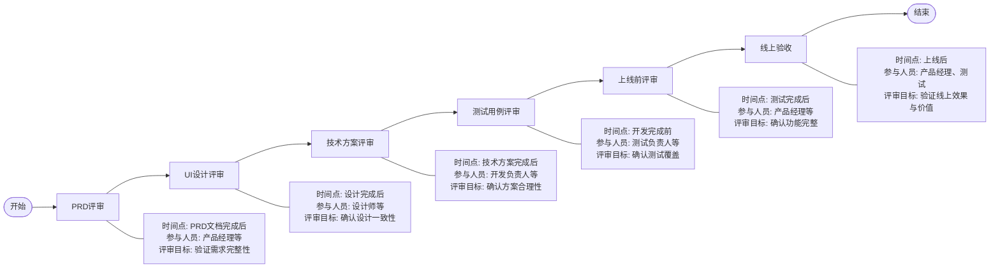
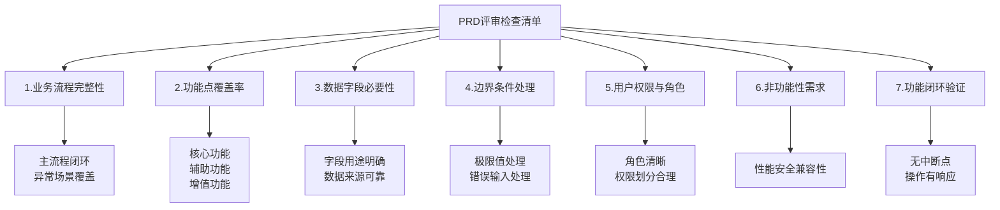
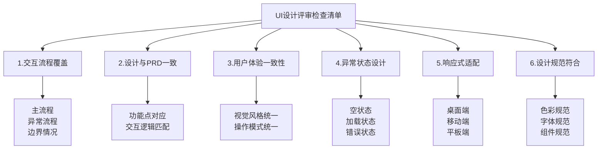
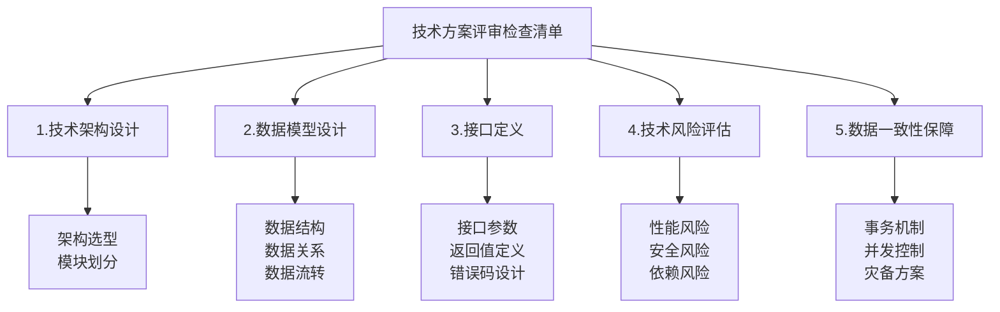
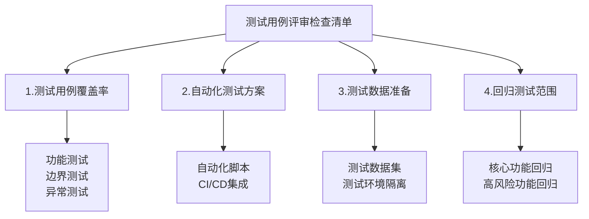
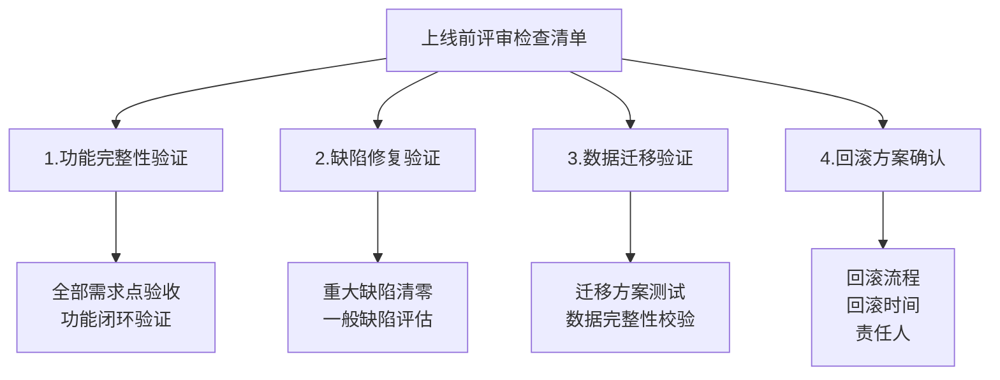
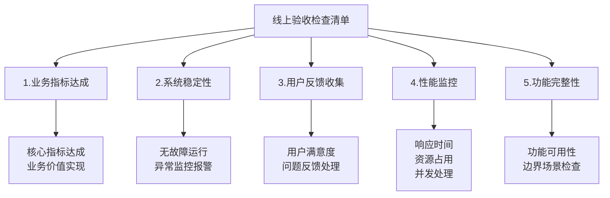
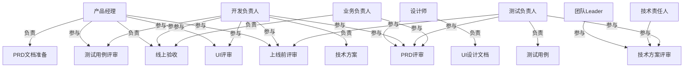
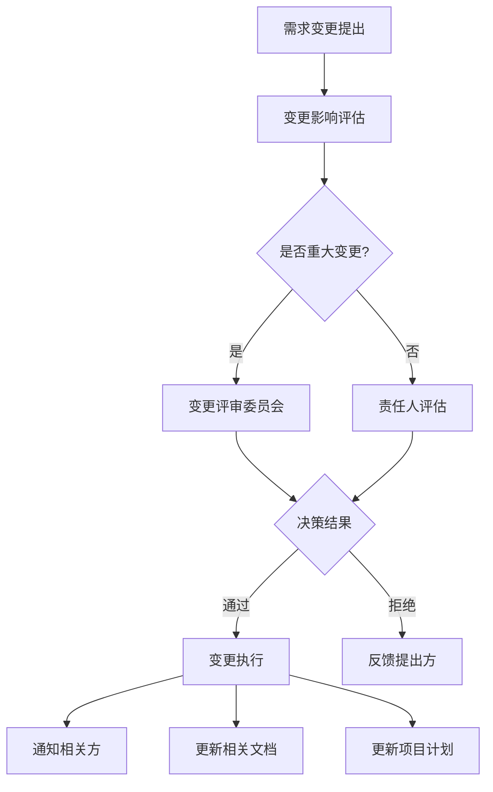
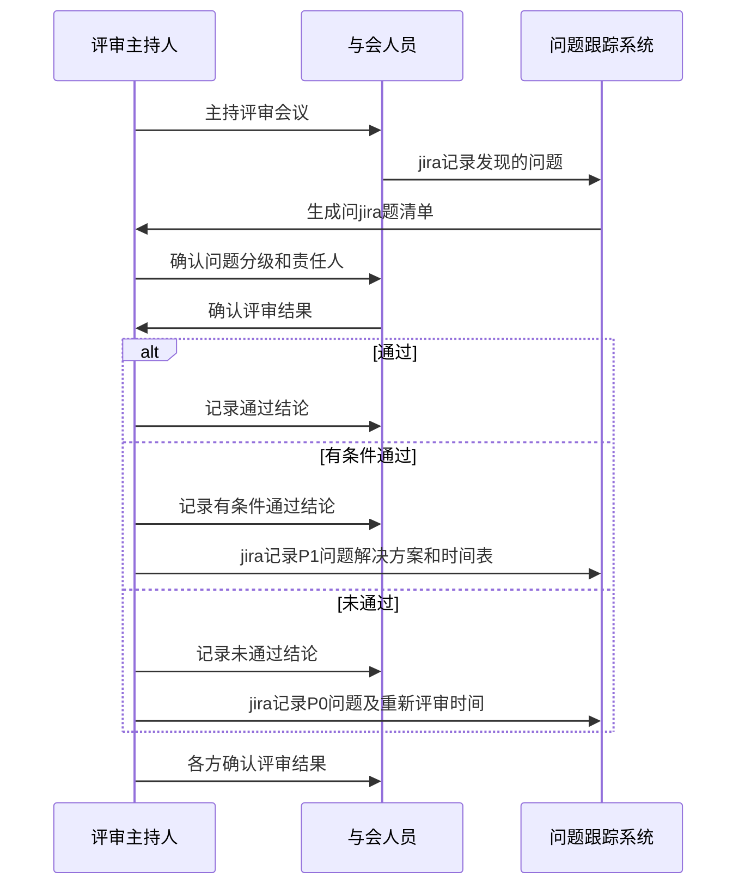

# 软件开发评审流程图

## 一、分阶段评审流程

## 二、各阶段评审检查清单

### PRD评审检查清单

### UI设计评审检查清单

### 技术方案评审检查清单

### 测试用例评审检查清单

### 上线前评审检查清单

### 线上验收检查清单

## 三、问题跟踪与状态流转

### 问题状态流转图

### 评审结果状态流转

## 四、角色与职责

## 五、变更管理流程

## 六、评审结果确认机制

