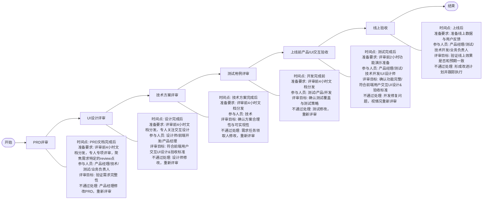
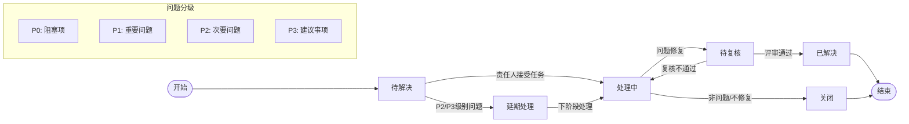
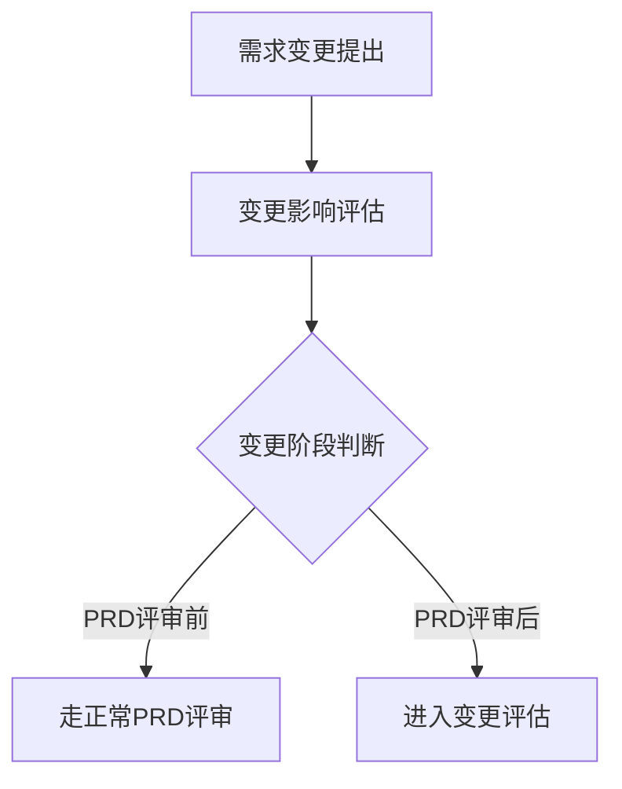
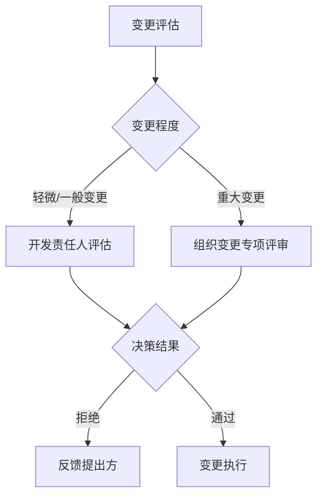
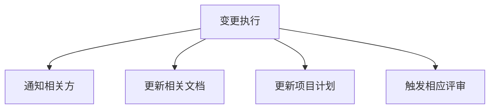
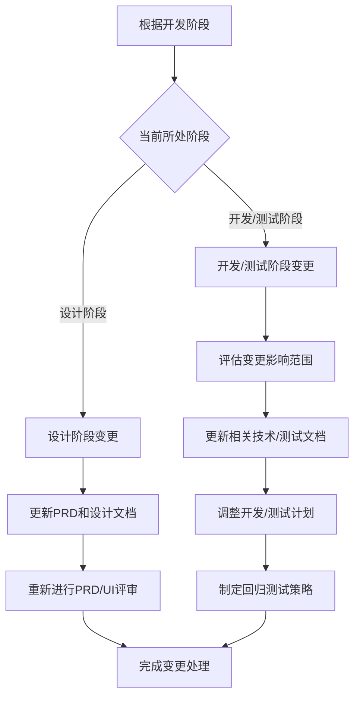
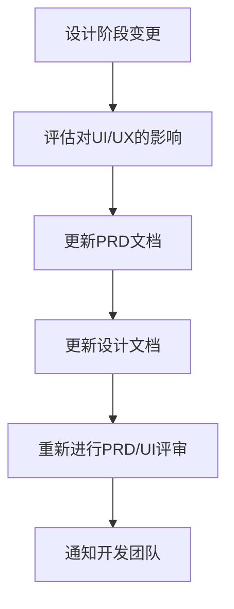
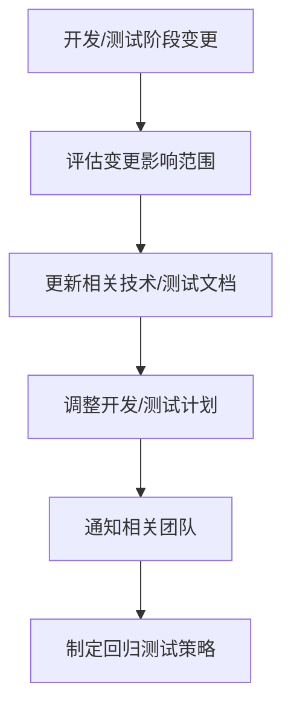
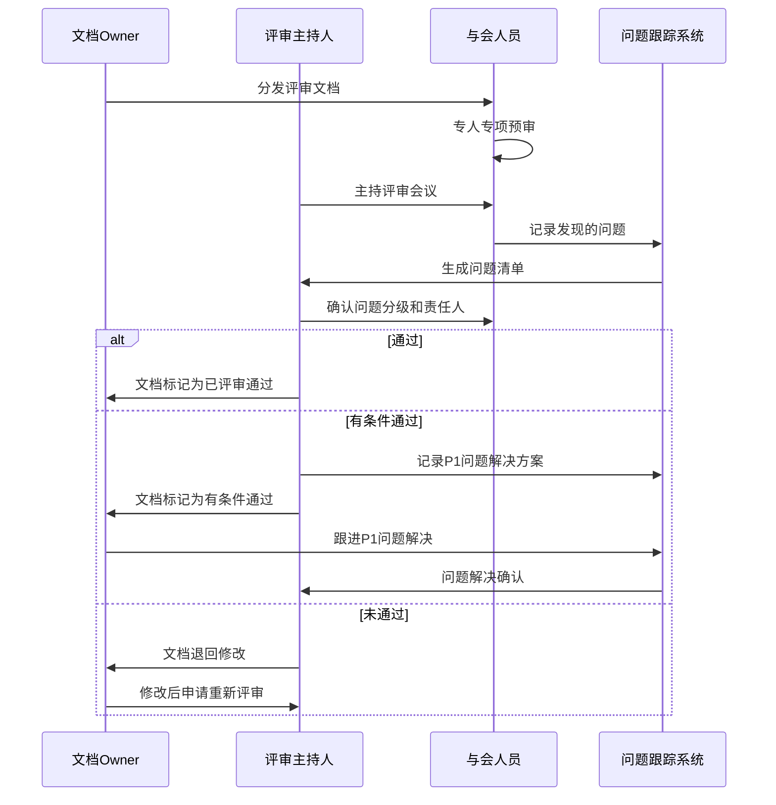

# 需求开发评审流程图

## 一、分阶段评审验收流程

## 二、各阶段评审检查清单

### PRD评审检查清单

[PRD评审表](https://github.com/Taskon-xyz/PR/edit/main/PRD%E8%AF%84%E5%AE%A1%E8%A1%A8.md)

### UI设计评审检查清单

[前端用户交互UI设计&amp;验收标准](https://github.com/Taskon-xyz/PR/blob/main/%E5%89%8D%E7%AB%AF%E7%94%A8%E6%88%B7%E4%BA%A4%E4%BA%92UI%E8%AE%BE%E8%AE%A1%26%E9%AA%8C%E6%94%B6%E6%A0%87%E5%87%86.md)

### 技术方案评审检查清单

[技术方案评审表](https://github.com/Taskon-xyz/PR/blob/main/%E6%8A%80%E6%9C%AF%E6%96%B9%E6%A1%88%E8%AF%84%E5%AE%A1%E8%A1%A8.md)

### 测试准入标准检查清单

[测试准入标准（开发联调输出质量）](测试准入标准（开发联调输出质量）.md)

### 测试准出标准检查清单

[测试准出标准（可发生产）](测试准出标准.md)

### 测试用例评审检查清单

[测试计划评审表](https://github.com/Taskon-xyz/PR/blob/main/%E6%B5%8B%E8%AF%95%E8%AE%A1%E5%88%92%E8%AF%84%E5%AE%A1%E8%A1%A8.md)

## 三、问题跟踪与状态流转

### 问题状态流转图

### 需求评审结果状态流转

## 四、角色与职责

```mermaid
flowchart TB
    PM[产品经理] -->|负责| PRD[PRD文档准备]
    PM -->|参与| UI_Review[UI评审]
    PM -->|参与| Test_Review[测试用例评审]
    PM -->|参与| Launch_Review[上线前评审]
    PM -->|负责| Online_Review[线上验收]
    PM -->|负责| PRD_Quality["PRD业务价值与完整性把关"]
  
    Design[设计师] -->|负责| UI_Doc[UI设计文档]
    Design -->|参与| PRD_Review[PRD评审]
    Design -->|负责| UI_Quality["UI交互与用户体验把关"]
  
    Dev[开发负责人] -->|负责| Tech_Doc[技术方案]
    Dev -->|参与| PRD_Review
    Dev -->|参与| UI_Review
    Dev -->|参与| Test_Review
    Dev -->|参与| Launch_Review
    Dev -->|参与| Online_Review
    Dev -->|负责| Tech_Quality["技术可行性与工作量评估把关"]
  
    TL[团队Leader] -->|参与| Tech_Review[技术方案评审]
    TR[技术责任人] -->|参与| Tech_Review
  
    Test[测试负责人] -->|负责| Test_Case[测试用例]
    Test -->|参与| PRD_Review
    Test -->|参与| Tech_Review
    Test -->|参与| Launch_Review
    Test -->|负责| Test_Quality["测试验证与边界条件把关"]
  
    Biz[业务负责人] -->|参与| PRD_Review
    Biz -->|负责| Online_Review
    Biz -->|负责| Biz_Quality["业务流程与规则把关"]
```

## 五、需求变更管理流程

### 5.0 需求变更定义与界定

#### 需求变更的定义

需求变更是指在需求被正式评审通过后，对需求内容进行的任何修改、增加或删除。包括但不限于：

- 功能范围的变化（增加、删除或修改功能点）
- 非功能性需求的变化（性能、安全性、可用性等要求的调整）
- 业务规则或流程的变化
- 用户界面或交互设计的重大调整
- 数据结构或接口定义的变化

#### 需求变更类型界定

| 变更类型           | 定义                                                                   | 示例                                                       | 处理方式                   |
| ------------------ | ---------------------------------------------------------------------- | ---------------------------------------------------------- | -------------------------- |
| **轻微变更** | 不影响系统架构、核心流程和项目排期，工作量调整<1H（阈值需要商量再定）  | UI文案修改、非关键字段调整、局部交互优化                   | 开发责任人评估后可直接实施 |
| **一般变更** | 影响局部功能但不改变架构和核心流程，工作量1h-1人天（阈值需要商量再定） | 增加非核心功能点、调整数据验证规则、修改次要业务流程       | 需变更评估和项目经理审批   |
| **重大变更** | 影响系统架构、核心流程或关键接口，工作量>=2人天（阈值需要商量再定）    | 修改核心业务逻辑、架构调整、关键接口变更、新增主要功能模块 | 需组织变更专项评审         |

#### 需求变更启动条件

在以下情况下需要启动正式的需求变更流程：

1. PRD正式评审通过后的任何需求调整
2. UI设计评审通过后的重大界面或交互变更
3. 开发工作量变化超过原计划20%的情况
4. 影响系统核心功能或业务规则的任何变更

#### 无需变更流程的情况

以下情况可视为需求澄清而非变更，无需启动正式变更流程：

1. 对已有需求的细节解释和澄清（不改变原需求意图）
2. 修复需求文档中的明显错误或不一致
3. 对非关键UI元素的微调（不影响用户操作流程）
4. 在保持功能本质不变的情况下对文案或提示的优化

### 5.1 需求变更基本流程

### 5.2 需求变更评估决策

### 5.3 需求变更执行流程

### 5.4 需求各阶段变更处理方式

### 5.4.1 设计阶段变更处理

### 5.4.2 开发/测试阶段变更处理

## 六、评审结果确认机制

## 七、专人专项审核与文档把关规定

| 角色                                      | 专项审核重点                           | 关注评审项                             | 介入要求                              |
| ----------------------------------------- | -------------------------------------- | -------------------------------------- | ------------------------------------- |
| review具体需求点的任务领取人              | 需求完整性，明确性，技术可行性         | 功能需求、业务流程、数据需求、需求描述 | 提前4小时审核文档，评估技术实现可行性 |
| UI设计师/review具体需求点的前端任务领取人 | 交互体验、页面流程、设计一致性         | 交互设计、异常处理                     | 提前4小时审核文档，关注UI交互部分     |
| 测试负责人/技术负责人                     | 可验证性、可测试性、边界条件、异常场景 | 功能需求、业务流程、异常处理           | 提前4小时审核文档，关注测试验证方案   |
