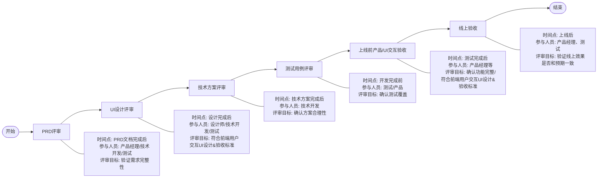
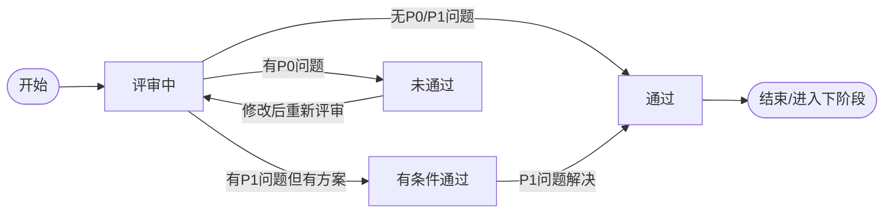
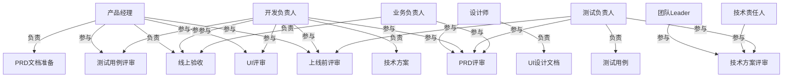
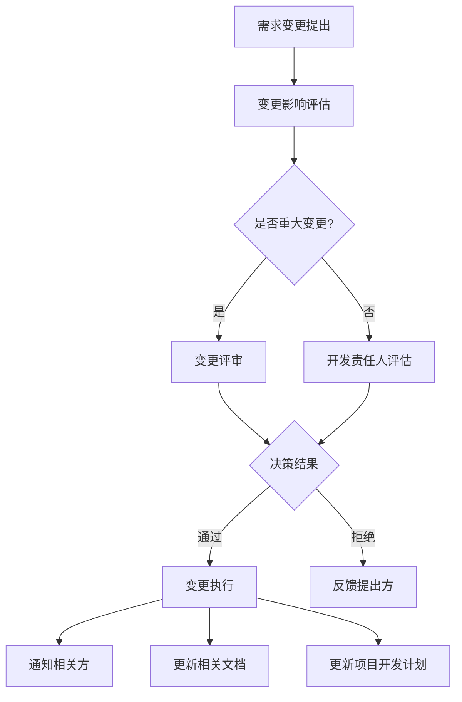
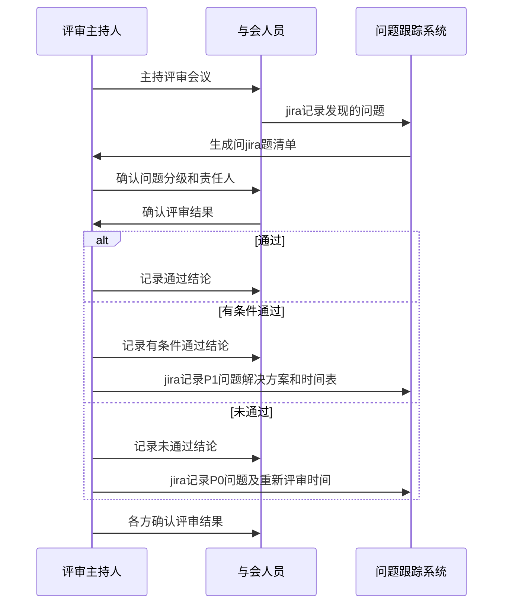

# 需求开发评审流程图

## 一、分阶段评审验收流程

## 二、各阶段评审检查清单

### PRD评审检查清单

[PRD评审表](https://github.com/Taskon-xyz/PR/edit/main/PRD%E8%AF%84%E5%AE%A1%E8%A1%A8.md)

### UI设计评审检查清单

[前端用户交互UI设计标准](https://github.com/Taskon-xyz/PR/blob/main/%E5%89%8D%E7%AB%AF%E7%94%A8%E6%88%B7%E4%BA%A4%E4%BA%92UI%E8%AE%BE%E8%AE%A1%26%E9%AA%8C%E6%94%B6%E6%A0%87%E5%87%86.md)

### 技术方案评审检查清单

[技术方案评审表](https://github.com/Taskon-xyz/PR/blob/main/%E6%8A%80%E6%9C%AF%E6%96%B9%E6%A1%88%E8%AF%84%E5%AE%A1%E8%A1%A8.md)

### 测试准入标准检查清单

[测试准入标准（开发联调输出质量）](测试准入标准（开发联调输出质量）.md)

### 测试准出标准检查清单

[测试准出标准（可发生产）](测试准出标准.md)

### 测试用例评审检查清单

[测试计划评审表](https://github.com/Taskon-xyz/PR/blob/main/%E6%B5%8B%E8%AF%95%E8%AE%A1%E5%88%92%E8%AF%84%E5%AE%A1%E8%A1%A8.md)

## 三、问题跟踪与状态流转

### 问题状态流转图

### 评审结果状态流转

## 四、角色与职责

## 五、变更管理流程

## 六、评审结果确认机制

