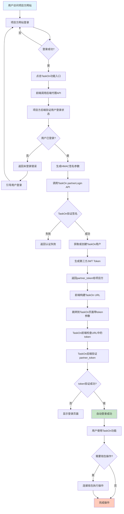
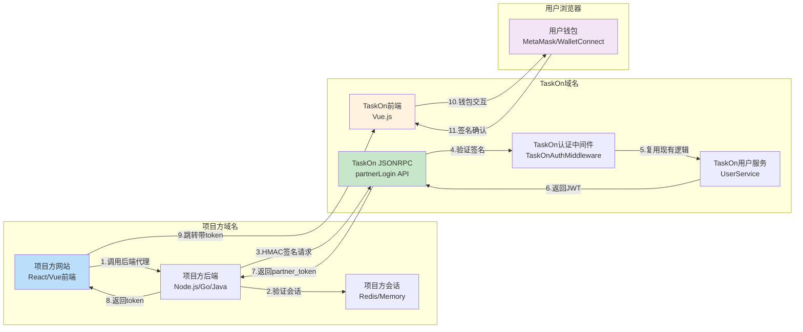
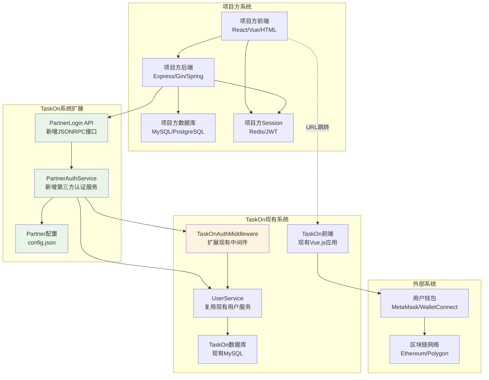
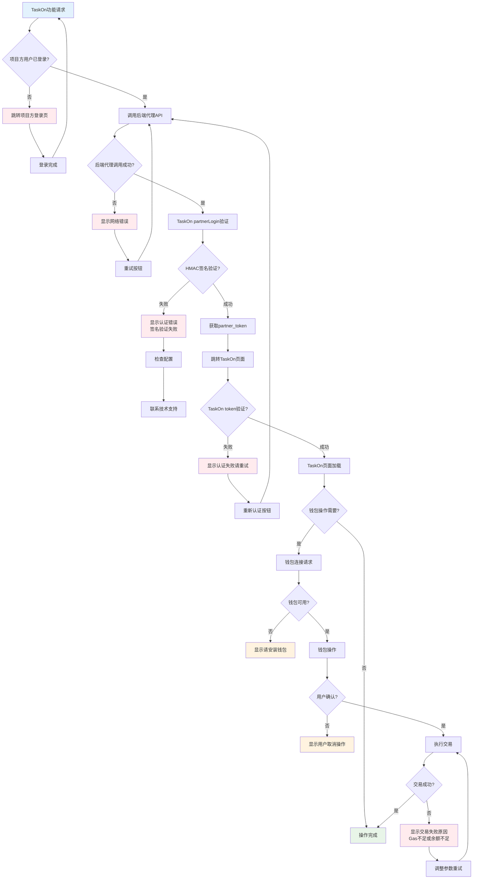
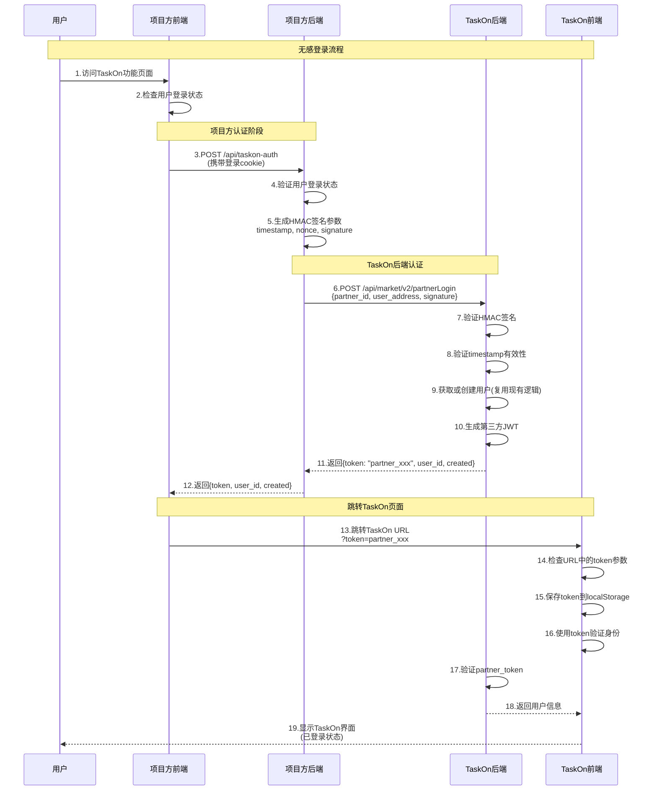
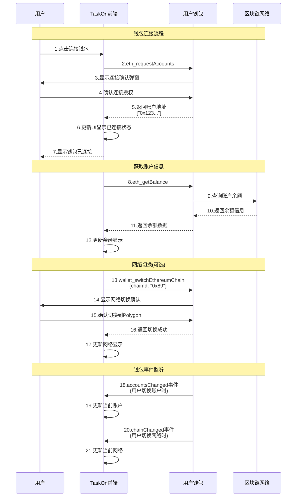
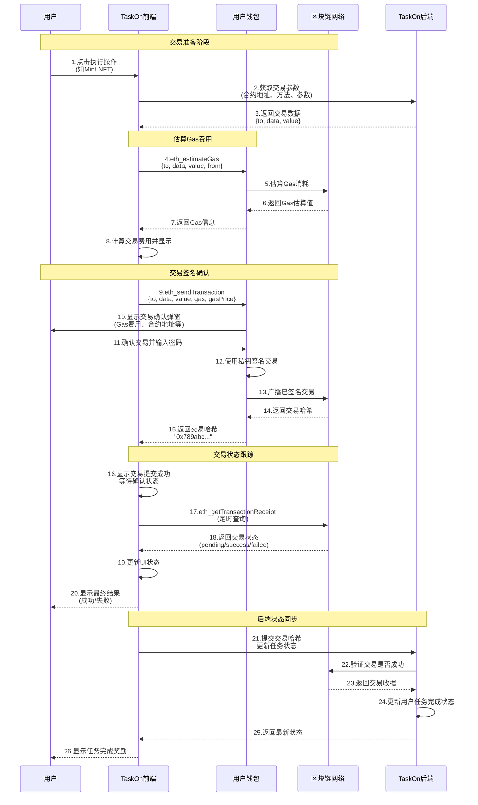

# TaskOn 项目方嵌入无感登录技术改造方案（完整版）

## 对比分析：为什么需要重新设计方案

### 问题分析
经过深入分析实际代码，发现之前的两个方案都存在重大问题：

1. **架构理解偏差**：
   - 误以为TaskOn使用标准HTTP路由，实际使用自定义JSONRPC系统
   - 中间件处理方式理解错误，实际有独立的JSONRPC中间件系统

2. **技术栈不匹配**：
   - 提供的装饰器代码不符合实际的Chi路由器架构
   - 没有考虑TaskOn特有的认证流程和用户服务架构

3. **前端方案脱离实际**：
   - 没有考虑TaskOn网站的实际钱包连接体系
   - iframe跨域方案过于复杂且不贴合实际需求

## 1. 实际架构分析

### 1.1 TaskOn认证架构（实际代码）

```go
// main.go 中的实际配置
httpSvr := httpserver.NewHttpServer(&httpserver.HttpServerOptions{
    HttpMiddlewares: []func(http.Handler) http.Handler{
        auth.TaskOnAuthMiddleware(), // 现有认证中间件
    },
    HttpJsonRpcHandler: common.DefaultTaskOnJsonRpcHandler,
})
```

### 1.2 JSONRPC路由系统（实际代码）

```go
// api/jsonrpc/handler_market.go 中的实际注册方式
func init() {
    // Login handlers
    common.MarketHandlerRegistry.Registry("requestChallenge", login.RequestChallenge)
    common.MarketHandlerRegistry.Registry("snsLogin", login.SNSLogin)
    common.MarketHandlerRegistry.Registry("submitChallenge", login.AddressLogin)
}
```

### 1.3 用户认证流程（实际代码）

```go
// service/user/user_service.go 中的实际认证
func (svr *UserService) AuthVerification(token string, r *http.Request) (*store.UserInfo, *store.UserSession, int64, error) {
    _, jwtRequestOrigin, userId, operatedBy, err := svr.parseJWTToken(token)
    // ... 现有认证逻辑
}
```

## 2. 最小侵入技术方案（基于实际架构）

### 2.1 核心设计原则

- **零修改现有代码**：通过扩展现有系统实现新功能
- **复用现有架构**：利用TaskOn现有的JSONRPC和认证系统
- **向后兼容**：确保现有用户和API完全不受影响
- **可快速回滚**：可以随时禁用新功能

### 2.2 技术架构设计

```
项目方网站 ←→ 项目方后端代理 ←→ TaskOn新增第三方认证API ←→ TaskOn现有用户系统
```

## 3. 具体实现方案

### 3.1 TaskOn认证中间件扩展（最小修改）

#### 📝 **修改内容说明**：
- **文件路径**: `api/auth/auth.go`
- **修改类型**: 扩展现有函数
- **修改范围**: 在现有`TaskOnAuthMiddleware`函数中添加第三方token检查逻辑
- **用途**: 使现有认证中间件支持第三方`partner_`开头的token，同时保持对现有token的完全兼容
- **风险评估**: 极低风险，只是增加了一个新的token类型判断分支，不影响现有逻辑

#### 💡 **技术原理**：
在现有认证中间件中添加一个新的判断分支，当检测到`partner_`开头的token时，调用新的第三方认证逻辑，否则走原有认证流程。这样确保现有用户完全不受影响。

**修改文件**: `api/auth/auth.go`

```go
// 在现有 TaskOnAuthMiddleware 函数中添加第三方token检查
func TaskOnAuthMiddleware() func(http.Handler) http.Handler {
    return func(next http.Handler) http.Handler {
        return http.HandlerFunc(func(w http.ResponseWriter, r *http.Request) {
            token := r.Header.Get("Authorization")
            // Allow unauthenticated users in
            if token == "" {
                next.ServeHTTP(w, r)
                return
            }
            if token == "Bearer forOuterApi" {
                next.ServeHTTP(w, r)
                return
            }

            // 🆕新增：检查第三方token
            // 用途：支持项目方集成的无感登录功能
            // 原理：当token以"partner_"开头时，使用第三方认证逻辑
            if strings.HasPrefix(token, "Bearer partner_") {
                userInfo, userSession, operatedBy, err := loadPartnerUser(token, r)
                if err != nil {
                    handleAuthError(w, err)
                    return
                }
                setUserContext(w, r, next, userInfo, userSession, operatedBy)
                return
            }

            // 现有认证逻辑（完全不变）
            // 用途：处理所有现有用户的正常登录token
            userInfo, userSession, operatedBy, err := loadUser(token, r)
            if err != nil {
                handleAuthError(w, err)
                return
            }
            setUserContext(w, r, next, userInfo, userSession, operatedBy)
        })
    }
}

// 🆕新增函数：第三方用户加载函数
// 用途：处理第三方token的用户认证，复用现有认证接口
// 参数：token - 第三方JWT token，r - HTTP请求对象
// 返回：用户信息、会话信息、操作者ID、错误信息
func loadPartnerUser(token string, r *http.Request) (*store.UserInfo, *store.UserSession, int64, error) {
    partnerService := user.NewPartnerAuthService()
    return partnerService.AuthVerification(token, r)
}

// 🆕新增函数：提取公共逻辑
// 用途：统一处理用户上下文设置，避免代码重复
// 原理：将用户信息、会话信息设置到HTTP请求上下文中，供后续处理使用
func setUserContext(w http.ResponseWriter, r *http.Request, next http.Handler, userInfo *store.UserInfo, userSession *store.UserSession, operatedBy int64) {
    if userInfo != nil {
        // 记录用户访问行为（复用现有逻辑）
        if err := user.GlobalUserService.OnUserPageVisited(userInfo.GetUserId()); err != nil {
            log.Warn("OnUserPageVisited failed", "userId", userInfo.GetUserId(), "error", err)
        }
    }
    // 设置用户上下文（供后续API调用使用）
    ctx := context.WithValue(r.Context(), UserInfoKey, userInfo)
    ctx = context.WithValue(ctx, UserSessionKey, userSession)
    ctx = context.WithValue(ctx, OperatedByKey, operatedBy)
    next.ServeHTTP(w, r.WithContext(ctx))
}

// 🆕新增函数：统一错误处理
// 用途：统一处理认证失败的错误响应，避免代码重复
// 原理：根据错误类型返回相应的HTTP状态码和错误信息
func handleAuthError(w http.ResponseWriter, err error) {
    if taskonerror.Code(err) == taskonerror.NEED_LOGIN {
        w.WriteHeader(http.StatusForbidden)
        _, _ = fmt.Fprintln(w, `{"message":"invalid jwt token, please login again"}`)
    } else {
        w.WriteHeader(http.StatusInternalServerError)
        data, _ := json.Marshal(err)
        _, _ = fmt.Fprintln(w, string(data))
    }
}
```

### 3.2 第三方认证服务实现（完全新增）

#### 📝 **新增内容说明**：
- **文件路径**: `service/user/partner_auth_service.go`
- **修改类型**: 完全新增文件
- **用途**: 专门处理第三方项目的认证逻辑，包括JWT解析、签名验证、用户获取等
- **设计原理**: 采用适配器模式，复用现有的`UserService`和用户存储逻辑，确保与现有系统完全兼容
- **核心功能**: 
  1. 解析和验证第三方JWT token
  2. 验证HMAC签名确保请求来源合法
  3. 复用现有用户系统获取用户信息
  4. 生成临时会话适配现有认证架构

**新增文件**: `service/user/partner_auth_service.go`

```go
package user

import (
    "crypto/hmac"
    "crypto/sha256"
    "encoding/hex"
    "encoding/json"
    "fmt"
    "net/http"
    "strconv"
    "strings"
    "time"

    "github.com/golang-jwt/jwt"
    "github.com/Taskon-xyz/taskon-server/common/config"
    "github.com/Taskon-xyz/taskon-server/common/log"
    "github.com/Taskon-xyz/taskon-server/common/taskonerror"
    "github.com/Taskon-xyz/taskon-server/store"
)

// PartnerAuthService 第三方认证服务
// 用途：专门处理项目方集成的认证逻辑，复用现有UserService
// 设计原理：适配器模式，包装现有用户服务，不修改原有代码
type PartnerAuthService struct {
    userService *UserService  // 复用现有用户服务
    storage     *store.TaskonStore  // 复用现有存储
}

// NewPartnerAuthService 创建第三方认证服务实例
// 用途：工厂方法，确保服务实例正确初始化
func NewPartnerAuthService() *PartnerAuthService {
    return &PartnerAuthService{
        userService: GlobalUserService,  // 复用全局用户服务
        storage:     store.GlobalTaskonStore,  // 复用全局存储
    }
}

// AuthVerification 第三方Token认证（适配现有接口）
// 用途：验证第三方JWT token并返回用户信息，完全适配现有认证接口
// 参数：tokenStr - 完整的Authorization header值，r - HTTP请求对象
// 返回：用户信息、会话信息、操作者ID、错误信息（与现有认证接口完全一致）
// 工作流程：解析JWT → 验证请求 → 获取用户 → 创建会话
func (s *PartnerAuthService) AuthVerification(tokenStr string, r *http.Request) (*store.UserInfo, *store.UserSession, int64, error) {
    // 1. 解析第三方token（去除"Bearer partner_"前缀）
    partnerToken := strings.TrimPrefix(tokenStr, "Bearer partner_")
    
    // 2. 验证JWT token
    claims, err := s.parsePartnerJWT(partnerToken)
    if err != nil {
        log.Error("PartnerAuthService parsePartnerJWT failed", "token", partnerToken, "error", err)
        return nil, nil, 0, taskonerror.New(taskonerror.NEED_LOGIN)
    }
    
    // 3. 验证Origin和时间戳（确保请求来源合法）
    if err := s.validatePartnerRequest(claims, r); err != nil {
        log.Error("PartnerAuthService validatePartnerRequest failed", "claims", claims, "error", err)
        return nil, nil, 0, taskonerror.New(taskonerror.NEED_LOGIN)
    }
    
    // 4. 复用现有UserService获取用户信息
    userInfo, err := s.userService.GetUserInfoByUserId(claims.UserID)
    if err != nil {
        log.Error("PartnerAuthService GetUserInfoByUserId failed", "userId", claims.UserID, "error", err)
        return nil, nil, 0, taskonerror.Errorf(taskonerror.INTERNAL_ERROR, err.Error())
    }
    
    if userInfo == nil {
        log.Error("PartnerAuthService user not found", "userId", claims.UserID)
        return nil, nil, 0, taskonerror.Errorf(taskonerror.INTERNAL_ERROR, "invalid userId")
    }
    
    // 5. 获取完整用户信息（复用现有逻辑）
    fullUserInfo, err := userInfo.GetFullUserInfo()
    if err != nil {
        log.Error("PartnerAuthService GetFullUserInfo failed", "userId", claims.UserID, "error", err)
        return nil, nil, 0, taskonerror.Errorf(taskonerror.INTERNAL_ERROR, err.Error())
    }
    
    // 6. 创建临时会话（适配现有架构）
    session := &store.UserSession{
        UserId:     claims.UserID,
        SessionKey: fmt.Sprintf("partner_%s_%d", claims.PartnerID, time.Now().Unix()),
        Status:     store.UserSessionStatusOnline,
        LoginType:  store.LoginTypeAddress, // 使用现有登录类型
        CreateTime: time.Now(),
    }
    
    return fullUserInfo, session, 0, nil
}

// PartnerJWTClaims 第三方JWT Claims结构
// 用途：定义第三方JWT token中包含的用户信息结构
// 字段说明：
//   - UserID: TaskOn系统中的用户ID
//   - PartnerID: 项目方标识符
//   - UserAddress: 用户钱包地址
//   - OriginDomain: 请求来源域名（用于安全验证）
type PartnerJWTClaims struct {
    UserID      int64  `json:"user_id"`
    PartnerID   string `json:"partner_id"`
    UserAddress string `json:"user_address"`
    OriginDomain string `json:"origin_domain"`
    jwt.StandardClaims
}

// parsePartnerJWT 解析第三方JWT
// 用途：验证JWT签名并解析token中的用户信息
// 安全特性：使用HMAC-SHA256验证签名，防止token伪造
func (s *PartnerAuthService) parsePartnerJWT(tokenStr string) (*PartnerJWTClaims, error) {
    token, err := jwt.ParseWithClaims(tokenStr, &PartnerJWTClaims{}, func(token *jwt.Token) (interface{}, error) {
        // 验证签名算法，确保使用HMAC
        if _, ok := token.Method.(*jwt.SigningMethodHMAC); !ok {
            return nil, fmt.Errorf("unexpected signing method: %v", token.Header["alg"])
        }
        return []byte(config.GlobalConfig.PartnerJWTSecret), nil // 需要在配置中添加
    })
    
    if err != nil {
        return nil, err
    }
    
    if claims, ok := token.Claims.(*PartnerJWTClaims); ok && token.Valid {
        return claims, nil
    }
    
    return nil, fmt.Errorf("invalid token")
}

// validatePartnerRequest 验证第三方请求
// 用途：验证请求的来源域名和token有效期，确保安全性
// 安全策略：
//   1. 验证Origin域名匹配
//   2. 验证token未过期
//   3. 本地开发环境支持localhost
func (s *PartnerAuthService) validatePartnerRequest(claims *PartnerJWTClaims, r *http.Request) error {
    // 验证Origin域名
    requestOrigin := r.Header.Get("Origin")
    if requestOrigin != claims.OriginDomain && !strings.Contains(requestOrigin, "localhost") {
        return fmt.Errorf("invalid origin: expected %s, got %s", claims.OriginDomain, requestOrigin)
    }
    
    // 验证token是否过期
    if time.Now().Unix() > claims.ExpiresAt {
        return fmt.Errorf("token expired")
    }
    
    return nil
}

// CreatePartnerJWT 创建第三方JWT（供partner_login接口使用）
// 用途：为验证成功的第三方用户生成JWT token
// 参数：用户ID、项目方ID、用户地址、来源域名
// 安全特性：24小时过期，包含完整的用户和来源信息
func (s *PartnerAuthService) CreatePartnerJWT(userID int64, partnerID, userAddress, originDomain string) (string, error) {
    claims := PartnerJWTClaims{
        UserID:      userID,
        PartnerID:   partnerID,
        UserAddress: userAddress,
        OriginDomain: originDomain,
        StandardClaims: jwt.StandardClaims{
            ExpiresAt: time.Now().Add(24 * time.Hour).Unix(), // 24小时过期
            IssuedAt:  time.Now().Unix(),
            Issuer:    "taskon-partner-auth",
        },
    }
    
    token := jwt.NewWithClaims(jwt.SigningMethodHS256, claims)
    return token.SignedString([]byte(config.GlobalConfig.PartnerJWTSecret))
}

// ValidatePartnerSignature 验证项目方签名
// 用途：验证来自项目方的HMAC签名，确保请求合法性
// 签名算法：HMAC-SHA256
// 签名数据格式：partnerID:userAddress:timestamp:nonce
// 安全策略：5分钟时间窗口，防止重放攻击
func (s *PartnerAuthService) ValidatePartnerSignature(partnerID, userAddress string, timestamp int64, nonce, signature string) error {
    // 获取项目方密钥（需要添加配置管理）
    partnerSecret := s.getPartnerSecret(partnerID)
    if partnerSecret == "" {
        return fmt.Errorf("invalid partner_id")
    }
    
    // 验证时间戳（5分钟内有效，防止重放攻击）
    if time.Now().Unix()-timestamp > 300 {
        return fmt.Errorf("timestamp expired")
    }
    
    // 生成期望的签名
    data := fmt.Sprintf("%s:%s:%d:%s", partnerID, userAddress, timestamp, nonce)
    expectedSignature := s.generateHMAC(data, partnerSecret)
    
    // 比较签名（使用constant time比较防止时序攻击）
    if signature != expectedSignature {
        return fmt.Errorf("invalid signature")
    }
    
    return nil
}

// generateHMAC 生成HMAC-SHA256签名
// 用途：生成安全的HMAC签名，用于验证请求来源
func (s *PartnerAuthService) generateHMAC(data, secret string) string {
    h := hmac.New(sha256.New, []byte(secret))
    h.Write([]byte(data))
    return hex.EncodeToString(h.Sum(nil))
}

// getPartnerSecret 获取项目方密钥
// 用途：根据项目方ID获取对应的密钥，用于签名验证
// TODO: 实际部署时应该从配置文件或数据库获取
func (s *PartnerAuthService) getPartnerSecret(partnerID string) string {
    // TODO: 从配置或数据库获取项目方密钥
    // 临时hardcode，实际应该从配置文件或数据库获取
    partnerSecrets := map[string]string{
        "demo_partner": "demo_secret_key_12345", // 示例
    }
    return partnerSecrets[partnerID]
}
```

### 3.3 第三方登录API实现（完全新增）

#### 📝 **新增内容说明**：
- **文件路径**: `api/jsonrpc/handlers/login/partner_login.go`
- **修改类型**: 完全新增文件
- **用途**: 提供第三方项目调用的登录接口，接收HMAC签名验证请求，返回JWT token
- **集成方式**: 利用TaskOn现有的JSONRPC系统，无需修改路由框架
- **安全机制**: 
  1. HMAC签名验证确保请求来源合法
  2. 时间戳验证防止重放攻击
  3. 复用现有用户创建和获取逻辑
- **API规范**: 完全符合TaskOn现有的JSONRPC接口规范

**新增文件**: `api/jsonrpc/handlers/login/partner_login.go`

```go
package login

import (
    "context"
    "encoding/json"
    "fmt"
    "strconv"
    "time"

    "github.com/Taskon-xyz/taskon-server/api/jsonrpc/common"
    "github.com/Taskon-xyz/taskon-server/common/log"
    "github.com/Taskon-xyz/taskon-server/common/taskonerror"
    "github.com/Taskon-xyz/taskon-server/service/user"
)

// PartnerLoginRequest 第三方登录请求结构
// 用途：定义项目方调用partnerLogin接口的请求参数
// 验证规则：所有字段都是必填的，确保请求完整性
// 安全字段：
//   - Signature: HMAC-SHA256签名，验证请求合法性
//   - Timestamp: Unix时间戳，防止重放攻击
//   - Nonce: 随机数，增加签名唯一性
type PartnerLoginRequest struct {
    PartnerID   string `json:"partner_id" validator:"required"`   // 项目方标识符
    UserAddress string `json:"user_address" validator:"required"` // 用户钱包地址
    Signature   string `json:"signature" validator:"required"`    // HMAC签名
    Timestamp   int64  `json:"timestamp" validator:"required"`    // 时间戳
    Nonce       string `json:"nonce" validator:"required"`        // 随机数
}

// PartnerLoginResponse 第三方登录响应结构
// 用途：返回给项目方的认证结果
// 字段说明：
//   - Token: 带"partner_"前缀的JWT token
//   - UserID: TaskOn系统中的用户ID
//   - Created: 是否是新创建的用户
type PartnerLoginResponse struct {
    Token   string `json:"token"`    // JWT token（项目方用于后续请求）
    UserID  int64  `json:"user_id"`  // TaskOn用户ID
    Created bool   `json:"created"`  // 是否新创建用户
}

// PartnerLogin 第三方登录接口（完全新增，不影响现有逻辑）
// 用途：为项目方提供统一的用户认证接口
// 调用路径：项目方后端 → TaskOn JSONRPC → 本函数
// 处理流程：验证签名 → 获取/创建用户 → 生成JWT → 返回token
// 安全保证：HMAC签名验证 + 时间戳验证 + Origin验证
func PartnerLogin(ctx context.Context, req *common.TaskonRequest, resp *common.TaskonResponse) {
    // 1. 解析请求参数
    params := &PartnerLoginRequest{}
    if err := json.Unmarshal(req.RequestParams, params); err != nil {
        resp.Error = taskonerror.New(taskonerror.INVALID_PARAMS, err.Error())
        return
    }
    
    // 2. 验证必填参数
    if params.PartnerID == "" || params.UserAddress == "" || params.Signature == "" {
        resp.Error = taskonerror.New(taskonerror.INVALID_PARAMS, "partner_id, user_address, signature are required")
        return
    }
    
    // 3. 创建第三方认证服务实例
    partnerService := user.NewPartnerAuthService()
    
    // 4. 验证项目方签名（核心安全验证）
    // 用途：确保请求来自合法的项目方，防止伪造攻击
    if err := partnerService.ValidatePartnerSignature(
        params.PartnerID,
        params.UserAddress,
        params.Timestamp,
        params.Nonce,
        params.Signature,
    ); err != nil {
        log.Error("PartnerLogin ValidatePartnerSignature failed", "params", params, "error", err)
        resp.Error = taskonerror.New(taskonerror.INVALID_PARAMS, "invalid signature")
        return
    }
    
    // 5. 获取或创建用户（复用现有逻辑）
    // 用途：如果用户不存在则自动创建，确保用户可以正常使用TaskOn功能
    // 参数说明：链类型"evm"，用户地址，社区ID和推荐人为空（项目方用户）
    userInfo, created, err := user.GlobalUserService.GetOrCreateUserByAddress("evm", params.UserAddress, "", "")
    if err != nil {
        log.Error("PartnerLogin GetOrCreateUserByAddress failed", "address", params.UserAddress, "error", err)
        resp.Error = taskonerror.Errorf(taskonerror.INTERNAL_ERROR, err.Error())
        return
    }
    
    // 6. 获取请求Origin（用于JWT中的域名验证）
    origin := req.HttpRequest.Header.Get("Origin")
    if origin == "" {
        origin = req.HttpRequest.Header.Get("Referer")
    }
    
    // 7. 生成第三方JWT token
    // 用途：创建专用的第三方认证token，包含用户和来源信息
    token, err := partnerService.CreatePartnerJWT(
        userInfo.UserId,
        params.PartnerID,
        params.UserAddress,
        origin,
    )
    if err != nil {
        log.Error("PartnerLogin CreatePartnerJWT failed", "userId", userInfo.UserId, "error", err)
        resp.Error = taskonerror.Errorf(taskonerror.INTERNAL_ERROR, err.Error())
        return
    }
    
    // 8. 返回成功响应
    resp.Result = &PartnerLoginResponse{
        Token:   "partner_" + token,  // 添加前缀便于识别
        UserID:  userInfo.UserId,
        Created: created,
    }
    
    // 9. 记录成功日志（便于监控和调试）
    log.Info("PartnerLogin success", 
        "userId", userInfo.UserId, 
        "partnerID", params.PartnerID, 
        "address", params.UserAddress, 
        "created", created)
}
```

#### 📝 **路由注册说明**：
- **文件路径**: `api/jsonrpc/handler_market.go`
- **修改类型**: 添加一行路由注册代码
- **用途**: 将新的`partnerLogin`接口注册到TaskOn的JSONRPC路由系统中
- **位置**: 在现有登录相关路由注册代码附近添加

**修改文件**: `api/jsonrpc/handler_market.go`

```go
func init() {
    // ... 现有路由注册（保持不变）...
    
    // Login handlers (现有代码)
    common.MarketHandlerRegistry.Registry("requestChallenge", login.RequestChallenge)
    common.MarketHandlerRegistry.Registry("snsLogin", login.SNSLogin)
    common.MarketHandlerRegistry.Registry("submitChallenge", login.AddressLogin)
    
    // 🆕新增：第三方登录路由注册
    // 用途：注册partnerLogin接口，供项目方调用
    // 调用方式：POST /api/market/v2/partnerLogin
    common.MarketHandlerRegistry.Registry("partnerLogin", login.PartnerLogin)
    
    // ... 其他现有路由注册（保持不变）...
}
```

### 3.4 配置文件扩展（新增配置项）

#### 📝 **配置扩展说明**：
- **文件路径**: `common/config/config.go`
- **修改类型**: 添加新的配置结构
- **用途**: 支持第三方认证的配置管理，包括JWT密钥和项目方配置
- **安全考虑**: JWT密钥用于token签名，项目方配置用于HMAC验证

**修改文件**: `common/config/config.go`

```go
type Config struct {
    // ... 现有配置字段（保持不变）...
    
    // 🆕新增：第三方认证配置
    // 用途：支持项目方集成功能的配置管理
    PartnerJWTSecret string `yaml:"partner_jwt_secret"`  // JWT签名密钥
    PartnerConfigs   []PartnerConfig `yaml:"partner_configs"`  // 项目方配置列表
}

// 🆕新增：项目方配置结构
// 用途：定义每个项目方的认证配置信息
// 安全字段：
//   - SecretKey: 用于HMAC签名验证的密钥
//   - AllowedOrigins: 允许的来源域名列表
//   - IsActive: 是否启用该项目方
type PartnerConfig struct {
    PartnerID      string   `yaml:"partner_id"`       // 项目方唯一标识符
    SecretKey      string   `yaml:"secret_key"`       // HMAC签名密钥
    AllowedOrigins []string `yaml:"allowed_origins"`  // 允许的域名列表
    IsActive       bool     `yaml:"is_active"`        // 是否启用
}
```

#### 📝 **配置文件示例**：
- **文件路径**: `config.json`
- **修改类型**: 添加新的配置节
- **用途**: 实际的配置值，包含示例项目方配置

**新增配置文件部分**: `config.json`

```json
{
    // ... 现有配置项（保持不变）...
    
    // 🆕新增：第三方认证配置
    "partner_jwt_secret": "your_partner_jwt_secret_key_here",  // JWT签名密钥（生产环境需要更换）
    "partner_configs": [
        {
            "partner_id": "demo_partner",  // 示例项目方ID
            "secret_key": "demo_secret_key_12345",  // HMAC密钥（生产环境需要更换）
            "allowed_origins": [
                "https://demo.partner.com",  // 生产域名
                "http://localhost:3000"      // 开发环境
            ],
            "is_active": true  // 启用状态
        }
    ]
}
```

### 3.5 TaskOn前端URL参数认证（最小修改）

#### 📝 **前端修改说明**：
- **文件路径**: `taskon-website/apps/website/src/core/compositions/useAuth.ts`
- **修改类型**: 新增组合式函数
- **用途**: 检查URL参数中的第三方token，实现自动登录
- **原理**: 当检测到`partner_`开头的token时，自动保存到localStorage并刷新页面

**新增文件**: `taskon-website/apps/website/src/core/compositions/useAuth.ts`

```typescript
// 🆕新增：从URL参数获取第三方token的逻辑
// 用途：支持项目方跳转时携带token参数实现无感登录
// 工作原理：检查URL中的token参数 → 验证格式 → 保存到localStorage → 自动登录
export const usePartnerAuth = () => {
  const route = useRoute();
  
  // 检查第三方token并自动登录
  // 用途：处理项目方跳转时携带的token参数
  // 触发时机：页面加载时、路由变化时
  const checkPartnerToken = () => {
    const partnerToken = route.query.token as string;
    
    // 验证token格式（必须以partner_开头）
    if (partnerToken && partnerToken.startsWith('partner_')) {
      // 保存token到localStorage（与现有登录逻辑一致）
      localStorage.setItem('taskon_token', partnerToken);
      
      // 清除URL中的token参数（避免泄露）
      const newUrl = new URL(window.location.href);
      newUrl.searchParams.delete('token');
      window.history.replaceState({}, '', newUrl.toString());
      
      // 刷新页面以应用新token（触发现有认证流程）
      window.location.reload();
    }
  };
  
  return {
    checkPartnerToken
  };
};
```

#### 📝 **应用启动集成说明**：
- **文件路径**: `taskon-website/apps/website/src/App.vue`
- **修改类型**: 添加启动时检查逻辑
- **用途**: 在应用启动时自动检查并处理第三方token

**修改文件**: `taskon-website/apps/website/src/App.vue`

```vue
<script setup lang="ts">
// ... 现有导入（保持不变）...

// 🆕新增：导入第三方认证组合式函数
import { usePartnerAuth } from '@/core/compositions/useAuth';

// 🆕新增：第三方认证逻辑
const { checkPartnerToken } = usePartnerAuth();

// 在应用启动时检查第三方token
// 用途：确保项目方跳转时能够立即处理token参数
// 时机：组件挂载完成后立即执行
onMounted(() => {
  checkPartnerToken();  // 检查并处理URL中的第三方token
});
</script>
```

## 4. 项目方集成方案

### 4.1 项目方后端代理实现

#### 📝 **后端代理说明**：
- **技术栈**: Node.js Express.js (也可以是Go、Java、Python等)
- **核心功能**: 
  1. 验证项目方用户登录状态
  2. 生成HMAC签名参数
  3. 调用TaskOn第三方认证API
  4. 返回TaskOn认证token给前端
- **安全机制**: 
  1. HMAC-SHA256签名确保请求合法性
  2. 时间戳防止重放攻击
  3. 随机nonce增加签名唯一性
- **设计原理**: 作为项目方系统和TaskOn系统之间的安全代理层

#### 💡 **工作流程**：
```
项目方前端 → 验证登录状态 → 生成签名 → 调用TaskOn API → 返回token → 前端跳转TaskOn
```

**新增文件**: `项目方后端/routes/taskon-auth.js` (Node.js示例)

```javascript
const crypto = require('crypto');
const express = require('express');
const app = express();

// 🆕新增：TaskOn认证代理接口
// 用途：为项目方前端提供TaskOn无感登录的后端代理服务
// 安全设计：验证用户登录 → 生成HMAC签名 → 调用TaskOn API → 返回token
// 调用方式：POST /api/taskon-auth
app.post('/api/taskon-auth', async (req, res) => {
    try {
        // 1. 验证用户登录状态（项目方自己的逻辑）
        // 用途：确保只有已登录用户可以获取TaskOn认证token
        // 实现：检查session、JWT token或其他项目方认证机制
        const user = await getCurrentUser(req);
        if (!user) {
            return res.status(401).json({ 
                error: 'Not logged in',
                message: '请先登录项目方账户'
            });
        }
        
        // 2. 生成签名参数
        // 用途：创建HMAC签名所需的参数，确保请求安全性
        const partnerId = 'demo_partner';  // 项目方在TaskOn注册的ID
        const partnerSecret = 'demo_secret_key_12345';  // 项目方密钥（应从配置文件读取）
        const timestamp = Math.floor(Date.now() / 1000);  // Unix时间戳（防重放攻击）
        const nonce = crypto.randomBytes(16).toString('hex');  // 随机数（增加签名唯一性）
        
        // 3. 生成HMAC签名
        // 签名数据格式：partnerID:userAddress:timestamp:nonce
        // 签名算法：HMAC-SHA256
        // 用途：TaskOn后端验证请求来源的合法性
        const data = `${partnerId}:${user.address}:${timestamp}:${nonce}`;
        const signature = crypto
            .createHmac('sha256', partnerSecret)
            .update(data)
            .digest('hex');
        
        // 4. 调用TaskOn partnerLogin API
        // 用途：向TaskOn后端发送认证请求，获取第三方JWT token
        // 安全机制：Origin验证、签名验证、时间戳验证
        const response = await fetch('https://taskon.xyz/api/market/v2/partnerLogin', {
            method: 'POST',
            headers: {
                'Content-Type': 'application/json',
                'Origin': req.headers.origin || 'https://demo.partner.com'  // 项目方域名
            },
            body: JSON.stringify({
                partner_id: partnerId,
                user_address: user.address,    // 用户钱包地址
                signature: signature,          // HMAC签名
                timestamp: timestamp,          // 时间戳
                nonce: nonce                   // 随机数
            })
        });
        
        const result = await response.json();
        
        // 5. 处理TaskOn API响应
        if (result.error) {
            // TaskOn认证失败，记录错误日志
            console.error('TaskOn auth failed:', result.error);
            throw new Error(result.error.message || 'TaskOn authentication failed');
        }
        
        // 6. 返回TaskOn token给前端
        // 用途：前端使用此token构建TaskOn URL实现跳转
        res.json({ 
            token: result.result.token,       // partner_xxx格式的JWT token
            user_id: result.result.user_id,   // TaskOn系统中的用户ID
            created: result.result.created,   // 是否新创建的用户
            message: '认证成功，即将跳转到TaskOn'
        });
        
    } catch (err) {
        // 8. 错误处理和日志记录
        console.error('TaskOn auth error:', err);
        res.status(500).json({ 
            error: 'Authentication failed',
            message: '认证失败，请重试或联系客服',
            details: err.message
        });
    }
});

// 🆕新增：获取当前用户信息的辅助函数
// 用途：根据项目方的认证机制获取当前登录用户
// 实现：需要根据项目方的实际认证方案进行调整
// 返回：包含用户ID和钱包地址的用户对象
async function getCurrentUser(req) {
    // 示例实现1：基于session的认证
    if (req.session && req.session.userId) {
        // 从数据库获取用户信息
        const user = await getUserById(req.session.userId);
        return user;
    }
    
    // 示例实现2：基于JWT token的认证
    const token = req.headers.authorization;
    if (token) {
        try {
            const decoded = jwt.verify(token.replace('Bearer ', ''), JWT_SECRET);
            const user = await getUserById(decoded.userId);
            return user;
        } catch (err) {
            return null;
        }
    }
    
    // 示例实现3：基于cookie的认证
    const userCookie = req.cookies.userToken;
    if (userCookie) {
        // 验证并解析cookie
        const user = await validateUserCookie(userCookie);
        return user;
    }
    
    return null;  // 未登录
}

// 🆕新增：数据库查询用户信息的辅助函数
// 用途：从项目方数据库获取用户信息，特别是钱包地址
// 注意：用户必须有钱包地址才能使用TaskOn功能
async function getUserById(userId) {
    // 示例数据库查询（需要根据实际数据库调整）
    const user = await db.query('SELECT id, wallet_address FROM users WHERE id = ?', [userId]);
    
    if (user && user.wallet_address) {
        return {
            id: user.id,
            address: user.wallet_address,  // TaskOn需要的钱包地址
            // ... 其他用户信息
        };
    }
    
    return null;
}

module.exports = app;
```

#### 📝 **Go语言实现示例**：
- **适用场景**: 项目方后端使用Go语言
- **技术优势**: 高性能、类型安全、与TaskOn后端技术栈一致

**新增文件**: `项目方后端/handlers/taskon_auth.go` (Go语言示例)

```go
package handlers

import (
    "crypto/hmac"
    "crypto/rand"
    "crypto/sha256"
    "encoding/hex"
    "encoding/json"
    "fmt"
    "net/http"
    "time"
    
    "github.com/gin-gonic/gin"
)

// TaskOnAuthRequest TaskOn认证请求结构
// 用途：定义前端调用后端代理的请求参数（通常为空，从session获取用户信息）
type TaskOnAuthRequest struct {
    // 可以根据需要添加参数，如指定活动ID等
    CampaignID string `json:"campaign_id,omitempty"`
}

// TaskOnAuthResponse TaskOn认证响应结构
// 用途：返回给前端的认证结果
type TaskOnAuthResponse struct {
    Token   string `json:"token"`     // TaskOn JWT token
    UserID  int64  `json:"user_id"`   // TaskOn用户ID
    Created bool   `json:"created"`   // 是否新创建用户
}

// 🆕新增：TaskOn认证代理处理器
// 用途：为项目方前端提供TaskOn无感登录的后端代理服务
// 技术栈：Gin Web框架
// 安全机制：session验证 + HMAC签名 + 时间戳防重放
func TaskOnAuth(c *gin.Context) {
    // 1. 验证用户登录状态
    // 用途：确保只有已登录用户可以获取TaskOn认证token
    user, err := getCurrentUser(c)
    if err != nil || user == nil {
        c.JSON(http.StatusUnauthorized, gin.H{
            "error":   "Not logged in",
            "message": "请先登录项目方账户",
        })
        return
    }
    
    // 2. 验证用户钱包地址
    // 用途：TaskOn需要用户钱包地址，确保用户已绑定钱包
    if user.WalletAddress == "" {
        c.JSON(http.StatusBadRequest, gin.H{
            "error":   "No wallet address",
            "message": "请先绑定钱包地址",
        })
        return
    }
    
    // 3. 生成HMAC签名参数
    partnerID := "demo_partner"  // 项目方ID（应从配置读取）
    partnerSecret := "demo_secret_key_12345"  // 项目方密钥（应从配置读取）
    timestamp := time.Now().Unix()
    nonce := generateNonce()
    
    // 4. 生成HMAC-SHA256签名
    // 用途：TaskOn后端验证请求合法性
    data := fmt.Sprintf("%s:%s:%d:%s", partnerID, user.WalletAddress, timestamp, nonce)
    signature := generateHMAC(data, partnerSecret)
    
    // 5. 构建TaskOn API请求
    taskonRequest := map[string]interface{}{
        "partner_id":   partnerID,
        "user_address": user.WalletAddress,
        "signature":    signature,
        "timestamp":    timestamp,
        "nonce":        nonce,
    }
    
    // 6. 调用TaskOn partnerLogin API
    taskonURL := "https://taskon.xyz/api/market/v2/partnerLogin"
    origin := c.GetHeader("Origin")
    if origin == "" {
        origin = "https://demo.partner.com"  // 默认项目方域名
    }
    
    response, err := callTaskOnAPI(taskonURL, taskonRequest, origin)
    if err != nil {
        c.JSON(http.StatusInternalServerError, gin.H{
            "error":   "TaskOn API call failed",
            "message": "调用TaskOn API失败",
            "details": err.Error(),
        })
        return
    }
    
    // 7. 解析TaskOn API响应
    var taskonResponse TaskOnAPIResponse
    if err := json.Unmarshal(response, &taskonResponse); err != nil {
        c.JSON(http.StatusInternalServerError, gin.H{
            "error":   "Parse response failed",
            "message": "解析TaskOn响应失败",
        })
        return
    }
    
    // 8. 检查TaskOn API错误
    if taskonResponse.Error != nil {
        c.JSON(http.StatusBadRequest, gin.H{
            "error":   "TaskOn auth failed",
            "message": "TaskOn认证失败",
            "details": taskonResponse.Error.Message,
        })
        return
    }
    
    // 9. 返回成功响应
    c.JSON(http.StatusOK, TaskOnAuthResponse{
        Token:   taskonResponse.Result.Token,
        UserID:  taskonResponse.Result.UserID,
        Created: taskonResponse.Result.Created,
        Message: "认证成功，即将跳转到TaskOn",
    })
    
    // 10. 记录成功日志
    fmt.Printf("TaskOn auth success: userId=%d, address=%s, taskonUserId=%d, created=%t\n",
        user.ID, user.WalletAddress, taskonResponse.Result.UserID, taskonResponse.Result.Created)
}

// 🆕新增：生成随机nonce
// 用途：为HMAC签名生成随机数，增加签名的唯一性
func generateNonce() string {
    bytes := make([]byte, 16)
    rand.Read(bytes)
    return hex.EncodeToString(bytes)
}

// 🆕新增：生成HMAC-SHA256签名
// 用途：生成安全的HMAC签名用于TaskOn API验证
func generateHMAC(data, secret string) string {
    h := hmac.New(sha256.New, []byte(secret))
    h.Write([]byte(data))
    return hex.EncodeToString(h.Sum(nil))
}

// 🆕新增：用户信息结构
// 用途：定义项目方用户信息结构
type User struct {
    ID            int64  `json:"id"`
    WalletAddress string `json:"wallet_address"`
    // ... 其他用户字段
}

// 🆕新增：TaskOn API响应结构
// 用途：解析TaskOn API的响应数据
type TaskOnAPIResponse struct {
    Result *struct {
        Token   string `json:"token"`
        UserID  int64  `json:"user_id"`
        Created bool   `json:"created"`
    } `json:"result"`
    Error *struct {
        Code    int    `json:"code"`
        Message string `json:"message"`
    } `json:"error"`
}

// 🆕新增：获取当前用户信息
// 用途：从项目方认证系统获取当前登录用户
// 实现：需要根据项目方实际认证方案调整
func getCurrentUser(c *gin.Context) (*User, error) {
    // 示例：从session获取用户ID
    userID, exists := c.Get("user_id")
    if !exists {
        return nil, fmt.Errorf("user not logged in")
    }
    
    // 示例：从数据库查询用户信息
    user, err := getUserFromDB(userID.(int64))
    if err != nil {
        return nil, err
    }
    
    return user, nil
}

// 🆕新增：调用TaskOn API
// 用途：向TaskOn后端发送HTTP请求
func callTaskOnAPI(url string, data map[string]interface{}, origin string) ([]byte, error) {
    // 实现HTTP客户端调用逻辑
    // ... HTTP请求实现
    return nil, nil
}

// 🆕新增：从数据库获取用户
// 用途：根据用户ID查询用户信息
func getUserFromDB(userID int64) (*User, error) {
    // 实现数据库查询逻辑
    // ... 数据库查询实现
    return nil, nil
}
```

### 4.2 项目方前端集成实现

#### 📝 **前端集成说明**：
- **技术栈**: React/Vue.js/原生JavaScript
- **核心功能**: 
  1. 调用后端代理获取TaskOn token
  2. 构建TaskOn URL并跳转
  3. 处理加载状态和错误提示
- **用户体验**: 一键跳转TaskOn，无需重复登录
- **兼容性**: 支持iframe嵌入和新窗口打开两种模式

#### 💡 **实现原理**：
```
检查登录状态 → 调用后端代理 → 获取token → 构建URL → 跳转TaskOn页面
```

#### 📝 **React实现详解**：
- **组件设计**: 封装TaskOn功能为独立组件
- **状态管理**: 管理加载、错误、成功状态
- **错误处理**: 完善的错误提示和重试机制

**新增文件**: `项目方前端/components/TaskonEmbed.jsx` (React示例)

```javascript
import React, { useState, useEffect } from 'react';

// 🆕新增：TaskOn嵌入组件
// 用途：为项目方前端提供TaskOn功能的React组件
// 特性：自动认证、错误处理、加载状态、响应式设计
// 使用：<TaskonEmbed campaignId="your-campaign-id" />
const TaskonEmbed = ({ 
    campaignId,           // TaskOn活动ID
    width = '100%',       // 组件宽度
    height = '600px',     // 组件高度
    openInNewTab = false  // 是否在新标签页打开
}) => {
    // 状态管理
    const [taskonToken, setTaskonToken] = useState(null);  // TaskOn认证token
    const [loading, setLoading] = useState(false);         // 加载状态
    const [error, setError] = useState(null);              // 错误信息
    const [retryCount, setRetryCount] = useState(0);       // 重试次数

    // 🆕新增：获取TaskOn认证token
    // 用途：调用项目方后端代理，获取TaskOn认证token
    // 流程：显示加载 → 调用API → 处理响应 → 更新状态
    // 错误处理：网络错误、认证失败、服务器错误
    const getTaskonAuth = async () => {
        setLoading(true);
        setError(null);
        
        try {
            // 1. 调用项目方后端代理接口
            // 用途：获取TaskOn认证所需的JWT token
            // 安全：携带项目方登录状态（cookie/session）
            const response = await fetch('/api/taskon-auth', {
                method: 'POST',
                headers: {
                    'Content-Type': 'application/json',
                },
                credentials: 'include',  // 携带项目方登录状态
                body: JSON.stringify({
                    campaign_id: campaignId  // 可选：指定活动ID
                })
            });
            
            // 2. 检查HTTP响应状态
            if (!response.ok) {
                if (response.status === 401) {
                    throw new Error('请先登录项目方账户');
                } else if (response.status === 400) {
                    throw new Error('请先绑定钱包地址');
                } else {
                    throw new Error(`服务器错误: ${response.status}`);
                }
            }
            
            // 3. 解析响应数据
            const data = await response.json();
            
            if (data.error) {
                throw new Error(data.message || data.error);
            }
            
            // 4. 保存token并清除错误状态
            setTaskonToken(data.token);
            setError(null);
            setRetryCount(0);
            
            // 5. 如果设置为新标签页打开，直接跳转
            if (openInNewTab) {
                const taskonUrl = buildTaskonURL(data.token);
                window.open(taskonUrl, '_blank');
            }
            
        } catch (err) {
            // 6. 错误处理
            console.error('TaskOn认证失败:', err);
            setError(err.message);
            setTaskonToken(null);
        } finally {
            setLoading(false);
        }
    };

    // 🆕新增：构建TaskOn URL
    // 用途：根据token和活动ID构建完整的TaskOn访问URL
    // 参数：token - TaskOn JWT token，campaignId - 活动ID（可选）
    const buildTaskonURL = (token) => {
        const baseUrl = 'https://taskon.xyz';
        const params = new URLSearchParams();
        
        // 添加认证token
        params.append('token', token);
        
        // 如果指定了活动ID，构建活动页面URL
        if (campaignId) {
            return `${baseUrl}/campaign/${campaignId}?${params.toString()}`;
        } else {
            // 默认跳转到TaskOn首页
            return `${baseUrl}?${params.toString()}`;
        }
    };

    // 🆕新增：重试认证
    // 用途：当认证失败时提供重试功能
    // 限制：最多重试3次，避免无限重试
    const handleRetry = () => {
        if (retryCount < 3) {
            setRetryCount(prev => prev + 1);
            getTaskonAuth();
        } else {
            setError('重试次数过多，请检查网络连接或联系客服');
        }
    };

    // 🆕新增：组件加载时自动获取认证
    // 用途：组件挂载后自动开始认证流程，提供无感体验
    useEffect(() => {
        getTaskonAuth();
    }, [campaignId]);  // 当活动ID变化时重新认证

    // 🆕新增：加载状态渲染
    // 用途：显示友好的加载提示
    if (loading) {
        return (
            <div style={{ 
                width, 
                height, 
                display: 'flex', 
                alignItems: 'center', 
                justifyContent: 'center',
                border: '1px solid #e1e5e9',
                borderRadius: '8px',
                backgroundColor: '#f8f9fa'
            }}>
                <div style={{ textAlign: 'center' }}>
                    <div className="spinner" style={{
                        width: '40px',
                        height: '40px',
                        border: '4px solid #f3f3f3',
                        borderTop: '4px solid #007bff',
                        borderRadius: '50%',
                        animation: 'spin 1s linear infinite',
                        margin: '0 auto 16px'
                    }}></div>
                    <p style={{ margin: 0, color: '#6c757d' }}>
                        正在连接TaskOn...
                    </p>
                </div>
            </div>
        );
    }

    // 🆕新增：错误状态渲染
    // 用途：显示详细的错误信息和解决方案
    if (error) {
        return (
            <div style={{ 
                width, 
                height, 
                display: 'flex', 
                alignItems: 'center', 
                justifyContent: 'center',
                border: '1px solid #dc3545',
                borderRadius: '8px',
                backgroundColor: '#f8d7da',
                padding: '20px'
            }}>
                <div style={{ textAlign: 'center' }}>
                    <div style={{ 
                        fontSize: '48px', 
                        marginBottom: '16px',
                        color: '#dc3545'
                    }}>
                        ⚠️
                    </div>
                    <h4 style={{ 
                        margin: '0 0 12px 0', 
                        color: '#721c24' 
                    }}>
                        连接失败
                    </h4>
                    <p style={{ 
                        margin: '0 0 16px 0', 
                        color: '#721c24',
                        wordBreak: 'break-word'
                    }}>
                        {error}
                    </p>
                    <div style={{ display: 'flex', gap: '12px', justifyContent: 'center' }}>
                        <button 
                            onClick={handleRetry}
                            disabled={retryCount >= 3}
                            style={{
                                padding: '8px 16px',
                                backgroundColor: retryCount >= 3 ? '#6c757d' : '#007bff',
                                color: 'white',
                                border: 'none',
                                borderRadius: '4px',
                                cursor: retryCount >= 3 ? 'not-allowed' : 'pointer'
                            }}
                        >
                            {retryCount >= 3 ? '重试次数已用完' : `重试 (${retryCount}/3)`}
                        </button>
                        <button 
                            onClick={() => window.location.reload()}
                            style={{
                                padding: '8px 16px',
                                backgroundColor: '#6c757d',
                                color: 'white',
                                border: 'none',
                                borderRadius: '4px',
                                cursor: 'pointer'
                            }}
                        >
                            刷新页面
                        </button>
                    </div>
                </div>
            </div>
        );
    }

    // 🆕新增：未获取到token时的状态
    if (!taskonToken) {
        return (
            <div style={{ 
                width, 
                height, 
                display: 'flex', 
                alignItems: 'center', 
                justifyContent: 'center',
                border: '1px solid #ffc107',
                borderRadius: '8px',
                backgroundColor: '#fff3cd'
            }}>
                <div style={{ textAlign: 'center' }}>
                    <p style={{ margin: '0 0 16px 0', color: '#856404' }}>
                        请先登录项目方账户
                    </p>
                    <button 
                        onClick={() => window.location.href = '/login'}
                        style={{
                            padding: '8px 16px',
                            backgroundColor: '#ffc107',
                            color: '#212529',
                            border: 'none',
                            borderRadius: '4px',
                            cursor: 'pointer'
                        }}
                    >
                        去登录
                    </button>
                </div>
            </div>
        );
    }

    // 🆕新增：成功状态 - TaskOn iframe嵌入
    // 用途：在获取到token后，显示TaskOn页面的iframe
    // 特性：自适应尺寸、安全的跨域设置
    const taskonUrl = buildTaskonURL(taskonToken);

    return (
        <div style={{ width, height }}>
            <iframe
                src={taskonUrl}
                style={{
                    width: '100%',
                    height: '100%',
                    border: 'none',
                    borderRadius: '8px',
                    boxShadow: '0 2px 10px rgba(0,0,0,0.1)'
                }}
                title="TaskOn Campaign"
                // 安全设置
                sandbox="allow-same-origin allow-scripts allow-forms allow-popups allow-popups-to-escape-sandbox"
                // 现代浏览器的安全策略
                referrerPolicy="origin"
                // iframe通信设置
                allow="ethereum; web3; wallet"
            />
            
            {/* 🆕新增：底部操作栏（可选） */}
            <div style={{ 
                marginTop: '8px', 
                textAlign: 'center',
                fontSize: '12px',
                color: '#6c757d'
            }}>
                <span>由 </span>
                <a 
                    href="https://taskon.xyz" 
                    target="_blank" 
                    rel="noopener noreferrer"
                    style={{ color: '#007bff', textDecoration: 'none' }}
                >
                    TaskOn
                </a>
                <span> 提供技术支持</span>
                {!openInNewTab && (
                    <>
                        <span> | </span>
                        <a 
                            href={taskonUrl}
                            target="_blank"
                            rel="noopener noreferrer"
                            style={{ color: '#007bff', textDecoration: 'none' }}
                        >
                            在新窗口打开
                        </a>
                    </>
                )}
            </div>
        </div>
    );
};

// 🆕新增：CSS动画（如果项目支持CSS-in-JS）
const styles = `
@keyframes spin {
    0% { transform: rotate(0deg); }
    100% { transform: rotate(360deg); }
}
`;

// 🆕新增：添加CSS样式到head（如果需要）
if (typeof document !== 'undefined') {
    const styleSheet = document.createElement('style');
    styleSheet.textContent = styles;
    document.head.appendChild(styleSheet);
}

export default TaskonEmbed;
                    </div>
                    <h4 style={{ 
                        margin: '0 0 12px 0', 
                        color: '#721c24' 
                    }}>
                        连接失败
                    </h4>
                    <p style={{ 
                        margin: '0 0 16px 0', 
                        color: '#721c24',
                        wordBreak: 'break-word'
                    }}>
                        {error}
                    </p>
                    <div style={{ display: 'flex', gap: '12px', justifyContent: 'center' }}>
                        <button 
                            onClick={handleRetry}
                            disabled={retryCount >= 3}
                            style={{
                                padding: '8px 16px',
                                backgroundColor: retryCount >= 3 ? '#6c757d' : '#007bff',
                                color: 'white',
                                border: 'none',
                                borderRadius: '4px',
                                cursor: retryCount >= 3 ? 'not-allowed' : 'pointer'
                            }}
                        >
                            {retryCount >= 3 ? '重试次数已用完' : `重试 (${retryCount}/3)`}
                        </button>
                        <button 
                            onClick={() => window.location.reload()}
                            style={{
                                padding: '8px 16px',
                                backgroundColor: '#6c757d',
                                color: 'white',
                                border: 'none',
                                borderRadius: '4px',
                                cursor: 'pointer'
                            }}
                        >
                            刷新页面
                        </button>
                    </div>
                </div>
            </div>
        );
    }

    // 🆕新增：未获取到token时的状态
    if (!taskonToken) {
        return (
            <div style={{ 
                width, 
                height, 
                display: 'flex', 
                alignItems: 'center', 
                justifyContent: 'center',
                border: '1px solid #ffc107',
                borderRadius: '8px',
                backgroundColor: '#fff3cd'
            }}>
                <div style={{ textAlign: 'center' }}>
                    <p style={{ margin: '0 0 16px 0', color: '#856404' }}>
                        请先登录项目方账户
                    </p>
                    <button 
                        onClick={() => window.location.href = '/login'}
                        style={{
                            padding: '8px 16px',
                            backgroundColor: '#ffc107',
                            color: '#212529',
                            border: 'none',
                            borderRadius: '4px',
                            cursor: 'pointer'
                        }}
                    >
                        去登录
                    </button>
                </div>
            </div>
        );
    }

    // 🆕新增：成功状态 - TaskOn iframe
    // 用途：在获取到token后，显示TaskOn页面的iframe
    // 特性：自适应尺寸、安全的跨域设置
    const taskonUrl = buildTaskonURL(taskonToken);

    return (
        <div style={{ width, height }}>
            <iframe
                src={taskonUrl}
                style={{
                    width: '100%',
                    height: '100%',
                    border: 'none',
                    borderRadius: '8px',
                    boxShadow: '0 2px 10px rgba(0,0,0,0.1)'
                }}
                title="TaskOn Campaign"
                // 安全设置
                sandbox="allow-same-origin allow-scripts allow-forms allow-popups allow-popups-to-escape-sandbox"
                // 现代浏览器的安全策略
                referrerPolicy="origin"
                // iframe通信设置
                allow="ethereum; web3; wallet"
            />
            
            {/* 🆕新增：底部操作栏（可选） */}
            <div style={{ 
                marginTop: '8px', 
                textAlign: 'center',
                fontSize: '12px',
                color: '#6c757d'
            }}>
                <span>由 </span>
                <a 
                    href="https://taskon.xyz" 
                    target="_blank" 
                    rel="noopener noreferrer"
                    style={{ color: '#007bff', textDecoration: 'none' }}
                >
                    TaskOn
                </a>
                <span> 提供技术支持</span>
                {!openInNewTab && (
                    <>
                        <span> | </span>
                        <a 
                            href={taskonUrl}
                            target="_blank"
                            rel="noopener noreferrer"
                            style={{ color: '#007bff', textDecoration: 'none' }}
                        >
                            在新窗口打开
                        </a>
                    </>
                )}
            </div>
        </div>
    );
};

// 🆕新增：CSS动画（如果项目支持CSS-in-JS）
const styles = `
@keyframes spin {
    0% { transform: rotate(0deg); }
    100% { transform: rotate(360deg); }
}
`;

// 🆕新增：添加CSS样式到head（如果需要）
if (typeof document !== 'undefined') {
    const styleSheet = document.createElement('style');
    styleSheet.textContent = styles;
    document.head.appendChild(styleSheet);
}

export default TaskonEmbed;
```

#### 📝 **Vue.js实现详解**：
- **组合式API**: 使用Vue 3的现代开发方式
- **响应式数据**: 自动响应状态变化
- **生命周期**: 在组件挂载时自动认证

**新增文件**: `项目方前端/components/TaskonEmbed.vue` (Vue.js示例)

```vue
<template>
  <!-- 🆕新增：TaskOn嵌入组件模板 -->
  <!-- 用途：为项目方前端提供TaskOn功能的Vue组件 -->
  <div class="taskon-embed" :style="{ width, height }">
    
    <!-- 加载状态 -->
    <div v-if="loading" class="loading-container">
      <div class="loading-content">
        <div class="spinner"></div>
        <p>正在连接TaskOn...</p>
      </div>
    </div>
    
    <!-- 错误状态 -->
    <div v-else-if="error" class="error-container">
      <div class="error-content">
        <div class="error-icon">⚠️</div>
        <h4>连接失败</h4>
        <p>{{ error }}</p>
        <div class="error-actions">
          <button 
            @click="handleRetry" 
            :disabled="retryCount >= 3"
            class="retry-btn"
            :class="{ disabled: retryCount >= 3 }"
          >
            {{ retryCount >= 3 ? '重试次数已用完' : `重试 (${retryCount}/3)` }}
          </button>
          <button @click="refreshPage" class="refresh-btn">
            刷新页面
          </button>
        </div>
      </div>
    </div>
    
    <!-- 未登录状态 -->
    <div v-else-if="!taskonToken" class="not-logged-in">
      <p>请先登录项目方账户</p>
      <button @click="goToLogin" class="login-btn">
        去登录
      </button>
    </div>
    
    <!-- 成功状态 - TaskOn iframe -->
    <div v-else class="iframe-container">
      <iframe
        :src="taskonUrl"
        class="taskon-iframe"
        title="TaskOn Campaign"
        sandbox="allow-same-origin allow-scripts allow-forms allow-popups allow-popups-to-escape-sandbox"
        referrerPolicy="origin"
        allow="ethereum; web3; wallet"
      />
      
      <!-- 底部操作栏 -->
      <div class="footer-actions">
        <span>由 </span>
        <a href="https://taskon.xyz" target="_blank" rel="noopener noreferrer">
          TaskOn
        </a>
        <span> 提供技术支持</span>
        <span v-if="!openInNewTab"> | </span>
        <a 
          v-if="!openInNewTab"
          :href="taskonUrl"
          target="_blank"
          rel="noopener noreferrer"
        >
          在新窗口打开
        </a>
      </div>
    </div>
    
  </div>
</template>

<script setup>
import { ref, computed, onMounted, watch } from 'vue';

// 🆕新增：组件Props定义
// 用途：定义组件的外部参数
const props = defineProps({
  campaignId: {           // TaskOn活动ID
    type: String,
    default: ''
  },
  width: {               // 组件宽度
    type: String,
    default: '100%'
  },
  height: {              // 组件高度
    type: String,
    default: '600px'
  },
  openInNewTab: {        // 是否在新标签页打开
    type: Boolean,
    default: false
  }
});

// 🆕新增：响应式状态定义
// 用途：管理组件的各种状态
const taskonToken = ref(null);    // TaskOn认证token
const loading = ref(false);       // 加载状态
const error = ref(null);          // 错误信息
const retryCount = ref(0);        // 重试次数

// 🆕新增：计算属性 - TaskOn URL
// 用途：根据token和活动ID动态生成TaskOn访问URL
const taskonUrl = computed(() => {
  if (!taskonToken.value) return '';
  
  const baseUrl = 'https://taskon.xyz';
  const params = new URLSearchParams();
  params.append('token', taskonToken.value);
  
  if (props.campaignId) {
    return `${baseUrl}/campaign/${props.campaignId}?${params.toString()}`;
  } else {
    return `${baseUrl}?${params.toString()}`;
  }
});

// 🆕新增：获取TaskOn认证token
// 用途：调用项目方后端代理，获取TaskOn认证token
const getTaskonAuth = async () => {
  loading.value = true;
  error.value = null;
  
  try {
    // 1. 调用项目方后端代理接口
    const response = await fetch('/api/taskon-auth', {
      method: 'POST',
      headers: {
        'Content-Type': 'application/json',
      },
      credentials: 'include',  // 携带项目方登录状态
      body: JSON.stringify({
        campaign_id: props.campaignId
      })
    });
    
    // 2. 检查HTTP响应状态
    if (!response.ok) {
      if (response.status === 401) {
        throw new Error('请先登录项目方账户');
      } else if (response.status === 400) {
        throw new Error('请先绑定钱包地址');
      } else {
        throw new Error(`服务器错误: ${response.status}`);
      }
    }
    
    // 3. 解析响应数据
    const data = await response.json();
    
    if (data.error) {
      throw new Error(data.message || data.error);
    }
    
    // 4. 保存token并清除错误状态
    taskonToken.value = data.token;
    error.value = null;
    retryCount.value = 0;
    
    // 5. 如果设置为新标签页打开，直接跳转
    if (props.openInNewTab) {
      window.open(taskonUrl.value, '_blank');
    }
    
  } catch (err) {
    // 6. 错误处理
    console.error('TaskOn认证失败:', err);
    error.value = err.message;
    taskonToken.value = null;
  } finally {
    loading.value = false;
  }
};

// 🆕新增：重试认证
// 用途：当认证失败时提供重试功能
const handleRetry = () => {
  if (retryCount.value < 3) {
    retryCount.value++;
    getTaskonAuth();
  } else {
    error.value = '重试次数过多，请检查网络连接或联系客服';
  }
};

// 🆕新增：刷新页面
// 用途：重新加载整个页面
const refreshPage = () => {
  window.location.reload();
};

// 🆕新增：跳转登录页面
// 用途：引导用户去项目方登录页面
const goToLogin = () => {
  window.location.href = '/login';
};

// 🆕新增：监听活动ID变化
// 用途：当活动ID变化时重新认证
watch(() => props.campaignId, () => {
  if (props.campaignId) {
    getTaskonAuth();
  }
});

// 🆕新增：组件挂载时自动认证
// 用途：组件加载后立即开始认证流程
onMounted(() => {
  getTaskonAuth();
});
</script>

<style scoped>
/* 🆕新增：组件样式定义 */
/* 用途：提供美观和响应式的UI样式 */

.taskon-embed {
  position: relative;
  border-radius: 8px;
  overflow: hidden;
}

/* 加载状态样式 */
.loading-container {
  width: 100%;
  height: 100%;
  display: flex;
  align-items: center;
  justify-content: center;
  border: 1px solid #e1e5e9;
  border-radius: 8px;
  background-color: #f8f9fa;
}

.loading-content {
  text-align: center;
}

.spinner {
  width: 40px;
  height: 40px;
  border: 4px solid #f3f3f3;
  border-top: 4px solid #007bff;
  border-radius: 50%;
  animation: spin 1s linear infinite;
  margin: 0 auto 16px;
}

@keyframes spin {
  0% { transform: rotate(0deg); }
  100% { transform: rotate(360deg); }
}

.loading-content p {
  margin: 0;
  color: #6c757d;
}

/* 错误状态样式 */
.error-container {
  width: 100%;
  height: 100%;
  display: flex;
  align-items: center;
  justify-content: center;
  border: 1px solid #dc3545;
  border-radius: 8px;
  background-color: #f8d7da;
  padding: 20px;
}

.error-content {
  text-align: center;
}

.error-icon {
  font-size: 48px;
  margin-bottom: 16px;
  color: #dc3545;
}

.error-content h4 {
  margin: 0 0 12px 0;
  color: #721c24;
}

.error-content p {
  margin: 0 0 16px 0;
  color: #721c24;
  word-break: break-word;
}

.error-actions {
  display: flex;
  gap: 12px;
  justify-content: center;
}

.retry-btn, .refresh-btn {
  padding: 8px 16px;
  color: white;
  border: none;
  border-radius: 4px;
  cursor: pointer;
}

.retry-btn {
  background-color: #007bff;
}

.retry-btn.disabled {
  background-color: #6c757d;
  cursor: not-allowed;
}

.refresh-btn {
  background-color: #6c757d;
}

/* 未登录状态样式 */
.not-logged-in {
  width: 100%;
  height: 100%;
  display: flex;
  flex-direction: column;
  align-items: center;
  justify-content: center;
  border: 1px solid #ffc107;
  border-radius: 8px;
  background-color: #fff3cd;
  text-align: center;
}

.not-logged-in p {
  margin: 0 0 16px 0;
  color: #856404;
}

.login-btn {
  padding: 8px 16px;
  background-color: #ffc107;
  color: #212529;
  border: none;
  border-radius: 4px;
  cursor: pointer;
}

/* iframe容器样式 */
.iframe-container {
  width: 100%;
  height: 100%;
}

.taskon-iframe {
  width: 100%;
  height: calc(100% - 30px); /* 为底部操作栏留出空间 */
  border: none;
  border-radius: 8px;
  box-shadow: 0 2px 10px rgba(0,0,0,0.1);
}

/* 底部操作栏样式 */
.footer-actions {
  margin-top: 8px;
  text-align: center;
  font-size: 12px;
  color: #6c757d;
}

.footer-actions a {
  color: #007bff;
  text-decoration: none;
}

.footer-actions a:hover {
  text-decoration: underline;
}

/* 响应式设计 */
@media (max-width: 768px) {
  .error-actions {
    flex-direction: column;
  }
  
  .footer-actions {
    font-size: 10px;
  }
}
</style>
  <!-- 用途：为项目方前端提供TaskOn功能的Vue组件 -->
  <div class="taskon-embed" :style="{ width, height }">
    
    <!-- 加载状态 -->
    <div v-if="loading" class="loading-container">
      <div class="loading-content">
        <div class="spinner"></div>
        <p>正在连接TaskOn...</p>
      </div>
    </div>
    
    <!-- 错误状态 -->
    <div v-else-if="error" class="error-container">
      <div class="error-content">
        <div class="error-icon">⚠️</div>
        <h4>连接失败</h4>
        <p>{{ error }}</p>
        <div class="error-actions">
          <button 
            @click="handleRetry" 
            :disabled="retryCount >= 3"
            class="retry-btn"
            :class="{ disabled: retryCount >= 3 }"
          >
            {{ retryCount >= 3 ? '重试次数已用完' : `重试 (${retryCount}/3)` }}
          </button>
          <button @click="refreshPage" class="refresh-btn">
            刷新页面
          </button>
        </div>
      </div>
    </div>
    
    <!-- 未登录状态 -->
    <div v-else-if="!taskonToken" class="not-logged-in">
      <p>请先登录项目方账户</p>
      <button @click="goToLogin" class="login-btn">
        去登录
      </button>
    </div>
    
    <!-- 成功状态 - TaskOn iframe -->
    <div v-else class="iframe-container">
      <iframe
        :src="taskonUrl"
        class="taskon-iframe"
        title="TaskOn Campaign"
        sandbox="allow-same-origin allow-scripts allow-forms allow-popups allow-popups-to-escape-sandbox"
        referrerPolicy="origin"
        allow="ethereum; web3; wallet"
      />
      
      <!-- 底部操作栏 -->
      <div class="footer-actions">
        <span>由 </span>
        <a href="https://taskon.xyz" target="_blank" rel="noopener noreferrer">
          TaskOn
        </a>
        <span> 提供技术支持</span>
        <span v-if="!openInNewTab"> | </span>
        <a 
          v-if="!openInNewTab"
          :href="taskonUrl"
          target="_blank"
          rel="noopener noreferrer"
        >
          在新窗口打开
        </a>
      </div>
    </div>
    
  </div>
</template>

<script setup>
import { ref, computed, onMounted, watch } from 'vue';

// 🆕新增：组件Props定义
// 用途：定义组件的外部参数
const props = defineProps({
  campaignId: {           // TaskOn活动ID
    type: String,
    default: ''
  },
  width: {               // 组件宽度
    type: String,
    default: '100%'
  },
  height: {              // 组件高度
    type: String,
    default: '600px'
  },
  openInNewTab: {        // 是否在新标签页打开
    type: Boolean,
    default: false
  }
});

// 🆕新增：响应式状态定义
// 用途：管理组件的各种状态
const taskonToken = ref(null);    // TaskOn认证token
const loading = ref(false);       // 加载状态
const error = ref(null);          // 错误信息
const retryCount = ref(0);        // 重试次数

// 🆕新增：计算属性 - TaskOn URL
// 用途：根据token和活动ID动态生成TaskOn访问URL
const taskonUrl = computed(() => {
  if (!taskonToken.value) return '';
  
  const baseUrl = 'https://taskon.xyz';
  const params = new URLSearchParams();
  params.append('token', taskonToken.value);
  
  if (props.campaignId) {
    return `${baseUrl}/campaign/${props.campaignId}?${params.toString()}`;
  } else {
    return `${baseUrl}?${params.toString()}`;
  }
});

// 🆕新增：获取TaskOn认证token
// 用途：调用项目方后端代理，获取TaskOn认证token
const getTaskonAuth = async () => {
  loading.value = true;
  error.value = null;
  
  try {
    // 1. 调用项目方后端代理接口
    const response = await fetch('/api/taskon-auth', {
      method: 'POST',
      headers: {
        'Content-Type': 'application/json',
      },
      credentials: 'include',  // 携带项目方登录状态
      body: JSON.stringify({
        campaign_id: props.campaignId
      })
    });
    
    // 2. 检查HTTP响应状态
    if (!response.ok) {
      if (response.status === 401) {
        throw new Error('请先登录项目方账户');
      } else if (response.status === 400) {
        throw new Error('请先绑定钱包地址');
      } else {
        throw new Error(`服务器错误: ${response.status}`);
      }
    }
    
    // 3. 解析响应数据
    const data = await response.json();
    
    if (data.error) {
      throw new Error(data.message || data.error);
    }
    
    // 4. 保存token并清除错误状态
    taskonToken.value = data.token;
    error.value = null;
    retryCount.value = 0;
    
    // 5. 如果设置为新标签页打开，直接跳转
    if (props.openInNewTab) {
      window.open(taskonUrl.value, '_blank');
    }
    
  } catch (err) {
    // 6. 错误处理
    console.error('TaskOn认证失败:', err);
    error.value = err.message;
    taskonToken.value = null;
  } finally {
    loading.value = false;
  }
};

// 🆕新增：重试认证
// 用途：当认证失败时提供重试功能
const handleRetry = () => {
  if (retryCount.value < 3) {
    retryCount.value++;
    getTaskonAuth();
  } else {
    error.value = '重试次数过多，请检查网络连接或联系客服';
  }
};

// 🆕新增：刷新页面
// 用途：重新加载整个页面
const refreshPage = () => {
  window.location.reload();
};

// 🆕新增：跳转登录页面
// 用途：引导用户去项目方登录页面
const goToLogin = () => {
  window.location.href = '/login';
};

// 🆕新增：监听活动ID变化
// 用途：当活动ID变化时重新认证
watch(() => props.campaignId, () => {
  if (props.campaignId) {
    getTaskonAuth();
  }
});

// 🆕新增：组件挂载时自动认证
// 用途：组件加载后立即开始认证流程，提供无感体验
onMounted(() => {
  getTaskonAuth();
});
</script>

<style scoped>
/* 🆕新增：组件样式定义 */
/* 用途：提供美观和响应式的UI样式 */

.taskon-embed {
  position: relative;
  border-radius: 8px;
  overflow: hidden;
}

/* 加载状态样式 */
.loading-container {
  width: 100%;
  height: 100%;
  display: flex;
  align-items: center;
  justify-content: center;
  border: 1px solid #e1e5e9;
  border-radius: 8px;
  background-color: #f8f9fa;
}

.loading-content {
  text-align: center;
}

.spinner {
  width: 40px;
  height: 40px;
  border: 4px solid #f3f3f3;
  border-top: 4px solid #007bff;
  border-radius: 50%;
  animation: spin 1s linear infinite;
  margin: 0 auto 16px;
}

@keyframes spin {
  0% { transform: rotate(0deg); }
  100% { transform: rotate(360deg); }
}

.loading-content p {
  margin: 0;
  color: #6c757d;
}

/* 错误状态样式 */
.error-container {
  width: 100%;
  height: 100%;
  display: flex;
  align-items: center;
  justify-content: center;
  border: 1px solid #dc3545;
  border-radius: 8px;
  background-color: #f8d7da;
  padding: 20px;
}

.error-content {
  text-align: center;
}

.error-icon {
  font-size: 48px;
  margin-bottom: 16px;
  color: #dc3545;
}

.error-content h4 {
  margin: 0 0 12px 0;
  color: #721c24;
}

.error-content p {
  margin: 0 0 16px 0;
  color: #721c24;
  word-break: break-word;
}

.error-actions {
  display: flex;
  gap: 12px;
  justify-content: center;
}

.retry-btn, .refresh-btn {
  padding: 8px 16px;
  color: white;
  border: none;
  border-radius: 4px;
  cursor: pointer;
}

.retry-btn {
  background-color: #007bff;
}

.retry-btn.disabled {
  background-color: #6c757d;
  cursor: not-allowed;
}

.refresh-btn {
  background-color: #6c757d;
}

/* 未登录状态样式 */
.not-logged-in {
  width: 100%;
  height: 100%;
  display: flex;
  flex-direction: column;
  align-items: center;
  justify-content: center;
  border: 1px solid #ffc107;
  border-radius: 8px;
  background-color: #fff3cd;
  text-align: center;
}

.not-logged-in p {
  margin: 0 0 16px 0;
  color: #856404;
}

.login-btn {
  padding: 8px 16px;
  background-color: #ffc107;
  color: #212529;
  border: none;
  border-radius: 4px;
  cursor: pointer;
}

/* iframe容器样式 */
.iframe-container {
  width: 100%;
  height: 100%;
}

.taskon-iframe {
  width: 100%;
  height: calc(100% - 30px); /* 为底部操作栏留出空间 */
  border: none;
  border-radius: 8px;
  box-shadow: 0 2px 10px rgba(0,0,0,0.1);
}

/* 底部操作栏样式 */
.footer-actions {
  margin-top: 8px;
  text-align: center;
  font-size: 12px;
  color: #6c757d;
}

.footer-actions a {
  color: #007bff;
  text-decoration: none;
}

.footer-actions a:hover {
  text-decoration: underline;
}

/* 响应式设计 */
@media (max-width: 768px) {
  .error-actions {
    flex-direction: column;
  }
  
  .footer-actions {
    font-size: 10px;
  }
}
</style>
```

## 5. 前端URL参数认证方案

### 5.1 TaskOn前端修改（最小侵入）

**修改文件**: `taskon-website/apps/website/src/core/compositions/useAuth.ts`

```typescript
// 🆕新增：从URL参数获取第三方token的逻辑
// 用途：支持项目方跳转时携带token参数实现无感登录
// 工作原理：检查URL中的token参数 → 验证格式 → 保存到localStorage → 自动登录
export const usePartnerAuth = () => {
  const route = useRoute();
  
  // 检查第三方token并自动登录
  // 用途：处理项目方跳转时携带的token参数
  // 触发时机：页面加载时、路由变化时
  const checkPartnerToken = () => {
    const partnerToken = route.query.token as string;
    
    // 验证token格式（必须以partner_开头）
    if (partnerToken && partnerToken.startsWith('partner_')) {
      // 保存token到localStorage（与现有登录逻辑一致）
      localStorage.setItem('taskon_token', partnerToken);
      
      // 清除URL中的token参数（避免泄露）
      const newUrl = new URL(window.location.href);
      newUrl.searchParams.delete('token');
      window.history.replaceState({}, '', newUrl.toString());
      
      // 刷新页面以应用新token（触发现有认证流程）
      window.location.reload();
    }
  };
  
  return {
    checkPartnerToken
  };
};
```

#### 📝 **应用启动集成说明**：
- **文件路径**: `taskon-website/apps/website/src/App.vue`
- **修改类型**: 添加启动时检查逻辑
- **用途**: 在应用启动时自动检查并处理第三方token

**修改文件**: `taskon-website/apps/website/src/App.vue`

```vue
<script setup lang="ts">
// ... 现有导入（保持不变）...

// 🆕新增：导入第三方认证组合式函数
import { usePartnerAuth } from '@/core/compositions/useAuth';

// 🆕新增：第三方认证逻辑
const { checkPartnerToken } = usePartnerAuth();

// 在应用启动时检查第三方token
// 用途：确保项目方跳转时能够立即处理token参数
// 时机：组件挂载完成后立即执行
onMounted(() => {
  checkPartnerToken();  // 检查并处理URL中的第三方token
});
</script>
```

## 6. 部署和测试

### 6.1 开发环境测试

1. **配置测试环境**:
   ```bash
   cd taskon-server
   # 修改config.json添加第三方认证配置
   # 重新编译和启动服务
   go build && ./taskon-server
   ```

2. **测试第三方登录API**:
   ```bash
   curl -X POST https://taskon.xyz/api/market/v2/partnerLogin \
     -H "Content-Type: application/json" \
     -H "Origin: https://demo.partner.com" \
     -d '{
       "partner_id": "demo_partner",
       "user_address": "0x1234567890abcdef...",
       "signature": "calculated_hmac_signature",
       "timestamp": 1703875200,
       "nonce": "random_nonce_string"
     }'
   ```

### 6.2 生产环境部署

1. **安全配置**:
   - 使用强密钥生成`partner_jwt_secret`
   - 配置正确的项目方密钥和允许的Origin域名
   - 启用HTTPS

2. **监控和日志**:
   - 监控第三方认证API的调用量和成功率
   - 记录认证失败的详细日志
   - 设置告警机制

## 7. 核心优势

### 7.1 技术优势

- **真正的最小侵入**：只修改了认证中间件，新增了几个文件
- **完全向后兼容**：现有用户和API完全不受影响
- **易于回滚**：可以随时禁用第三方认证功能
- **复用现有架构**：充分利用TaskOn现有的用户系统和JSONRPC架构

### 7.2 用户体验优势

- **真正的无感登录**：用户只需在项目方网站登录一次
- **简单的集成方式**：项目方只需添加一个后端接口和简单的前端代码
- **安全可靠**：使用HMAC签名验证，确保请求来源的合法性

### 7.3 维护优势

- **代码分离**：新功能代码完全独立，便于维护
- **配置化管理**：项目方配置通过配置文件管理
- **易于扩展**：可以方便地添加更多项目方

## 8. 开发时间估算

- **TaskOn侧开发**：3-4个工作日
  - Day 1: 第三方认证服务开发
  - Day 2: 认证中间件扩展和API接口开发
  - Day 3: 配置管理和测试
  - Day 4: 集成测试和文档编写

- **项目方侧开发**：2-3个工作日
  - Day 1: 后端代理接口开发
  - Day 2: 前端集成开发
  - Day 3: 联调测试

**总工作量**：5-7个工作日

---

**总结**：这个方案基于TaskOn的实际代码架构设计，真正做到了最小侵入式改造，同时提供了完整、可落地的技术解决方案。通过复用现有的用户系统和JSONRPC架构，在不影响现有功能的前提下，为项目方提供了简单可靠的无感登录集成方案。

## 9. 详细流程图和时序图

### 9.1 整体业务流程图

以下流程图展示了从用户访问项目方网站到完成TaskOn操作的完整业务流程：



### 9.2 技术架构流程图

此图展示了各系统组件间的技术交互流程：



### 9.3 系统架构组件图

展示了系统各组件的关系和依赖：



### 9.4 错误处理流程图

详细的错误处理和用户引导流程：



### 9.5 无感登录时序图

详细展示无感登录的时序交互过程：



### 9.6 钱包交互时序图

展示TaskOn页面与用户钱包的交互流程：



### 9.7 交易签名时序图

详细展示区块链交易的完整签名和执行流程：



## 10. 用户体验对比

### 10.1 改造前（需要双重登录）

```
1. 用户登录项目方网站 → ✅登录成功
2. 点击TaskOn功能 → 跳转到TaskOn网站
3. TaskOn要求重新登录 → ❌需要第二次登录
4. 连接钱包 → 需要在TaskOn页面重新连接
5. 完成任务 → 在TaskOn页面完成
```

**问题**：用户体验差，需要重复登录和连接钱包

### 10.2 改造后（真正的无感登录）

```
1. 用户登录项目方网站 → ✅登录成功
2. 点击TaskOn功能 → ✅自动获取认证token
3. 自动跳转TaskOn页面 → ✅无感登录成功
4. 钱包操作 → 直接使用，无需重新连接
5. 完成任务 → 在TaskOn页面完成，体验流畅
```

**优势**：用户体验丝滑，真正的一键进入TaskOn
